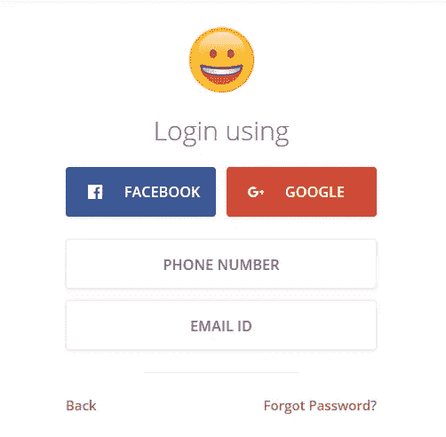
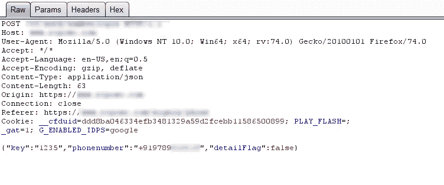
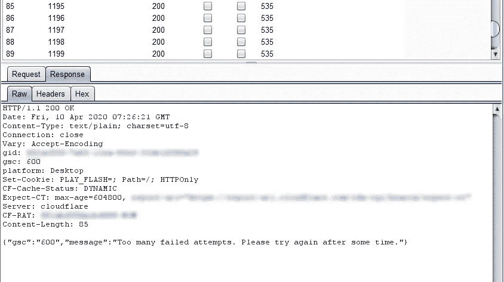
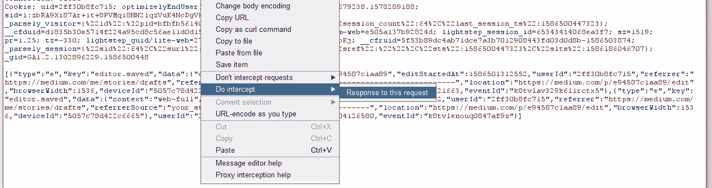
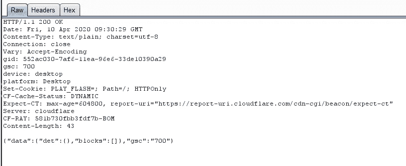
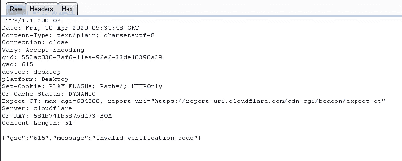
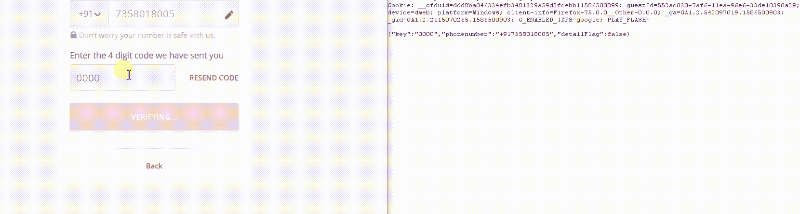

# 印度最大的视频分享网站 OTP Bypass。

> 原文：<https://infosecwriteups.com/otp-bypass-on-indias-biggest-video-sharing-site-e94587c1aa89?source=collection_archive---------0----------------------->

我已经很久没有发表任何文章了，我会继续发表一些关于我最近最好的发现。

几个月来，我们一直在通过我们的组织从事一些私人项目。所以，我决定休息一会儿，在公共平台上寻找 bug 来更新我的技能。

后来，我发现了一个允许用户分享视频的社交媒体网站，类似于拥有超过 5000 万活跃用户的抖音，但我决定不向公众透露。

# 让我们开始吃吧！

我通过收集一些关于目标网站的信息开始了攻击，让我们把这个网站想象成 example.com，我注册了一个账户，正在搜索 dashboard。但令我惊讶的是，我找不到停止前进的仪表板，因为我喜欢寻找 XSS ❤

等等，让我们试试登录页面。

登录页面(出于安全原因修改！)

登录页面有一个登录与电话号码的方法，这允许我输入我的手机号码，并输入我收到的 4 位数的动态口令。我决定通过使用入侵者选项卡来强行使用 OTP 方法。

使用不正确的 OTP 将请求发送到易受攻击的站点

我转发了请求，但不幸的是，当我达到 10 个数据包时，请求数据包被阻止。我必须承认，这是一个很好的实现。

用于 OTP 暴力的入侵者攻击

我决定不放弃 OTP 旁路，让我去另一个镜头，我前往创建帐户，并再次尝试蛮力迫使 OTP，但仍然失败。喝了几杯咖啡因饮料后，我决定通过使用**动作>拦截>对请求的响应来分析请求和响应。**该方法允许攻击者修改发送给浏览器的响应。

因此，我用新的手机号码在创建帐户表单上提出了另一个请求，并输入了我收到的正确的动态口令。通过使用 Do Intercept 响应，我开始分析响应，令我惊讶的是，响应非常简单，如下所示。

有效动态口令的响应

> **{"data":{"det":{}，" blocks":[]}，" gsc":"700"}**

坦白说，我不知道这是什么意思。但是我发现如果用户输入有效的 OTP，这个代码片段可以用来获取用户的详细信息。

现在我决定用无效的 OTP 来分析响应。

对无效动态口令的响应

> **{"gsc":"615 "，" message ":"验证码无效" }**

现在我发现这是唯一用于验证 OTP 的代码片段。为了让这个可行，我需要证明这个确实可行。于是我决定用朋友的手机号注册，输入了一个错误的 OTP，而我所做的只是通过拦截响应，把无效的验证码片段去掉，换成有效的代码片段。

无线一键通

你好。！即使没有有效的动态口令，我也可以用我朋友的手机号码创建帐户，这清楚地表明我可以用任何手机号码创建帐户，而无需验证动态口令。

# 吸取教训！

研究人员总是试图破坏 OTP 字段，但是他们忘记了分析发送到浏览器的响应。玩弄回应，用力打奖金。

# 时间线:

2019 年 10 月:就此问题发送的邮件。

2019 年 11 月:已就此问题发送邮件。

2019 年 12 月:已发送关于此问题的邮件。

2020:还在发邮件！！:)

如果你喜欢这篇文章，请鼓掌👏(50X)，那我们来连线:

**推特:**【https://twitter.com/sriramoffcl】T4

**insta gram:**[https://instagram.com/sriram_offcl](https://instagram.com/sriram_offcl)

**领英:**[https://www.linkedin.com/in/sriramkesavan](https://www.linkedin.com/in/sriramkesavan/?lipi=urn%3Ali%3Apage%3Ad_flagship3_feed%3B24kf2%2BxTTkih9NPd%2B%2BEBJw%3D%3D)

[**邮件:**](paypal.me/sri123)sriramkesavan98@gmail.com |**捐款:**[https://paypal.me/sri123](https://paypal.me/sri123)

# 放弃

博客内容仅用于信息和教育目的。

对于因使用博客内容而直接或间接产生的任何直接、间接、暗示、惩罚性、特殊、附带或其他后果性损害，我特此声明不对任何一方承担任何及所有责任，由读者自行负责。

**和平** ✌️ **！！！**

*关注* [*Infosec 报道*](https://medium.com/bugbountywriteup) *获取更多此类精彩报道。*

 [## 信息安全报道

### 收集了世界上最好的黑客的文章，主题从 bug 奖金和 CTF 到 vulnhub…

medium.com](https://medium.com/bugbountywriteup)