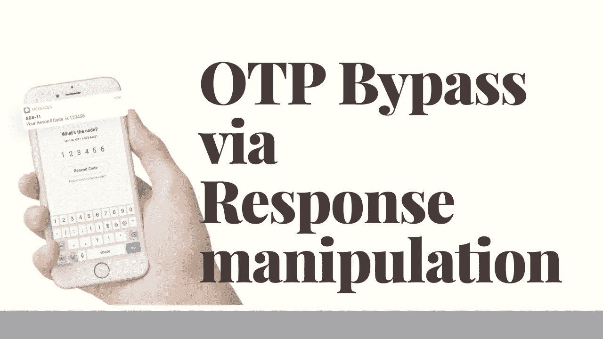

# 通过响应操作的 OTP 旁路

> 原文：<https://infosecwriteups.com/otp-bypass-via-response-manipulation-d5af09039fdf?source=collection_archive---------1----------------------->

你好黑客们，

希望你们做得很好，并狩猎大量的昆虫和美元！

今天，我带来了我最近的一个发现。我想和大家分享一下。这就是使用响应操作技术的 OTP 旁路。

**什么是反应操纵？**

响应操作是一种技术，攻击者在响应到达浏览器之前对其进行更改。在响应操作的帮助下，有时您可以绕过 2FA 或认证以及许多其他东西。

让我们开始讨论这个发现

当我在寻找一个私人程序时，我注意到有一个功能，你可以添加你的 Paytm 号码。在添加它的时候，你必须通过动态口令进行验证。所以我决定绕过这个 OTP。因为我尝试了所有不同的技术来绕过 OTP，但是没有运气。

于是我试着在那里加了自己的号，仔细观察了请求和响应。基本上，我在那里看到 OTP 不知何故泄漏了响应？

但还是没有运气！

在查看请求和响应时，我发现与正确和错误的 OTP 响应相比，只有一个主要的区别。

如果您将输入错误的动态口令，那么在响应中您将得到

**(“成功”:假，“消息”:“OTP-mismatch”)**

如果您输入正确的动态口令，那么在响应中您会看到

**(“成功”:真，“paytmno”:“1234567890”)**

其余的回答都是一样的。

观察到这一点后，我决定用真实的 OTP 响应来操纵错误的 OTP 响应。

所以我又添加了另一个数字(9999999999)，然后 web 应用程序要求输入动态口令，而我输入了错误的动态口令。

通过代理捕获请求和响应，并将响应更改为

**【成功】:真，“pay tmno”:“9999999999”)**

****(“成功”:假，“消息”:“OTP-不匹配”)****

**通过请求后，该号码成功更新为新的 Paytm 号码。**

**因此，OTP 成功绕过**

**希望这对你们有用**

**黑客快乐！**

**推特句柄:-[https://twitter.com/Xch_eater](https://twitter.com/Xch_eater)**