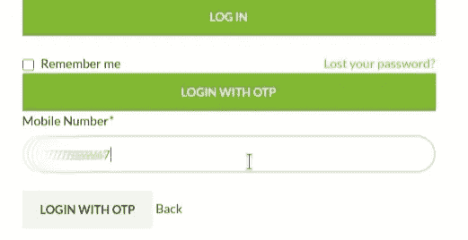
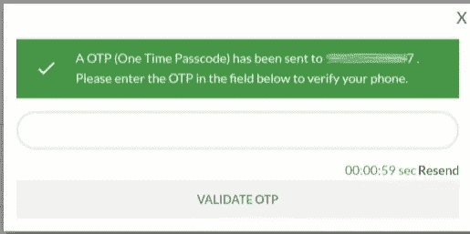
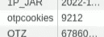

# 通过 Cookie 泄漏 OTP 会导致帐户被接管

> 原文：<https://infosecwriteups.com/otp-leaking-through-cookie-leads-to-account-takeover-4fb96f255e2f?source=collection_archive---------4----------------------->

## OTP 旁路

[泄漏](https://smilyhomes.com/wp-content/uploads/2022/04/roof-leakage.jpeg)

你好黑客们，

这次我要讨论的是一个电子商务网站中导致账户被接管的 OTP 泄露漏洞。

我们开始吧

> 什么是 OTP？
> 一次性密码，也称为一次性 PIN、一次性授权码或动态密码，是在计算机系统或其他数字设备上仅在一次登录会话或交易中有效的密码
> (来源:[维基百科](https://en.wikipedia.org/wiki/One-time_password))

在谷歌上搜索一个 bug bounty 程序的时候，我得到了一个电子商务网站。我开始检查网站的注册和登录页面，我拦截了这些请求，并开始搜索任何敏感数据，但我什么也没找到。

在我注册了一个账户并试图登录的时候，我发现了那个网站上有趣的事情。我应该发现注册页面本身的漏洞。

让我们讨论一下

注册后，有两种登录方式:使用密码或 OTP

登录页面

我用 OTP 登录，输入注册号，点击 OTP 登录

验证动态口令

然后我检查了 cookie，有一个新的 cookie 出现了“otpcookies”和 OTP 值。

动态口令（One-time Password 的缩写）

我输入了动态口令并验证了它。

成功登录

我们已成功登录帐户。

只要知道他们的手机号码，我们就可以接管任何账户。我们可以使用相同的方法注册帐户，最有趣的部分是没有验证手机号码和电子邮件 id，这意味着我们甚至可以注册不存在的号码和电子邮件。这些都发生在一个电子商务网站上:(

我向管理员报告了这个问题，他们在几个小时内做出了回应，并接受了这个错误。从那以后，他们没有任何回应，直到现在也没有更新。我们等等吧。

感谢您的阅读…

# 跟我来:

推特:[https://twitter.com/ag3n7apk](https://twitter.com/ag3n7apk)

领英:[https://www.linkedin.com/in/abhijith-pk-ag3n7/](https://www.linkedin.com/in/abhijith-pk-ag3n7/)