# 带外(OOB) SQL 注入

> 原文：<https://infosecwriteups.com/out-of-band-oob-sql-injection-87b7c666548b?source=collection_archive---------0----------------------->

带外(OOB) SQL 注入不是一种新的攻击，几年前就开始讨论了。撰写的目的是分享和总结研究过程中的发现。关于这项研究的详细讨论可以参考在[学术界](https://www.academia.edu/41117452/A_Study_of_Out-of-Band_Structured_Query_Language_Injection)和[芝诺多](https://zenodo.org/record/3556347#.XeDK1tURVPY)发表的论文。文中讨论的相关查询可以参考 [GitHub](https://github.com/Gabriel-Labs/OOB-SQLi) 。

与带内和盲 SQL 注入相比，OOB SQL 注入通过出站通道过滤数据，可以是 DNS 或 HTTP 协议。数据库系统发起出站 DNS 或 HTTP 请求的能力可能需要依赖于可用的功能。该函数可以是文件操作函数(例如:load_file()，master..xp_dirtree)或建立连接函数(例如:DBMS_LDAP。INIT，UTL_HTTP.request)。要利用 OOB SQL 注入，目标 web 和数据库服务器应满足以下条件:

1.  web 应用程序缺乏输入验证
2.  允许目标数据库服务器向公众发起出站请求(DNS 或 HTTP)而不受安全边界限制的网络环境
3.  足够的权限来执行必要的功能，以启动出站请求

下图说明了 OOB SQL 注入的流程。在本文中，Burp Collaborator 服务器用于监听和捕获从数据库系统发起的出站请求。Burp Collaborator server 是 Burp Suite Enterprise 的一个组件，具有独特的 FQDN，位于云上，用于接收指向服务器的任何出站请求。

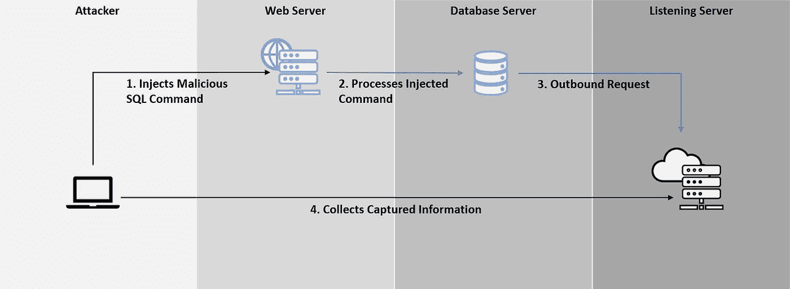

**基于 DNS 的渗透:**

以下是 MySQL 数据库的分支之一 MariaDB 的基于 DNS 的过滤查询示例。关于微软 SQL 数据库、PostgreSQL 数据库和 Oracle 数据库的讨论，可以参考前面提到的论文。该查询用于从 MariaDB 中获取数据库版本、用户名和密码。load_file()函数用于发起出站 DNS 请求和句点(。)作为分隔符来组织捕获数据的显示。

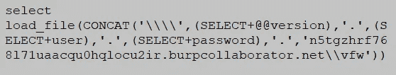

Burp Collaborator 服务器捕获的 MariaDB 的 DNS 出站请求如下所示:

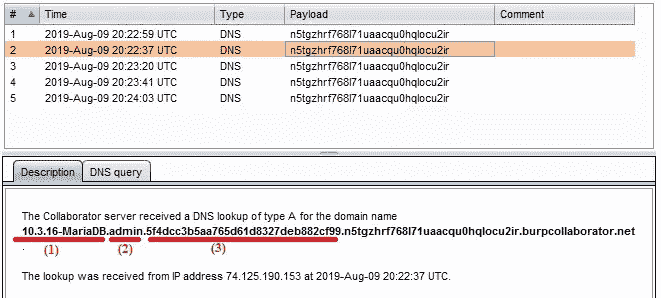

**基于 HTTP 的渗透:**

Oracle 数据库通过使用 UTL_HTTP.request 函数来演示基于 HTTP 的过滤。下面显示了用于从数据库中提取数据库版本、当前用户名和散列密码的示例查询。UTL_HTTP.request()函数的目的是触发数据库系统的 HTTP 请求。String version、user 和 hashpass 用于组织捕获的数据，并使其看起来像 HTTP 请求的参数。

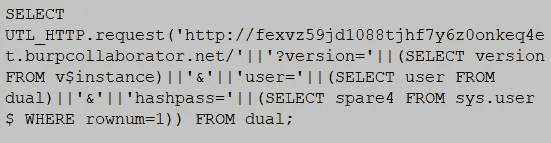

下面显示了 Burp Collaborator 服务器捕获的 HTTP 请求:

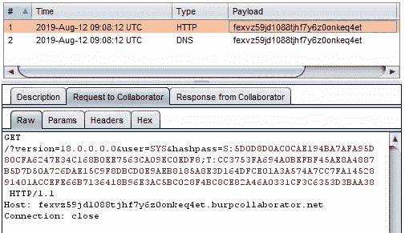

**高级 OOB SQL 注入**

域名和子域名有其规范和格式。每个子域名最多 63 个字符，完整域名最多允许 253 个字符。除此之外，域名只允许字母，数字和连字符(-)。规范和格式成为使用 DNS 通道进行数据渗透的限制。分段和编码是可以用来克服这些限制的两种方法。

下面是一个结合了分段和编码方法的示例查询，用于 Microsoft SQL 数据库的过滤。SUBSTRING 函数用于将提取的原始数据一分为二，base64 用于在发送到 Burp Collaborator 服务器之前对碎片数据进行编码。

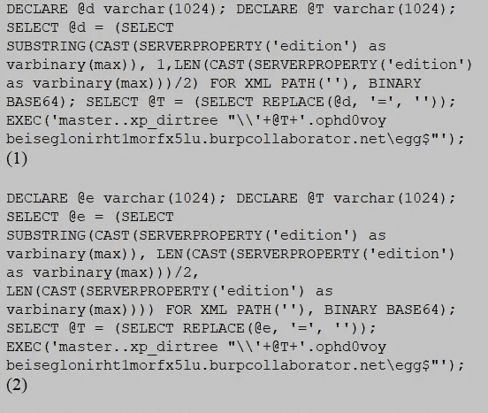

下图显示了 Burp Collaborator 服务器捕获的编码碎片数据。

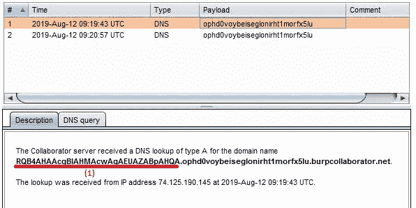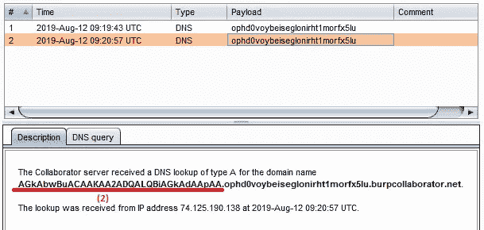

在解码之前，需要将捕获的碎片数据按顺序合并。下面显示了 base64 解码后的 Microsoft SQL server 版本。

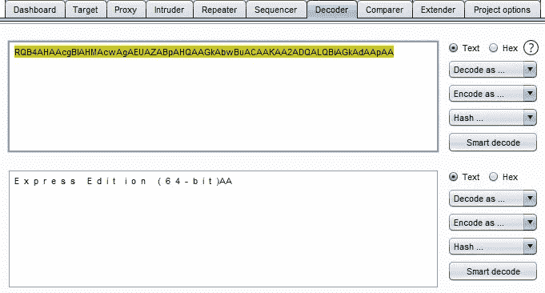

结合使用基于 HTTP 和 DNS 的渗透方法可能会产生 SQL 注入链接。在下一节中，Oracle 数据库和 MariaDB 都用于演示链接，链接的流程如下所示:

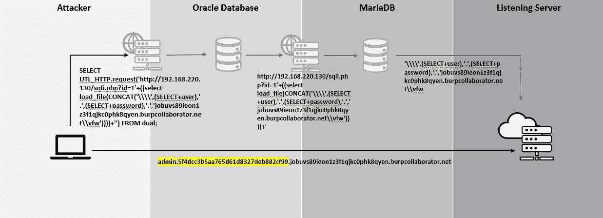

以下是链接的示例查询。查询的内部用于触发 MariaDB 的 DNS 出站请求，外部用于触发 Oracle DB 的 HTTP 出站请求。

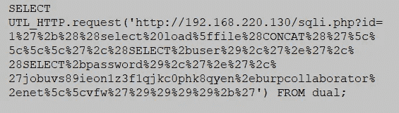

下面显示了链接结束时从 MariaDB 捕获的数据。

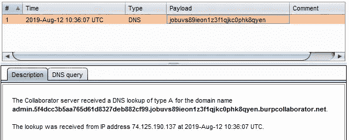

**推荐**

1.  客户端和服务器端的输入验证
2.  正确的错误处理，以避免显示详细的错误信息
3.  评审网络和安全架构设计
4.  根据最小特权原则将数据库帐户分配给应用程序
5.  实施 Web 应用程序防火墙(WAF)和入侵防御系统(IPS)等安全控制作为附加控制
6.  持续监控异常和适当的事件响应流程，作为控制措施的安全网

**参考文献:**

[https://www.notsosecure.com/oob-exploitation-cheatsheet](https://www.notsosecure.com/oob-exploitation-cheatsheet)

[https://www.owasp.org/index.php/SQL_Injection](https://www.owasp.org/index.php/SQL_Injection)

[https://www.acunetix.com/websitesecurity/sql-injection2](https://www.acunetix.com/websitesecurity/sql-injection2)

[https://portswigger . net/burp/documentation/desktop/tools/collaborator-client](https://portswigger.net/burp/documentation/desktop/tools/collaborator-client)

Justin Clarke 的 SQL 注入攻击和防御(2012 年)

 [## 域名中可以使用哪些特殊字符？-2014 年 11 月-论坛

### 我正在设法建立一个域名，但是我有问题。我想用的大多数名字都已经有人用了。我…

www.cnet.com](https://www.cnet.com/forums/discussions/what-special-characters-can-you-use-in-a-domain-name-271485/) 

*关注* [*Infosec 报道*](https://medium.com/bugbountywriteup) *获取更多此类精彩报道。*

 [## 信息安全报道

### 收集了世界上最好的黑客的文章，主题从 bug 奖金和 CTF 到 vulnhub…

medium.com](https://medium.com/bugbountywriteup)