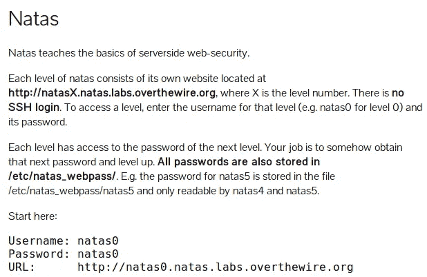
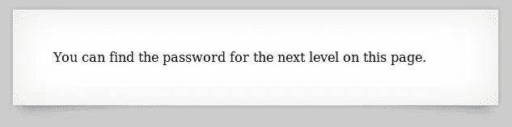
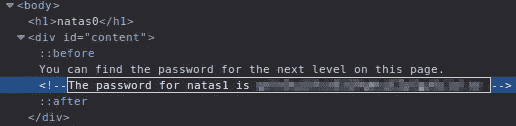
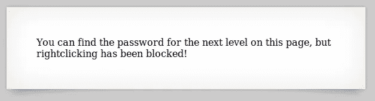
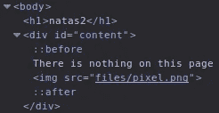
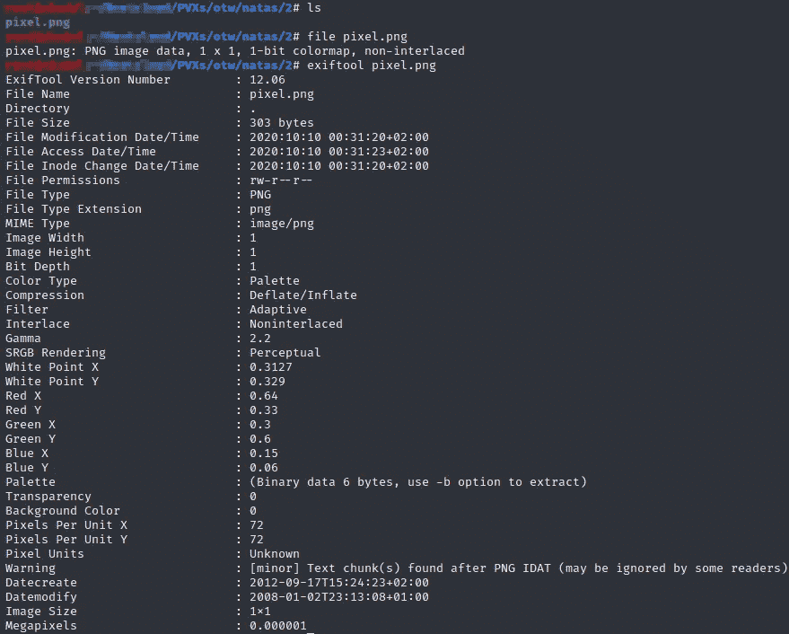
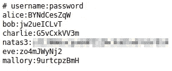

# 《穿越火线》——纳塔斯 0 1 2

> 原文：<https://infosecwriteups.com/over-the-wire-natas-0-1-2-98f6da9f6903?source=collection_archive---------3----------------------->

[OverTheWire](https://overthewire.org/wargames/) (OTW)是了解各种安全主题的最佳资源之一，他们的主页明确指出:

> OverTheWire 社区提供的战争游戏可以帮助您以充满乐趣的游戏形式学习和实践安全概念。
> 要找到更多关于某个战争游戏的信息，只需访问左边菜单中的链接页面。

我个人在 OTW 上花了很多时间，因为它让我理解了一些我没有的概念，并学习了我不知道的命令和方法

这一系列的帖子将会是关于纳塔斯战争游戏的，如果这是你第一次听说 OTW，我会推荐你先从强盗战争游戏开始，但是做你想做的，随意实验，尽情享受吧！

# 0 级有线纳塔

通过网络—Natas 0 级描述

通过访问给定的 URL 并使用凭证登录，我们将看到以下页面

Natas 级网页

让我们用我们最喜欢的浏览器开发工具做一个简单的 HTML 代码检查

将出现一个通配符密码

而在 HTML 代码之间，在一个非常隐蔽的(！)评论，我们找到 natas1 密码

按照说明进入 natas1 网页并登录

# 一级有线电视

Natas 级——哦不！右键单击被禁用

这个级别希望我们更好地理解我们的浏览器是如何工作的

要打开 FireFox 上的检查工具，我进入 FF 菜单-> Web Developer ->切换工具(Ctrl + Shift + I)

但是要检查页面 HTML 代码，您还可以

*   使用打嗝(或任何网络代理)
*   将“view-source:”前置到 natas1 URL
*   拦截 Burp 上的响应，并禁用/删除锁定右键单击的 JS

查看网页代码有无数种方法

出现另一个通配符密码

同样，密码在网页源代码中

# 越线纳塔二级

Natas 级

让我们继续检查页面源代码

页面上的图像

页面上的元素非常少，唯一与众不同的是一个名为“pixel.png”的文件，它出现在页面上，但显然是不可见的

pixel.png 的 exiftool

然后我决定下载这张图片并用 [exiftool](https://exiftool.org/) 检查它的信息，但是这张图片没有任何有用的信息

Natas 2 /files 目录

所以我试着查看 pixel.png 的父目录是否可以访问，确实可以，里面有一个 users.txt 文件

Natas 2 users.txt 文件

这就是了，natas3 密码在这里

OTW·纳塔斯 0 1 2 级到此结束

我希望你喜欢它。

PVXs—[https://twitter.com/pivixih](https://twitter.com/pivixih)