# 《过线》——纳塔斯 3 4 5

> 原文：<https://infosecwriteups.com/over-the-wire-natas-3-4-5-c85e47b75321?source=collection_archive---------3----------------------->

# 越线纳塔三级

Natas 三级

让我们去检查页面源代码

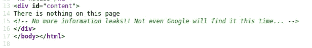

谷歌也不行

搜索引擎检查/robots.txt 文件中允许和不允许的页面

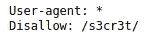

服务器上有一个/s3cr3t/目录

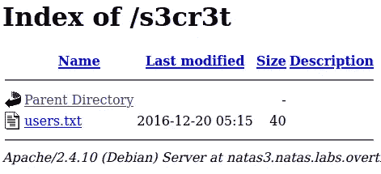

包含文件名“users.txt”

该文件包含 natas4 的凭据 4

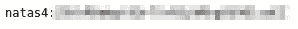

这边请

# 四级以上

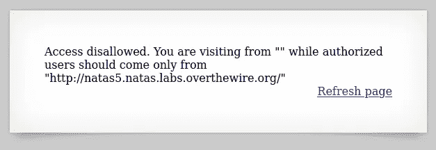

Natas 级

该页面希望我们从 natas5 到达，因此更改 burp 上的 HTTP Referer 头

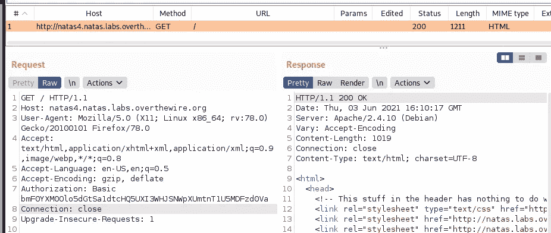

原始请求/响应

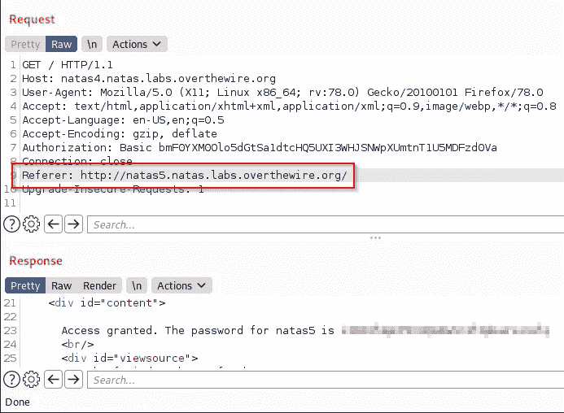

请求在打嗝时修改

对修改后的请求的响应包含 natas5 的凭证

# 第五级

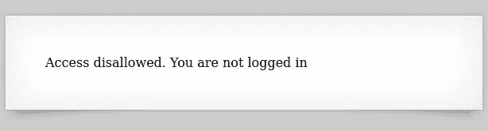

Natas 级

检查源，那里什么也没有，所以检查打嗝时的请求/响应

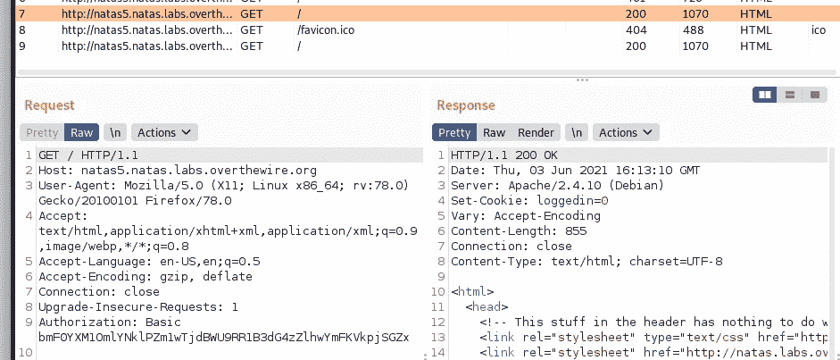

服务器响应将“登录”cookie 设置为 0

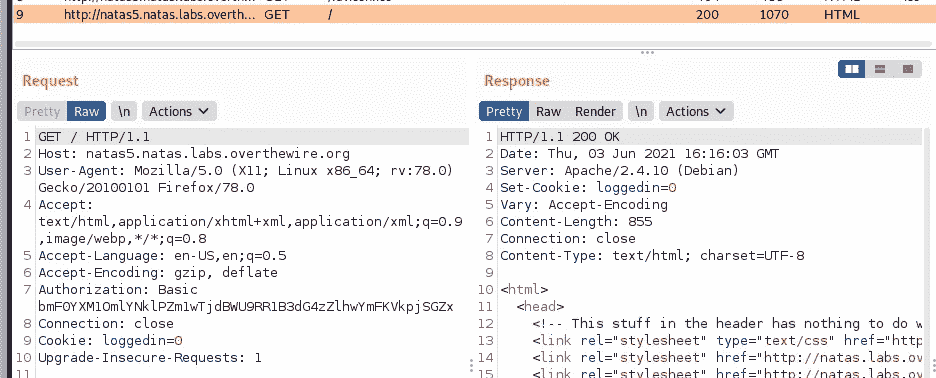

cookies 总是在给定时发送到服务器

让我们将请求发送到中继器，并更改 cookie 值

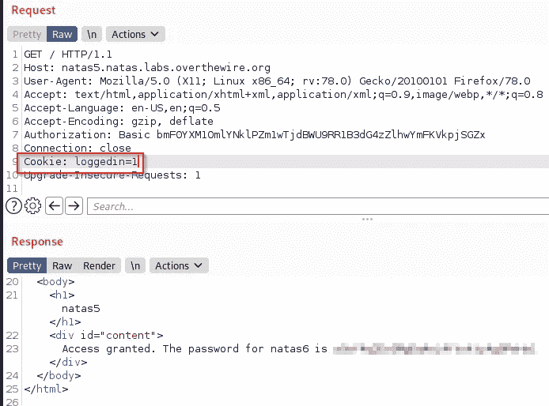

这边请

对修改后的请求的响应包含 natas6 的凭证

这是 OTW·纳塔斯的第 3、4、5 关

我希望你喜欢它。

PVXs—[https://twitter.com/pivixih](https://twitter.com/pivixih)