# 《穿越火线》——纳塔丝 6 7 8

> 原文：<https://infosecwriteups.com/over-the-wire-natas-6-7-8-a90e3981fdd1?source=collection_archive---------2----------------------->

# 超过 6 级

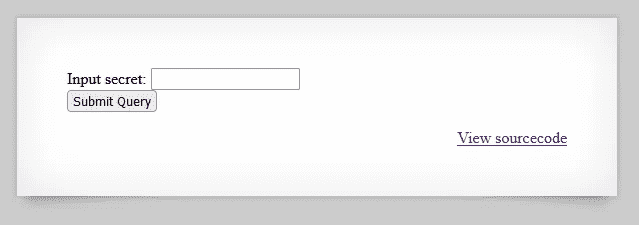

6 级

查看“查看源代码”链接

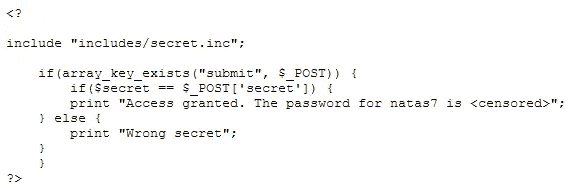

当前级别的 PHP 源代码

PHP 代码包含一个文件“includes/secret.inc”

然后将＄secret 变量与级别页面上输入文本字段中的 HTTP POST 数据“secret”参数进行比较

如果匹配，则打印 natas7 的密码

查看“/includes/secret.inc”

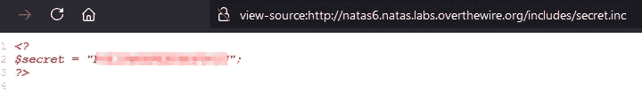

秘密公司

包含的文件创建了一个$secret 变量，它的值是获取 natas7 密码的秘密

在级别输入文本字段中输入密码，并获取 natas7 密码

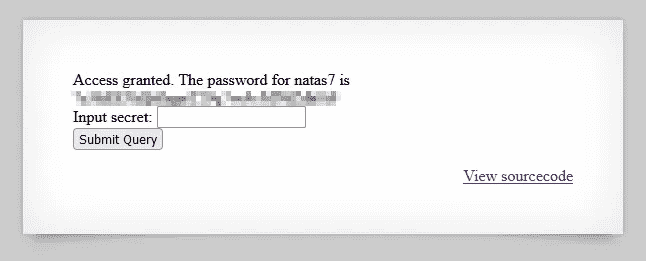

# 越线 7 级


Natas7 水平

检查源页面和链接页面

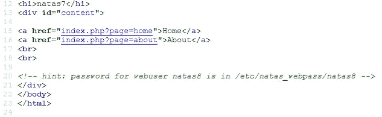

温柔的提醒所有的密码在哪里

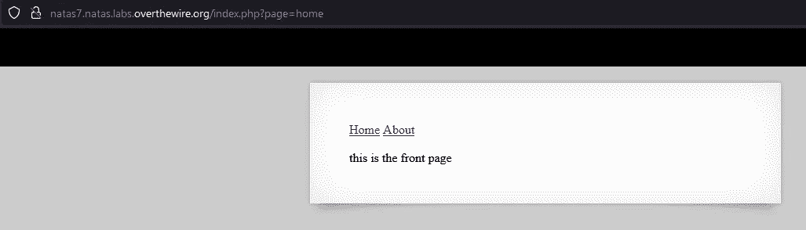

主页链接

点击“首页”向我们展示了这个页面，网址已经变成了“index.php？page=home "

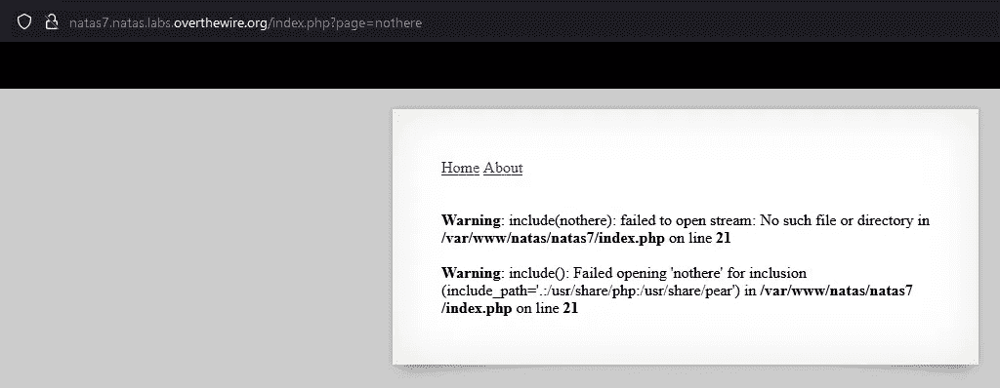

包含错误

手动转到“index.php？page=nothere”向我们展示了 index.php 试图包含一个从我们传递的“page”参数中命名的文件，并且它抛出一个找不到文件的错误

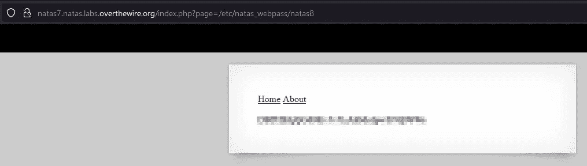

Natas8 密码

然后手动转到“index.php？page=/etc/natas_webpass/natas8 "向我们展示了下一关的密码

# 越线 8 级

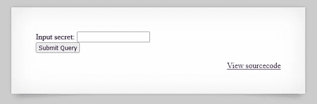

纳塔 10 水平

检查查看源代码链接

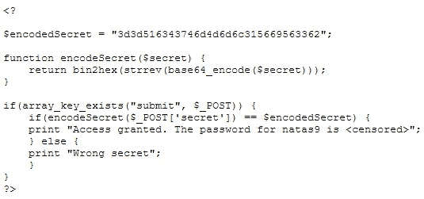

级别页面源代码中的 PHP 代码片段

有一个 PHP 代码片段检查文本输入字段中的“secret”POST 数据参数是否与经过多次编码的“$encodedSecret”变量中的静态值相匹配:

返回 bin 2 hex(strrev(base64 _ encode($ secret))；

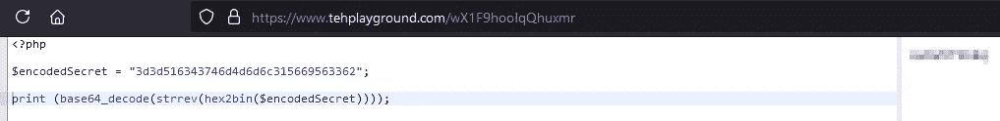

在谷歌上找到的 PHP 游乐场

通过使用在 Google-tehplayground.com 上找到的 PHP 操场，找到颠倒代码中操作的密码

```
print (base64_decode(strrev(hex2bin($encodedSecret))));
```

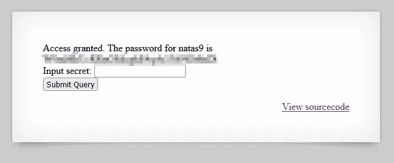

Natas9 密码

输入以前发现的秘密的纯文本，并获得 natas9 的密码

这就结束了 OTW·纳塔斯 6 7 8 级

我希望你喜欢它。

PVXs

[](https://twitter.com/pivixih) [## JavaScript 不可用。

### 编辑描述

twitter.com](https://twitter.com/pivixih) [](https://tryhackme.com/p/PVXs) [## TryHackMe | PVXs

### TryHackMe 是一个免费的学习网络安全的在线平台，使用动手练习和实验室，通过您的…

tryhackme.com](https://tryhackme.com/p/PVXs)