# 穿越火线:战争游戏；强盗等级 0 到 10 演练

> 原文：<https://infosecwriteups.com/over-the-wire-wargames-bandit-level-0-to-10-walkthrough-97015bfc6538?source=collection_archive---------0----------------------->

在这篇博客中，我将为 BANDIT 演示一次演练。强盗战争游戏的目标是绝对的初学者。它将教授在 https://overthewire.org/wargames 玩其他战争游戏所需的基础知识。

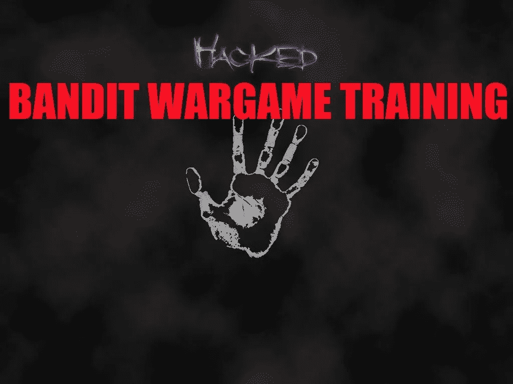

# **0 级**

# 水平目标

这个级别的目标是让你使用 SSH 登录游戏。你需要连接的主机是 bandit.labs.overthewire.org 的**，端口 2220。用户名为 **bandit0** ，密码为 **bandit0** 。登录后，进入[1 级](https://overthewire.org/wargames/bandit/bandit1.html)页面，了解如何击败 1 级。**

# ****解决方案****

> **C:\Users\Rishi> **宋承宪 bandit0@bandit.labs.overthewire.org-p 2220**
> 这是一个 OverTheWire 游戏服务器。更多关于 http://www.overthewire.org/wargames 的信息**
> 
> **bandit 0 @ bandit . labs . overthe wire . org 的密码: **bandit0****

****

# **0 到 1 级**

# **水平目标**

**下一个级别的密码存储在主目录下名为 **readme** 的文件中。使用这个密码通过 SSH 登录 bandit1。每当你找到一个关卡的密码时，使用 SSH(在端口 2220 上)登录到那个关卡并继续游戏。**

# ****解决方案****

> **c:\ Users \ Rishi >***ssh bandit0@bandit.labs.overthewire.org-p 2220***
> 这是一款 OverTheWire 游戏服务器。关于[http://www.overthewire.org/wargames](http://www.overthewire.org/wargames)的更多信息**
> 
> **bandit 0 @ bandit . labs . overthe wire . org 的密码: ***bandit0*****
> 
> **bandit 0 @ bandit:~ $**ls**
> 自述
> bandit0@bandit:~$ ***猫自述***
> ***BoJ 9 jbbunnfktd 78 OOP sqoltutmc 3 my 1*****

**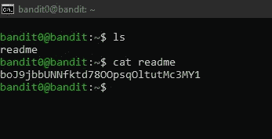**

# ****一级到二级****

# **水平目标**

**下一个级别的密码存储在主目录中名为的文件中**

# ****解决方案****

> **c:\ Users \ Rishi >***ssh***[***bandit1@bandit.labs.overthewire.org***](mailto:bandit1@bandit.labs.overthewire.org)***-p 2220***
> 这是一款 OverTheWire 游戏服务器。关于[http://www.overthewire.org/wargames](http://www.overthewire.org/wargames)的更多信息**
> 
> **[bandit1@bandit.labs.overthewire.org](mailto:bandit1@bandit.labs.overthewire.org)的密码:**BoJ 9 jbbunnfktd 78 oopsqoltutmc 3 my 1**
> Linux bandit . otw . local 5 . 4 . 8 x86 _ 64 GNU/Linux 0**

**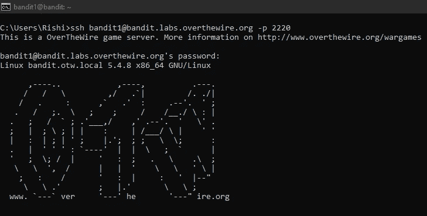**

> **bandit1@bandit:~$ ***猫。/-***
> ***cv 1 dtq xwvfxtvm 2 f 0k 09 shz 0 ywrinya 9***
> bandit 1 @ bandit:~ $**

**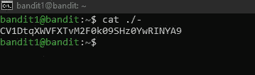**

# ****二至三级****

# **水平目标**

**下一个级别的密码存储在主目录中的文件名为的名为**空格的文件中****

# ****解决方案****

> **c:\ Users \ Rishi >**ssh**[**bandit2@bandit.labs.overthewire.org**](mailto:bandit2@bandit.labs.overthewire.org)**-p 2220**
> 这是一款 OverTheWire 游戏服务器。更多关于 http://www.overthewire.org/wargames 的信息**
> 
> **[bandit2@bandit.labs.overthewire.org](mailto:bandit2@bandit.labs.overthewire.org)的密码:***cv 1 dtqxwvfxtvm 2 f 0k 09 shz 0 ywrinya 9*****
> 
> **Linux bandit . otw . local 5 . 4 . 8 x86 _ 64 GNU/Linux**

**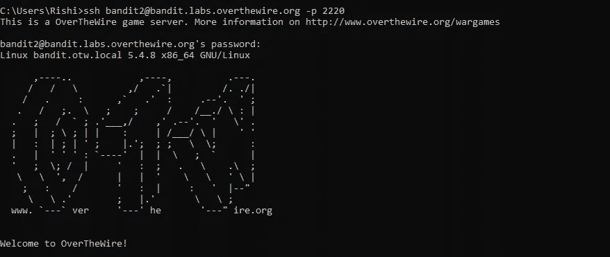**

> **bandit 2 @ bandit:~ $**ls**
> 文件名中的空格
> bandit2@bandit:~$ **cat。/spaces \ in \ this \ filename
> umhadqclwmgdlok q3yngjwxgormb 5 luk**
> bandit 2 @ bandit:~ $**

**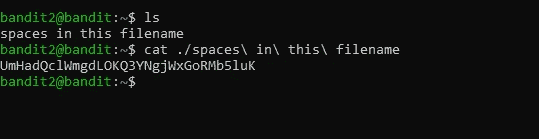**

# ****或****

> **bandit 2 @ bandit:~ $**ls**
> 文件名中的空格
> bandit2@bandit:~$ **cat "。/此文件名中的空格"
> umhadqclwmgdlok q3yngjwxgormb 5 luk**
> bandit 2 @ bandit:~ $**

**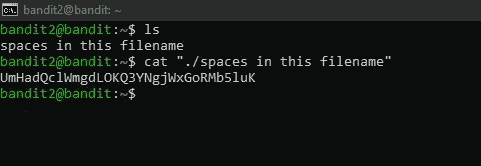**

# ****三级到四级****

# **水平目标**

**下一关的密码存储在**目录下的隐藏文件中。****

# ****解决方案****

> **c:\ Users \ Rishi >**ssh**[**bandit3@bandit.labs.overthewire.org**](mailto:bandit3@bandit.labs.overthewire.org)**-p 2220**
> 这是一款 OverTheWire 游戏服务器。关于[http://www.overthewire.org/wargames](http://www.overthewire.org/wargames)的更多信息**
> 
> **[bandit3@bandit.labs.overthewire.org](mailto:bandit3@bandit.labs.overthewire.org)的密码:**umhadqclwmgdlok q3yngjwxgormb 5 luk**Linux bandit . otw . local 5 . 4 . 8 x86 _ 64 GNU/Linux**

**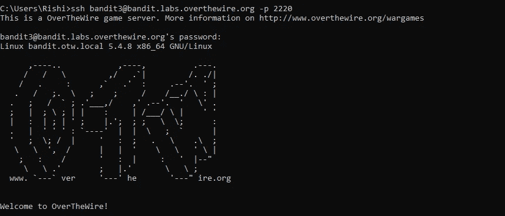**

> **bandit 3 @ bandit:~/inhere $**ls**
> bandit 3 @ bandit:~/inhere $**ls-a**。..。隐藏的
> bandit3@bandit:~/inhere$ **猫。隐藏的**
> **piwrprtpn 36 qitsp 3 eqaw 936 yafofgab** bandit 3 @ bandit:~/inhere $**

**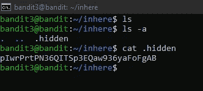**

# **四级到五级**

# **水平目标**

**下一个级别的密码存储在**固有的**目录中唯一可读的文件中。提示:如果你的终端坏了，试试“重置”命令。**

# ****解决方案****

> **c:\ Users \ Rishi >**ssh**[**bandit4@bandit.labs.overthewire.org**](mailto:bandit4@bandit.labs.overthewire.org)**-p 2220**
> 这是一款 OverTheWire 游戏服务器。关于[http://www.overthewire.org/wargames](http://www.overthewire.org/wargames)的更多信息**
> 
> **[bandit4@bandit.labs.overthewire.org](mailto:bandit4@bandit.labs.overthewire.org)的密码:**piwrprtpn 36 qitsp 3 eqaw 936 yafofgab**Linux bandit . otw . local 5 . 4 . 8 x86 _ 64 GNU/Linux**

**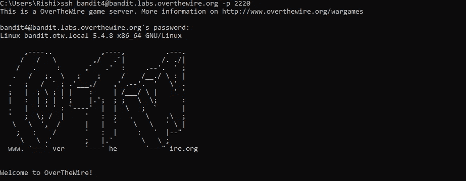**

> **bandit 4 @ bandit:~/inhere $**ls**
> -file 00-file 01-file 02-file 03-file 04-file 05-file 06-file 07-file 08-file 09
> bandit 4 @ bandit:~/inhere $**file。/-file0***
> 。/-file00:数据
> 。/-file01:数据
> 。/-file02:数据
> 。/-file03:数据
> 。/-file04:数据
> 。/-file05:数据
> 。/-file06:数据
> 。/-file07: ASCII 文本
> 。/-file08:数据
> 。/-file 09:data
> bandit 4 @ bandit:~/inhere $**cat。/-file 07
> korebokuiddphwk 7 jzc 0 rtdopnaykh**
> bandit 4 @ bandit:~/inhere＄时**

**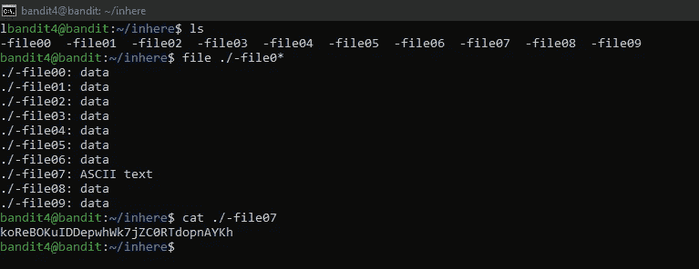**

# ****5 至 6 级****

# **水平目标**

**下一个级别的密码存储在**固有**目录下的某个文件中，并具有以下所有属性:**

*   **人类可读的**
*   **大小为 1033 字节**
*   **不可执行**

# ****解决方案****

> **c:\ Users \ Rishi >**ssh**[**bandit5@bandit.labs.overthewire.org**](mailto:bandit5@bandit.labs.overthewire.org)**-p 2220**
> 这是一款 OverTheWire 游戏服务器。关于[http://www.overthewire.org/wargames](http://www.overthewire.org/wargames)的更多信息**
> 
> **[bandit5@bandit.labs.overthewire.org](mailto:bandit5@bandit.labs.overthewire.org)的密码:**korebokuiddphwk 7 jzc 0 rtdopnaykh**Linux bandit . otw . local 5 . 4 . 8 x86 _ 64 GNU/Linux**

****

**bandit5@bandit:~/inhere$ **找-型 f -size 1033c！——可执行**
。/maybe here 07/. file 2
bandit 5 @ bandit:~/inhere $**CD maybe here 07**
bandit 5 @ bandit:~/inhere/maybe here 07 $**cat . file 2
dxjzpullxyr 17 uwoi 01 bnlqbtfemego 7****

**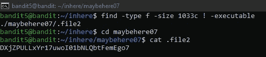**

# ****6 级到 7 级****

# **水平目标**

**下一级的密码存储在服务器上的某个地方**，并具有以下所有属性:****

*   **归用户 bandit7 所有**
*   **归集团所有 6**
*   **33 字节大小**

# ****解决方案****

> **c:\ Users \ Rishi >**ssh**[**bandit6@bandit.labs.overthewire.org**](mailto:bandit6@bandit.labs.overthewire.org)**-p 2220**
> 这是一款 OverTheWire 游戏服务器。关于[http://www.overthewire.org/wargames](http://www.overthewire.org/wargames)的更多信息**
> 
> **[bandit6@bandit.labs.overthewire.org](mailto:bandit6@bandit.labs.overthewire.org)的密码:**dxjzpullxyr 17 uwoi 01 bnlqbtfemego 7**
> Linux bandit . otw . local 5 . 4 . 8 x86 _ 64 GNU/Linux**

**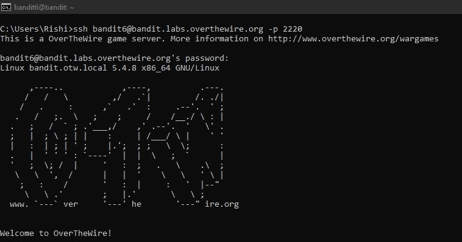**

> **bandit 6 @ bandit:/$**find/-user bandit 7-group bandit 6-size 33c 2>&1 | grep -F -v 权限| grep-F-v 目录**
> /var/lib/dpkg/info/bandit 7 . password
> bandit 6 @ bandit:/$**cat/var/lib/dpkg/info/bandit 7 . password
> hkbptkqniay 4 fw 76 bey 8 pvxkedqrq****

**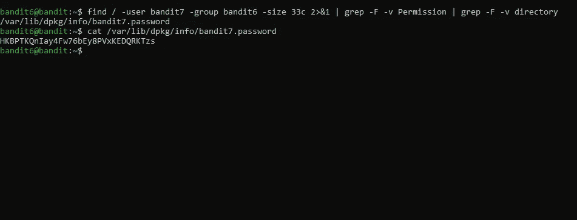**

# ****7 级到 8 级****

# **水平目标**

**下一关的密码存储在文件 **data.txt** 中，紧挨着第一百万个**字****

# ****解决方案****

> **c:\ Users \ Rishi >**ssh**[**bandit7@bandit.labs.overthewire.org**](mailto:bandit7@bandit.labs.overthewire.org)**-p 2220**
> 这是一款 OverTheWire 游戏服务器。关于[http://www.overthewire.org/wargames](http://www.overthewire.org/wargames)的更多信息**
> 
> **[bandit7@bandit.labs.overthewire.org](mailto:bandit7@bandit.labs.overthewire.org)的密码:**hkbptkqniay 4 fw 76 bey 8 pvxkedkrktzs**
> Linux bandit . otw . local 5 . 4 . 8 x86 _ 64 GNU/Linux**

**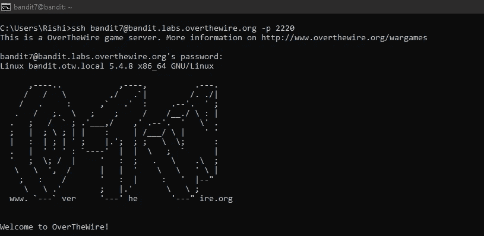**

> **bandit 7 @ bandit:~ $**ls**
> data . txt
> bandit 7 @ bandit:~ $**cat data . txt | grep 第百万个**
> **第百万个 cvx 2 jja 4 cfaltqs 87 JK 27 qwqghbm 9 plv**
> bandit 7 @ bandit:~ $**

**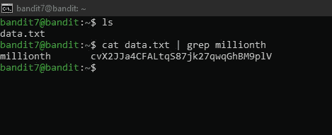**

# ****8 至 9 级****

# **水平目标**

**下一级的密码存储在文件 **data.txt** 中，并且是唯一一行只出现一次的文本**

# ****解决方案****

> **C:\Users\Rishi> **宋承宪**[**bandit8@bandit.labs.overthewire.org**](mailto:bandit8@bandit.labs.overthewire.org)**-p 2220**
> 这是一款 OverTheWire 游戏服务器。关于[http://www.overthewire.org/wargames](http://www.overthewire.org/wargames)的更多信息**
> 
> **[bandit8@bandit.labs.overthewire.org](mailto:bandit8@bandit.labs.overthewire.org)的密码:**cvx 2 jja 4 cfaltqs 87 JK 27 qwqghbm 9 plv**
> Linux bandit . otw . local 5 . 4 . 8 x86 _ 64 GNU/Linux**

**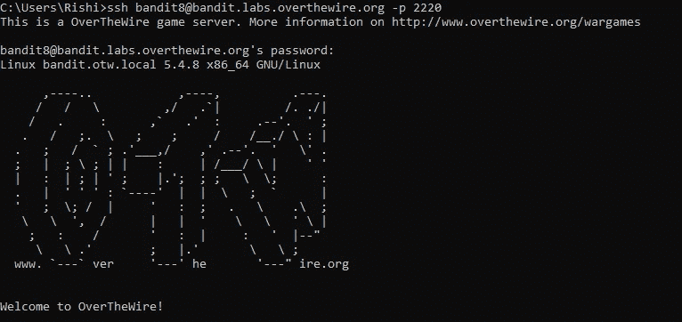**

> **bandit 8 @ bandit:~ $**ls**
> data . txt
> bandit 8 @ bandit:~ $**cat data . txt | sort | uniq-c-u**
> 1**usvvyfszzwbi 6 wgc 7 dafyfur 6 jqquhr**
> bandit 8 @ bandit:~ $**

**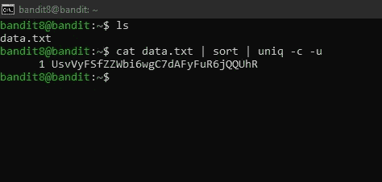**

# ****9 级到 10 级****

# **水平目标**

**下一级的密码存储在文件 **data.txt** 中，是少数人类可读的字符串之一，前面有几个“=”字符。**

# ****解决方案****

> **c:\ Users \ Rishi >**ssh**[**bandit9@bandit.labs.overthewire.org**](mailto:bandit9@bandit.labs.overthewire.org)**-p 2220**
> 这是一款 OverTheWire 游戏服务器。关于[http://www.overthewire.org/wargames](http://www.overthewire.org/wargames)的更多信息**
> 
> **[bandit9@bandit.labs.overthewire.org](mailto:bandit9@bandit.labs.overthewire.org)的密码:**usvvyfsfzzwbi 6 wgc 7 dafy fur 6 jqquhr**
> Linux bandit . otw . local 5 . 4 . 8 x86 _ 64 GNU/Linux**

**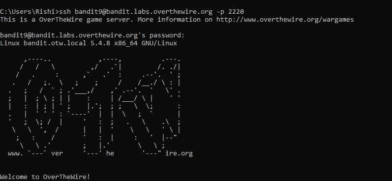**

> **bandit 9 @ bandit:~ $**ls**
> data . txt
> bandit 9 @ bandit:~ $**strings data . txt | grep = = = = = = = = = = = = = the * 2i " 4
> = = = = = = = = = = = = = = password
> Z)= = = = = = = = = is
> &= = = = = = = = = =**trukldjsbj 5g 7 yyj2 r0 o******

**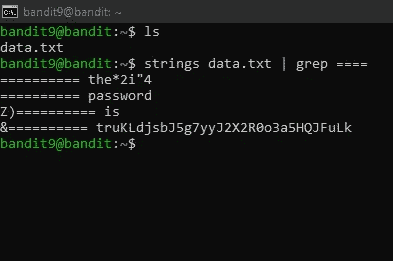**

> **如果你想了解更多关于网络安全的知识，请关注 Instagram 上的 [i.m.pratikdabhi](https://www.instagram.com/i.m.pratikdabhi/)**