# 穿越火线:战争游戏；强盗穿越第二部分；11 至 15 级

> 原文：<https://infosecwriteups.com/over-the-wire-wargames-bandit-walkthrough-part-ii-level-11-to-15-6638d287f38?source=collection_archive---------0----------------------->

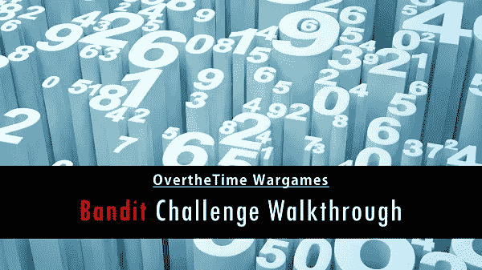

来源谷歌

这篇博客是我上一篇关于强盗从 0 级到 10 级的演练的博客【bit.ly/bandit0to10】T2 的续篇。在这篇博客中，我将介绍强盗从 11 级到 15 级的演练。强盗战争游戏的目标是绝对的初学者。它将教授在 https://overthewire.org/wargames[上玩其他战争游戏所需的基础知识。](https://overthewire.org/wargames)

# 强盗等级 10 →等级 11

# 水平目标

下一级的密码存储在文件 **data.txt** 中，该文件包含 base64 编码的数据

# 解决这一关可能需要的命令

grep，sort，uniq，strings，base64，tr，tar，gzip，bzip2，xxd

# 有益的阅读材料

*   [维基百科上的 Base64](https://en.wikipedia.org/wiki/Base64)

# **解决方案**

```
**C:\Users\Rishi>ssh bandit10@bandit.labs.overthewire.org -p 2220**
This is a OverTheWire game server. More information on [http://www.overthewire.org/wargames](http://www.overthewire.org/wargames)[bandit10@bandit.labs.overthewire.org](mailto:bandit10@bandit.labs.overthewire.org)’s password: **truKLdjsbJ5g7yyJ2X2R0o3a5HQJFuLk**
Linux bandit.otw.local 5.4.8 x86_64 GNU/Linux
```

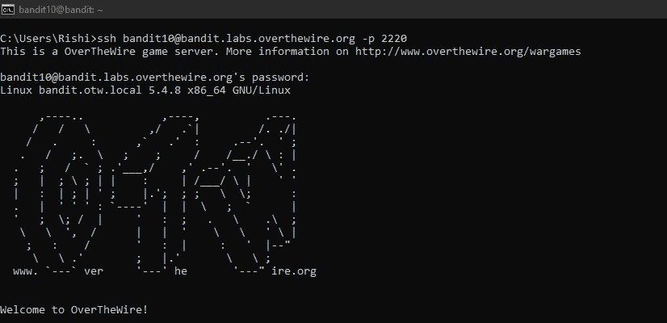

```
bandit10@bandit:~$ **ls**
data.txt
bandit10@bandit:~$ **cat data.txt | base64 -d**
The password is **IFukwKGsFW8MOq3IRFqrxE1hxTNEbUPR**
bandit10@bandit:~$
```

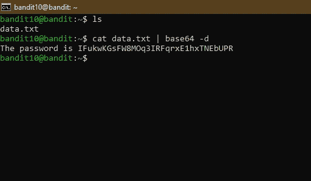

# 强盗等级 11 →等级 12

# 水平目标

下一关的密码存储在文件 **data.txt** 中，其中所有小写(a-z)和大写(A-Z)字母都旋转了 13 个位置

# 解决这一关可能需要的命令

grep，sort，uniq，strings，base64，tr，tar，gzip，bzip2，xxd

# 有益的阅读材料

*   [维基百科上的 rot 13](https://en.wikipedia.org/wiki/Rot13)

# **解决方案**

```
C:\Users\Rishi>**ssh** [**bandit11@bandit.labs.overthewire.org**](mailto:bandit11@bandit.labs.overthewire.org) **-p 2220**
This is a OverTheWire game server. More information on [http://www.overthewire.org/wargames](http://www.overthewire.org/wargames)[bandit11@bandit.labs.overthewire.org](mailto:bandit11@bandit.labs.overthewire.org)’s password:**IFukwKGsFW8MOq3IRFqrxE1hxTNEbUPR**
Linux bandit.otw.local 5.4.8 x86_64 GNU/Linux
```

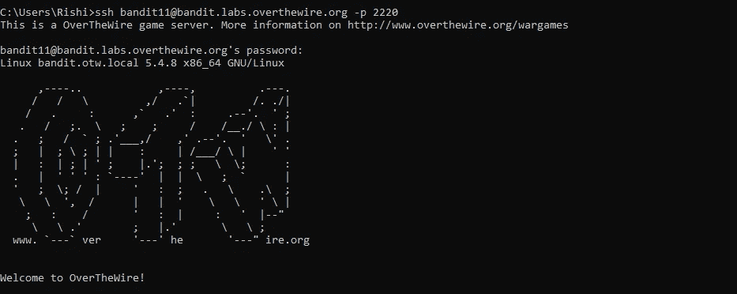

```
bandit11@bandit:~$ **cat data.txt | tr “A-Za-z” “N-ZA-Mn-za-m”**
The password is **5Te8Y4drgCRfCx8ugdwuEX8KFC6k2EUu**
bandit11@bandit:~$ 
```

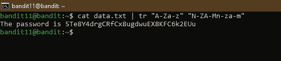

# 强盗等级 12 →等级 13

# 水平目标

下一关的密码存储在文件 **data.txt** 中，这是一个经过反复压缩的文件的 hexdump。对于这个级别，在/tmp 下创建一个目录可能会很有用，您可以在这个目录中使用 mkdir。比如:mkdir /tmp/myname123。然后使用 cp 复制数据文件，并使用 mv 对其进行重命名(请阅读联机帮助页！)

# 解决这一关可能需要的命令

grep，sort，uniq，strings，base64，tr，tar，gzip，bzip2，xxd，mkdir，cp，mv，file

# 有益的阅读材料

*   [百科上的十六进制转储](https://en.wikipedia.org/wiki/Hex_dump)

# **解决方案**

```
C:\Users\Rishi>**ssh bandit12@bandit.labs.overthewire.org -p 2220**
This is a OverTheWire game server. More information on http://www.overthewire.org/wargames[bandit12@bandit.labs.overthewire.org](mailto:bandit12@bandit.labs.overthewire.org)’s password:**5Te8Y4drgCRfCx8ugdwuEX8KFC6k2EUu**
Linux bandit.otw.local 5.4.8 x86_64 GNU/Linux
```

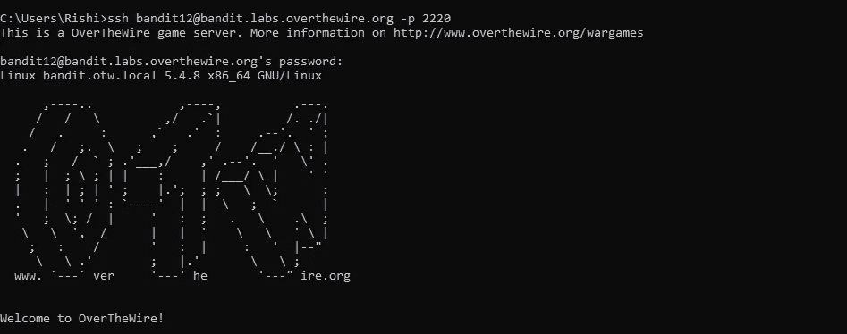

```
bandit12@bandit:~$ ***ls***
bandit12@bandit:~$ ***mkdir ./../../tmp/rishidhamija && cp data.txt ./../../tmp/rishidhamija && cd ./../../tmp/rishidhamija***
bandit12@bandit:/tmp/rishidhamija$ ***ls***
data.txt
bandit12@bandit:/tmp/rishidhamija$ ***xxd -r data.txt data***
bandit12@bandit:/tmp/rishidhamija$ ***ls***
data data.txt
bandit12@bandit:/tmp/rishidhamija$ ***file data***
data: gzip compressed data, was “data2.bin”, last modified: Thu May 7 18:14:30 2020, max compression, from Unix
bandit12@bandit:/tmp/rishidhamija$ ***mv data data.gz***
bandit12@bandit:/tmp/rishidhamija$ ***gzip -d data.gz***
bandit12@bandit:/tmp/rishidhamija$ ***ls***
data data.txt
bandit12@bandit:/tmp/rishidhamija$ ***file data***
data: bzip2 compressed data, block size = 900k
bandit12@bandit:/tmp/rishidhamija$ ***mv data data.bz2***
bandit12@bandit:/tmp/rishidhamija$ ***bzip2 -d data.bz2***
bandit12@bandit:/tmp/rishidhamija$ ***file data***
data: gzip compressed data, was “data4.bin”, last modified: Thu May 7 18:14:30 2020, max compression, from Unix
bandit12@bandit:/tmp/rishidhamija$ ***mv data data.gz***
bandit12@bandit:/tmp/rishidhamija$ ***gzip -d data.gz***
bandit12@bandit:/tmp/rishidhamija$ ***ls***
data data.txt
bandit12@bandit:/tmp/rishidhamija$ ***file data***
data: POSIX tar archive (GNU)
bandit12@bandit:/tmp/rishidhamija$ ***mv data data.tar***
bandit12@bandit:/tmp/rishidhamija$ ***tar -x -f data.tar***
bandit12@bandit:/tmp/rishidhamija$ ***ls***
data5.bin data.tar data.txt
bandit12@bandit:/tmp/rishidhamija$ ***file data5.bin***
data5.bin: POSIX tar archive (GNU)
bandit12@bandit:/tmp/rishidhamija$ ***mv data5.bin data.tar***
```

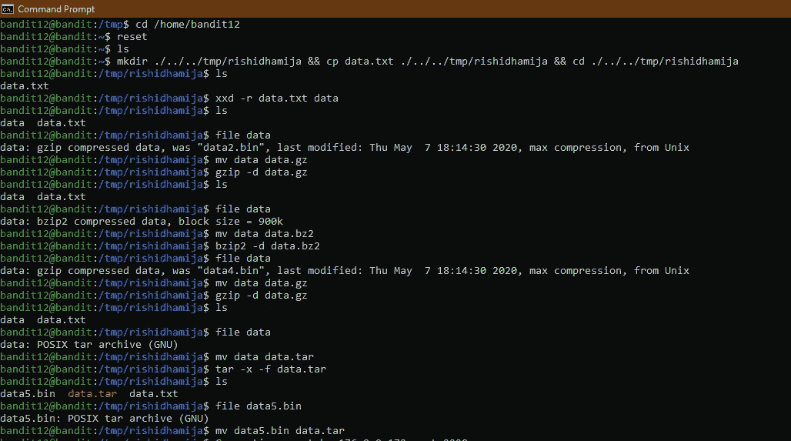

```
bandit12@bandit:/tmp/rishidhamija$ ***ls***
data.tar data.txt
bandit12@bandit:/tmp/rishidhamija$ ***file data.tar***
data.tar: POSIX tar archive (GNU)
bandit12@bandit:/tmp/rishidhamija$ ***tar -x -f data.tar***
bandit12@bandit:/tmp/rishidhamija$ ***ls***
data6.bin data.tar data.txt
bandit12@bandit:/tmp/rishidhamija$ ***file data6.bin***
data6.bin: bzip2 compressed data, block size = 900k
bandit12@bandit:/tmp/rishidhamija$ ***mv data6.bin data.bz2***
bandit12@bandit:/tmp/rishidhamija$ ***bzip2 -d data.bz2***
bandit12@bandit:/tmp/rishidhamija$ ***ls***
data data.tar data.txt
bandit12@bandit:/tmp/rishidhamija$ ***file data***
data: POSIX tar archive (GNU)
bandit12@bandit:/tmp/rishidhamija$ ***mv data data.tar***
bandit12@bandit:/tmp/rishidhamija$ ***tar -x -f data.tar***
bandit12@bandit:/tmp/rishidhamija$ ***ls***
data8.bin data.tar data.txt
bandit12@bandit:/tmp/rishidhamija$ ***file data8.bin***
data8.bin: gzip compressed data, was “data9.bin”, last modified: Thu May 7 18:14:30 2020, max compression, from Unix
bandit12@bandit:/tmp/rishidhamija$ ***mv data8.bin data.gz***
bandit12@bandit:/tmp/rishidhamija$ ***gzip -d data.gz***
bandit12@bandit:/tmp/rishidhamija$ ***ls***
data data.tar data.txt
bandit12@bandit:/tmp/rishidhamija$ ***file data***
data: ASCII text
bandit12@bandit:/tmp/rishidhamija$ ***mv data data.txt***
bandit12@bandit:/tmp/rishidhamija$ ***cat data.txt***
The password is ***8ZjyCRiBWFYkneahHwxCv3wb2a1ORpYL***
```

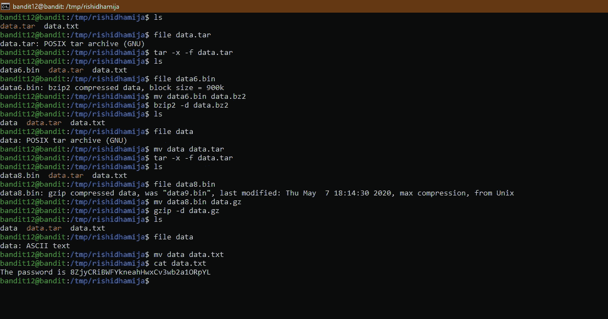

# 强盗等级 13 →等级 14

# 水平目标

下一级的密码存储在 **/etc/bandit_pass/bandit14 中，只能由用户 bandit14** 读取。对于这个级别，您不会得到下一个密码，但是您会得到一个私有的 SSH 密钥，可以用来登录到下一个级别。**注意:** **localhost** 是一个主机名，指的是您正在工作的机器

# 解决这一关可能需要的命令

ssh、telnet、nc、openssl、s_client、nmap

# 有益的阅读材料

*   [SSH/OpenSSH/Key](https://help.ubuntu.com/community/SSH/OpenSSH/Keys)

# 解决办法

```
C:\Users\Rishi>***ssh*** [***bandit13@bandit.labs.overthewire.org***](mailto:bandit13@bandit.labs.overthewire.org) ***-p 2220***
This is a OverTheWire game server. More information on [http://www.overthewire.org/wargames](http://www.overthewire.org/wargames)[bandit13@bandit.labs.overthewire.org](mailto:bandit13@bandit.labs.overthewire.org)’s password:***8ZjyCRiBWFYkneahHwxCv3wb2a1ORpYL***
Linux bandit.otw.local 5.4.8 x86_64 GNU/Linux 
```

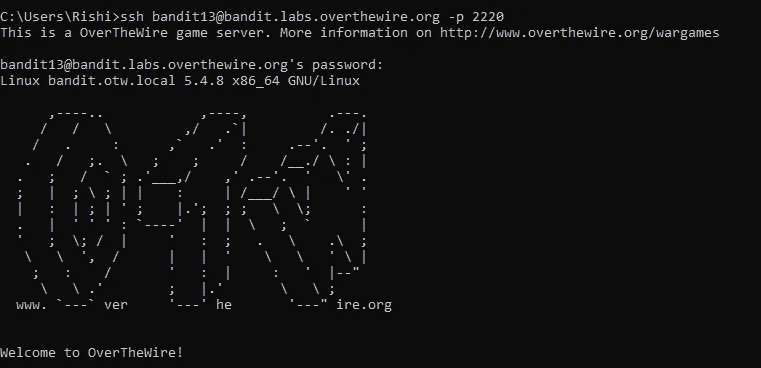

```
bandit13@bandit:~$ ***ls***
sshkey.private
bandit13@bandit:~$ ***ssh -i sshkey.private bandit14@localhost***
Could not create directory ‘/home/bandit13/.ssh’.
The authenticity of host ‘localhost (127.0.0.1)’ can’t be established.
ECDSA key fingerprint is SHA256:98UL0ZWr85496EtCRkKlo20X3OPnyPSB5tB5RPbhczc.
Are you sure you want to continue connecting (yes/no)? ***yes***
Failed to add the host to the list of known hosts (/home/bandit13/.ssh/known_hosts).
This is a OverTheWire game server. More information on [http://www.overthewire.org/wargames](http://www.overthewire.org/wargames)Linux bandit.otw.local 5.4.8 x86_64 GNU/Linux
```

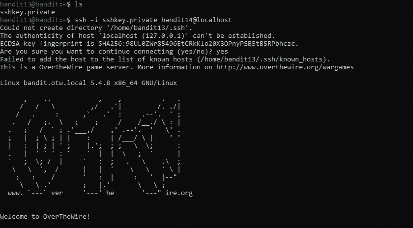

```
bandit14@bandit:~$ ***pwd***
/home/bandit14
bandit14@bandit:~$ ***cd ../..***
bandit14@bandit:/$ ***ls***
bin   cgroup2  etc   initrd.img      lib    lib64   lost+found  mnt  proc        root  sbin   srv  tmp  var      vmlinuz.old
boot  dev      home  initrd.img.old  lib32  libx32  media       opt  README.txt  run   share  sys  usr  vmlinuz
bandit14@bandit:/$ ***cd etc/bandit_pass/***
bandit14@bandit:/etc/bandit_pass$ ***ls***
bandit0  bandit10  bandit12  bandit14  bandit16  bandit18  bandit2   bandit21  bandit23  bandit25  bandit27  bandit29  bandit30  bandit32  bandit4  bandit6  bandit8
bandit1  bandit11  bandit13  bandit15  bandit17  bandit19  bandit20  bandit22  bandit24  bandit26  bandit28  bandit3   bandit31  bandit33  bandit5  bandit7  bandit9
bandit14@bandit:/etc/bandit_pass$ ***file bandit14***
bandit14: ASCII text
bandit14@bandit:/etc/bandit_pass$ ***cat bandit14***
***4wcYUJFw0k0XLShlDzztnTBHiqxU3b3e***
bandit14@bandit:/etc/bandit_pass$
```

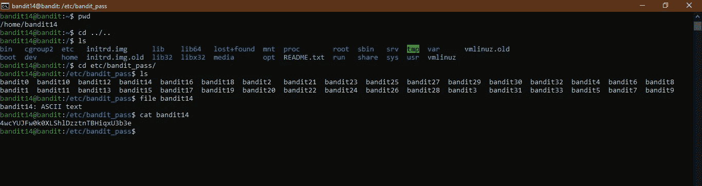

# 强盗等级 14 →等级 15

# 水平目标

将当前级别的密码提交到本地主机上的**端口 30000，即可找回下一级别的密码。**

# 解决这一关可能需要的命令

ssh、telnet、nc、openssl、s_client、nmap

# 有益的阅读材料

*   [互联网如何在 5 分钟内运转(YouTube)](https://www.youtube.com/watch?v=7_LPdttKXPc) (不完全准确，但对初学者来说足够好了)
*   [IP 地址](http://computer.howstuffworks.com/web-server5.htm)
*   [维基百科上的 IP 地址](https://en.wikipedia.org/wiki/IP_address)
*   [维基百科上的本地主机](https://en.wikipedia.org/wiki/Localhost)
*   [端口](http://computer.howstuffworks.com/web-server8.htm)
*   [维基百科上的端口(电脑联网)](https://en.wikipedia.org/wiki/Port_(computer_networking))

# 解决办法

```
C:\Users\Rishi>***ssh*** [***bandit14@bandit.labs.overthewire.org***](mailto:bandit14@bandit.labs.overthewire.org) ***-p 2220***
This is a OverTheWire game server. More information on [http://www.overthewire.org/wargames](http://www.overthewire.org/wargames)[bandit14@bandit.labs.overthewire.org](mailto:bandit14@bandit.labs.overthewire.org)'s password:***4wcYUJFw0k0XLShlDzztnTBHiqxU3b3e***
Linux bandit.otw.local 5.4.8 x86_64 GNU/Linux
```

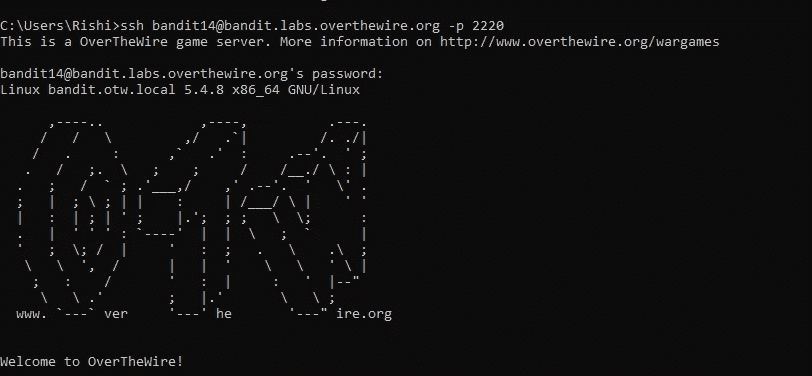

```
bandit14@bandit:~$ ***nc localhost 30000***
***4wcYUJFw0k0XLShlDzztnTBHiqxU3b3e***
Correct!
***BfMYroe26WYalil77FoDi9qh59eK5xNr***bandit14@bandit:~$
```

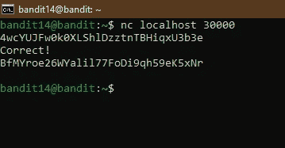

感谢阅读

> 如果你有兴趣了解更多关于网络安全的知识，请关注 Instagram 上的 [i.m.pratikdabhi](https://www.instagram.com/i.m.pratikdabhi/)