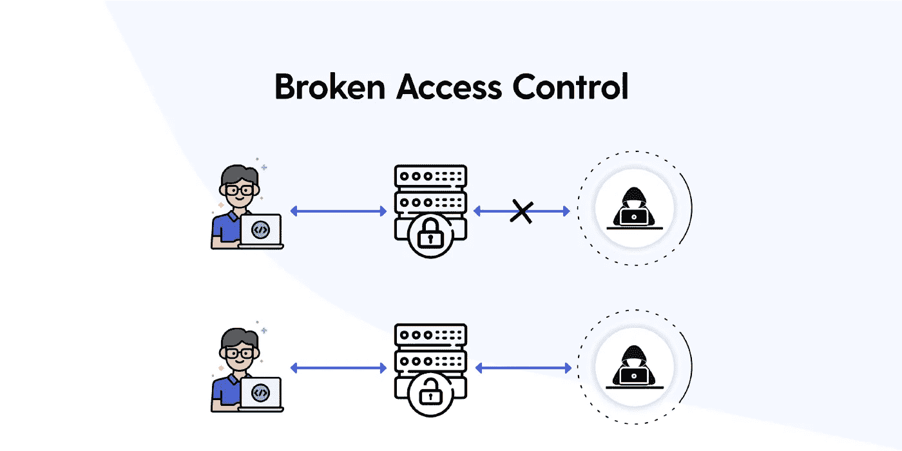

# OWASP-访问控制漏洞

> 原文：<https://infosecwriteups.com/owasp-access-control-vulnerability-611278b0d401?source=collection_archive---------1----------------------->

资料来源:NMcabling.co.uk

本文将集中讨论访问控制安全性和被破坏的访问控制，它将总结思想、过程并描述由于访问控制漏洞而引起的权限提升以及如何减轻它们。

OWASP Top 10 将访问控制漏洞列为最高的漏洞之一，因此在您进行下一次 bug 搜索时，有必要了解它以及检测它的可能方法。

所以，带上你的零食、保持水分的水以及任何需要注意的东西，因为这篇文章会很长很有趣。

## 什么是访问控制？

访问控制或授权是告诉用户谁或什么可以在应用程序中被访问的约束。

因此，我们可以说，在 web 应用程序的上下文中，访问控制依赖于授权和会话管理。

> **-**会话管理用于检查**-**后续的 HTTP 请求是否由同一用户发出。
> 
> **认证-** 验证用户的身份
> 
> **访问控制-** 验证用户执行的操作是否允许。

因此，设计和实现访问控制是一个复杂的过程，因为它们对于每个 web 应用程序都是不同的。从用户的角度来看，访问控制可以分为以下几类:

1.  **垂直门禁-**

垂直访问控制是限制一组用户访问敏感功能的机制。例如在一个 web 应用程序中管理员有权修改用户帐户，而普通用户则不享受这种特权。

2.**水平访问控制-**

水平访问控制是一种机制，允许一组人使用明确分配给他们的特定资源。例如，在银行系统中，您只能查看和修改您的帐户，而不能查看和修改其他帐户。

3.**依赖于上下文的访问控制-**

这些类型的访问控制根据应用程序的状态或用户与应用程序的交互方式来限制功能。一个非常常见的例子是，任何电子商务网站都可能阻止用户在购物时修改商品价格。

# 中断的访问控制

因此，当用户可以访问禁止他们访问的资源时，就会存在此漏洞。

**(I)纵向特权升级**

*访问不允许他们使用的功能*

**[I.I]未受保护的功能-**

这是最基本的垂直权限提升类型，在这种情况下，应用程序不会强制实施任何类型的保护来访问敏感信息。

例如，如果用户可以通过修改 URL 直接访问管理面板。

***https://xyz.com/admin***

这种信息可以通过查看 robots.txt 来访问，或者我们可以说是泄露了。

在某些情况下，信息不会被直接泄露，但仍可以通过其他方式访问，因为它们没有受到很强的保护，而只是隐藏在一个不太可预测的 URL 中，这称为模糊安全性。

例如，通过分析基于用户角色构建用户界面的 javascript 代码，可以泄漏管理面板 URL。

***<脚本>***

**var is admin = false；**

***if (isAdmin) {***

***…***

***var adminPanelTag = document . createelement(' a ')；***

***adminpaneltag . set attribute(' https://XYZ . com/admin ')；***

***adminpaneltag . innertext = ' Admin panel '；***

***…***

***}***

***</脚本>***

所以上面的脚本做了一个简单的动作，如果用户是管理员，它链接用户 UI，并且它包含的 URL 对所有人都是可见的，不管用户的状态如何。

**【一、二】基于参数的访问控制方法-**

更常见的是，web 应用程序使用另一种方法来识别用户的角色，为此，它们在登录时存储有关用户的信息。这条信息可以在任何可控的位置，比如 cookies、隐藏字段或预设的查询字符串参数。

【https://xyz.com/login/frame.jsp?admin=true*T42*

***https://xyz.com/login/frame.jsp?role=1***

例如，这个 web 应用程序通过检查必填字段来理解用户的角色。这种方法很危险，因为用户可以手动更改这些字段并授予管理员访问权限。

**【一、三】平台配置错误-**

这个挺有意思的。有时候，web 应用程序会根据用户的配置文件对特定的 URL 和基于 HTTP 的请求实施特定的访问控制。例如:

***拒绝:帖子，/管理/修改，常规***

对于常规组中的用户，上述规则拒绝/admin/modify 的 POST 方法。为了绕过这一点，我们可以使用各种非标准的 HTTP 头，它们可以覆盖 URL 原始请求，例如，我们可以使用 **X-Original-URL** 和 **X-Rewrite-URL。**因此，如果 web 应用程序允许通过请求头覆盖 URL，这个技巧将会起作用。

例如，如果 web 应用程序指定了上述规则，我们只需要使用代理服务器(Burpsuite)添加一行。

***POST/HTTP 1.1***

**X-Original-URL:/admin/modify**

该武器库中可用的另一种类型的攻击是基于方法的攻击，因为上述攻击是基于 URL 的。在这种情况下，攻击者可以使用 GET(或其他方法)来规避访问控制。

**(II)横向特权升级**

正如已经讨论过的，当用户获得属于其他人的资源的访问权(也称为窃取)时，就会出现这种漏洞。

此类别下的一些利用类似于垂直权限提升。为了更好地理解，让我们做一个简单的类比，一个著名的电子商务网站有两个用户(Bob 和 Alice)。当 Bob 访问他的帐户时，他注意到 id 参数被更改为如下所示的特定值

***http://xyz.com/myaccount?id=100***

现在，如果他通过提供任意值来修改 id 参数，他可以访问其他人的帐户，在这种情况下，他传递值“101”并访问 Alice 帐户。

嗯，漏洞总是不会这么直接，因为许多应用程序没有可预测的值。为此，他们更喜欢使用 GUID(全局唯一标识符)，在这种情况下，猜测是行不通的。然而，另一个用户的 GUID 可能在应用程序中的某个地方被隐藏或泄露，例如，我们可以检查特定用户被引用的位置。

> 水平权限提升攻击可以转化为垂直权限提升攻击，如果攻击者能够以某种方式危及更高权限用户的帐户，所有上述攻击都可能导致这种情况。

**(III)不安全的直接对象引用**

因此，IDOR 是一种访问控制漏洞，当应用程序使用用户提供的输入直接访问对象时，就会出现这种漏洞。这些问题与横向权限提升密切相关，但在某些情况下，它们也可能出现在纵向提升中。

**(四)多步流程中的访问控制漏洞**

一些 web 应用程序通过一系列步骤实现重要的功能，比如当我们在确认某个动作之前需要提供多个输入或选项时。

例如，web 应用程序有某些步骤:

> 用户表单
> 
> 提交更改
> 
> 查看更改

因此，web 应用程序可能对某些步骤有严格的访问控制，但在这种情况下，如果步骤 1、2 有控制方法，则忽略其他步骤，假设用户只有在前两个步骤完成后才会到达最后一个步骤。绕过这一点会导致攻击者获得对应用程序的未授权访问。

**(V)基于推荐人的访问控制**

web 应用程序具有 referer 头，它通常被添加到请求中，以指示和查找发起请求的页面。一些访问控制基于 HTTP 请求中提交的 Referer 头。

例如，一个应用程序对管理页面 *'/admin '，*实施访问控制，但是对于子页面 *'/admin/modify'* ，它们只检查 referer 头，因此如果 Referer 头包含 *'/admin'* ，那么它将允许访问。攻击者可以利用这一点，因为可以直接操纵子页面

## **如何防范访问控制漏洞**

最后，在最后一节，我们将讨论如何防止和减轻这一漏洞。可以使用以下方法

1.  永远不要仅仅依靠混淆来进行访问控制。
2.  减少公共访问资源的使用，直到明确需要。
3.  大多数情况下，对整个应用程序使用单一的应用程序机制。
4.  彻底审计和测试访问控制，以确保它们按预期运行

继续搜寻和保护网络，寻找一个更好更安全的地方！！

这类文章请关注我的 medium 和 LinkedIn。

[https://www.linkedin.com/in/sagar-tiwari-7a7639156/](https://www.linkedin.com/in/sagar-tiwari-7a7639156/)