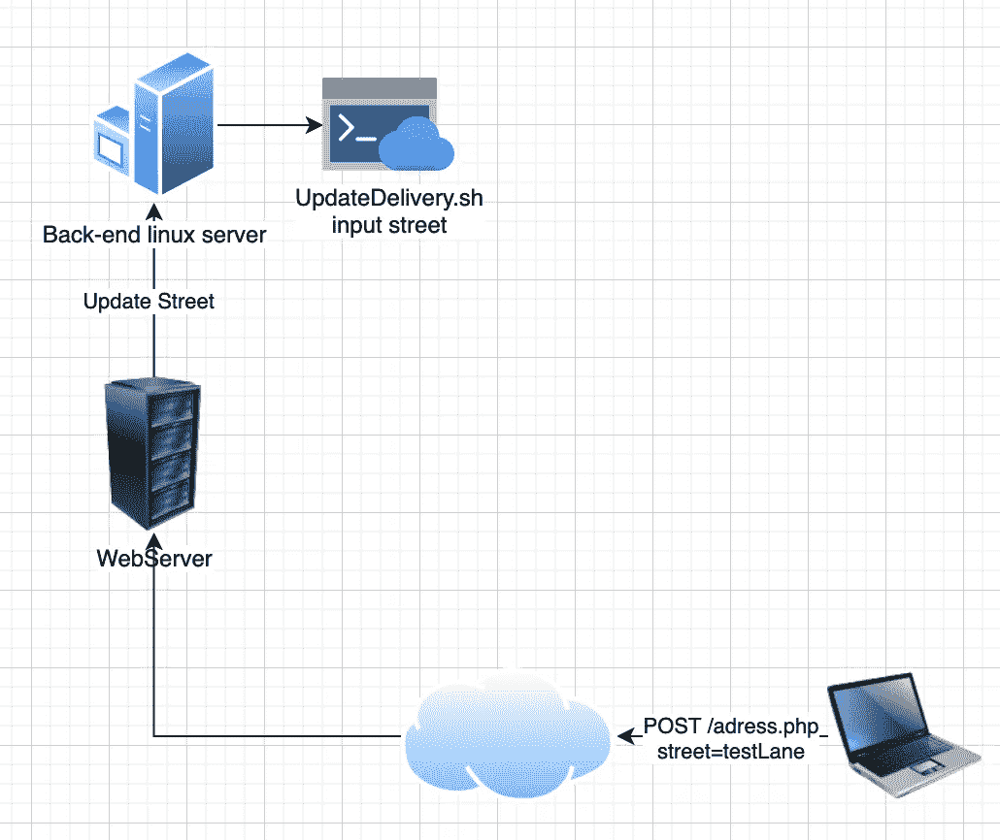
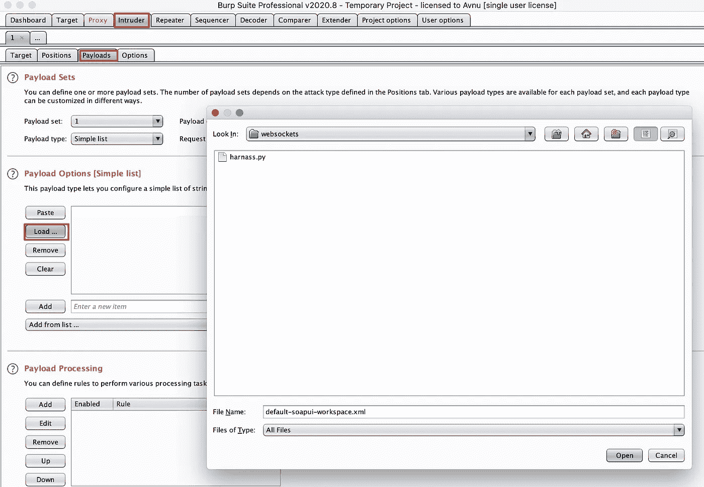
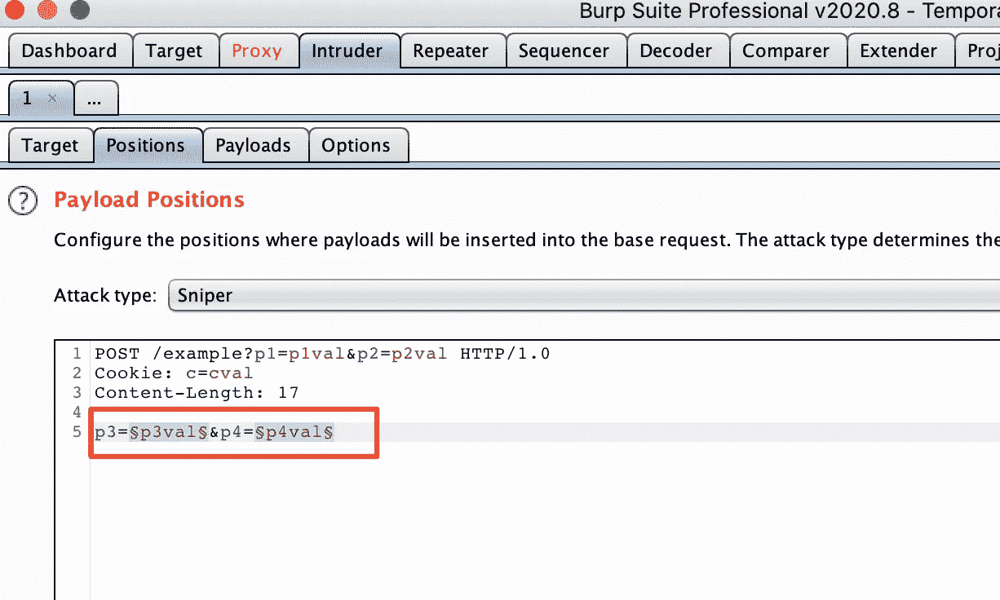

# OWASP 前 10:1-注入

> 原文：<https://infosecwriteups.com/owasp-top-10-1-injection-39a9272e36b4?source=collection_archive---------7----------------------->

# 介绍

当 OWASP 谈到注入缺陷时，它指的是允许从低影响问题(HTML 注入)到严重错误(SQLi 允许删除表)的任何缺陷。基本上任何介于两者之间的东西都可以在这里提到，比如 LDAP 注入、OS 命令注入等等。这些漏洞都有一个共同点，它们的根本原因。它们都是因为开发人员将用户的未初始化数据传递给解释器而发生的。

# 这是什么？

如果您是一名开发人员，您现在可能已经编写了一些查询，这些查询有时也会接受用户输入，例如:

```
SELECT * FROM PRODUCTS WHERE TEXT LIKE '%" . $_GET['q'] . "%';
```

如果我们不对用户输入进行适当的净化，这一行看起来很简单的代码可能会搞砸很多事情。恶意用户可能会在此处输入引号，这会中断 SQL 语句并允许执行用户提交的查询。你可以想象这是不可取的，我们有许多不同类型的注射。今天我们将讨论其中的几个，我们将从不同的角度来看。我们还需要注意，SQL 注入只是这个难题的一小部分，我们还将讨论命令注入。

# SQL 注入

## 黑客的视角

作为一名黑客，我的观点是试图依赖这样一个事实，即开发人员将需要清理我的所有数据，如果他们忘记这样做，即使只有一点，我也可能有一个可能的攻击切入点。这就是为什么我的测试策略非常依赖于测试我看到的每一个参数，甚至是我没有直接看到的参数。

由于我们可以测试 SQLi 和盲 SQLi，这就使事情变得复杂了。在盲 SQLi 中，服务器不会返回任何值供我们处理，我们只能通过发送一个已知会导致延迟的查询来测试此方法，但这会带来几个问题:

*   任何滞后都会导致响应延迟，看起来像是盲目的 SQLi 触发了，而实际上并没有触发
*   您需要知道您的目标使用什么数据库，这样您就可以为该服务器指定一个命令
*   对于本来就很慢的调用，盲目的 SQLi 测试更加困难，您将不得不等待很长时间，看看它是否被正确应用

考虑到这一点，如果我们对正在执行的数据库查询有所怀疑，并且可以控制，我们将尝试测试我们可以为 SQLi 找到的每一个参数。一个典型的实际例子，你会发现登录时有 SQLi，虽然这可能发生在 pentest 上，但它不会发生在 bug bounty 目标上。这太明显了，我们必须在 javascript 文件、隐藏的表单字段、waybackmachine 和我们能想到的任何东西中寻找那些隐藏的参数。

我们通常用单引号和双引号进行测试

```
'"
```

当我们看到一个 SQL 错误时，我们将进一步调查，或者使用像 [SQLmap.py](http://sqlmap.py) 这样的工具，或者手动调查，尽管我们必须注意这对于盲 SQLi 不起作用。

## 开发人员的视点

当涉及到 SQLi 保护时，开发人员的工作非常艰难，他们不仅要清理用户可以直接控制的每个参数，还必须考虑对应用程序的间接影响。例如，可能有正在运行的获取文件的批处理作业，这些文件的内容经常需要清理，但这并不总是容易的。

当第三方应用程序开始发送我们的应用程序数据时，它很容易变得一塌糊涂，并且很容易疏忽和忘记整理一条信息，这可能会引发连锁反应，您不想从您的工资支票中扣除。

作为一名开发人员，您应该遵循一些基本的安全原则来消除或避免这类攻击。

*   最小需求特权原则:如果您有一个只需要从数据库中读取数据的查询，那么我们可能不需要一个可以写入甚至删除数据的用户。如果可能的话，我们应该尽可能地将我们的用户隔离开来，这样如果我们真的被黑客攻击了，黑客就可能拥有最少的特权
*   异议关系映射:开发人员还可以创建对象，然后将这些对象映射到特定的数据库字段。当需要执行查询时，查询将发生在数据对象集合上，而不再发生在数据库本身上，这为 SQLi 消除了一个很大的攻击媒介
*   准备好的语句:对于需要直接与数据库交互的地方，总是建议使用准备好的语句。使用它们比直接创建数据库请求更安全。
*   无论我们决定做什么，在用户输入与我们的程序交互时，净化用户输入是至关重要的

# 操作系统命令注入

## 这是什么？

当我们可以控制传递给 shell 的参数时，就会发生命令注入。如果输入没有得到安全的处理和适当的清理，我们可以在输入中插入一个命令，并让 shell 执行它。根据该 shell 的功能和权限，我们可以执行各种命令。



这个理论听起来很简单，但是发现这种漏洞一点也不简单。

# 攻击策略

命令注入如此难以发现的原因是因为我们从来不知道我们的哪个进程将触发后端 shell 执行。这意味着我们需要模糊我们找到的每一个参数，但是你可能想知道用什么字符来模糊。为了确定这一点，我们首先需要讨论哪些命令分隔符可以使用，以及哪些命令。

# 分离器

以下命令分隔符在基于 Windows 和 Unix 的系统上都有效:

*   `&`
*   `&&`
*   `|`
*   `||`

以下命令分隔符仅适用于基于 Unix 的系统:

*   `;`
*   换行(`0x0a`或`\\n`)

在基于 Unix 的系统上，您还可以使用反斜杠或美元字符在原始命令中执行插入命令的内联执行:

*   `injected command`
*   `$(`注入命令`)`

# 命令

下面是在 Linux 和 Windows 平台上有用的一些命令的摘要:

[Linux 和 windows 命令](https://www.notion.so/8ed7d380f0a740dfbdb72395dccf7cc8)

# 模糊列表

在此基础上，我们可以创建一个模糊列表，包含所有分隔符和所有可能的命令。我将把这个留给你，因为它应该是一个很好的练习。如果你对此有任何问题，请随时联系我。

通过使用 burp intruder 模糊您可以在这个世界列表中找到的每个参数。

正如你在截图中看到的，我们加载了模糊列表并标记了我们想要测试的参数。



# 盲目命令注入

我们可以通过向环回地址发出执行 ping 命令的请求来测试盲命令注入。

```
& ping -c 10 127.0.0.1 &
```

同样，将这一点添加到您的模糊列表中，并注意这种攻击媒介的响应时间。如果超过 10 秒，我们可能有一个盲目的命令注入，但要注意可能会出现延迟，并给出一个错误的肯定。