# OWASP 十大尝试将我全部收入一篇文章

> 原文：<https://infosecwriteups.com/owasp-top-10-tryhackme-all-in-one-writeup-68ae5ab37d57?source=collection_archive---------0----------------------->

大家好，阿尤什这边，今天我们来谈谈 OWASP TOP！)Tryhackme Room，在这个房间里，您将获得 owasp 十大漏洞，您将了解它们并解决特定漏洞的实验室问题，好了，不浪费时间，让我们开始吧

这是所有 OWASP 前 10 名的列表，我们将逐一介绍！

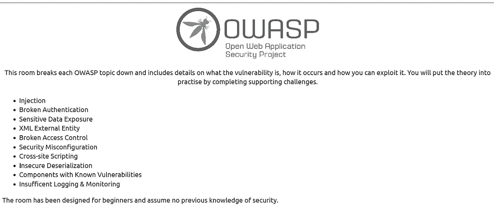

**第一天:注射**

好吧，那么，启动你的机器，你会得到这样的 IP 地址:

[http://your _ IP/evil shell . PHP](http://10.10.249.172/evilshell.php)然后在布施路上拜访【evilshell.php】T4

你会得到如下所示的界面:

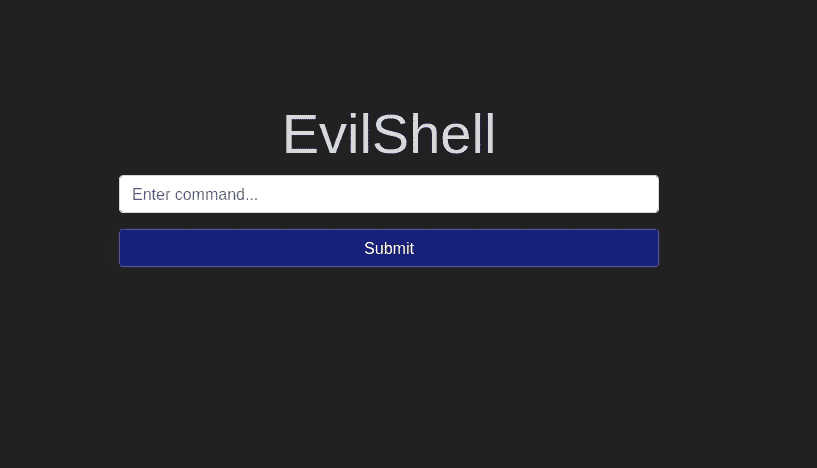

现在，让我们从提问开始

**Q1 网站根目录下有什么奇怪的文本文件？**

这很简单，我只需输入 **ls** 命令，然后我就得到那个特定的文件。

提示:文件名以 d 开头

**Q2 有多少非根用户/非服务用户/非守护进程用户？**

为此，我首先想到在哪里可以获得所有用户，然后我知道它将在 **/etc/passwd** 目录中，并且 passwd 是一个 txt 文件，所以我只是输入

**cat /etc/passwd** 然后我得到了所有用户，但为了得到用户数，我输入了 **cut -d: -f1 /etc/passwd** 然后我得到了零个用户，这在问题中有所描述。

**命令描述:** cut 命令切片一行并提取文本，在 cut 命令中我使用了-d(指定一个将用来代替默认“制表符”分隔符的分隔符)-f1(用于选择特定的字段。)

**Q3 这个 app 是以什么用户身份运行的？**

这很简单，我只是做了 whoami 并得到了答案。

**Q4 用户的 shell 设置为什么？**

在这里，你也只需输入 cat /etc/passwd，然后你就会得到答案。

提示:请看输出的下面部分。

**Q5 Ubuntu 运行的是什么版本？**

在这里，我首先尝试 uname -v，但没有成功，然后我做了一些关于如何找到 ubuntu 版本的研究，然后我得到了这个命令:

**lsb_release -a**

**Q6 打印出 MOTD。有什么最喜欢的饮料？**

我在这个问题上花了很长时间，我不知道这是什么，MOTD 然后我搜索了一下，然后我知道在哪里可以找到它，然后我做了 cat /etc/mod，但还是没有成功，然后我尝试访问/etc 目录的所有内容，并应用了这个命令**CD/etc&ls 和**然后我在 firefox 中通过查找选项搜索了 motd，是的，我得到了这个 **update-motd.d** ，在提示选项的帮助下，我应用了下面的命令

**cat/etc/update-motd . d/00-标题和答案为:**

我希望你知道这是一个博士，好吧，非常感谢你阅读这篇文章，我们将在下一个博客见面，你也可以点击这里在 instagram 上关注我。

**第二天:破解认证实用**

现在，让我们从第二个漏洞开始，好的，如果您已经阅读了《不可靠身份验证实用程序》中的内容，那么我希望您已经理解了间隔的概念以及如何使用它来重新注册特定用户，那么让我们从第一个问题开始。

**Q1 你在达伦的账户中找到的是哪面旗帜？**

为此，我们将注册名称达伦，但达伦的名字已经注册，所以我们能做什么，我们将使用间距技巧，我们已经在实践部分学习过，所以让我们使用它。

只需点击注册，输入 **darren** 和**末尾的两个空格**，然后用同样的用户名登录**和两个空格**，然后你就会得到你的第一面旗帜。

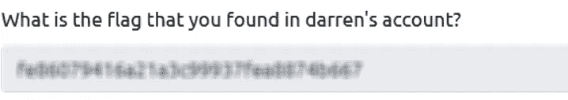

**Q2 你在亚瑟的叙述中发现的旗帜是什么？**

同样的方法也适用于你想要的任意数量的空间。

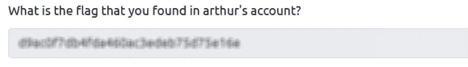

**第 3 天:敏感数据暴露(挑战)**

现在，我希望您已经了解了敏感数据暴露的支持材料如果是的话，那么让我们开始吧，

打开您的 web 应用程序，您会看到如下界面:

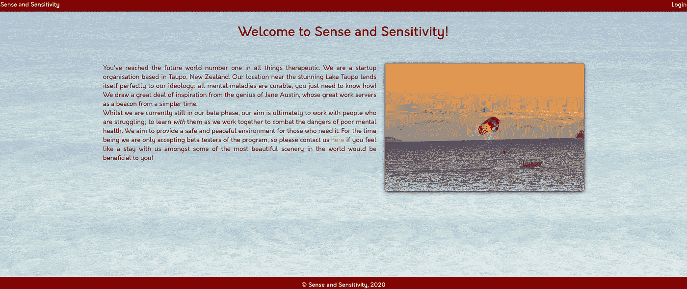

这里你可能会想，我能做什么，这是一张图片，我们将继续使用这张图片，只需在新标签中打开图片，然后应用/../../然后你将进入 web app 的**资产**目录，并给出你的第一个问题的答案。

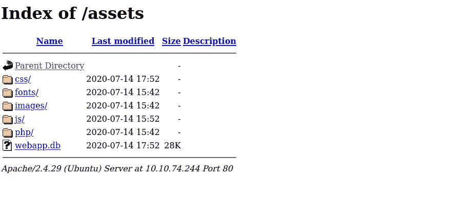

在这里您可以看到 webapp.db 文件，我们将使用它来查找管理员的密码，现在下载此文件并启动您的终端，并参考支持材料 1。

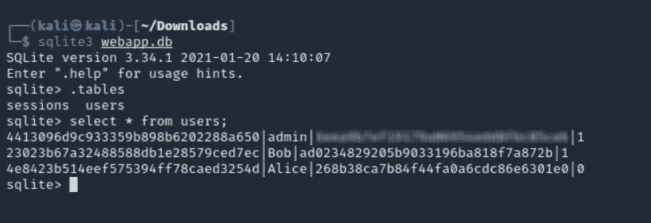

在这里，您可以看到我们得到了 admin 的散列，并且我们使用了**select * from users；**(不要以分号结尾)，这个 sql 命令将提取用户表的所有信息。

现在访问[https://crackstation.net/](https://crackstation.net/)破解哈希，然后你会得到密码，之后只需登录为管理员和标志，你会登录网页 php 目录。

**第 4 天:XML 外部实体—利用**

我希望您已经学习了 xml 外部实体的支持材料，并浏览了将要使用的有效负载。所以，现在让我们从问题开始:

**Q1/etc/passwd 中的用户名是什么？**

为此，我使用了以下有效载荷来获取用户名:

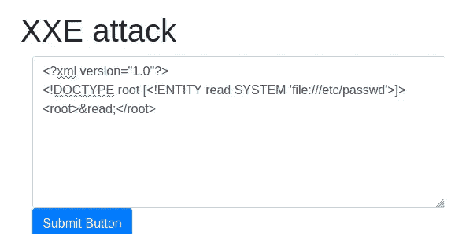

这个有效载荷将提取 passwd.txt 文件的所有内容，对于用户名，只要看最后一行，你就会得到它，我希望你得到它。

Q2 猎鹰的 SSH 密钥在哪里？

起初我不知道它的位置，然后只是在尝试

文件:///。宋承宪:但是后来经过研究，我找到了我在主目录下找到的确切位置，所以位置是这样的:

**file:///home/falcon/。ssh/id_rsa**

然后我得到了位置以及下一个问题的答案。

**Q3 猎鹰的私钥前 18 个字符是什么？**

在上一个问题中得到了答案。

**第五天:破解访问控制(IDOR 挑战)**

这是一个非常简单的问题，但是让我用简单的语言告诉你关于 IDOR 的事情，IDOR 仅仅是关于获取其他用户的信息，仅此而已，更多的是为你提供支持材料。

现在让我们来解决这个实验，使用用户名 **noot** 和密码 **test1234** 登录。

现在请注意 url:

[**http://10 . 10 . 228 . 249/note . PHP？注=1**](http://10.10.228.249/note.php?note=1)

我们将篡改音符值并得到结果。

提示:要获取标志，请输入 1-9 之间的值，并且**小于**小于 **1** : >

**第 6 天:安全错误配置**

在这里，在访问实验室后，我尝试了许多默认用户名和密码，如 admin:admin root:toor，但没有成功，然后在提示部分写了一些文档，然后我搜索了沉思笔记 github 并得到了结果

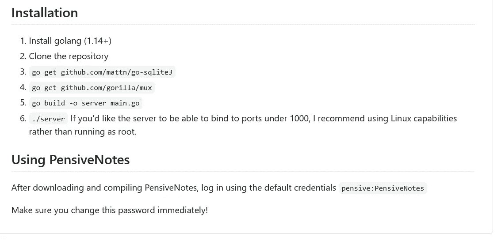

这是结果，登录后，我得到了标志。

**第七天:跨站点脚本**

我希望你已经了解了 XSS 的支持材料，让我们开始吧

**Q1 在浏览器中导航到**[**http://MACHINE _ IP/**](http://MACHINE_IP/)**，点击导航栏上的“映出 XSS”标签；制作一个反射的 XSS 有效载荷，它会弹出一个说“你好”的窗口。**

让我们首先再次部署机器，然后点击反射 XSS，并保持你的眼睛在网址上，并使用下面给出的脚本来获得第一个问题的答案:

这将弹出一个带有标志的窗口。

**Q2 在同一个反射页面上，设计一个反射的 XSS 有效载荷，它会弹出一个你机器的 IP 地址。**

为此，使用以下给定脚本:

**<脚本>警报(window . location . hostname)</脚本>**

这将再次弹出一个窗口，显示你的 ip 和标志，为了更好地理解这些东西，你应该清楚你可以从 w3 学校学习的 javascript。

**Q3 现在在您的浏览器中导航到**[**http://MACHINE _ IP/**](http://MACHINE_IP/)**并点击导航栏上的“存储的 XSS”选项卡；做账。**

**然后添加评论，看看能否插入一些自己的 HTML。**

现在你必须在注释部分使用任何 html 标签，比如 h1，p，li，ul 等等，然后你会得到答案，让我们用 h1 标签，就像这样

# 你好

**Q4 在同一个页面上，创建一个警告弹出框出现在带有您的文档 cookies 的页面上。**

为此，您需要使用 document.cookies，并像这样提供提醒功能

然后你会得到你的答案。

**Q5 通过添加评论和使用 Javascript 将“XSS 游乐场”改为“我是黑客”。**

我在提示部分和脚本的帮助下做的这个是这样的:

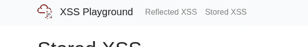

这里#thm-title 是 xss 有效载荷的 id，在 logo 的右边，这个文本我们必须改成我是一个黑客，所以我们将在上面的脚本的帮助下执行这个，只要提交那个脚本，你就会得到你的答案。

**答案是:** **网站 _ 可以 _ 容易 _ 污损 _ 用 _xss**

**第 8 天:不安全的反序列化—cookie 实用**

我希望你已经学习了支持材料和前面的问题**不安全的反序列化**是非常容易的，这就是为什么我将直接浏览 cookies 实用程序，让我们开始吧

**Q1 第一面旗帜(cookie 值)**

现在，按照说明，只需注册您的用户名和密码，在这一个中，我们必须首先篡改 cookie 值，我们必须找到作为用户的标志，该标志隐藏在会话 cookie 中，它是 base 64 编码的，因此我们将使用 base64 解码器并提交该标志。我希望你已经登录，在 firefox 中只需按 ctrl+shift+i 并打开存储选项，你会看到 sessionid 值，只需复制它并打开 base64 解码器[https://www.base64decode.org/](https://www.base64decode.org/)将值粘贴到这里，然后你会得到标志。

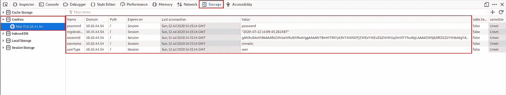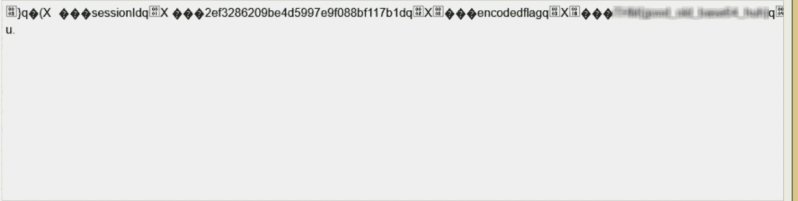

**Q2 第二面旗帜(管理仪表板)**

为此，只需将用户类型更改为 admin 并刷新页面。

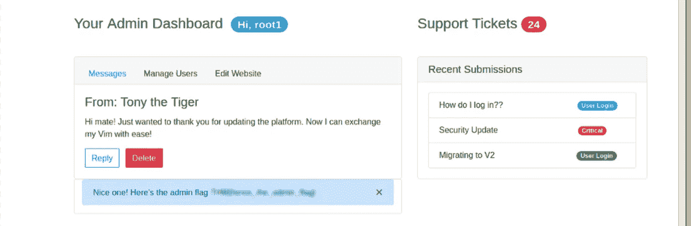

这是你的第二面旗子！

**不安全的反序列化—代码执行**

1.首先，将 userType cookie 的值从“admin”更改为“user”并返回到[http://MACHINE _ IP/my profile](http://MACHINE_IP/myprofile)

2.然后，左键单击下面截图中的“交换您的 vim”中的 URL。

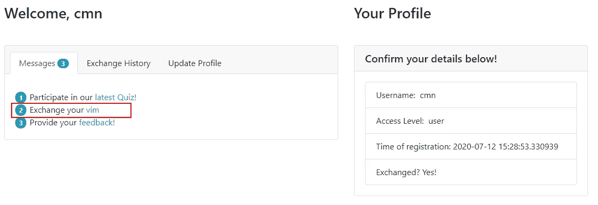

3.完成后，左键单击“提供您的反馈！”在那里，你将直接这样的页面，并提交反馈

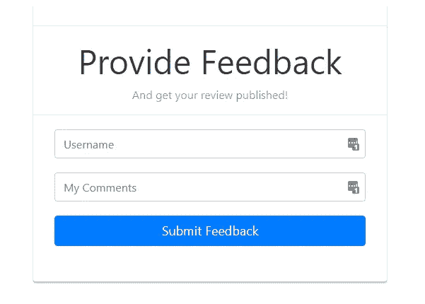

4)启动你的 netcat

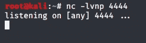

5)现在编写给定的代码，并输入您可以从访问页面访问的 vpn Ip

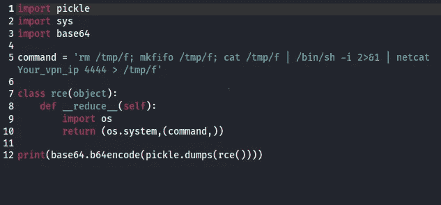

6)通过`python3 rce.py`执行“rce.py”

7)注意该命令的输出，它将类似于以下内容:

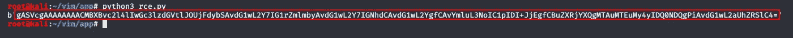

8)复制并粘贴两个语音标记(‘数据’)之间的所有内容**。在我的情况下，我会复制**

9)将其粘贴到浏览器的“编码有效负载”cookie 中:

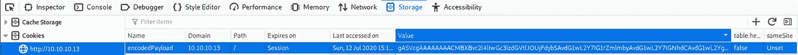

10)刷新页面。它将挂起，请参考您的 netcat 监听器:

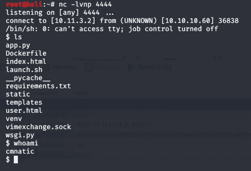

11)现在你已经得到了 shell，只需输入 **cd ~就可以移动到根目录，并且 ls** 你已经得到了标志！

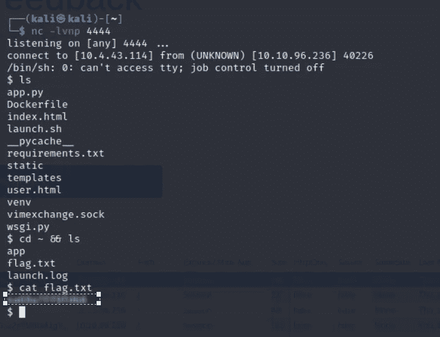

**第 9 天:具有已知漏洞的组件—利用**

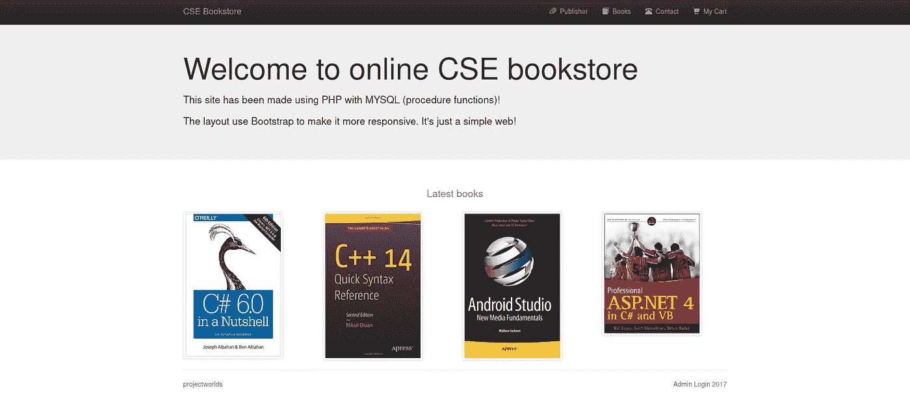

在这里，基本上我们必须为书店找到漏洞，然后我搜索 projectsworld rce，然后我得到了这个链接:

 [## 攻击性安全利用数据库档案

### 在线书店 1.0 -未经身份验证的远程代码执行..PHP 平台的 webapps 漏洞

www.exploit-db.com](https://www.exploit-db.com/exploits/47887) 

下载漏洞并使用 python3 和 passwd url 作为参数运行它，最后我得到了 shell。

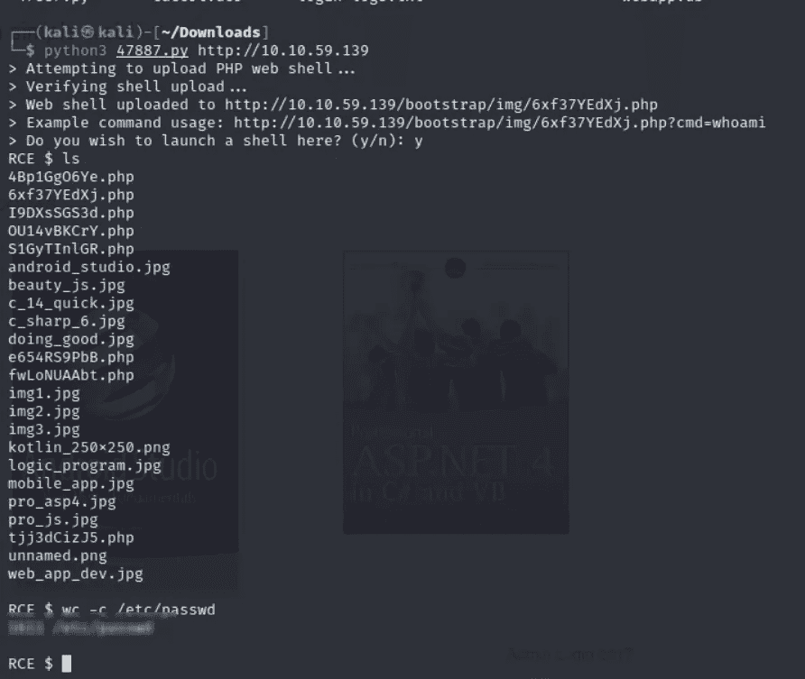

**第 10 天:记录和监控不足**

这很简单，只需下载文件并检查哪一个在重复 ip，这就是 IP 地址，猜测攻击是你的任务。

我们终于解决了 OWASP 的 10 大漏洞，伙计们，如果你们真的喜欢它，请鼓掌，你们也可以在 instagram 上关注我，点击[这里](https://instagram.com/_3xabyt3_)立即关注！

好吧，那我们下次博客再见！

黑客快乐！