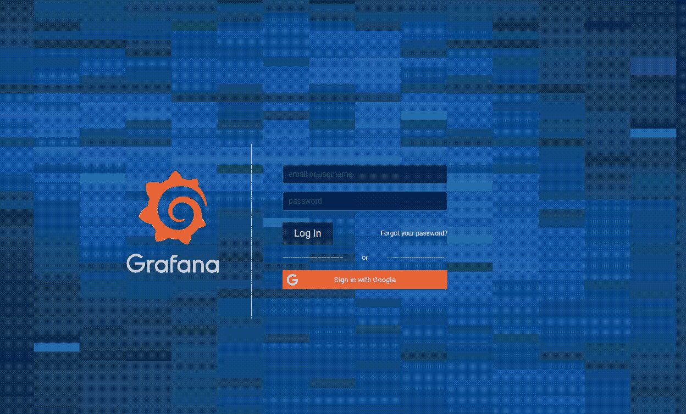

# P1:轻松访问 Grafana 仪表板

> 原文：<https://infosecwriteups.com/p1-easy-access-to-grafana-dashboard-9b7df82329b6?source=collection_archive---------3----------------------->

> 嘿，伙计们，我在这里分享我的一个老发现。其中使用默认凭证访问 grafana 仪表板，这导致关于服务器分析的敏感信息和关于资源利用率的其他信息。

你们一定都在想写这个简单发现的必要性，即使初学者也能发现这个问题:好吧，我的答案是只有 50%的 bug 猎人寻找这个缺陷，因为他们遵循他们的清单。作为渗透测试人员，我们的工作是测试和报告每一个漏洞，即使它很低或很高。我把这篇文章分享给那些执行或提供渗透测试服务或为一家公司工作的猎人和初级测笔员。这些简单的漏洞可以给我们提供有趣的数据&以及对面板的访问。

我在测试一个目标，所以就叫它 redacted.com 吧。我使用了**子查找器** & **httpx** 来查找活跃的子域名:-

**sub finder-d redacted.com | httpx-o redated . txt**

Redacted.com 使用 Grafana V6.0.2 的过时版本。在那里，我注意到一个子域是[https://grafana.redacted.com](https://grafana.redacted.com)，它被重定向到[https://grafana.redacted.com/login,](https://grafana.redacted.com/login,)，只有管理员或内部用户可以访问仪表板。所以我开始寻找 CVE 的&尝试一些旁路技术来访问 dashboard 但是没有成功。

我现在在做什么？

我现在做的是有没有其他方法可以进入仪表板。

也许有办法进入

突然，我的蜘蛛感觉警告我，我错过了在管理面板上查找漏洞的一个重要且简单的部分:尝试默认凭证。

我怎么忘记了测试管理面板的第一条规则？

而 grafana 默认凭证是 **admin: admin** ，在 grafana 文档中有提到。我尝试了**admin:admin**以 admin 身份登录。

已登录|抱歉，出于一个好的原因，我不分享完整的视频概念证明:)

**影响:**这可能会导致关于服务器分析的敏感信息和关于资源利用率的其他信息。
攻击者还可以生成一个 API 密钥，将资源从这个平台拉到攻击者的控制域。

**填空:**

谁该为这个错误负责:_ _ _ _ _ _ _ _ _ _ _ _ _ _ _😁

按照 Bugcrowd VRT 的说法，这个缺陷具有 P1 严重性，奖励应该是 4 位数，但我在 VDP(停止的项目)上发现了它，他们根据奖金项目的预算支付。

**赏金:$$$(3 位数)**

注意:永远不要低估蜘蛛的感觉，尝试你所拥有的一切，永不放弃。

**格拉法纳 6.3.3 之前版本中未经认证存储的 XSS 由** [**穆罕默德·塞尔瓦**](https://twitter.com/serWazito0)**:**[**https://t.co/8jiFU7few6?amp=1**](https://t.co/8jiFU7few6?amp=1)

***推特:***[https://twitter.com/Mah3Sec](https://twitter.com/Mah3Sec_)

感谢阅读我的文章，祝你狩猎愉快！