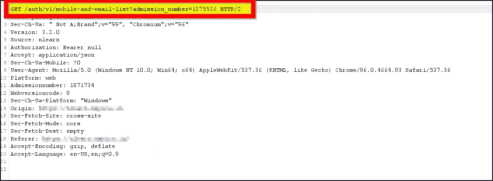
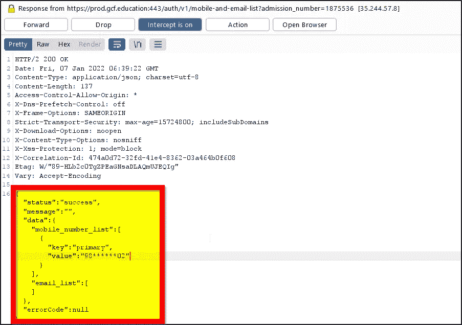
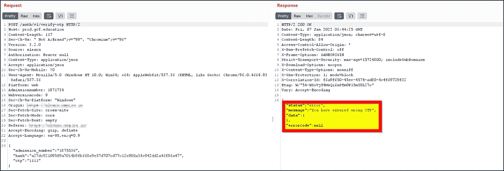
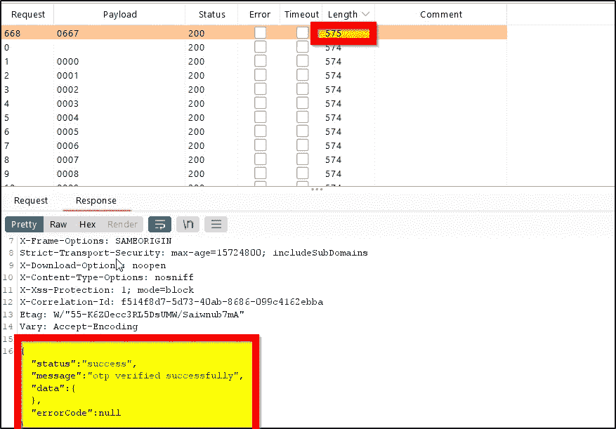
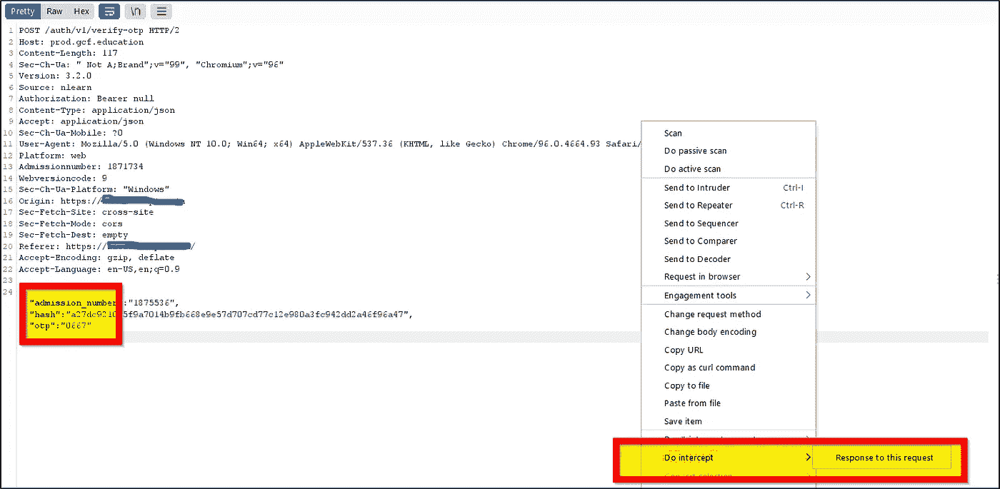
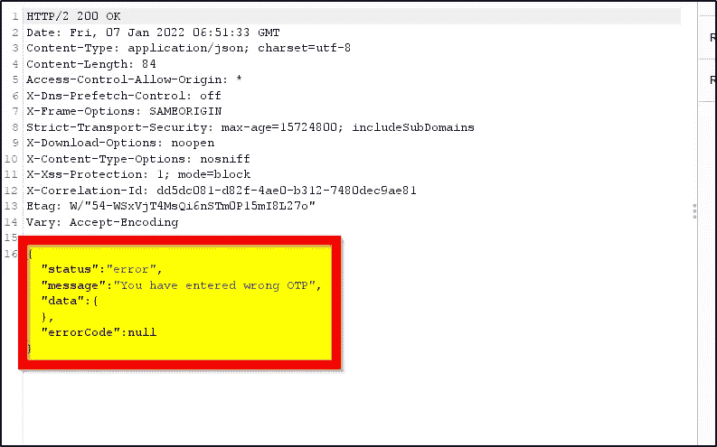
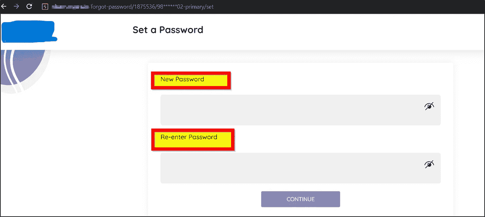
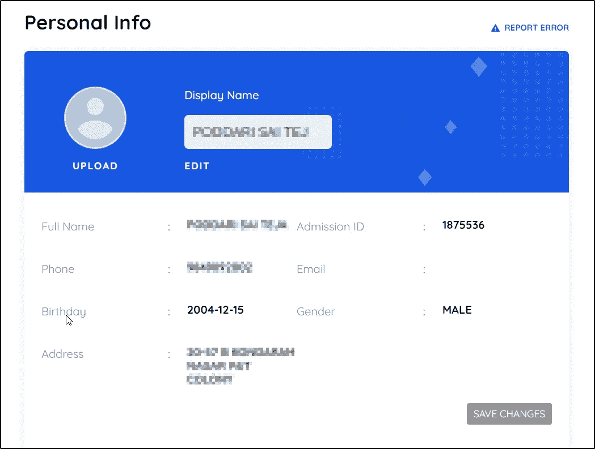

# P1 漏洞:我如何将逻辑错误与帐户接管漏洞联系起来😈🧑‍💻以前没人说过你😁

> 原文：<https://infosecwriteups.com/p1-vulnerability-how-i-chained-logical-error-to-account-takeover-vulnerability-that-no-one-59aa88a9cae8?source=collection_archive---------0----------------------->

# *导言*

你好黑客们，我是 Gowtham，一个来自印度的道德黑客和渗透测试者，他喜欢寻找漏洞😁。由于许多因素，我给了我的第二个博客一个巨大的空白！我真诚地向大家道歉。所以今天，我要告诉你，我是如何利用 Web 应用程序本身的逻辑错误获得帐户接管漏洞的。我到现在还没有报告这个 bug，所以出于某种原因，我不想公开这个网站的名称，姑且称之为“Example.com”。让我们开始学习吧🔥

> ***当逻辑失败时，攻击者会成功:***

虽然这个网站没有太多的功能，但我总是首先查找“绕过登录”漏洞。所以我从重置密码功能开始，请求如下所示👇

忘记密码的请求

答案是:

对上述要求的回应

一切都会好的，直到我们把参数“status”改成:“fail”。甚至在改变参数时，它发送 OTP 到注册的移动电话号码，但是这允许我们暴力破解 OTP[无速率限制漏洞]。

“逻辑错误导致无速率限制”

> 我如何设法绕过只工作一次的 OTP😈

修改值后，用户将获得一个 OTP[它实际上通知用户]到他/她的手机号码。所以我输入了一些随机的 OTP，这样我就可以暴力破解正确的 OTP。

对随机输入的 OTP 的响应。

您可能认为可以将该值更改为“status”:“success”来绕过 OTP，但这是行不通的，因为验证是在服务器端进行的。现在我唯一的选择就是为检察官办公室而战，我做到了。

*   正确的动态口令给出的长度是 575，而所有其他动态口令给出的长度是 574。

正确动态口令的响应

获得 OTP 后，我立即修改了值，并在之前的请求中输入了正确的 OTP。

使用正确的动态口令请求

现在你仍然可以看到，我们得到“状态”:“错误”，因为正如我所说的，它在两端进行检查，服务器端以及客户端。

*   我们的代码在暴力破解过程中已经被验证过了，所以现在正如你所预料的，我们可以将值改为“success”来绕过客户端的 OTP。

我将值更改为 Success，它绕过了 OTP 验证。

现在我可以为任何用户更改密码了！！😁我可以登录任何用户账户，也就是账户接管漏洞

可以能够改变任何用户的密码。

泄露一些关键数据，如地址、电话号码、姓名以及一些银行信息。

> 结尾注释😣

我向每一个觉得这个博客像是一个演练/报告的人道歉。我试图详细解释每件事，这就是粘贴所有截图的原因。我向你保证，我每周至少会写一篇博客😅。让我们一起学习，一起成长。

> 如果你在学习中遇到任何问题，或者对我的博客有任何疑问，请随时联系我😁❤️

您可以关注我:

https://www.twitter.com/gowtham_ponnana 的❤️:

https://www.instagram.com/gowtham_ponnana 的❤️:

gowtham.official45@gmail.com❤️

[注意]:我真诚地建议人们加入我们的 Discord 社区，了解更多关于网络安全的东西。

不和:[https://discord.gg/gY35nHX7gu](https://discord.gg/gY35nHX7gu)

感谢和问候，

戈塔姆·奈杜·蓬纳纳