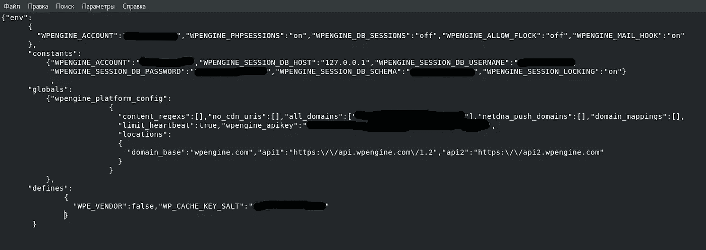

# 60 秒内 P1 漏洞

> 原文：<https://infosecwriteups.com/p1-vulnerability-in-60-seconds-85ef93d42b99?source=collection_archive---------0----------------------->

2018 年 1 月，我被邀请参加 Bugcrowd 上的 privat 计划，范围为*.bountydomain.com。

我在这家公司的子域名上发现了 12 个漏洞，并决定看看位于[www.bountydomain.com 的主网站。](http://www.bountydomain.com.)我运行 wfuzz(比起 dirbuster，我更喜欢 Wfuzz ),发现 https://www.bountydomain.com/blog/在[运行 Wordpress 博客。](https://www.bountydomain.com/blog/)

首先想到的是:“伙计们，这是 Wordpress 和博客在主网站上的新版本= >没有 vuln”。但是，我决定检查一下这个资源…结果！！！

Wfuzz 告诉我以下网址有 200 个代码状态:【https://www.bountydomain.com/blog/_wpeprivate/config】T4。json

这个文件公开了来自 WPEngine 的 API 密钥，DB 用户名，DB 密码等等。

赏金:1500 美元

推特:[https://twitter.com/Wh11teW0lf](https://twitter.com/Wh11teW0lf)