# P4·CTF:阿普费尔·塞特

> 原文：<https://infosecwriteups.com/p4-ctf-apfel-seite-6eb03b7b60d7?source=collection_archive---------2----------------------->

这是我为 p4 CTF 的 apfles seite web exploitation challenge 撰写的文章。在这个挑战中，我们需要检查 apple store 网站，寻找任何漏洞。

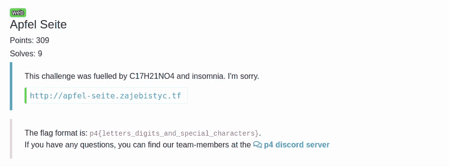

首先，我们访问他们给我们的 URL，我们可以看到四个导航按钮。我们可以按下它们中的任何一个来查看在“apfel_selection”参数中带有“description.txt”路径的页面。

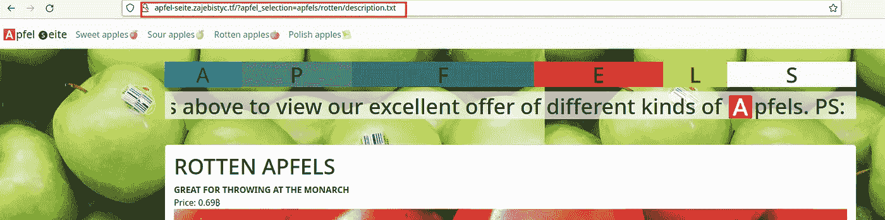

我们可以尝试将该值更改为另一个文件，以确认我们是否进行了路径遍历。为此，我们尝试读取文件/etc/passwd。

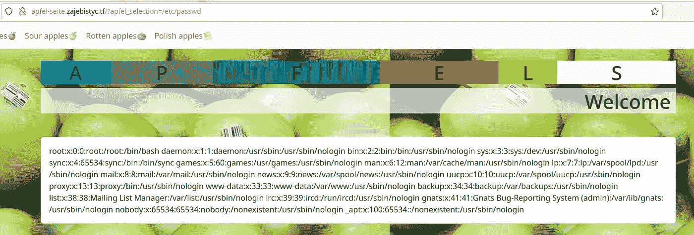

我们可以看到，我们可以使用绝对路径，但如果我们从我们的位置尝试相对路径”../../../../../../../../etc/passwd "我们得到以下错误消息。

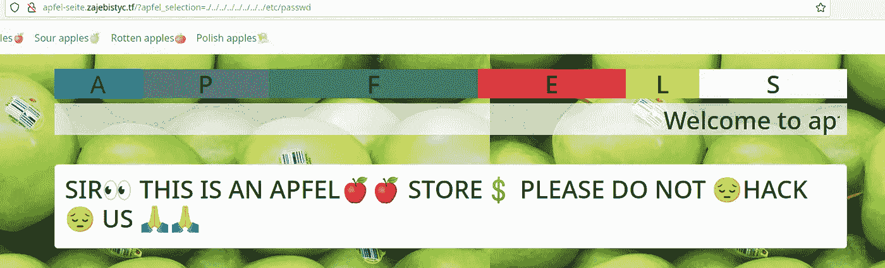

要查看此消息的原因，我们可以通过漏洞读取页面的 index.php 来访问服务器代码。

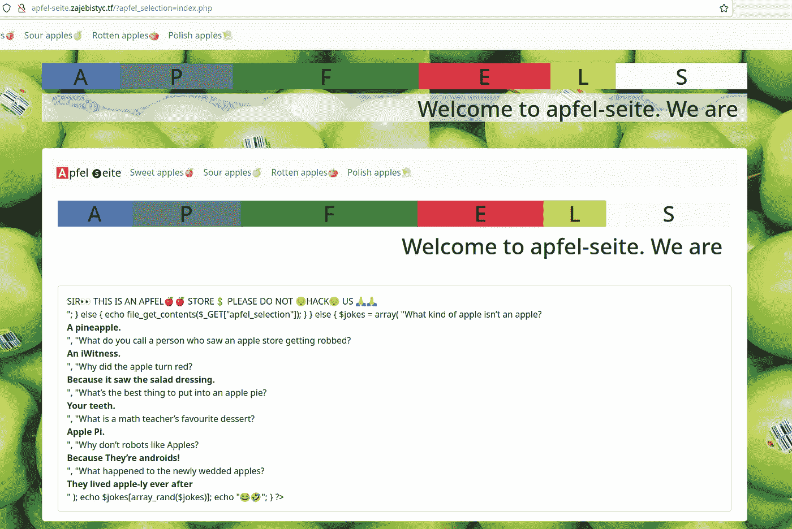

让我们使代码更容易阅读和更详细地分析。

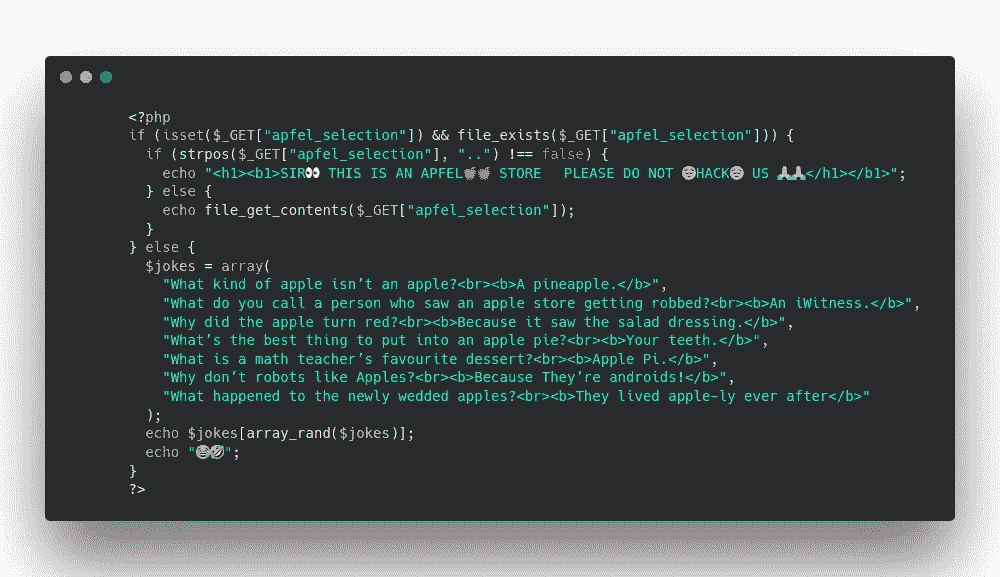

我们看到它用“..”过滤输入这就是它给出这个错误的原因。但是我们仍然不知道旗子在哪里。在尝试了从遍历路径获得代码执行并枚举所有标准文件的常用方法后，我在解决挑战方面没有取得任何进展。

我决定休息一下，通过总结我们所拥有的，给出一个新的和不同的方法来应对挑战:

*   苹果主题挑战。
*   路径遍历。
*   未知的标志位置。

然后我想起了我的第一次试验，客户暴露了。DS_Store 文件，由于这个原因，我们在服务器上发现了一系列文件。我做了测试，有文件:

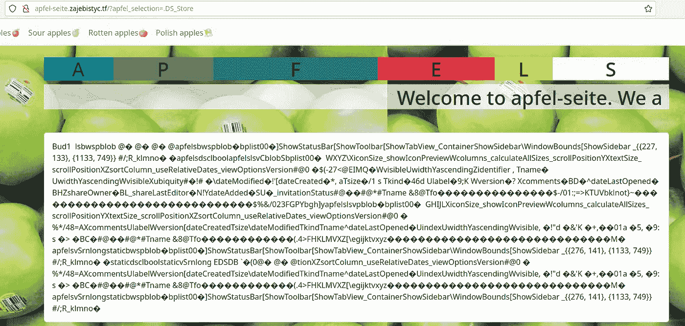

如果我们下载并解析该文件，我们会看到在根目录下只有 apfels 目录。

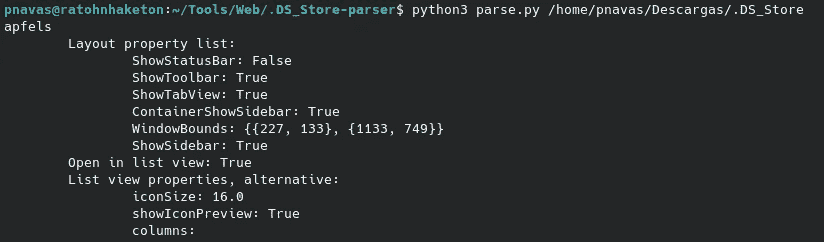

现在让我们来看看*。DS_Store* 在 apfels 目录里面。

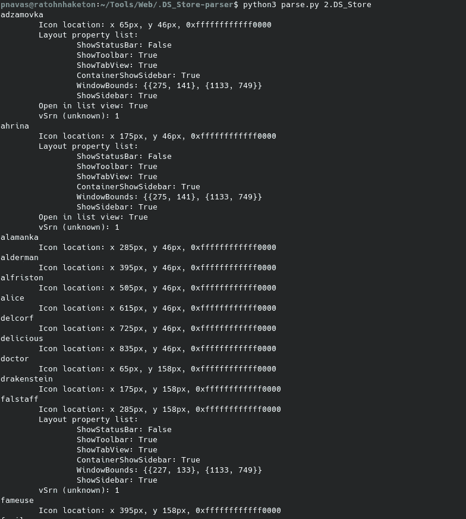

我们可以看到大量的目录，进入和下载*。每一个的 DS_Store* 看起来都是一个繁琐的任务。因此，我们将在 BurpSuite 的帮助下实现自动化，特别是针对入侵者。

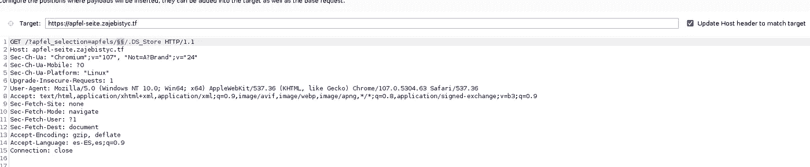

现在，我们可以看到其中一个与其他的有显著的不同:

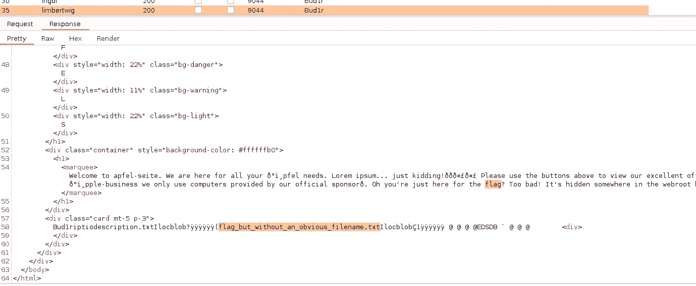

我们可以下载*。DS_Store* 并提取带有标志的文件名。

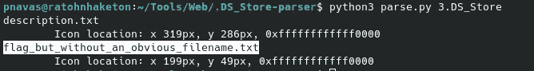

最后，我们可以读取标志文件并获得这些点:

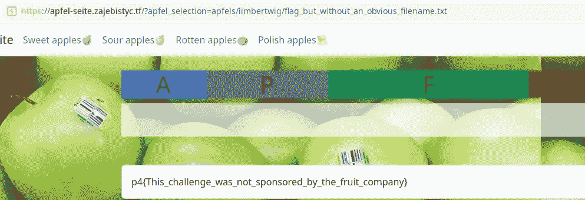

**GG！**

我希望你喜欢我的文章，并发现我的内容有用。下一篇文章再见。

## 来自 Infosec 的报道:Infosec 每天都有很多内容，很难跟上。[加入我们的每周简讯](https://weekly.infosecwriteups.com/)以 5 篇文章、4 个线程、3 个视频、2 个 GitHub Repos 和工具以及 1 个工作提醒的形式免费获取所有最新的 Infosec 趋势！