# PacketMaze Pcap 分析演练

> 原文：<https://infosecwriteups.com/packetmaze-pcap-analysis-walkthrough-7310e614a722?source=collection_archive---------2----------------------->

地点:[https://cyberdefenders.org/](https://cyberdefenders.org/labs/68)

## **1)什么是 FTP 密码？**

*ANS 提示:使用 ftp 过滤器，找到密码*

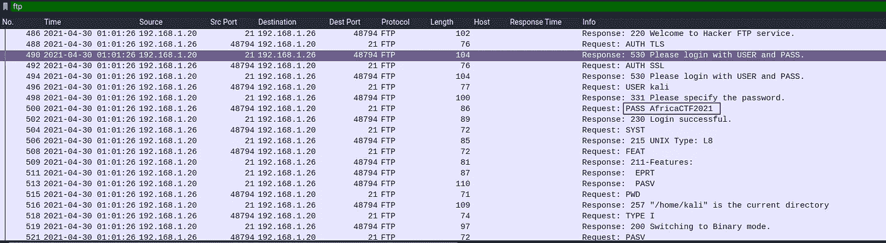

## 答复:非洲 2021 年

## 2)192 . 168 . 1 . 26 使用的 DNS 服务器的 IPv6 地址是什么？(####::####:####:####:####)

*ANS 提示:这里我首先找到服务器的 mac 地址(192.168.1.10)*

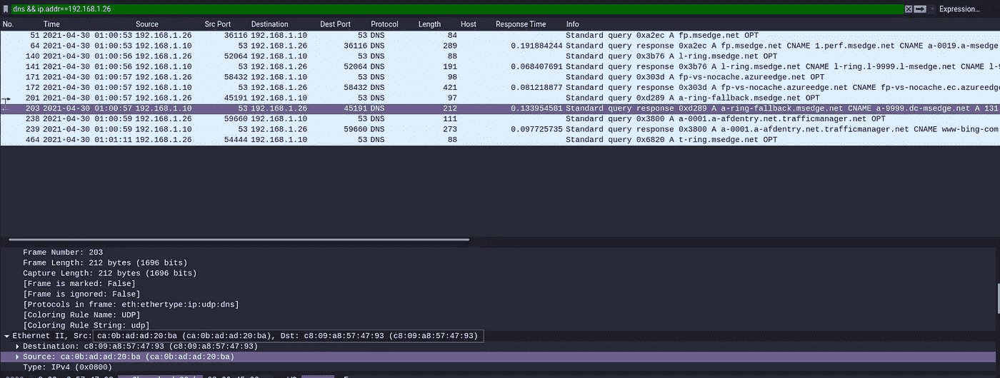

*ANS 提示:我转到统计- >对话部分，查看以太网部分，以找到更多关于服务器通信的信息*

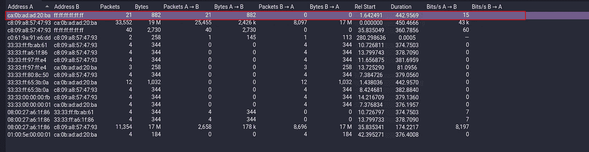

*ANS 提示:最后打开 ipv6 部分，比较您从以太网部分获得的关于服务器的相关信息*

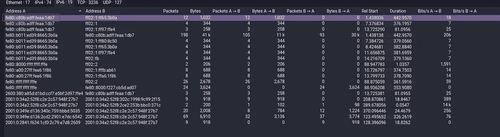

## 答案:fe80::c80b:adff:feaa:1db7

## 3)用户在数据包 15174 中查找哪个域？

*ANS 提示:转到统计- >对话，这里我们可以看到 15174* 以上使用的域名的 ip 地址

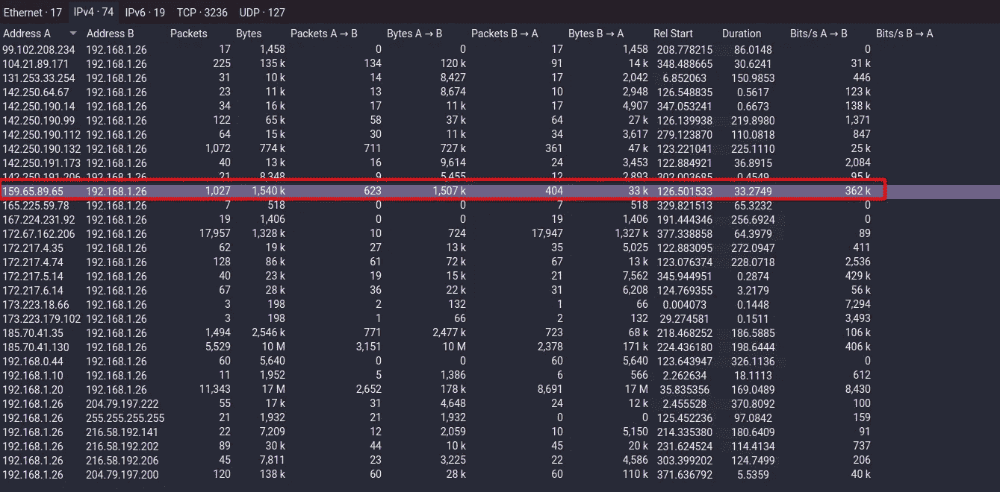

*ANS 提示:转到统计- >解析的地址，然后检查 ip 地址的对应域名*

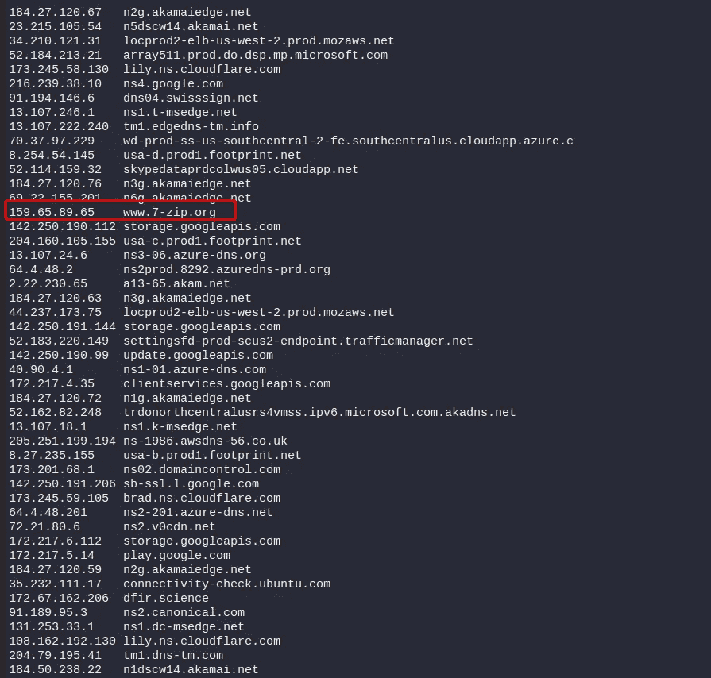

## 答案:[www.7-zip.org](http://www.7-zip.org)

## 4)从 192.168.1.26 发往 24.39.217.246 的 UDP 数据包有多少个？

*ANS 提示:使用 UDP&&IP . src = = 192 . 168 . 1 . 26&&IP . dst = = 24 . 39 . 217 . 246*

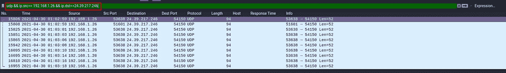

## 答:10

## 5)被监控系统的 MAC 地址是什么？

ANS 提示:我们知道监控系统的 ip 地址。所以找到 192.168.1.26 的 mac 地址

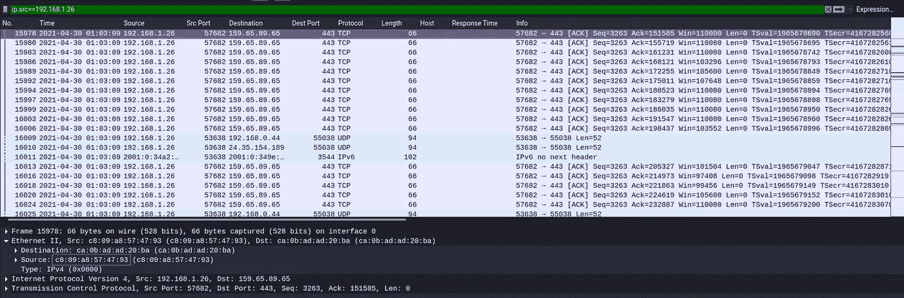

## 答案:c8:09:a8:57:47:93

## TLS 会话中使用的服务器证书公钥是什么:da4a 0000342 e4b 73459d 7360 B4 bea 971 cc 303 AC 18d 29 b 99067 e 46d 16 cc 07 F4 ff？

*ANS 提示:使用 tls.handshake.type==2 它列出所有服务器 hello。找到相应的 tls 会话 id 并检查其公钥*

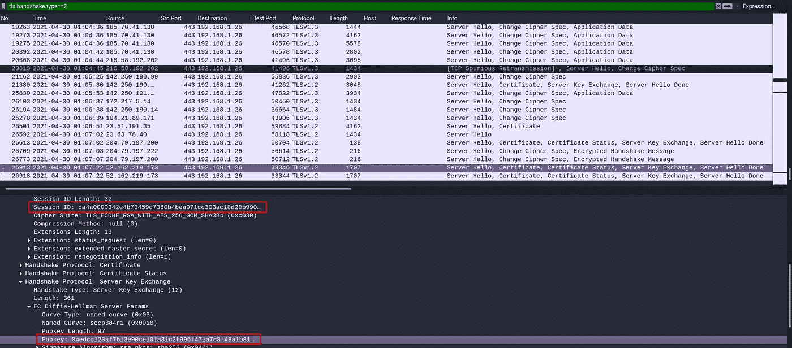

## ANS:04 edcc 123 af 7 b 13 e 90 ce 101 a 31 c 2 f 996 f 471 a 7 c 8 f 48 a 1 b 81d 765085 f 548059 a 550 F3 f 4 f 62 ca 1 f 0 e 8 f 74d 727053074 a 37 BCE B2 CBD c 7 ce 2 a 8994 DCD 76 DD 6834 eefc 5438 C3 b 6 da 929321 F3 a 1366 BD 14 c 88

## 7)用于与 protonmail.com 建立连接的第一个 TLS 1.3 客户端随机数是什么？

*ANS 提示:在这里你可以看到多了一栏“服务器名”。它列出了所有 https 服务器。您不知道如何将此专栏添加到您的 Wireshark 中。不要担心这个*[*https://www . malware-traffic-analysis . net/tutorials/wireshark/index 2 . html*](https://www.malware-traffic-analysis.net/tutorials/wireshark/index2.html)*使用这个网站并按照说明进行设置。*

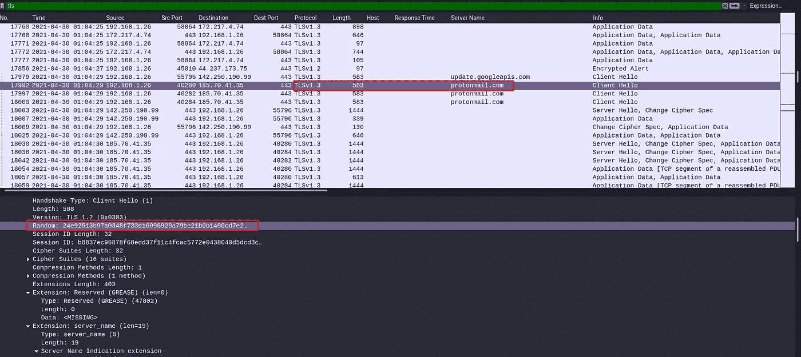

## ANS:24e 92513 b97a 0348 f 733d 16996929 a 79 be 21 b 0 b 1400 CD 7 e 2862 a 732 ce 7775 b 70

## 8)在数据包 27300 中，用户连接到了哪个域？

ANS 提示:找到 27300 个数据包的目的 ip 地址。然后进入统计- >解析地址，查看对应 ip 地址的域名

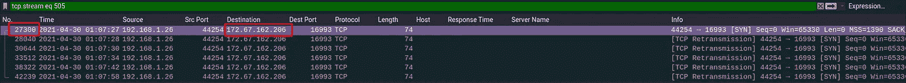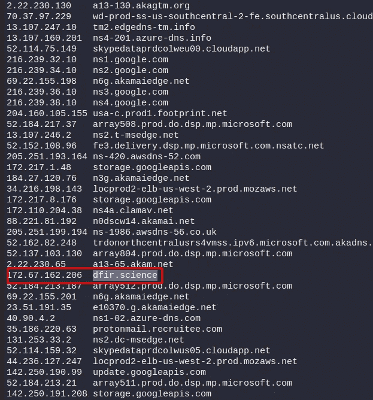

## 答:dfir.science

## 9)4 月 20 日，什么时候在 FTP 服务器上创建了一个非标准文件夹？(时:分)

*ANS 提示:使用 ftp 数据过滤器并打开正确的列表。然后查看基于行的文本数据部分，注意哪个目录是在 4 月 20 日创建的*

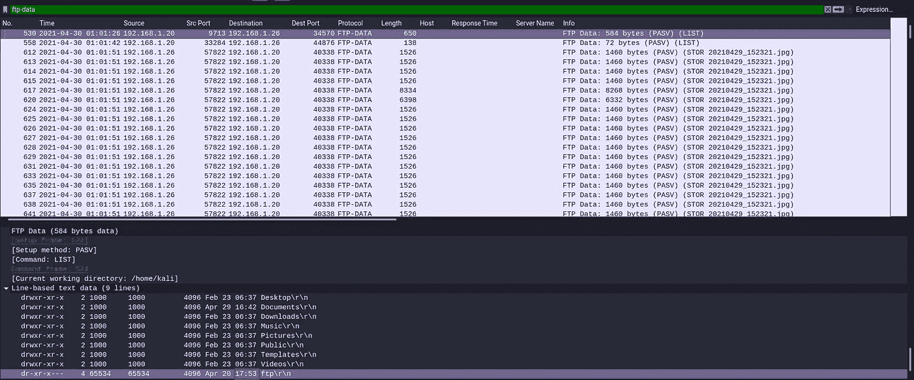

## 答:17: 53

## 10)FTP 服务器的 MAC 地址注册在哪个国家？(两个单词，中间有一个空格)

*ANS 提示:找到 192.168.1.20(ftp 服务器)的 mac 地址*

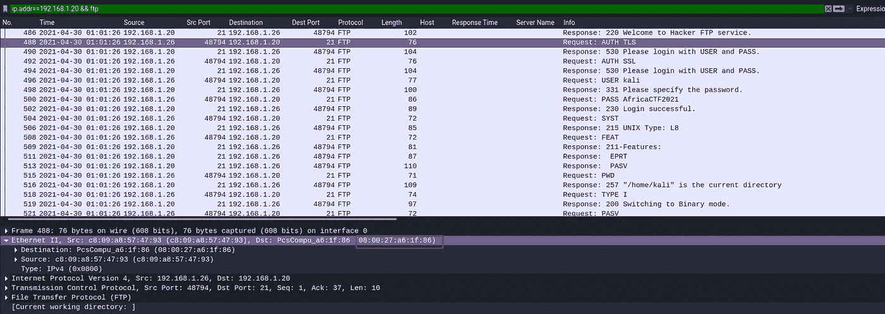

*ANS 提示:下一步就是去看***。并检查对应 mac 地址的国家代码**

*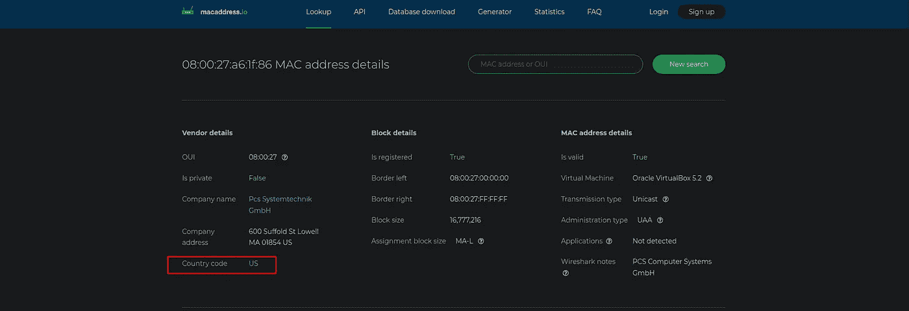*

## *答:美国*

## *11)用于拍摄图片 20210429_152157.jpg 的相机型号名称是什么？*

**ANS 提示:使用 ftp-data 过滤器并找到给定的图像。在 tcp 流中打开并保存为 raw 格式**

*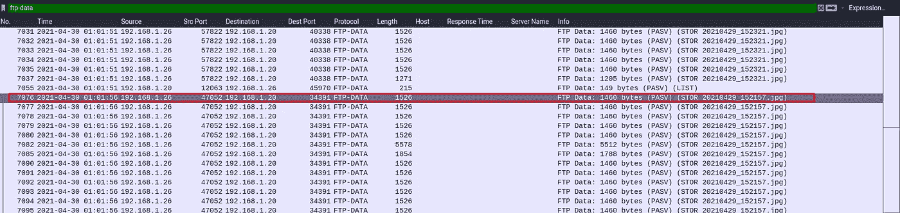**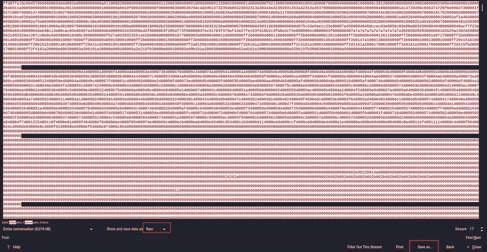*

*ANS 提示:现在我们得到了一个图像文件。下一步是去[*http://exif.regex.info/exif.cgi*](http://exif.regex.info/exif.cgi)找元数据。你可以看到相机型号*

*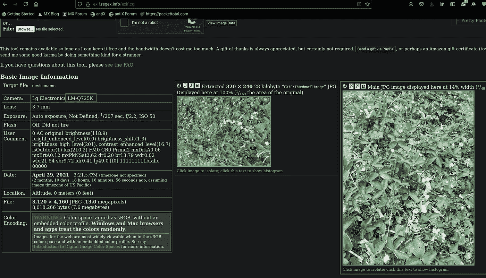*

## *答:LM-Q725K*

*参考链接*

* [## MAC 地址供应商查找

### 示例 44:38:39:ff:ef:57 通过给定的 MAC 地址，检索 OUI 供应商信息，检测虚拟机，可能…

macaddress.io](https://macaddress.io/)  [## Malware-Traffic-Analysis.net-将 HTTPS 服务器名称添加到 Wireshark 的列显示中

### 注意:我在 Palo Alto Networks 的博客上发布了此信息的更新版本，网址是:在此之前，您…

www.malware-traffic-analysis.net](https://www.malware-traffic-analysis.net/tutorials/wireshark/index2.html) 

[exif.regex.info/](http://exif.regex.info/)

感谢您的阅读和支持*