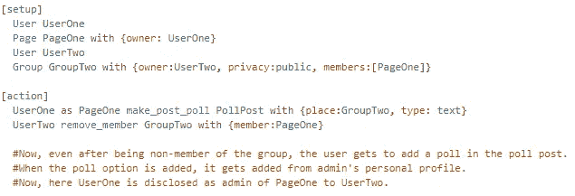
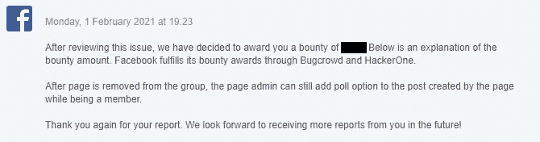
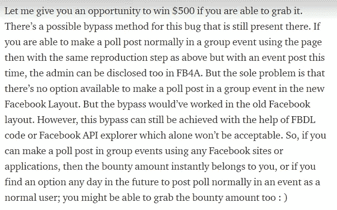
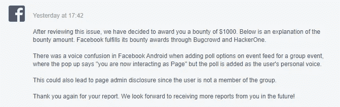

# 由于在脸书 Web + FB4A [$xxx+$xxxx]中不正确的会话处理，页面管理在组中泄露

> 原文：<https://infosecwriteups.com/page-admin-disclosed-in-groups-due-to-bad-session-handling-in-facebook-web-184514fafff9?source=collection_archive---------0----------------------->

…

> 这篇**快速报道**是关于脸书的一个**漏洞，在添加投票选项时，该漏洞可能已经**泄露了一个脸书组的 *ex-* **page_members** 的管理员**。**

**…**

群组可以通过简档[以及独立的页面](https://www.facebook.com/gpa/blog/pages-can-now-join-groups)加入。现在，当一个页面从一个组中删除后；它无法再与其他人的群组帖子进行完全交互。然而，它似乎可以轻松地与之前的交互进行交互，如删除评论、撤销赞等。

有趣的是，当我最初在 FB4A 上测试这个想法时；我发现它还可以添加投票选项到它在会员期间发表的投票帖子中，即使它现在不是会员。添加投票选项后，投票将添加到带有页面名称的帖子中。这是有意的。但是，当我转到脸书网站时，我发现当作为非成员添加投票选项时，投票选项是从管理员的个人资料中添加的，而管理员的个人资料从来不是组的一部分(从来不是成员)。

**为什么这是一个问题？**
- >因为；由于这种行为，他被显示为发布投票帖子的页面管理员。

**群组成员如何确定添加了投票选项的个人资料一定是该页面的管理员？**
- >因为不允许其他非成员在一个群中给 poll_post 添加投票选项。如果非成员配置文件将投票选项添加到 poll_post 中；这显然意味着他是发布 poll_post 的页面的管理员。

**…**

> 繁殖步骤简单来说

[FBDL 代码](https://www.facebook.com/whitehat/fbdl)

或者，你可以在这里看 POC 视频[。](https://drive.google.com/file/d/1b0YbuVUigN1hSwmOeARcljVphUZZKnLG/view?usp=sharing&fbclid=IwAR06xwXrP2RK1mfY4dsBaOZj6hmRiJDAEvHVl5x930Hr0Ovod-I_oYXKF38)

**…**

> **报告线程的时间表**
> 
> 报道——2020 年 12 月 29 日星期二
> 
> 预审—2021 年 1 月 4 日星期一
> 
> 2021 年 1 月 5 日星期二
> 
> 固定和固定确认—2021 年 1 月 13 日星期三
> 
> 悬赏——2021 年 2 月 1 日，星期一
> 
> [FBDL 奖金](https://www.facebook.com/whitehat/fbdl/docs/fbdl_bonus)提供—2021 年 2 月 1 日星期一
> 
> [编辑]旁路实现—2021 年 6 月(参见底部的旁路信息)

**…**

来自脸书的赏金(XXX 美元)消息

脸书通过在成为非会员后删除在 poll_post 中添加投票的选项修复了此问题。

…

> (**编辑 2021–05**)

所以，有趣的事情发生了。

早些时候，我也曾在这份报告的末尾发布过类似的内容。

你错过了，哈哈

→因此，这种情况在本报告中持续了几个月。但是，似乎没有人真正尝试过这个。结果，我自己几天前又回到了这份报告，并且能够实现我所说的机会。

所以，我注意到:**如果一个页面是群组的管理员之一，那么这个页面就能够在群组的任何事件中发布投票帖子，而不是作为普通成员。**

这是我之前忽略的一点，因为我只是试图用一个普通的页面成员发布一个投票帖子。但是，这一次我尝试使用一个具有组管理员权限的页面成员来执行它，并且成功了。我能够实现与上面相同的管理泄露漏洞，但这次额外结合了语音指示失败漏洞，如最后一点提到的[这里的](https://www.facebook.com/whitehat/payout_guidelines/page_admin)。结果，脸书又一次给了我更高的赏金: )

第二个

可以看这个的 POC 视频(([此处](https://drive.google.com/file/d/1THslBVjb-WaQrNyjTnHldDzDChAjpku6/view?usp=sharing)))。

…

所以，有一点可以借鉴的是:不要犹豫，抓住给予你的机会: )

**…**

> 感谢您阅读这篇关于一个简单漏洞的文章。如果您有任何建议/疑问，我可以在****/**[**insta gram**](https://www.instagram.com/samiparyal_/)**上找到您。****

**….**