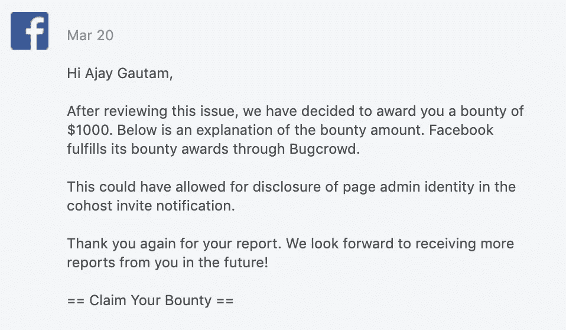

# 页面管理披露|脸书虫赏金 2019

> 原文：<https://infosecwriteups.com/page-admin-disclosure-facebook-bug-bounty-2019-ee9920e768eb?source=collection_archive---------1----------------------->

大家好，我已经很久没有写博客了，所以我想到了把它写进去。今天，我要分享我在 2019 年发现的一个脸书有效问题。

> 漏洞类型:隐私/授权
> 
> 产品领域:活动
> 
> 标题:脸书页面管理披露

**漏洞描述:**

当一个页面管理员将一个共同主持人添加到一些人创建的事件中时，会向用户发送一个通知，告知该页面已将他作为事件的主持人。当你打开活动时，它会显示有人(管理员的名字)邀请你参加活动，但实际上它泄露了页面管理员的名字。

漏洞的影响:

页面管理可以被公开。

页面管理员未经授权向共同主持用户发送了邀请。

**我着手重现这个问题的步骤:**

1.从页面创建事件

2.添加另一个帐户(确保他/她不是该页面的管理员)作为活动的共同主持人。

3.打开另一个帐户，然后点按关于共同主持人的通知。

4.您将会看到管理员的名字，他已经将您添加为联合主持人，如下所示

*阿杰·高塔姆邀请你*

**视频概念验证**

**时间线**

> 初次报告:2019 年 2 月 11 日
> 
> 脸书复制/发送给产品团队:2019 年 2 月 14 日
> 
> 固定时间:2019 年 3 月 18 日
> 
> 奖励时间:2019 年 3 月 20 日(1000 美元)

**联系方式详情**

ajay@nassincnepal.com