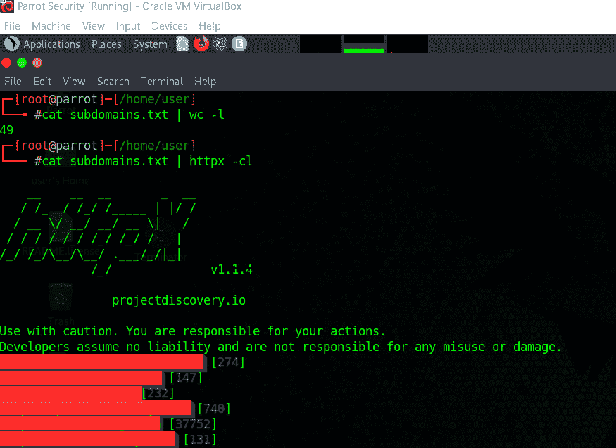
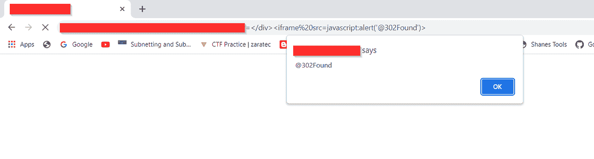
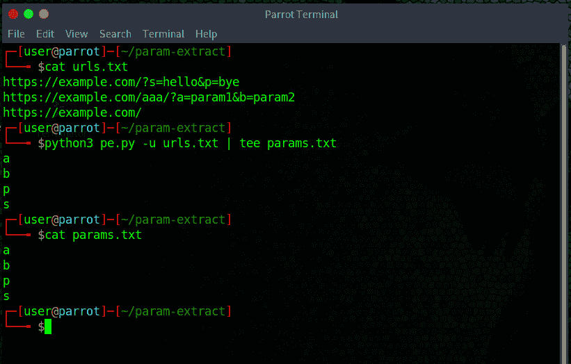

# 注射参数搜索

> 原文：<https://infosecwriteups.com/param-hunting-to-injections-4365da5447cf?source=collection_archive---------1----------------------->

## 嘿黑客们！你这周过得怎么样？

我们又回到了另一个博客。

今天我们将讨论注射液的有效参数搜索

所以最近我们一直在做一个私人项目。姑且称之为*redacted.com*。

因为有很多子域，我们想到根据*内容长度*过滤子域，以找到提供大量功能的域。

所以经过筛选后，我们登陆了有登录页面的<sub.redacted.com>。</sub.redacted.com>

最初，我们在寻找 BAC 同时，我们注意到，当我们在登录页面上输入无效凭证时，它会在 url 中响应一个错误参数。

于是，我们很快开始注入 *XSS* 有效载荷，以生成 *XSS* ，但没有运气，因为我们无法绕过过滤。

在我们开始测试密码重置功能后不久。

这里我们注意到，在输入任何无效的电子邮件后，url 中没有生成错误参数，因此我们考虑手动添加该参数。

令我们惊讶的是，参数实际上反映。

我们再次尝试注入 *XSS* 有效载荷，但是 WAF 阻止了一切。

最后，我们想到使用标签来平衡，因为 and boom 来了 **HTML 注入**。

我们知道你在想什么，是的，IFRAME 完成了剩下的工作。

**查找隐藏参数:**

有很多像 Paramminer、Arjun、x8 等工具可以帮助我们找到隐藏的参数，但不幸的是，在我们的例子中，这两种工具都不起作用，因为参数可能不在默认的单词列表中。

**主动参数搜索:**

主动参数搜索有助于检测所有参数并生成自定义的目标特定单词列表。

为了创建一个自定义单词表，我们需要提取所有与领域相关的参数，为此我们将使用这个漂亮的工具 [*getAllParams*](https://github.com/xnl-h4ck3r/GAP-Burp-Extension) 。

## 步骤:

1.  在您的 burp 套件中下载并配置 [getAllParams](https://github.com/xnl-h4ck3r/GAP-Burp-Extension) 扩展
2.  现在开始自动和手动抓取网站。

手动测试和自动化的结合总会比盲目使用脚本提供更好的结果

3.现在目标->站点地图->选择目标->右击->扩展->获取所有参数(GAP)

4.将所有提取的参数保存在一个文件中

5.您也可以使用 *gau* 、 *wayback* 、 *Katana* 或任何其他工具收集所有 URL，然后从提取的 URL 中提取所有参数。

我们已经编写了一个非常基本的脚本，它可以从各种工具收集的 URL 中提取所有参数:

[*【Param-Extract】*](https://github.com/302Found1/Param-Extract)*(耶懒的剧本但作品也是我们以后会更新的)*

或者，您也可以使用下面的一行程序通过展开工具提取 url:

> 分类网址|展开格式% q | cut-d " = "-f1 | sort-u > params . txt

6.现在合并 param 文件和 sort -u

7.一旦创建了包含所有参数的自定义单词表，就可以很容易地使用 Paraminer burp 扩展来发现隐藏的参数。

8.一旦您确定了隐藏的参数，您就可以基于案例场景测试各种注入或其他错误。

狩猎愉快！！！！

**作者:**

瓦伊巴夫·拉哈尼:

[https://www.linkedin.com/in/vaibhav-lakhani](https://www.linkedin.com/in/vaibhav-lakhani)https://twitter.com/vlakhani28

Dhir Parmar[:](https://www.linkedin.com/in/dhir-parmar-925b171a4)

[https://www.linkedin.com/in/dhir-parmar-925b171a4](https://www.linkedin.com/in/dhir-parmar-925b171a4)https://twitter.com/dhirparmar

[302 发现](https://www.linkedin.com/company/302found/):

[https://twitter.com/_302Found](https://twitter.com/_302Found)https://www.linkedin.com/company/302found/https://github.com/302Found1/

你也可以给我们买杯咖啡，如果你喜欢的话:[https://www.buymeacoffee.com/302found](https://www.buymeacoffee.com/302found)

## 来自 Infosec 的报道:Infosec 每天都有很多内容，很难跟上。[加入我们的每周简讯](https://weekly.infosecwriteups.com/)以 5 篇文章、4 个线程、3 个视频、2 个 GitHub Repos 和工具以及 1 个工作提醒的形式免费获取所有最新的 Infosec 趋势！