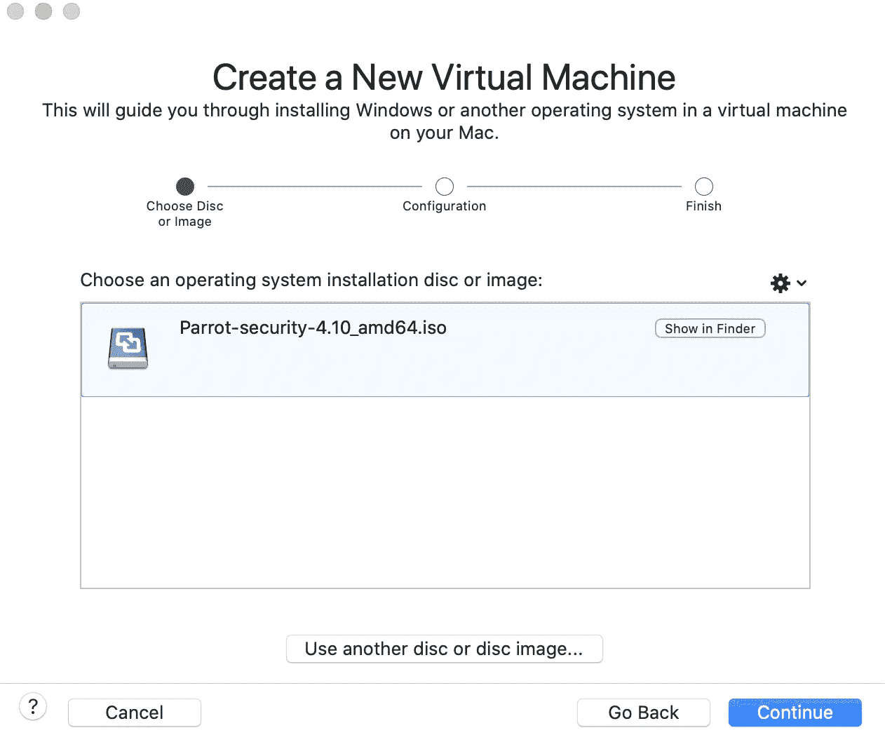
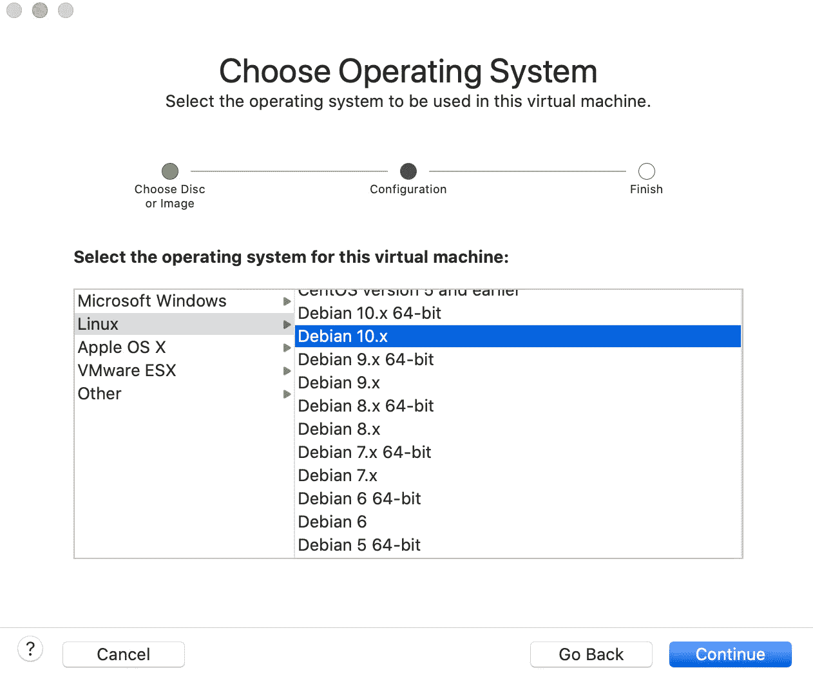
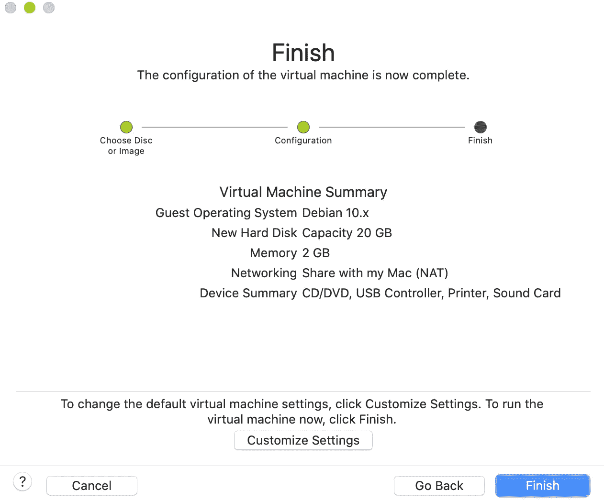
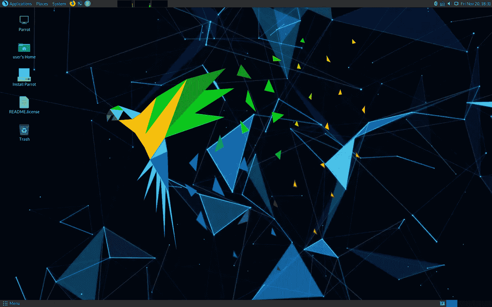
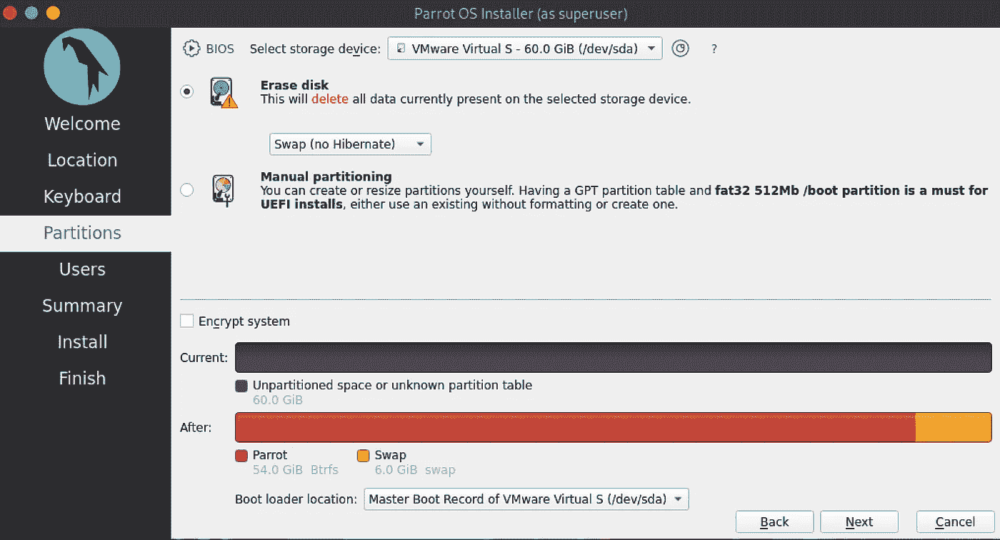
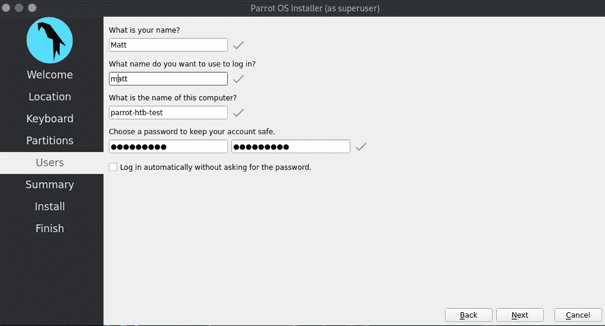
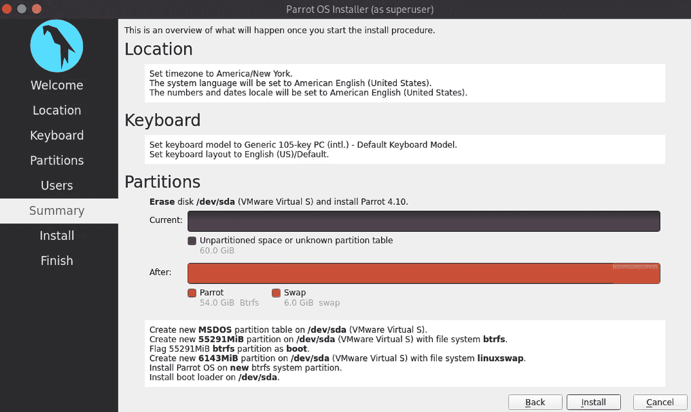
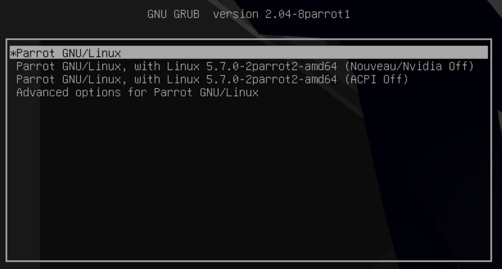
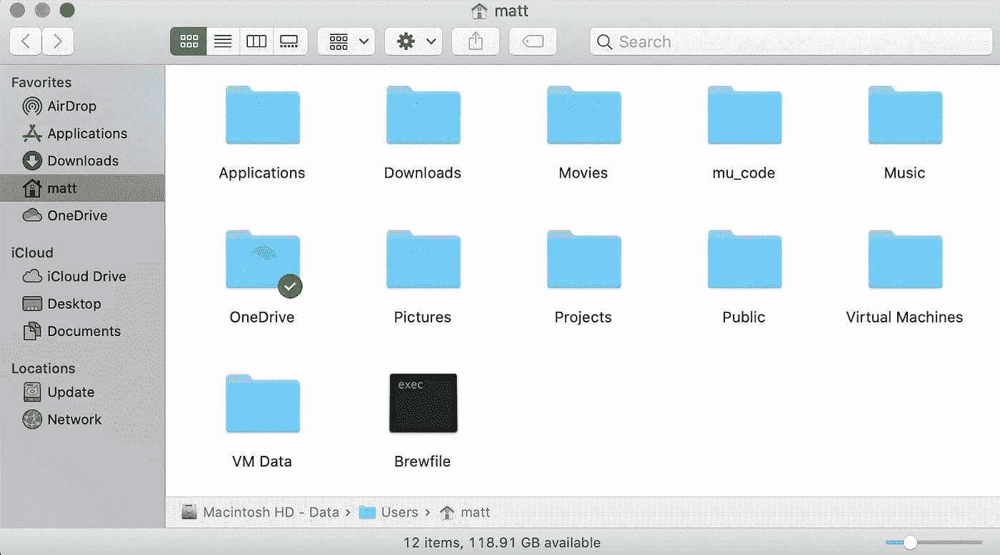
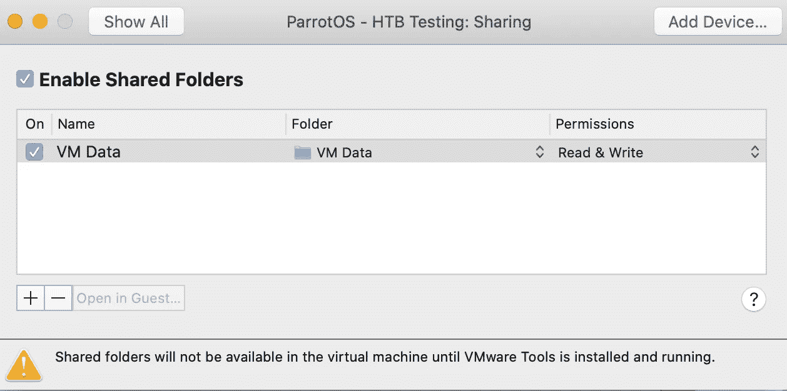

# ParrotOS 和 Hack The Box Buildout 第 1 部分

> 原文：<https://infosecwriteups.com/parrotos-and-hack-the-box-buildout-part-1-9ced497169c9?source=collection_archive---------5----------------------->

ParrotOS 在安全和隐私 Linux 领域是一个相对较新的公司，成立于 2013 年。虽然 Kali 是渗透测试的一个很好的选择，但是 Parrot 更加灵活。它肯定会开箱即用，但可以通过一些调整变得更好。

这个系列的很多内容都是通用工具和设置，对大多数使用 [HTB](https://www.hackthebox.eu) 的人都有好处。使用哪种 shell 或如何设置编辑器的细节是非常主观的，因此我在以后的文章中尽量减少这些主题。我将仅仅提供一些有用的别名和其他我认为有用的注释。

# 准备

下载你选择的 [iso](https://www.parrotsec.org/download/) 。我倾向于使用 security mate 版本，并将在本演练中使用最新的稳定版本 4.10。

我的虚拟主机是 macOS Big Sur 上的 VMWare Fusion 12，我使用 BIOS 作为我的固件选择。我给了它 60GB 的硬盘和 8GB 的内存。这些资源可能是多余的，但是我有多余的资源，为什么不呢。

虽然您当然可以在裸机上安装 ParrtOS，但是如果您正在做这样的练习，您应该使用虚拟机。我不是说你有风险，但这些都是你参与的敌对网络。

# 虚拟机设置

使用您选择的 ISO 创建新的虚拟机。

单击“完成”或自定义设置和可用资源。需要记住的一点是，网络设置应该保持 NAT 和自动选择。选择桥接网络可能会使主机受到恶意流量的攻击。

# 装置

引导进入实时安装，这是引导菜单中的第一项，也是默认选项。从现在开始，无论您在哪里安装操作系统，选择都是一样的。

点击**安装 Parrot** ，然后点击菜单直到你到达分区。我建议您选择抹掉磁盘并让它自动分区。加密与否是你的选择，我从不麻烦加密虚拟机，因为我的主机总是全磁盘加密，当不使用它时，我会关闭它。

添加您的登录详细信息。我个人从来没有把我的机器设置成自动登录，但是为了方便使用，如果你想的话，请随意。

检查所有设置，确保一切正常。

继续安装。这将需要一段时间，所以如果你还没有，去[注册](https://www.hackthebox.eu/invite)HTB。完成后，重启机器并选择启动屏幕上的第一项，这也是默认设置。

# 共享

让我们建立共享，因为这将使事情变得容易得多。如果主机和虚拟机之间的剪切和粘贴尚未工作，这也将使其能够工作。此时，我将创建一个快照，这样您就有了一个功能性的干净映像，以防出现问题。

我把我想共享的文件夹放在我的根目录下，但是只要你有适当的权限，位置并不重要。

现在，我们在 VMware 设置中进行设置。不用担心底部的警告信息。无论如何都会显示出来。

我们现在在 Parrot 中配置它。在你更新完 */etc/fstab* 之后，弹起盒子以确保一切都是明亮的。如果您得到一个错误消息，说 root 被锁定，并且您在一个循环中结束，那么恢复您创建的快照并仔细检查您的 fstab 行。如果你看到了这个，那么可以肯定的是你在这里输入了错误的内容。

# 后续步骤

在这一点上，你有一个非常有能力的基础来研究 HTB 和各种类型的 CTF 氏症。然而，一些调整可以让你的生活变得更简单，操作系统变得更舒适。

如果您更倾向于攻击性安全方面，添加一些额外的工具并更新其他工具将是一个好主意。

如果致力于 bug 奖金、恶意软件分析和漏洞开发，还有一些额外的调整，使开发和调试任务更容易。

继续《T2》第 2 部分，我们将深入探讨 OS 更新、升级的环境、额外的工具，以及修复 Parrot 中的一些 bug，这些 bug 在其他与安全相关的发行版中也会出现。

对该系列的进一步补充将包括方法论、特定技术、文章，以及使用这个特定的盒子通过深层和黑暗网络的现场狩猎。