# ParrotOS 和 Hack The Box Buildout 第 2 部分

> 原文：<https://infosecwriteups.com/parrotos-and-hack-the-box-buildout-part-2-4bf04b0efcd3?source=collection_archive---------0----------------------->

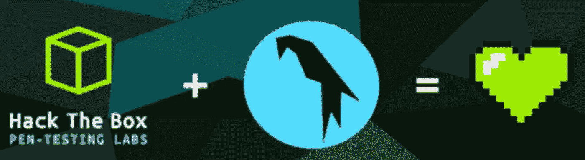

[ParrotOS](https://parrotlinux.org) 是 Linux 安全和隐私领域相对较新的公司，成立于 2013 年。虽然 Kali 是渗透测试的一个很好的选择，但是 Parrot 更加灵活。它肯定会开箱即用，但可以通过一些调整变得更好。

**完全披露**，我包括一些付费服务和订阅的链接。我与他们中的任何人都没有财务关系，也没有从他们那里获得任何佣金或产品。其中一些可能属于朋友或专业联系人。

如果您需要帮助安装 ParrotOS 并让共享文件夹正常工作，请查看本系列的第 1 部分。

正如所承诺的，第 2 部分将处理安装新的和更新的通用工具，以及配置一个示例 [Mate](https://mate-desktop.org/) 桌面环境，以便您可以专注于手头的任务。

# 初始更新

需要注意的一点是，与香草卡莉不同，ParrotOS 没有给用户一个重新注册的根帐户。你会看到`sudo`被大量使用。我强烈要求你保持这种方式。我想不出我什么时候需要过 root 帐户。如果你正在做渗透测试和 CTF 的，你应该很好地掌握用户和组权限，这样做任何改变。</end _ 布道>

先做个更新升级吧。可能会有一些弹出窗口需要阅读并点击是或否，所以不要偏离太远，否则这将变成三个小时的努力。

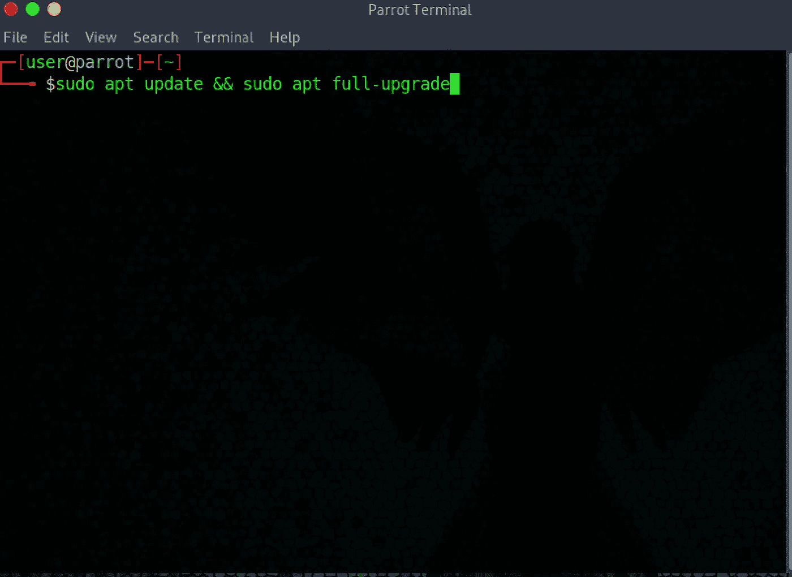

不要运行标准`sudo apt update && sudo apt upgrade`，这将破坏滚动分布。具体来说，看看这个 [Reddit 线程](https://www.reddit.com/r/linuxquestions/comments/estn3i/linux_upgrades/)。

在此期间，这将是一个了解 HTB 平台并熟悉其工作方式的绝佳时机。如果你对它完全陌生，你可以在 VIP 级别注册。退役的箱子都有书面和视频演练。观看视频演练并跟随是一个很好的尝试方法，并在这个过程中学到很多东西。

如果你手头拮据，IppSec 是一个很好的选择，如果你的目标是为 OSCP 和 T21 做准备，这一点尤其重要。

注意使用的方法论。开发你自己的工作流程和创建你自己的自动化工具可能是至关重要的，并且在拥有许多这样的盒子时可以节省很多时间。

# 壳

我不打算说太多关于 shell 配置的内容，因为大多数人都有强烈的观点，并且可以从大量的博客文章中找出如何按照自己的喜好配置它。我将展示我认为最有用的两个 shells，以及一些简单、通用的别名。

在第 3 部分中，我将详细介绍我的 ParrotOS [i3](https://i3wm.org/) 环境，包括安装、配置、shell 和编辑器选择。它主要面向渗透测试和开发，所以请跟我来。

许多人喜欢 zsh，有些人可能也喜欢[鱼](https://fishshell.com)，两者都是 Bash 和其他 shells 的现代升级。这取决于你用什么感觉舒服。不过，出于可移植性的原因，我要提醒您不要用 Bash 以外的任何语言编写脚本。

如果你想使用 fish，你需要安装它。

`sudo apt install fish`

您可以使用 web 界面通过`fish_config`或通过 *$HOME/对其进行配置。配置/鱼/配置.鱼*。更多信息可在[网站](https://fishshell.com)上找到。Fish 内置了我需要的通用系统的所有组件，所以对我来说它是有意义的。

ParrotOS 已经开箱安装了 zsh。最简单的设置方法是使用 [oh-my-zsh](https://ohmyz.sh) 。安装时会自动将默认 shell 设置为 zsh。你还应该安装[语法高亮插件](https://github.com/zsh-users/zsh-syntax-highlighting)。查看该网站的附加配置选项和插件。

我通常也在开发机器上运行 [starship](https://starship.rs) 。当使用几种不同的语言和环境时，starship 可以很容易地知道你的回购状态，以及提示符上的语言版本，而不必为各种外壳使用大量插件。它位于外壳的顶部，不需要任何配置就可以做一些有趣的事情。

它的工作原理是，所有的东西都是初始安装的，如果你不想使用它们，就需要关掉它们。

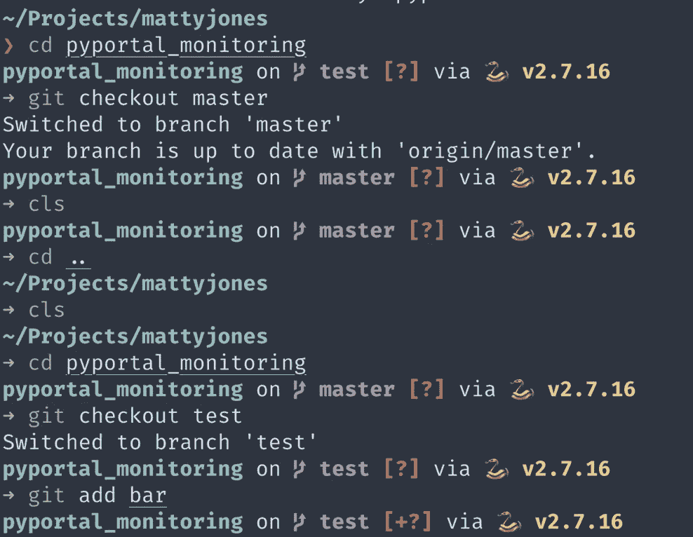

**TL；DR** Fish 和 starship 可以替换我所有的 zsh 插件和我多年来收集的各种碎片，同时仍然允许我在 GitHub repo 中链接我的点文件。

我的个人渗透测试虚拟机的设置有所不同，并且进行了大幅精简。以 [i3](https://i3wm.org/) 和 zsh 为中心，它提供了一个完全不受干扰、高性能的环境，不会妨碍我。我将在第 3 部分详细讨论这一点。

别名就像观点一样，每个人都有一个清单。这里有几个我觉得有用的。

# 工具

Parrot 提供了几乎所有您需要的东西，在某些情况下，还有很多您不会用到的东西。尽管和卡莉一样，还是有一些差距。

## 单词表

标准的都在那里，但是 rockyou 是压缩的，所以你想先解压缩它。

`sudo gzip -d /usr/share/wordlists/rockyou.txt.gz`

seclists 组非常适合用于许多基于 web 的枚举。

`sudo wget -c https://github.com/danielmiessler/SecLists/archive/master.zip -O SecList.zip`

这是一个很大的包，一旦解压缩，应该被移动到默认的单词表目录`/usr/share/wordlists/`你可以删除非单词表文件，如果你想，我从来没有打扰。您也可以直接在这个目录中进行 git 克隆，但是我讨厌到处都有存储库。

一个好的折衷办法可能是将所有这些更新和额外的包放到 */opt* 中，如果你觉得有必要的话，使用符号链接或组权限来配置所需的访问。

## masscan

Masscan 是我最喜欢的工具之一，但安装在 Parrot 上的版本有一个 bug，可能还有 Kali，这使得它无法自动化。我们至少需要使用 1.0.6，这意味着我们需要从源代码开始构建。

## searchsploit

如果你想进行本地漏洞搜索，安装 [searchsploit](https://www.exploit-db.com/searchsploit) ，这基本上是一个本地版本的 exploit-db。

`sudo apt install exploitdb`

## 随机工具

当我需要使用 Bash 在命令行上处理 JSON 时，我喜欢用 jq。你可以打印、切片/切块和绘制各种结构。这比使用 sed/awk/grep 要容易得多。我现在已经有相当长的胡子了，所以在 Bash 了大约一百行之后，我又回到了编写 Perl。

Lnav 是一个处理日志和其他类型结构化文件的伟大工具。

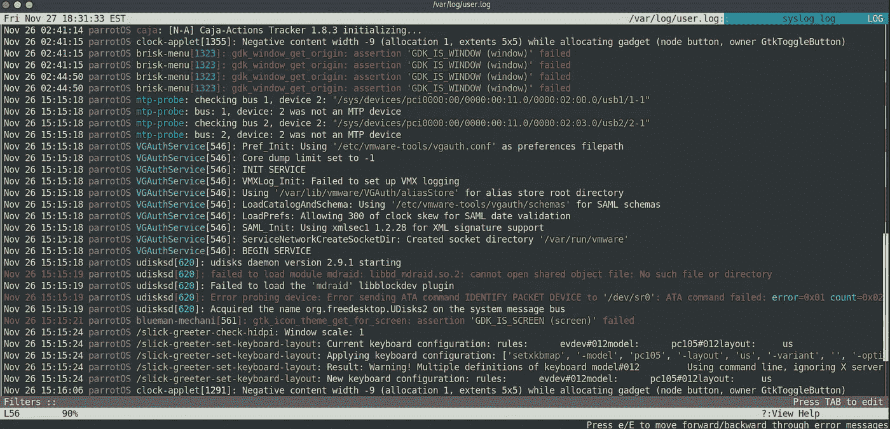

[Bat](https://github.com/sharkdp/bat) 是`cat`的替代品，具有语法高亮、分页功能和正则表达式搜索。我有时会将它用于我不想在编辑器中打开的定义良好的大型文件。实际上，我提到它是因为它是一个很酷的 Rust 项目。大多数时候我倾向于使用`nvim`来完成这个任务。

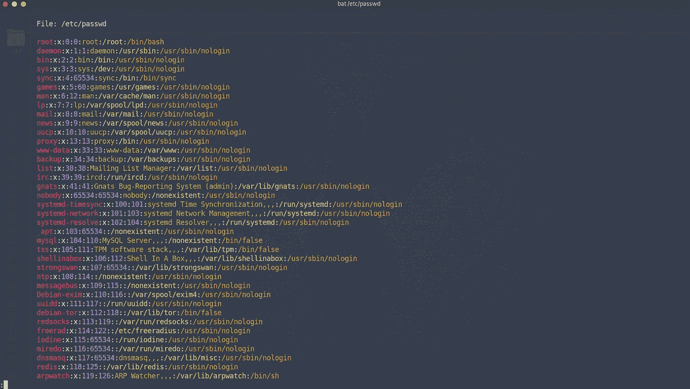

# 漂亮的桌面(多动症和强迫症患者小心)

如果你已经有了一台你喜欢的台式机，请随意离开。我习惯使用平铺窗口管理器，特别是 [i3](https://i3wm.org) ，因为我 80%的时间都在使用 [tmux](https://github.com/tmux/tmux/wiki) 而且我不在乎菜单。这些都将在第 3 部分中给出。

对于更通用的设置，或者是为我的妻子或孩子设置的，我坚持使用 [Mate](https://mate-desktop.org/) 或 [Cinnamon](https://en.wikipedia.org/wiki/Cinnamon_(desktop_environment)) 。我将在这里显示 Mate，因为这是默认的 ParrotOS 桌面。

首先，我将登录窗口简化为一个输入框和桌面选择器。

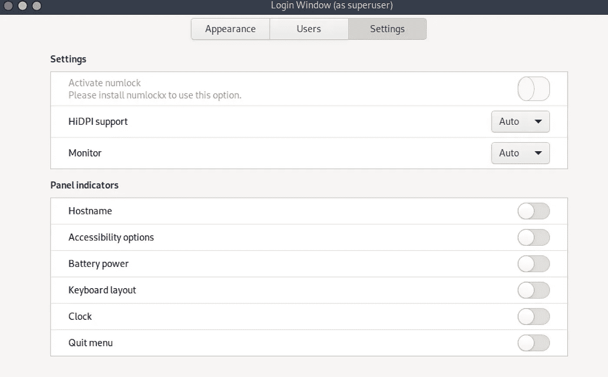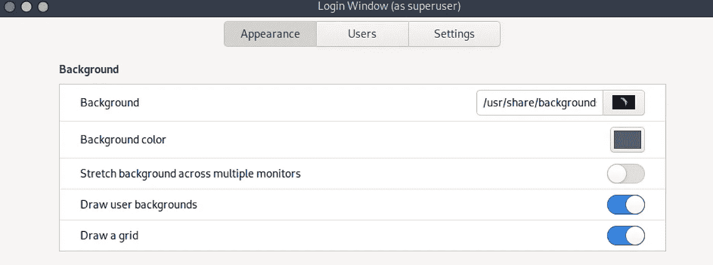

说到桌面本身，我对诺德和极简主义情有独钟。它设置在我最常用的界面上:

*   末端的
*   tmux
*   nvim
*   文件管理器
*   桌面环境

我还把所有的 cruft 都去掉，从上下面板 100%半透明开始。然后我移除所有桌面项目。

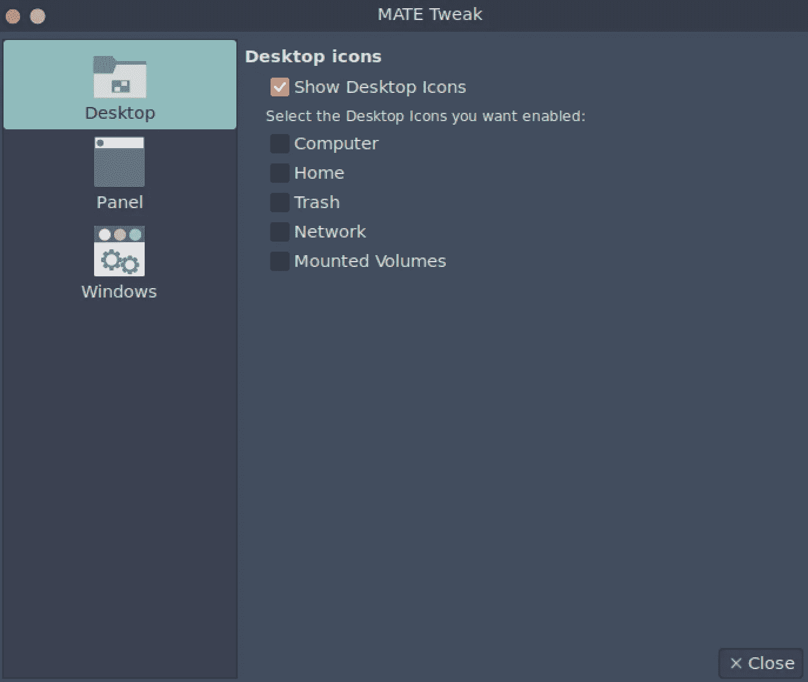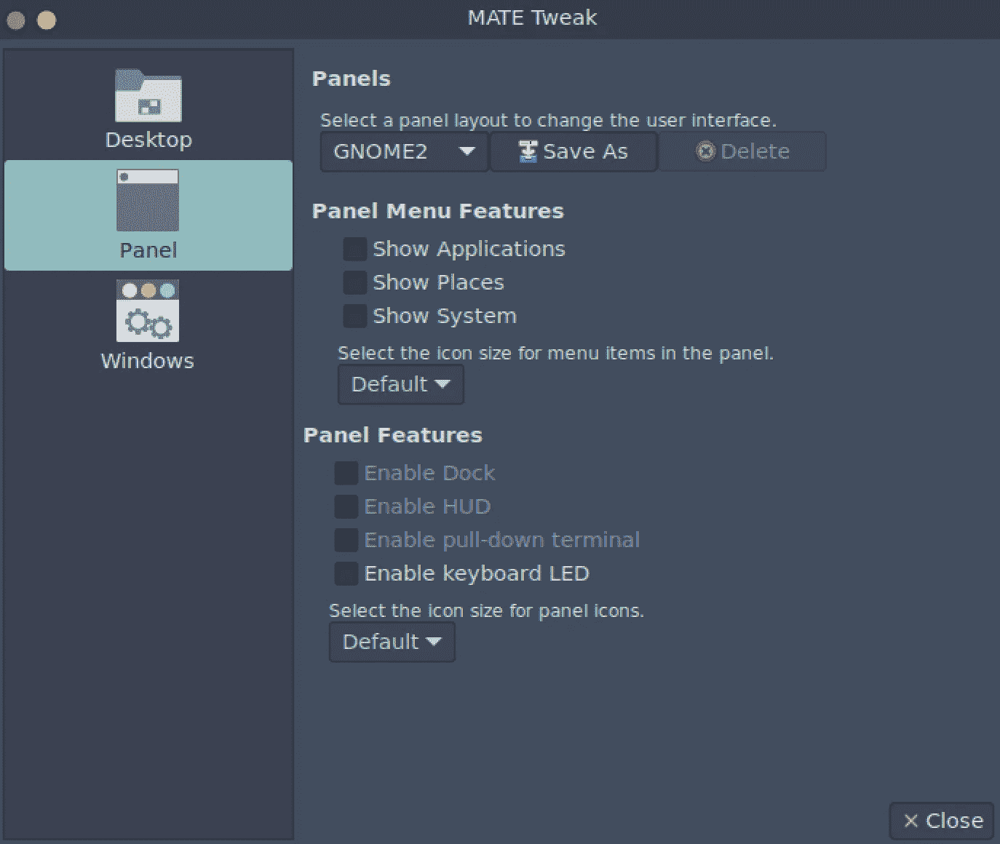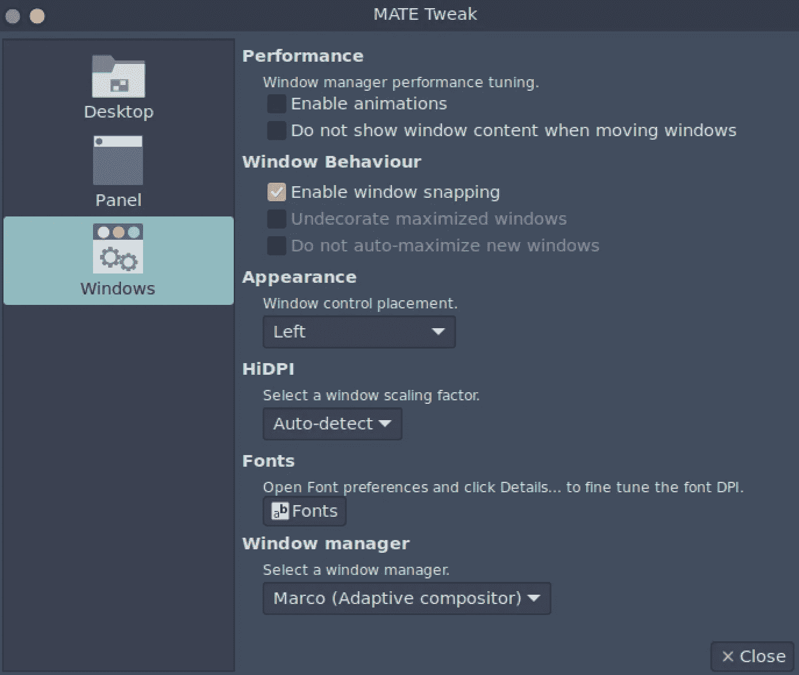

我还从系统托盘中取出我不需要的东西。请记住，这是一个虚拟机，在裸机或通用系统上，您将需要其中一些应用程序。

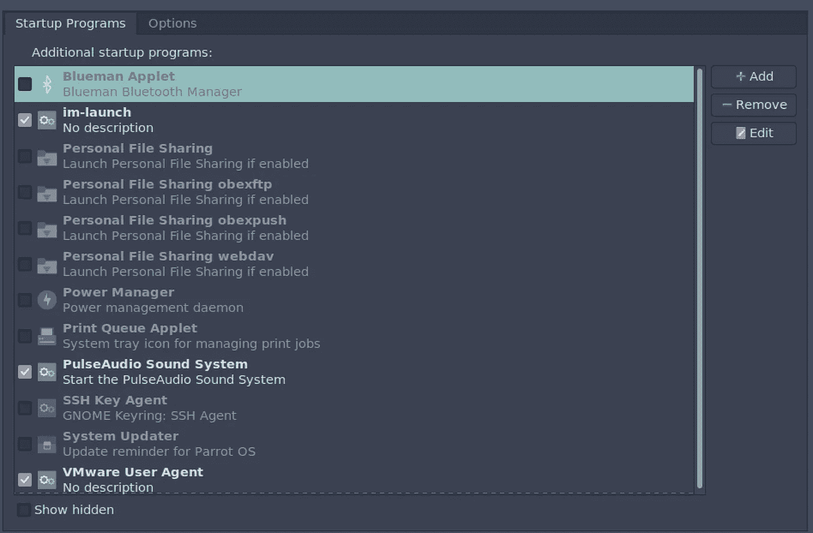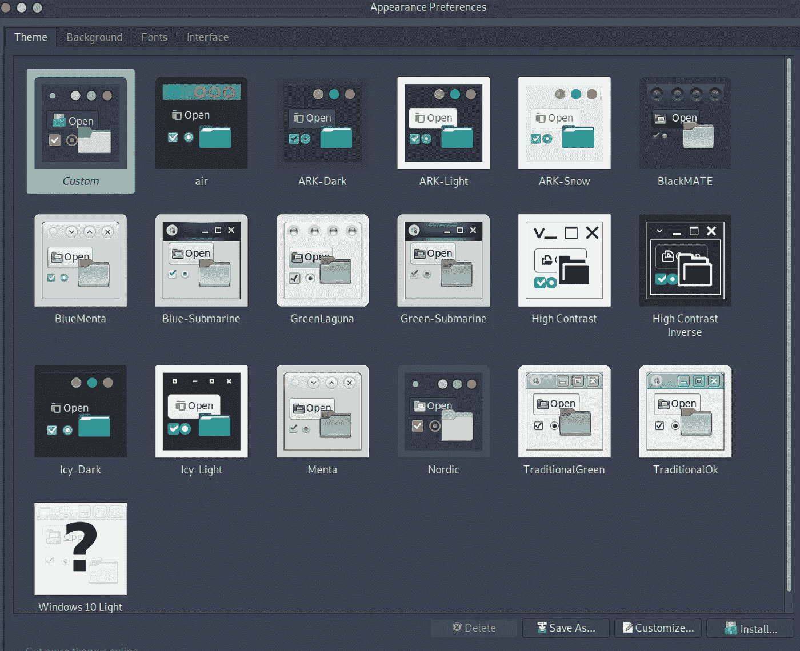

我还删除了任何没有特定用途的面板项目，比如工作区转换器、额外的自定义启动器和应用程序菜单。

最终的结果是一个相当不受干扰的用户界面，让我可以专注于手头的任务。这对于虚拟机来说更简单，因为我不需要担心蓝牙、电池和其他常见的小部件，因为我可以直接访问主机。

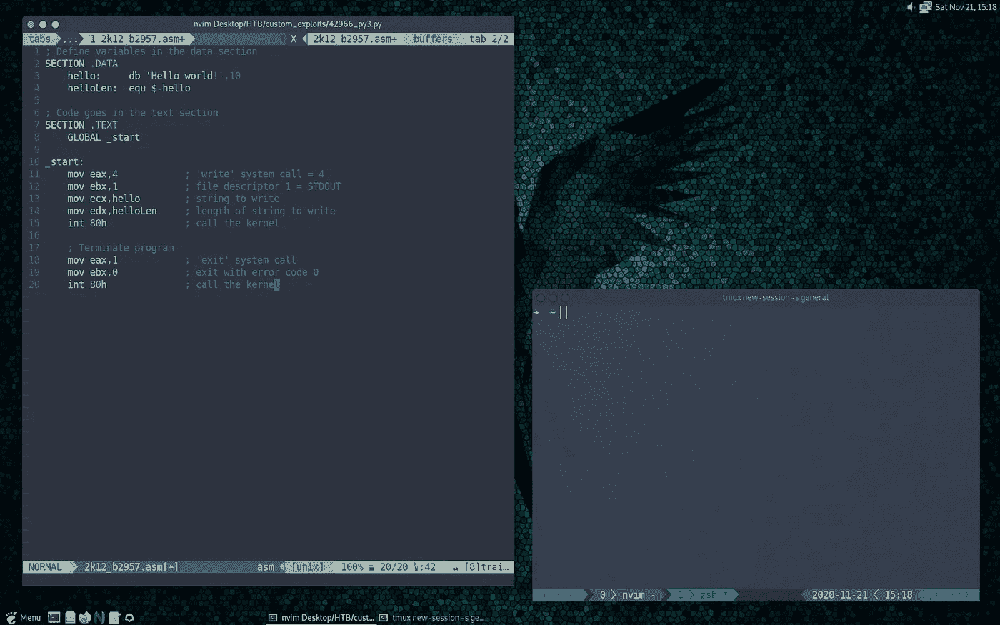

## 包裹

这绝不是开箱即用的完美设置，从来都不是，但是一旦您使用基本配置启动并运行它，并填补一些工具空白，您就可以开始了。您可能想进一步定制您的桌面或安装额外的工具，选择权在您。

正如我前面所说，我更喜欢平铺窗口管理器，在我的例子中是 i3。下一部分将重点介绍这一点。请跟我来获得通知时，它下降。

其他计划中的帖子将进一步详细介绍，重点是编辑器、调试器和其他对漏洞开发有用的分析工具和技巧。