# 第 1 部分:最终的笔测试投件箱演练

> 原文：<https://infosecwriteups.com/part-1-build-a-cloud-based-command-and-control-server-and-attack-drop-box-with-a-cellular-b3e9e063dedd?source=collection_archive---------0----------------------->

# 介绍

在我的职业生涯中，一次又一次出现需要远程访问的情况。根据工作角色的不同，客户分为内部客户(全国各地的其他部门)和外部客户(世界各地向我们支付咨询费用的客户)。为了避免大量的旅行和酒店开支以及避免冗长的繁文缛节，我发现最好的方法是建立一个远程投件箱。本文假设您至少知道底层协议的名称，但我们将定义一些关键术语，如“投件箱”和“命令和控制”。不要担心这会很有趣，尽可能直接。

# 3 部分系列

为了避免这篇文章太长，我把配置过程分成了 3 个部分:

1.  构建基于云的命令和控制服务器
2.  构建攻击下拉框
3.  安装蜂窝反向链接(硬件/软件)

# 什么是远程投件箱？

远程投件箱是您发送给客户的计算设备。客户将把您的设备插入一个活动的以太网端口，投件箱将根据您选择的协议自动建立一个到您的命令和控制架构的出站连接。

# 等待命令和控制，我如何建立它？

就我们的目的而言，本文将介绍如何建立一个简单的基于云的服务器来捕捉你的投件箱通信，并允许你从任何地方通过隧道连接到你的投件箱。

# 命令和控制设置

# 步骤 1 —购买域名(不需要)

进入 domains.google.com >获得一个新域>搜索一个酷的名称并购买它(我将使用我的 stealing.io 域)> DNS 设置>使用自定义名称服务器:

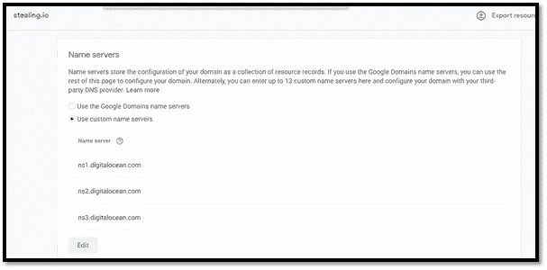

谷歌域名指向数字海洋 DNS

>自定义资源记录>输入以下 TXT 记录:{

_ acme-challenge:" hfwfdb 5 RRC _ 2 ibbhnljtn 0 lyvvojvl 7-A-rrdYJsAwY "，

_ acme-challenge . www:" yh ci 0 yaugwy 2 qrdlao 94 jzscnxnl 1h 0 ygsvovf 1 yj 1a "

}

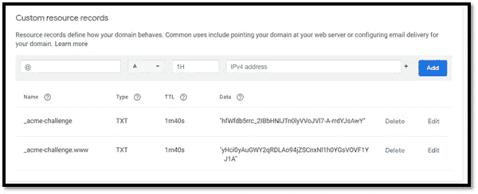

自定义资源记录

你完了！我们现在有一个域名(网站)名称指向数字海洋的 DNS 服务器进行解析。完美！

# 步骤 2 —数字海洋(DO)设置

注册一个 DO 帐户>登录>创建一个 Droplet >选择一个映像>[选择] Ubuntu >选择您想要的任何版本>选择一个计划>[选择]基本>[选择] $5/mo >选择一个数据中心区域>[选择]您想要的任何地方> VPC 网络>[保留为默认]>验证>[选择]密码>创建根密码(使其长且复杂，这是临时使用的，稍后将被禁用) >有多少个 Droplet？>[选择] 1 Droplet >选择一个主机名>[输入]您的创意主机名(我的将是 killbit-CNC)>创建 Droplet

现在，您将在仪表板中看到您的 droplet，其中 IP 地址已分配给我们的 droplet:

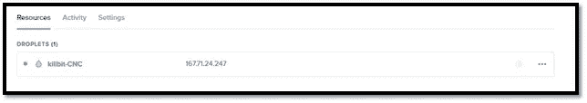

Ubuntu 服务器运行

是时候将我们的 DNS 记录映射到我们的 CnC droplet 了:

创建>域/DNS >添加域>[输入]您的域>[单击]添加域

创建新记录>主机名>[输入]您想要使用的子域名，如“连接”>将从下拉菜单>创建记录中指向>[选择]您的 droplet

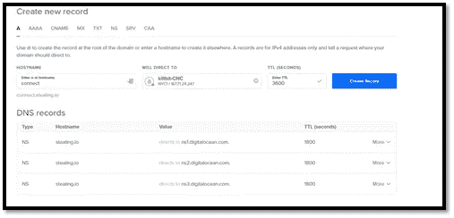

配置 DNS 解析

新记录现在应该出现了。

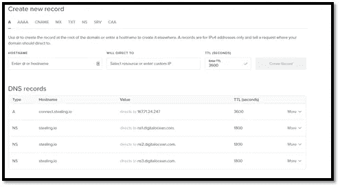

你现在应该有一个像这样的 A 记录

现在使用您之前为 Ubuntu root 帐户创建的凭证 SSH 到您的 Droplet。您使用的命令应该类似于

> ssh root @[子域。域名您已注册]

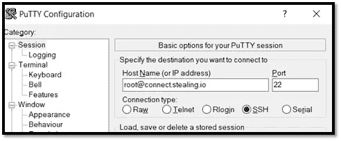

使用 Putty 通过 SSH 连接到我们在 D.O .的服务器。

从 putty[选择]打开>[选择]是，出现接受证书的提示

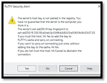

选择是

>[输入]密码提示

您现在应该有一个终端屏幕:

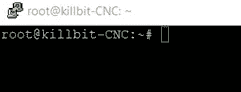

欢迎来到你的根终端

创建一个新用户，并将其添加到 sudoers 组

> adduser 输入用户名你想要的

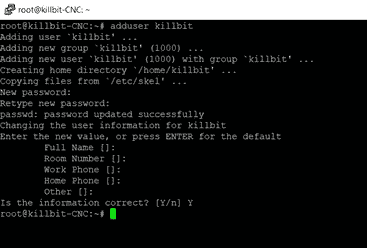

创建新用户

>设置密码>[回车][回车][回车]>是

现在向您创建的用户发布 sudo priveledges

> visudo

在第 30 行的根条目后添加:

>[ENTER]用户名 ALL=(ALL:ALL) ALL

授予用户 Sudo 权限

> CTRL+O [ENTER]

> CTRL+X

与 Ubuntu 断开连接。

作为新用户通过 SSH 连接到您的服务器:

> ssh[new _ user @ subdomain . domain](mailto:new_user@subdomain.domain)

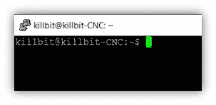

服务器上的新用户外壳

# 强化 SSH 配置

通过打开 Putty 密钥生成器>单击生成>摆动鼠标>保存公钥和私钥>转换>导出 OpenSSH 密钥，使用 Putty 生成密钥对

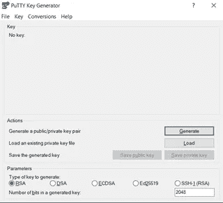

用 Putty 处理 SSH 密钥

现在，您可以将您的公共 openssh 格式的密钥放在/home/中的 CnC 服务器上的 authorized_keys 文件中。您的用户的 ssh 目录。将您的 putty 会话指向私有 Putty 密钥(。ppk)在连接> SSH >验证>用于验证的私钥文件下:

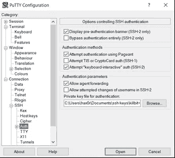

Putty 中的 SSH 密钥身份验证配置

在 CnC 服务器上，将 OpenSSH 格式的公钥添加到用户的~/home/下的 authorized_keys 文件中。ssh 目录。现在去更改 SSH 配置，以防止将来基于密码进入您的 CnC 服务器，并有效地阻止针对您的服务器的 SSH 暴力。

> vim /etc/ssh/sshd_config

进行以下更改:

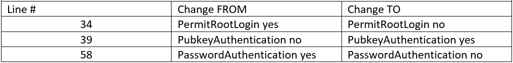

对 SSHD 配置的编辑

您需要重复 SSH 过程，让您的投件箱使用第二组密钥自动连接回 CnC 服务器。由于您需要从 CnC 运行到收存箱，因此生成收存箱密钥将更加容易:

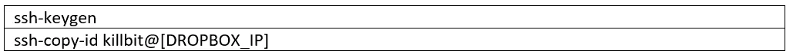

然后再从下拉框到 CnC:

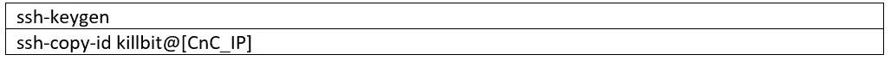

生成 ssh 密钥并将它们复制到您的服务器的命令

现在是更新托管在数字海洋的数控服务器的好时机。继续运行命令(这些需要很长时间才能完成，所以要做好准备):

更新服务器的命令

**我们将在下一篇文章中构建我们的 Dropbox:**

第 2 部分:[构建笔测试下拉框](https://killbit.medium.com/part-2-build-the-pen-test-drop-box-69278526886a)

**之后是:**

第 3 部分: [Pen Test DropBox —添加一个单元格反向链接](https://killbit.medium.com/part-3-pen-test-dropbox-adding-a-cellar-backlink-8c8d5cfde667)

如果你喜欢我的内容和我在这里提供的工作，请考虑发送一些咖啡爱我的方式@【https://www.buymeacoffee.com/killbit 

你友好的邻居黑客，

杀手