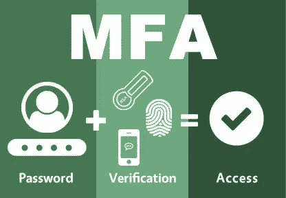
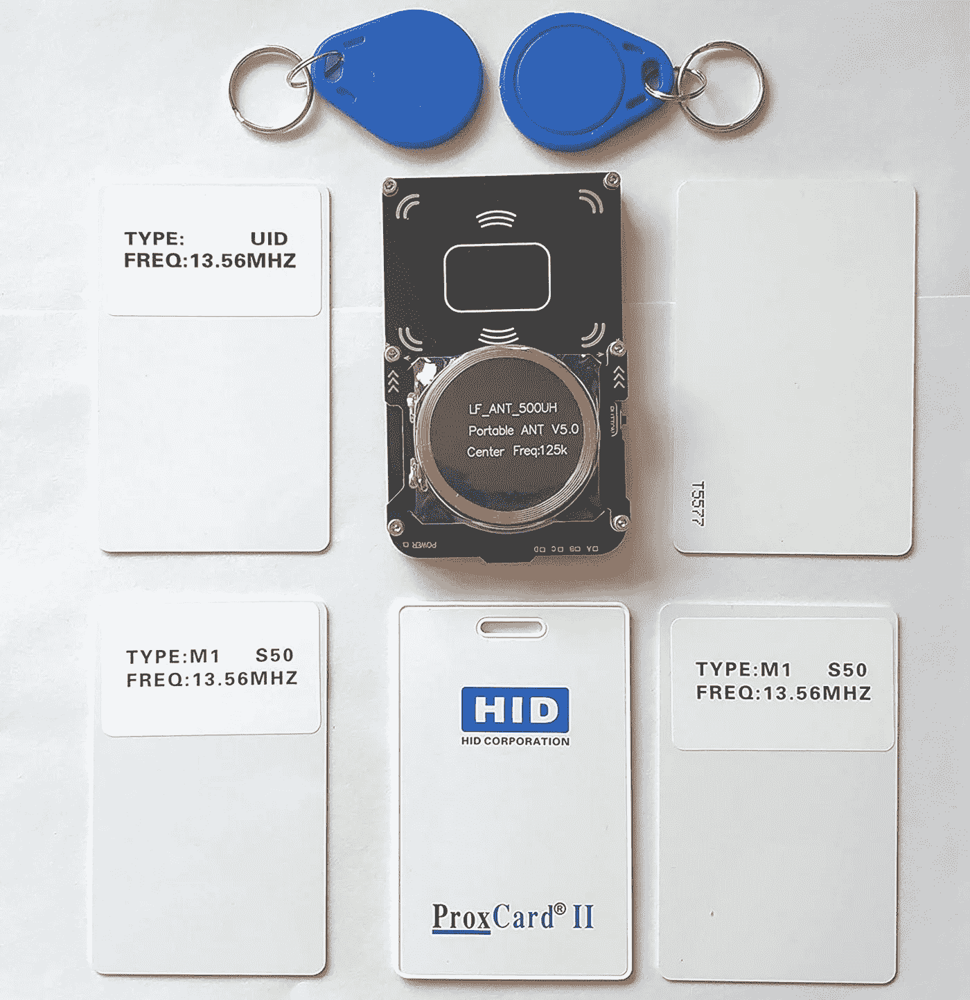
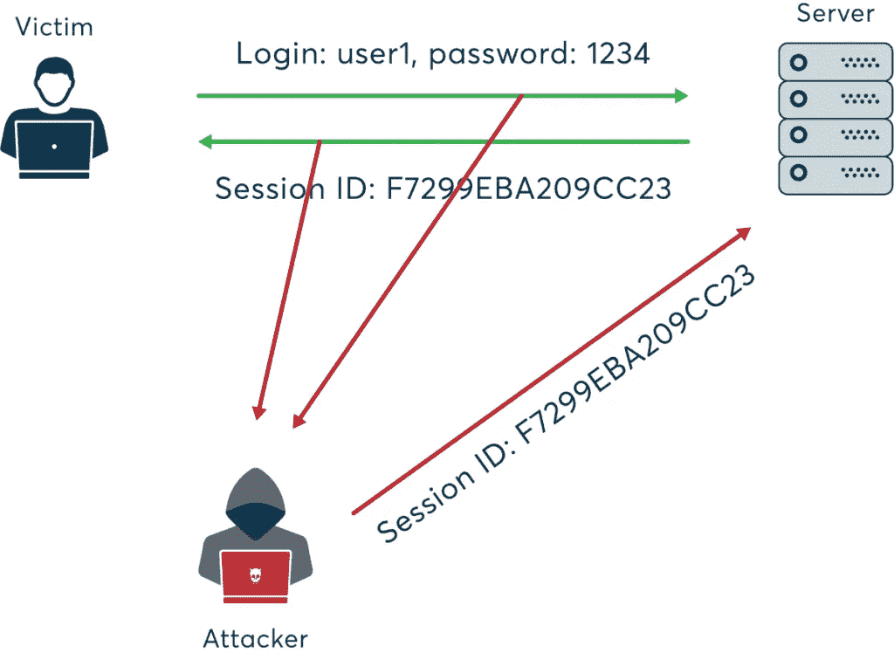
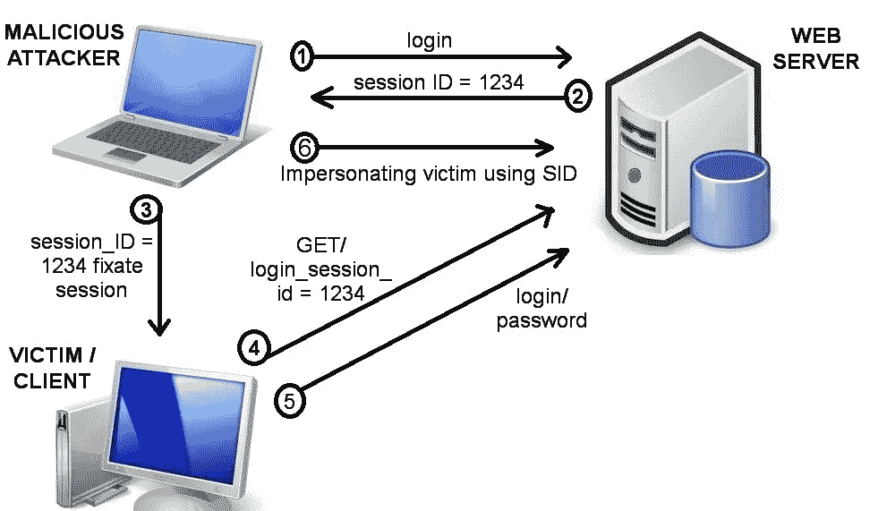
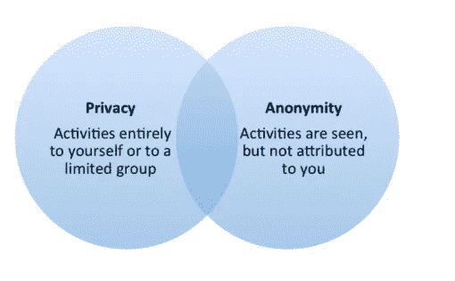
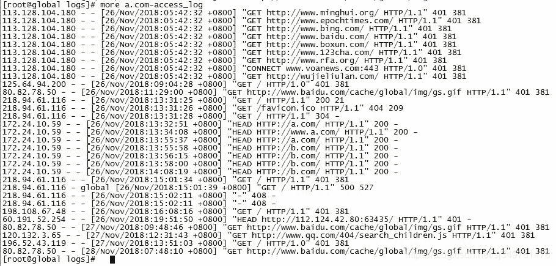
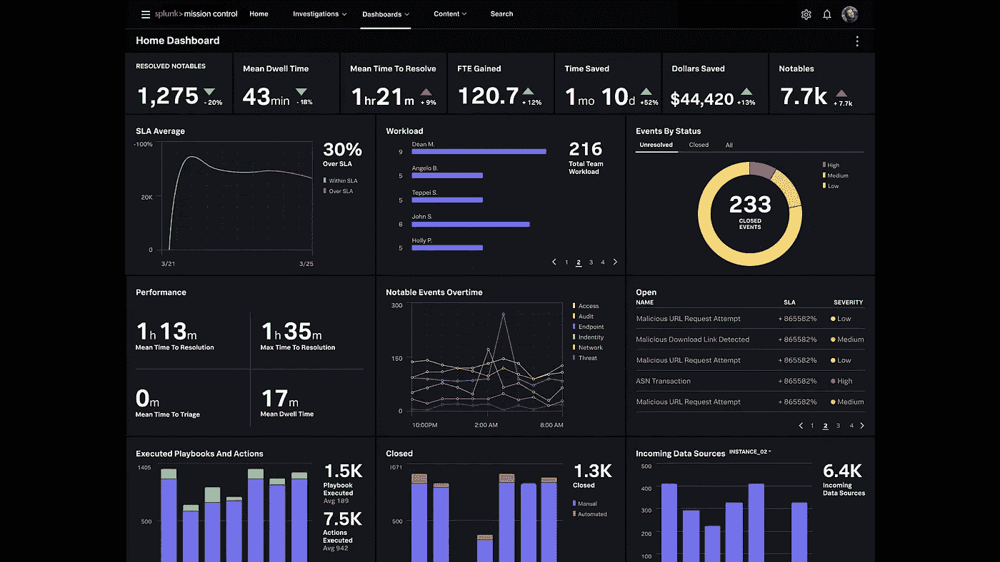
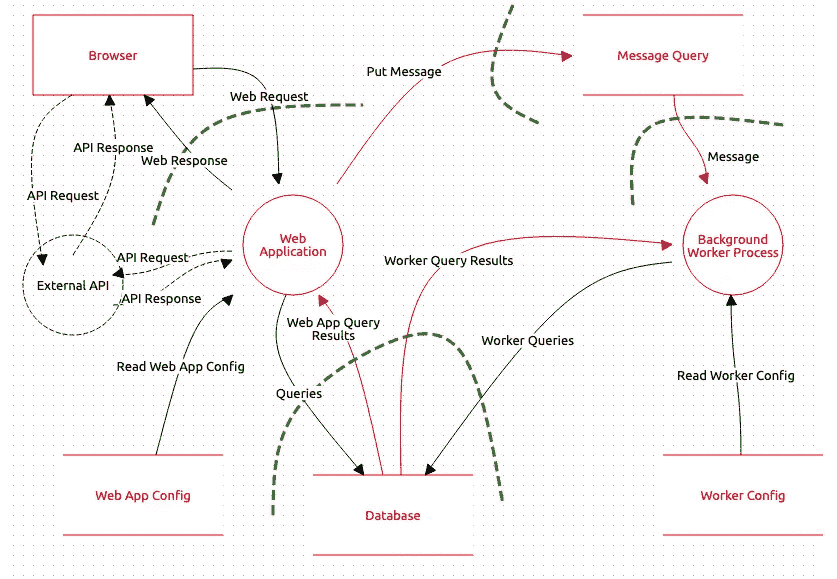

# 信息安全概述|第一部分

> 原文：<https://infosecwriteups.com/part-1-the-reality-of-modern-information-security-in-enterprise-around-the-world-57bcd3feb169?source=collection_archive---------1----------------------->

## 全球企业的现代信息安全现实。

了解信息安全行业中常用的关键字，这些关键字与复杂的 OWASP 十大关键字一起使用。

# 证明

你想去工地，向看守人介绍你的名字，然后进去。这是**的身份证明**。进去之前，你必须向看守人出示你的身份证。这是**认证**。

# 两步验证/双因素身份验证

您被迫向看守人出示您的身份证，此外，看守人要求提供一个注册的手机号码，他在系统中验证该号码，并通过该号码发送一个 OTP。这是**两步验证**。

# 多因素身份认证。

看守人不仅需要身份证和有效的手机号码，还需要单独的政府身份证。同样，拥有 2 种以上独特的身份验证方法称为**多因素身份认证。**这是**多因素认证**。

**MFA /多因素认证**

# 授权令牌/ Cookie /会话令牌

你去听音乐会，并在入口处出示有效的购买门票进行验证。验票后，主持人在你手上系上一条丝带。这被称为**授权令牌/ Cookie /会话令牌。**

**授权令牌/ Cookie /会话令牌。**

# I [模拟/会话模拟](https://youtu.be/v1Y4CubBi60)

当一个人伪造他人的通行卡进入该场所时。因此，通过使用其他人的身份，看守人允许这个人进去。这是 [**冒名顶替**](https://youtu.be/v1Y4CubBi60) 。

**冒名顶替**

类似地，在一个组织中，雇主为他们的员工/利益相关者/客人提供一张出入卡，用于进入各自的区域/房间。这些门禁卡可以[克隆](https://www.offensive-security.com/offsec/cloning-rfid-tags-with-proxmark-3/)。这被称为**会话模拟。**

代理标记 3

# 会话劫持

某个黑客撕掉了别人的徽章，到处炫耀。这是**会话劫持**。

**会话劫持**

# 会话固定

他还在看守人身上贴了一张写有他身份的徽章的复印件，一直等到他给你。这是**会话注视。**

**场次固定**

# 隐私和匿名

你在新浇的地板上跺了一脚，没有留下任何痕迹，除了你，根本没有人知道这件事的发生。这是**的隐私**。

隐私和匿名

你踩在新浇的地板上，在上面留下了痕迹，但是没人知道是哪个黑客干的。这是**匿名**。

# 日志(Apache Web 服务器日志)和闪回日志

守夜人在日志上记下了你到达和离开的日期和时间。这是**日志**。

Apache Web 服务器日志

看守人跟在你后面，记录下你所有的行为。这是**闪回记录**。

# 威胁

你在一个建筑工地，有可能一块砖头会砸到你的头上。这是一个**威胁**。

# SIEM /事件相关性/ SOC 监控工具

管理员在日志上写了一条记录，几天前有一个和你同姓的工人在他们的建筑工地找到了一份工作。这是事件的**关联。**

Windows 事件

在**事件关联**期间，看守人定期按下按钮，之后警报器开始鸣响，红灯闪烁，全体人员进入地下室砌砖。这是 [**暹**](https://en.wikipedia.org/wiki/Security_information_and_event_management) 。负责人最后告诉看守人注意这些事件，如果再次被发现，就提醒他。这是对 **SIEM 事件关联规则的更新。**

Splunk 仪表盘

Splunk 是用于实时监控此类事件相关性的工具。这是一个 **SOC 监控工具。**

# 威胁模型

在开始建造场地之前，先创建一个 3D 模型。建造该网站的时间表是经过计算的。所有其他重要的风险因素和收益都在施工开始前进行了讨论。还计算了未来市场销售收入方面的业务产出。以相同地理位置区域的类似项目为例进行计算。最后，如果由于任何自然灾害或任何其他因素，如果施工被冻结，那么业务依赖性也被计算。因为该施工现场不会对其他正在进行的项目造成影响。

威胁模型

继续阅读第二部分。

如果你是 infosec 的新手，或者已经进入 infosec 并计划转换路径，那么这将有助于你理解组织中不同的关键字和工作角色。基于你更喜欢的领域并希望深入挖掘，那么我的下一篇博客将帮助你了解一个组织在招聘候选人时给出的不同工作角色名称。这将为你选择什么样的职业道路提供更清晰的思路。

[推特](https://bit.ly/3vh81WW)或者联系我请在 [LinkedIn](https://bit.ly/3NCGWEf) 上留言