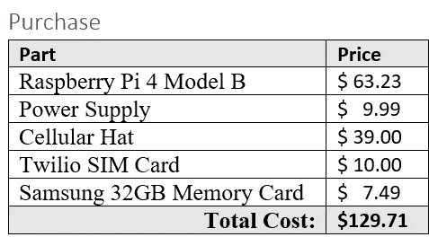
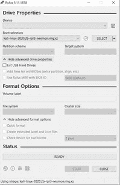

# 第 2 部分:最终的笔测试投件箱演练—构建笔测试投件箱

> 原文：<https://infosecwriteups.com/part-2-build-the-pen-test-drop-box-69278526886a?source=collection_archive---------2----------------------->

# 订购零件

建造成本

**购买链接**

树莓 Pi 4 型——63.23 美元——【https://amzn.to/3n6xBty 

电源—$ 9.99—【https://amzn.to/3HK31xQ 

蜂窝帽——39.00 美元——[点击此处](https://sixfab.com/product/raspberry-pi-3g-4glte-base-shield-v2/)

Twilio SIM 卡——10.00 美元——[点击此处](https://www.twilio.com/wireless)

三星 64GB 存储卡——7.49 美元——[https://amzn.to/3f30Jxo](https://amzn.to/3f30Jxo)

# 组装零件

这部分很简单，不需要解释。

# 安装 Kali

从:[https://Kali . download/ARM-images/current/Kali-Linux-2022.2-raspberry-pi-ARM 64 . img . xz](https://kali.download/arm-images/current/kali-linux-2022.2-raspberry-pi-arm64.img.xz)下载 Kali ARM 镜像

下载 Rufus: [这里](https://rufus.ie/)

使用 Rufus 通过 USB 适配器将 Kali ARM 映像写入您的 MicroSD 卡。

Rufus 接口

一旦你有了带有 Kali 操作系统的 microSD，只需把它放在 Pi 上的 MicroSD 插槽中。您已经准备好启动了！

接下来，我们将添加我们的蜂窝反向链接！:)[点击这里](https://killbit.medium.com/part-3-pen-test-dropbox-adding-a-cellar-backlink-8c8d5cfde667)

第 1 部分:[构建一个基于云的命令和控制服务器，并用蜂窝反向链接攻击 Drop Box](https://killbit.medium.com/part-1-build-a-cloud-based-command-and-control-server-and-attack-drop-box-with-a-cellular-b3e9e063dedd)

第 3 部分: [Pen Test DropBox —添加一个地窖式的反向链接](https://killbit.medium.com/part-3-pen-test-dropbox-adding-a-cellar-backlink-8c8d5cfde667)

如果你喜欢我的内容和我在这里提供的工作，请考虑发送一些咖啡爱我的方式@[https://www.buymeacoffee.com/killbit](https://www.buymeacoffee.com/killbit)

你友好的邻居黑客，

杀手