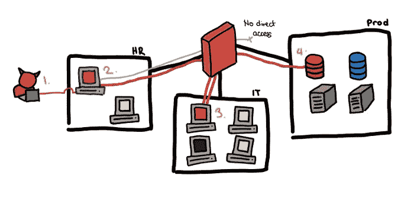
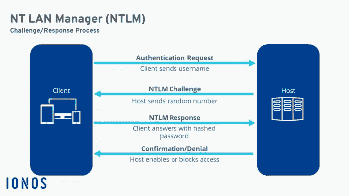
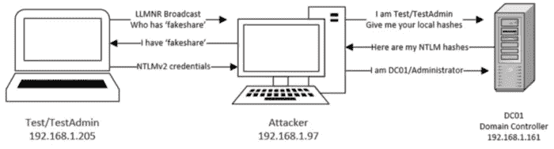

# 通过哈希攻击

> 原文：<https://infosecwriteups.com/pass-the-hash-attack-ddf956cf9551?source=collection_archive---------1----------------------->

由 [Unsplash](https://unsplash.com/@gurysimrat?utm_source=unsplash&utm_medium=referral&utm_content=creditCopyText) 上 [Gursimrat Ganda](https://unsplash.com/@gurysimrat?utm_source=unsplash&utm_medium=referral&utm_content=creditCopyText) 拍摄的照片

我们每天都听到关于破坏的消息，有时甚至听到关于系统危害的消息，所以攻击者采取什么步骤以及他如何渗透整个系统都是未知的。让我们明确这一点。

从攻击者的角度来看，危害系统/网络包括 5 个阶段。它们是:

1.  **侦察**:用于收集系统信息，可以主动也可以被动操作。因此，攻击者试图收集尽可能多的信息，以便尽可能有效地攻击系统。
2.  **扫描和枚举**:扫描由攻击者执行，目的是识别系统中的任何漏洞。
3.  **获得访问权限:**一旦攻击者发现了系统的漏洞，他或她就可以利用这些漏洞来危害系统。
4.  **保持访问/利用后:**利用后，攻击者要么试图保持对系统的访问，要么试图攻击网络上的另一个系统，以获取更多信息。
5.  **清除您的踪迹:**攻击者销毁了他行动的所有证据，这样就没有人能够确定是谁入侵了系统以及获得了什么信息。

出于这篇博客文章的目的，我们将讨论攻击者在后期利用阶段可能利用的一种攻击。这种攻击是后开发阶段的横向移动阶段的一部分。

**后期开发**

攻击者的主要目标是发射外壳。一旦他做到了这一点，可能性是无穷无尽的，而且这在很大程度上取决于系统管理员已经实现的安全强化过程。

在弹出外壳并引用正在打开的会话后，对手采取的任何操作都将被称为后利用。他可以安装恶意软件，甚至在受害者关闭计算机后采取措施保持持久性，甚至泄漏数据。

**横向移动**

[来源](https://pberba.github.io/security/2020/04/26/lateral-movement/)

你会同意我的观点，即被攻击者入侵的计算机/主机不会是网络中唯一的主机。网络包括多台(至少 2 台)计算机，每台计算机都能够相互通信。横向移动是指攻击者移动或危害网络中其他计算机的过程。在这个过程中，他可能会危及网络中其他更敏感的部分。

传递哈希是攻击者在 Windows 环境中横向移动时使用的一种后利用技术。

**简介**

当您登录到拥有多个用户帐户的计算机或公司网络时，您需要提供用户名和密码。您认为 Windows 会简单地将您的密码与数据库中存储的密码进行比较吗？不。那样不安全。相反，它所做的是找到一个密码的 NTLM 散列，并与用户名一起存储在一个名为 LSASS.exe 的文件中。你会想到两个问题。

1.  为什么我们的密码是散列的？
2.  为什么它会把你的密码存在一个文件里？

它是散列的，所以即使你的计算机被入侵，攻击者也不会马上得到明文密码。至于第二部分，它存储在一个文件中，因此您不必为必须访问的每个功能输入凭据。在您的家庭环境中，您可能没有考虑到这一点的重要性，但是在企业环境中，有多个服务和任务正在运行。作为用户，要与他们互动，你必须提供你的凭证。如果您必须每 5 分钟输入一次凭据，这很容易让人感到沮丧。这是 SSO 的一个概念，您只需输入一次凭据，就可以访问您的用户角色所允许的服务，而无需再次输入密码。

**NTLM**

这可能会让你吃惊，但是你的密码从来不会通过网络发送。但是你如何证明你自己呢？NTLM 是一种身份验证协议，它使用质询/响应模型来验证用户身份。让我们来了解如何。

假设用户想要访问服务器的服务。服务器向用户发送询问。我们知道现在我们的密码已经被散列并存储在 LSASS.exe 文件中。使用我们的密码的 NTLM 散列对挑战进行加密，并连同我们的用户名一起发送回(作为对挑战的响应)服务器。

**挑战(使用用户的 NTML 散列加密)- >响应**

现在服务器有了我们的用户名、响应和它发送给我们的原始挑战。它将它们发送到域控制器。

域控制器是一个独立的实体，拥有我们的用户名和密码的 NTLM 哈希。它从服务器接收用户名、响应和原始挑战。它获取用户名，并找到用户对应的 NTML 散列。它接受 NTLM 散列并使用该散列解密响应。然后，它将解密后的响应与原始质询进行比较。如果它们相等，则用户通过了身份验证。

**注意:**如果散列与用于加密质询的散列相同，则解密的响应应该与原始质询相同。

[来源](https://www.ionos.com/digitalguide/fileadmin/DigitalGuide/Schaubilder/server-during-ntlm-authentication.png)

简而言之，这就是挑战/回应模式的工作方式。这不受网络嗅探攻击的影响，因为无论是哈希还是密码都不会与服务器或域控制器共享。

但是这使它容易受到一种叫做传递散列的单独类型的攻击。

**什么是帕斯哈什？**

正如我们刚刚了解到的

1.  我们的密码被散列并存储在 LSASS.exe 文件中。
2.  我们的散列用于加密质询，然后作为响应发送。

如果对手能够破坏机器，他就可以利用这一点为自己谋利。

哈希传递是一种攻击，其中对手使用或发送密码哈希而不是密码本身来验证自己。

他必须采取的第一步是转储存储在 LSASS.exe 文件或 SAM 文件中的 NTLM 散列。

然后，他可以使用这些散列来验证自己。完成这一任务的完美工具是 **Mimikatz** 。

**补救**

识别散列攻击是相当困难的。但是，有几种方法可以用来防止这种类型的攻击。

如果在您的组织中使用 SSO，您可以做的是启用多因素身份认证。这将确保即使您的凭据已经被转储和破坏，攻击者也无法破坏其他系统。

您可以使用的另一种补救技术是应用最小特权原则。这在基于云的环境中很常见，也是在企业环境中使用的一种优秀策略。

最小特权原则认为，用户应该只能访问那些完成工作所需的文件、进程和服务，仅此而已。

## 来自 Infosec 的报道:Infosec 每天都有很多内容，很难跟上。[加入我们的每周简讯](https://weekly.infosecwriteups.com/)以 5 篇文章、4 个线程、3 个视频、2 个 GitHub Repos 和工具以及 1 个工作提醒的形式免费获取所有最新的 Infosec 趋势！