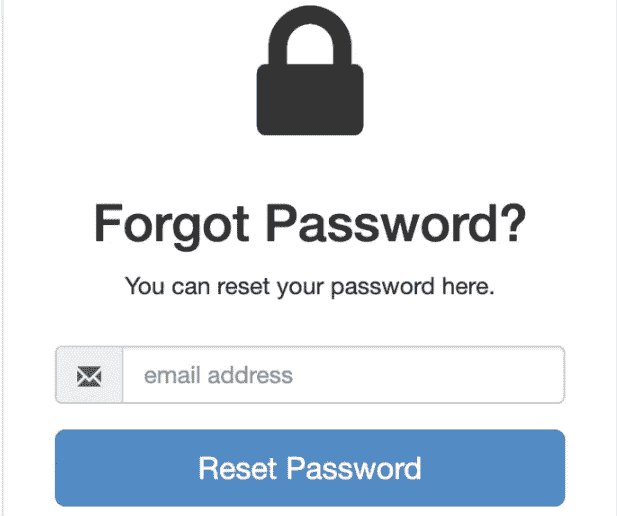
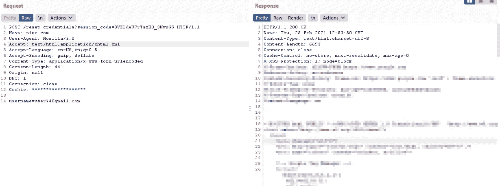
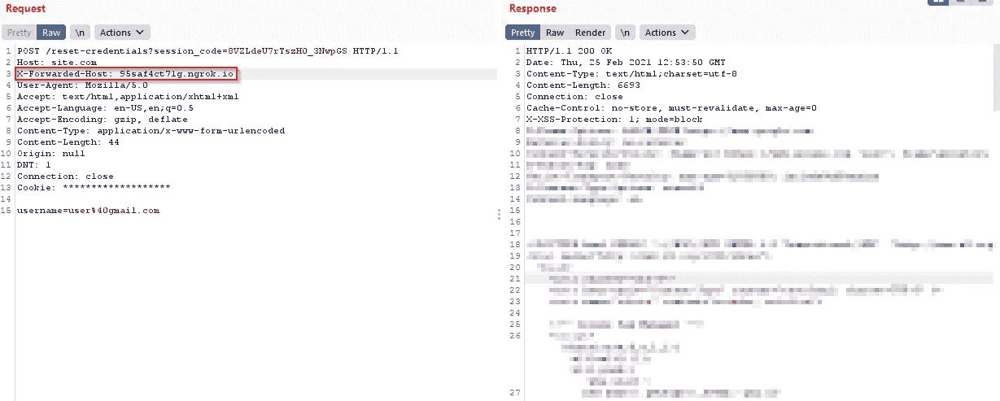
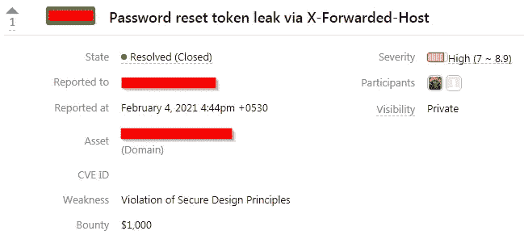

# 密码重置令牌通过 X-Forwarded-Host 泄漏

> 原文：<https://infosecwriteups.com/password-reset-token-leak-via-x-forwarded-host-4ed3e33dca31?source=collection_archive---------0----------------------->

大家好，

我是 [**萨扬·布杰尔**](https://twitter.com/saajanbhujel) 。

商学学士(B.Com)的学生，我也是一名昆虫赏金猎人。

这是我的第一篇博客，如果你发现任何拼写错误，请耐心听我说几分钟。这个博客是关于一个漏洞的，我在黑客的私人程序中发现了这个漏洞，它允许我接管任何用户的账户。但是在开始这篇博客之前，我想提供一些关于主机头的基本信息。

## 什么是 HTTP 主机头？

从 HTTP/1.1 开始，HTTP 主机标头是强制的请求标头。它指定了用户想要访问的域名。

例如，如果一个用户访问 https://example.com 的**，那么他们的浏览器将发出一个包含如下主机头的请求:**

> **GET / HTTP/1.1**
> 
> **主持人:example.com**

**现在让我们开始写博客吧…**

****

**几天前，我在 Hackerone 上收到通知，说我被邀请参加一个私人项目。所以我接受了邀请，开始寻找那个私人项目。在开始搜索那个私人程序时，我花了 5-6 天时间寻找跨站点脚本(XSS)、IDOR、SQL 注入、登录页面缺陷、信息泄露和子域接管，但仍然什么也没找到。**

****

**休息了几个小时后，我又开始在那个域上搜索，但这次我得到了一个有趣的功能，这是我上次没有看到的。有趣的功能是**密码重置功能**。所以我对自己说，让我们试试这个密码重置功能。**

****

**我不能透露目标的名字，因为这是一个私人项目。所以，让我们假设目标是**site.com**。他们的密码重置功能是这样的:**

****

**我注意到，每当我们进入我们的电子邮件并点击重置密码。我们收到了一封带有密码重置令牌链接的更改密码的电子邮件。**

**密码重置令牌链接如下所示:**

> **https://site.com/action-token?key = eyjhbgcioijiuzi 1 nisinr 5 ccigoiaislduiwia 2 lkia 6 icizzwm 2 odu 2 z**

**这一次我决定拦截密码重置请求，我还启动了我的 ngrok 服务器。**

****原始请求**是这样的:**

****

**然后我在原始请求中添加了另一个带有我的 ngrok 服务器域的头“X-Forwarded-Host”。所以现在**修改后的请求**是这样的:**

****

**这次我收到了一封更改密码的邮件，但是是用我的 ngrok 服务器域。密码重置令牌链接如下所示:**

> **https://95saf4ct71g.ngrok.io/action-token?key = wia 2 lkiia 6 iccioijiuzi 1 niis INR 5 ccigodu 2 zeyjhbgia**

**您还可以看到，我只需在密码重置请求中添加标题“X-Forwarded-Host ”,就可以成功地更改主机。**

**然后，我注意到，如果我在密码重置页面输入受害者的电子邮件，并拦截该请求，如果我添加另一个标题“X-Forwarded-Host”与我的恶意域名。然后受害者将收到一封电子邮件的密码重置令牌链接与我的恶意域名。当受害者点击那个链接时，他会重定向到我的网站，他的所有令牌都会泄露给我。然后我可以用受害者泄露的令牌更改他的密码。是的，这个漏洞的影响是一个完整的帐户接管。**

**因此，现在我可以通过重置密码，完全接管任何在 site.com 拥有账户的人的账户。**

****

**因此，没有浪费任何时间，我成功地提交了这个漏洞的完整概念证明，然后，Hackerone 的私人程序奖励了我 1000 美元。**

****

**谢谢你阅读这篇博客，我希望你能学到一些东西。**

**祝你愉快！….**

****