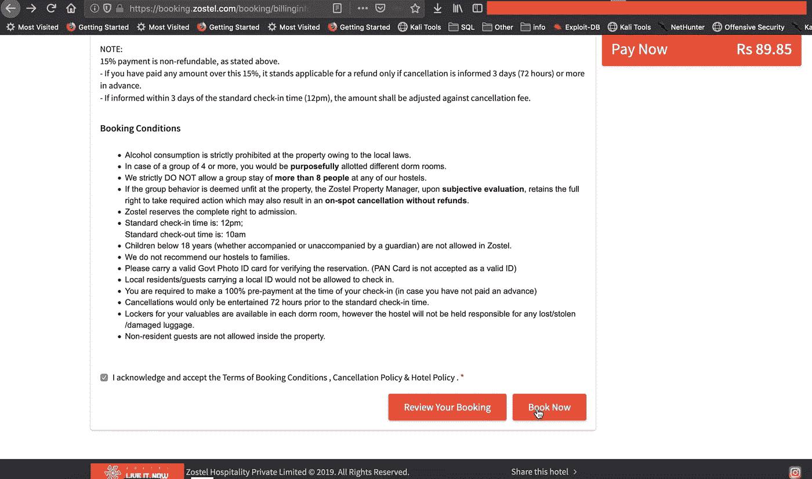
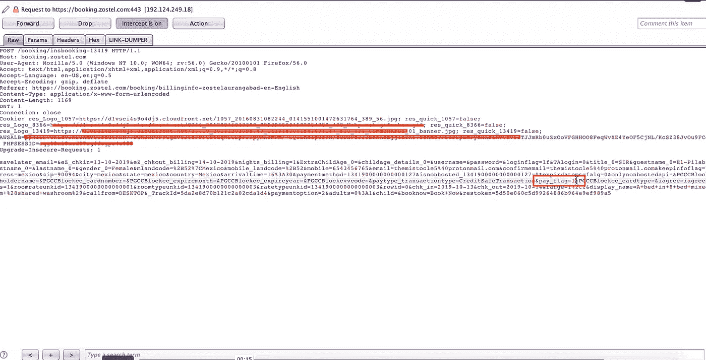
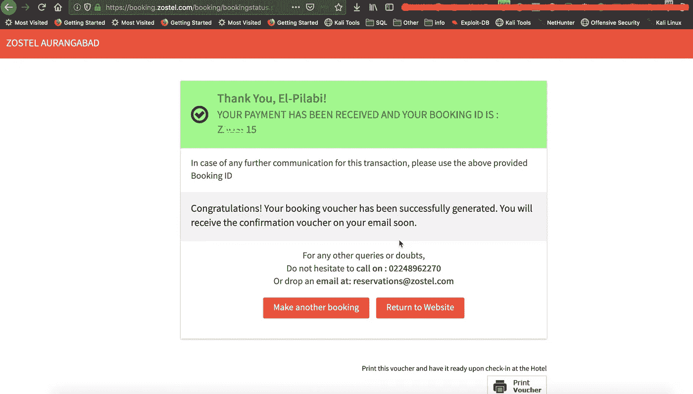

# Zostel 的支付网关旁路:印度最大的连锁旅店

> 原文：<https://infosecwriteups.com/payment-gateway-bypass-of-zostel-indias-biggest-hostel-chain-81c407454f0a?source=collection_archive---------1----------------------->

> 最近我计划去印度进行我的个人旅行。在欧洲，找一个青年旅舍是很普遍的，但是我不确定印度的情况。搜索之后，我偶然发现了 Zostel，这是印度和尼泊尔最大的连锁旅店。所以在预订之前，我在我的打嗝历史中找到一些付款请求。我立即重试同样的事情，并修改了价值，我能够绕过支付网关，免费预订我的宿舍。我立即在 twitter 上找到了 CEO，因为他们现在还没有 bugbounty 计划，并报告了这个问题。

# 描述:

Web 参数篡改攻击基于对客户机和服务器之间交换的参数的操纵，以便修改应用程序数据，例如用户凭证和权限、产品的价格和数量等。随着全球在线交易和电子商务的迅猛发展，针对在线支付系统安全性的攻击的数量和类型也在不断增加。因此，在使用网站为 Zostel 付款时，很容易绕过支付网关，无需支付任何费用即可预订酒店。

# 影响:

任何攻击者都可以在不支付任何在线费用的情况下预订旅馆房间，并且很容易提前预订所有房间，这将造成房间不足以及公司的财务损失。

# 复制步骤:

1.访问网站。

2.选择您想要预订的任何日期。

3.填写用户详细信息并完成页面。

带有预付款选项的立即预订页面

4.使用任何代理拦截 POST 请求，如 burpsuite/owasp zap/paros 代理，并将参数从 1 更改为 0“pay _ flag = 0”

薪资标志操纵

5.302 以及成功预订页面，无需支付任何费用。

成功

# 缓解措施:

必须从 HTTP 主体中删除价格变量。只需在 HTTP 标题中输入商品编号，从数据库中调出价格，并建立某种复查系统。

计算与价格参数和用户详细信息相关的所有请求的散列，以便没有操纵的机会。

使用 sha256 等强大的哈希算法验证两端的哈希。

> 我要感谢 Zostel 的 Dharamveer 先生和 Gaurav 先生承认了这个问题，并很快对其进行了修补。这是印度生态系统在网络安全方面的一个很好的例子。在 30 天内报告并解决问题。

*关注* [*Infosec 报道*](https://medium.com/bugbountywriteup) *获取更多此类精彩报道。*

 [## 信息安全报道

### 收集了世界上最好的黑客的文章，主题从 bug 奖金和 CTF 到 vulnhub…

medium.com](https://medium.com/bugbountywriteup)