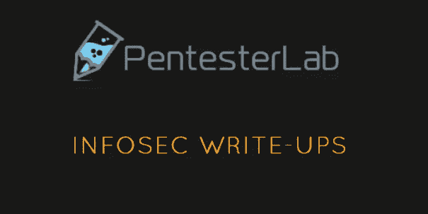

# Pentester Lab Pro 订阅赠品

> 原文：<https://infosecwriteups.com/pentester-lab-pro-subscription-giveaway-4a902a4097ca?source=collection_archive---------2----------------------->

## InfoSec Writeups 与 PentesterLab 的首次合作

大家好！

我们非常兴奋地宣布，Infosec writes-ups 将首次与[**PentesterLab**](https://pentesterlab.com/)**合作举办竞赛，这是最大、最好的在线资源，让学习网络黑客更容易！**

**获胜者将获得**为期 1 个月的 PentesterLab Pro Lab 优惠券，**使用这些优惠券，他们可以访问所有的 Pro 实验室，并了解从基本错误到高级漏洞的一切。**

**规则很简单。要获得资格，您应该:**

1.  **成为[信息安全报道](https://medium.com/bugbountywriteup)的作者**
2.  **在 PentesterLab 有账户**
3.  **关注推特上的 [Infosec 文章](https://twitter.com/InfoSecComm)和 [PentesterLab](https://twitter.com/pentesterlab?lang=en)**
4.  **从 2020 年 10 月 4 日至 14 日提交一篇高质量的文章(仅限未发表的草稿)。**
5.  **在记录末尾添加一行“*作为 10 月 PentesterLab 赠品*的一部分提交”。**

**获奖者将根据**掌声、观点、文章质量和所讨论技术的新颖性等**来决定。将会有**两个赢家。****

**来自世界各地的任何人都可以参加。年龄、职业等都不重要。**

## **注意事项:**

*   **在它的一生中，不应该在中等收费墙后面写文章。这意味着即使没有中级会员资格，每个人都可以访问它。**
*   **这篇文章不应该从 InfoSec 的文章中删除(如果删除，作者下次将被取消资格)**

**这都是我们这边的。我们迫不及待地想看看你能写出什么样的精彩文章。**

**继续黑，继续写，继续牛逼。**

**问候，**

**[Sai](https://medium.com/u/be0f09f27ea3?source=post_page-----4a902a4097ca--------------------------------) 和 [Anangsha](https://medium.com/u/6e2475a6e38a?source=post_page-----4a902a4097ca--------------------------------) 和
编辑， [InfoSec 报道](https://medium.com/bugbountywriteup)**