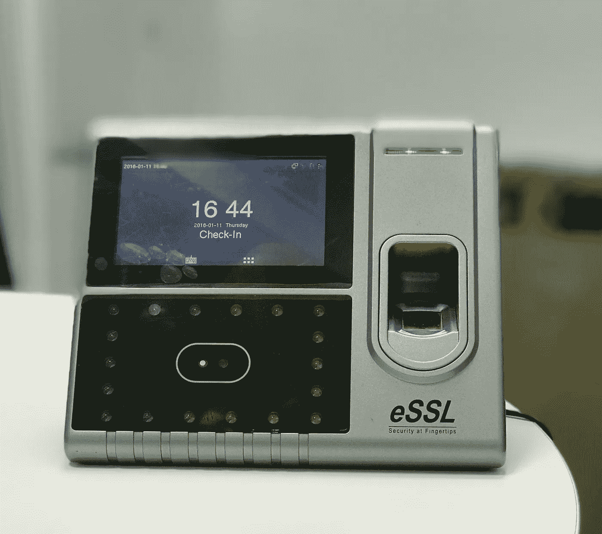
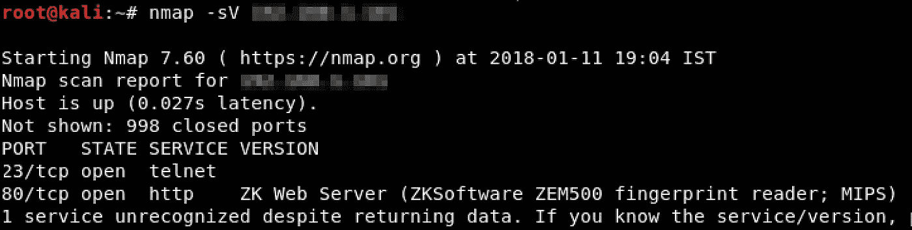
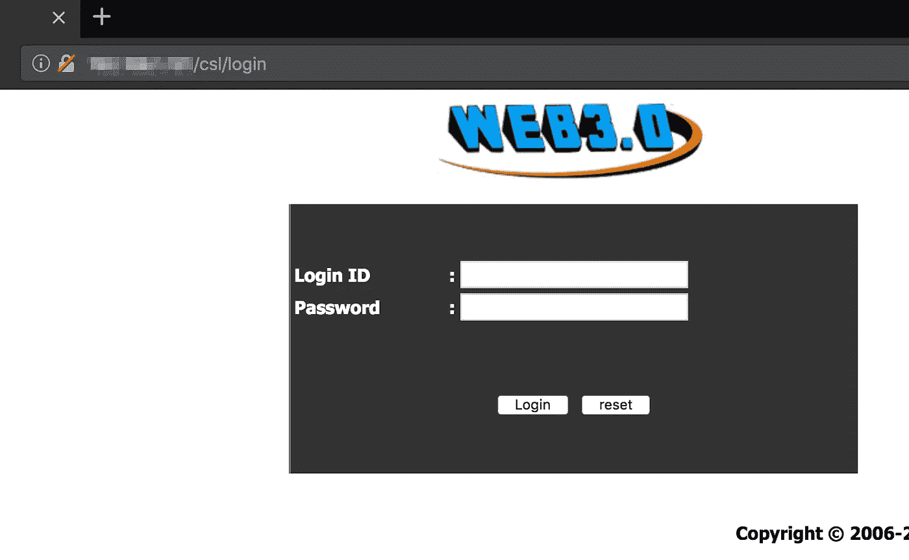
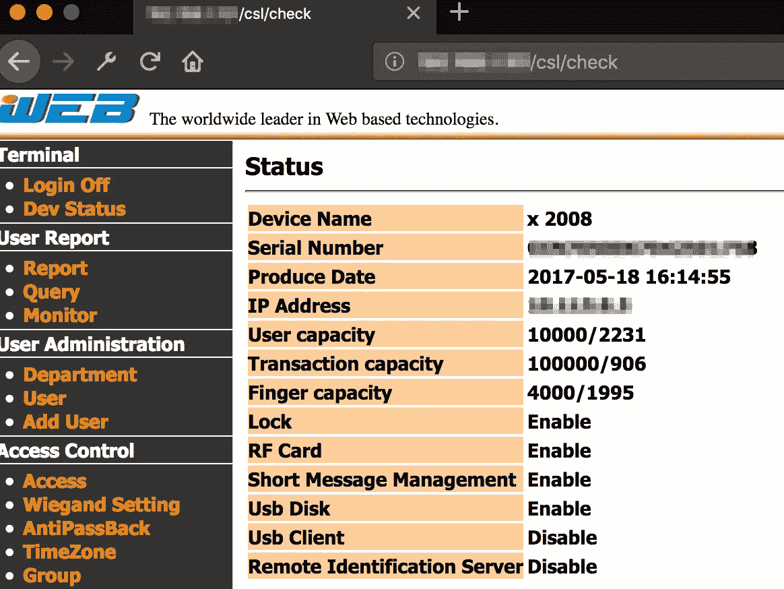
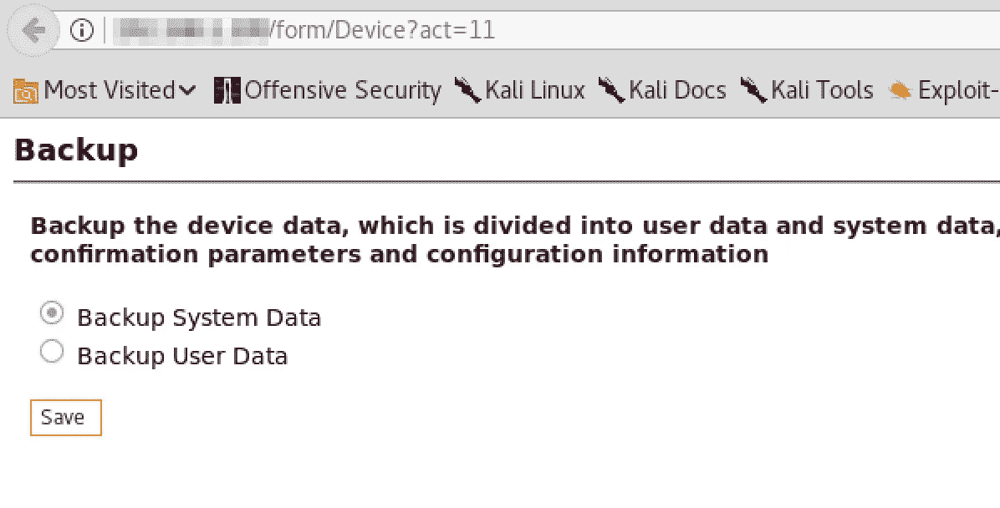
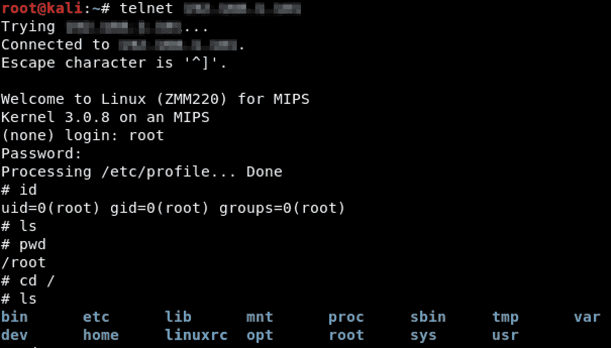
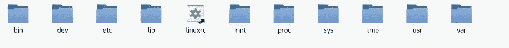
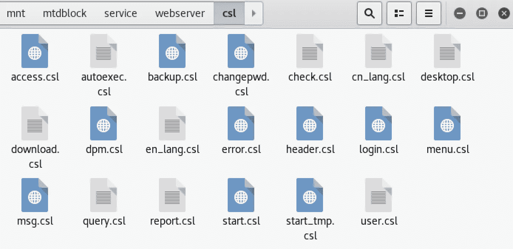
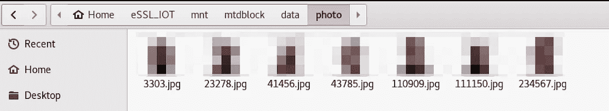
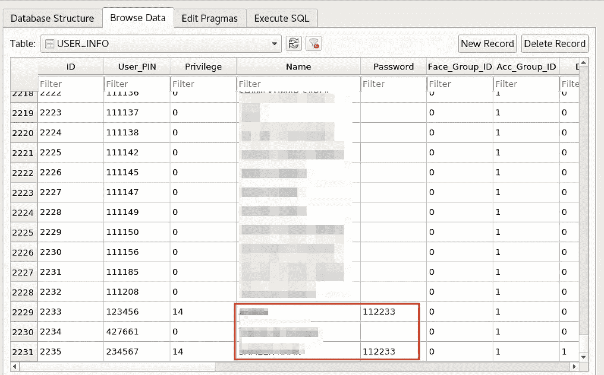

# 测试基于 IOT 的生物识别考勤设备

> 原文：<https://infosecwriteups.com/pentesting-an-iot-based-biometric-attendance-device-10c0efd69392?source=collection_archive---------0----------------------->

在红队的一次活动中，我有机会测试一种生物识别考勤设备，这种设备通常被客户用来标记出勤情况和限制进入特定房间。

> 我在这里没有弹出任何零天，但事实上，该设备配置很差，它允许我在上面获得 root 访问权限。

这是我测试的设备的快照。

从评估开始，我发现设备连接到网络，并且我能够从设备的网络设置中获取其 IP 地址。

我对设备的 IP 地址进行了端口扫描，发现远程主机上运行着 **telnet** 和 **web 服务器**。

这里唯一的攻击面是损害目标上运行的 **Telnet** 或**web 服务器**。此外，我无法对 Telnet 版本进行指纹识别。此外，还试图使用默认凭证来强制 telnet 服务，但没有成功。然后，我继续沿着 **Webserver** 路径前进。

目标在端口 80 上运行 ZK Web 服务器 3.0

用户手册[对我更好地理解 ZK 网络服务器 3.0 的工作是一个很好的指导。](http://www.nod-finger.com/Download/web%20server%203.0_en.pdf)

我很快发现 Web 服务器充满了漏洞，例如**访问控制问题**、**会话固定**和**暴力攻击**等等。

尽管如此，我还是能够使用默认凭证进入管理面板:**管理员:123456**

我进一步导航到备份设备数据部分，这允许我下载系统和用户数据。

最糟糕的部分来了:

> 由于访问控制不当，您可以通过导航到 URL 来访问备份数据，而无需进行身份验证。

备份系统数据下载一个**。dat** 文件。 **dat** 文件包含 **ZKConfig.cfg** 文件，其中硬编码了 Telnet 凭证。:D

我能够使用获得的凭证以 **root** 身份登录 **telnet** 。

我在本地机器上挂载了整个文件系统，并分析了所有文件。文件系统包含 web 服务器的源代码，然后可以对其进行分析，以寻找 web 服务中的进一步漏洞。

文件系统还包含所有用户数据。以下图片显示的是使用设备的生物特征进入受限房间的人。

文件系统还包含 **SQLite 数据库**，其中包含用户信息，包括他们的凭证以及**指纹和生物数据**。

可以通过**修改**和**在 SQLite 数据库中添加一个条目**来验证和访问受限区域。

我使用 [**Firmwalker**](https://github.com/craigz28/firmwalker) 来提取我可以从文件系统中检索到的任何更敏感和有用的东西。

此外，还发现 IOT 设备使用 API 将所有数据备份到**云服务器**中。因此，IOT 设备可以进一步用于**旋转**并访问备份所有数据的云主机。

继续进行不在我的范围之内，我的评估目标已经完成。

# 结论:

IOT 设备通常被供应商错误配置，并可能为任何人访问敏感数据打开大门。在这种情况下，IOT 设备不仅泄露了所有的用户信息，而且给了任何人访问或绕过访问控制机制的机会。

*关注* [*Infosec 报道*](https://medium.com/bugbountywriteup) *获取更多此类精彩报道。*

 [## 信息安全报道

### 收集了世界上最好的黑客的文章，主题从 bug 奖金和 CTF 到 vulnhub…

medium.com](https://medium.com/bugbountywriteup)