# 第 1 部分:“向公众开放”CTF 演练

> 原文：<https://infosecwriteups.com/pentesting-cloud-part-1-open-to-the-public-ctf-walkthrough-aa4dae59ec4e?source=collection_archive---------1----------------------->

最近我玩 [pentesting.cloud](https://pentesting.cloud/) CTF 玩得很开心，在这篇博文中，我想开始一个新的 IMHO 最有趣挑战的演练系列。我先从名为[“对公众开放”](https://pentesting.cloud/challenge/open-to-the-public/)的硬挑战说起。


# 让我们开始吧！

这个挑战不需要任何设置，乍一看，它的描述并没有提供太多信息:

> 本次挑战不需要任何文件。该标志是一个 AWS 访问键。
> 
> 访问密钥不在这个域上，不要试图枚举/攻击这个网站，否则你将被永久禁止。

有多种可以公开的 AWS 资源类型。 [Scott Piper](https://twitter.com/0xdabbad00) 创建了此类资源类型的列表，可在[这里](https://github.com/SummitRoute/aws_exposable_resources)找到。但是，为了能够找到与挑战相关的任何内容，我们至少需要 AWS 帐户 ID。如果你已经完成了任何其他 pentesting.cloud 的挑战(例如 [Intro](https://pentesting.cloud/challenge/intro-the-first-challenge/) challenge)，你会发现所有与挑战相关的文件都存储在名为*pentesting-challenges-public*的 S3 桶中。有一个[有趣的研究](https://cloudar.be/awsblog/finding-the-account-id-of-any-public-s3-bucket/)是关于从公共桶名中确定 AWS 帐户 ID🤯研究作者还发布了[开源工具](https://github.com/WeAreCloudar/s3-account-search)，它会为你带来奇迹。所以让我们来试试:

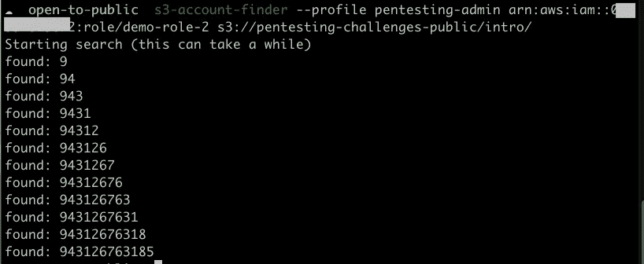

现在让我们检查同一个帐户是否被用来共享其他东西，而不仅仅是 S3 桶中的对象。让我们从寻找公开的 EBS 快照开始(我的第一个猜测是 EBS，因为几年前我创建了一个类似的 [CTF 挑战赛](https://medium.com/securing/krkanalytica-challenge-demystified-1c6477839e76))。您可以使用 AWS 管理控制台来搜索公共 EBS 快照。此外，您可以使用过滤器`Owner = 943126763185`:

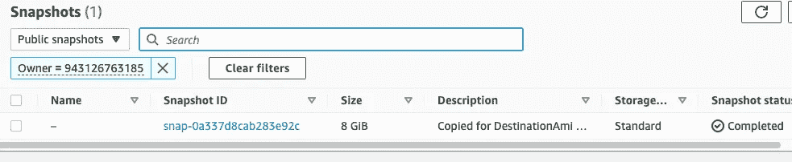

答对了。！！正如你在上面看到的，有公开共享的 EBS 快照。复制快照 ID，让我们研究一下它的内容。

# 探索 EBS 快照

首先，您需要有一个正在运行的 EC2 实例(一个带有默认设置的自由层 t2.micro 实例在这里会很好地工作)。但是，您不能将快照直接连接到 EC2 实例。您需要首先从快照创建一个 EBS 卷(请注意**该卷必须在与您正在运行的 EC2 实例**相同的可用性区域中创建；不然就贴不上了)。为此，进入 AWS 管理控制台，然后:**S*service->EC2->Volumes->Create Volume->指定自定义快照 id…*** 并提供共享快照的 id:

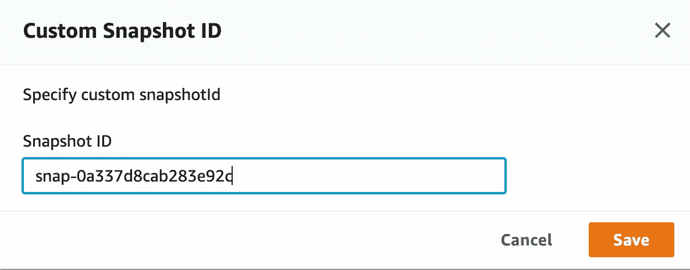

一旦创建了卷，现在是时候将它附加到正在运行的 EC2 实例了(在 AWS 管理控制台中:**S*service->EC2->******Actions->Attach volume***，并在此选择您的 EC2 实例 ID):

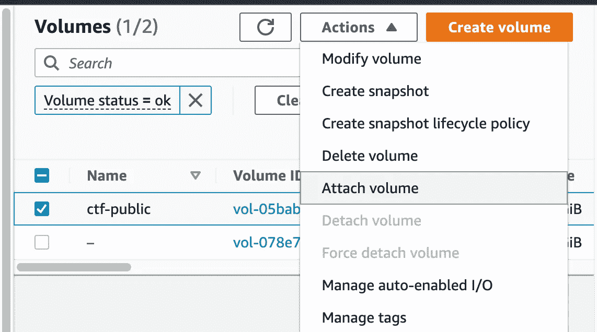

然后登录到您的 EC2 实例(在我的例子中，我使用了 [AWS 会话管理器](https://docs.aws.amazon.com/AWSEC2/latest/UserGuide/session-manager.html)，找到附加的卷(命令:`lsblk`)并将其挂载到您的文件系统(命令:`sudo mount [device] [mount point]`):

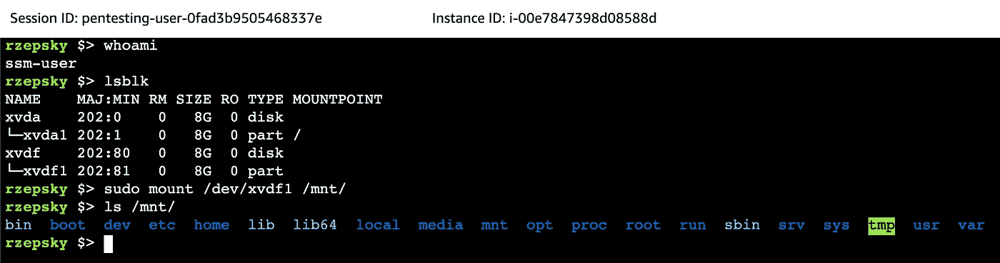

凭直觉，我去了 */home* 目录。在`.bash_history`文件中你可以看到 *ssm 用户*使用了 OS *root* 用户:

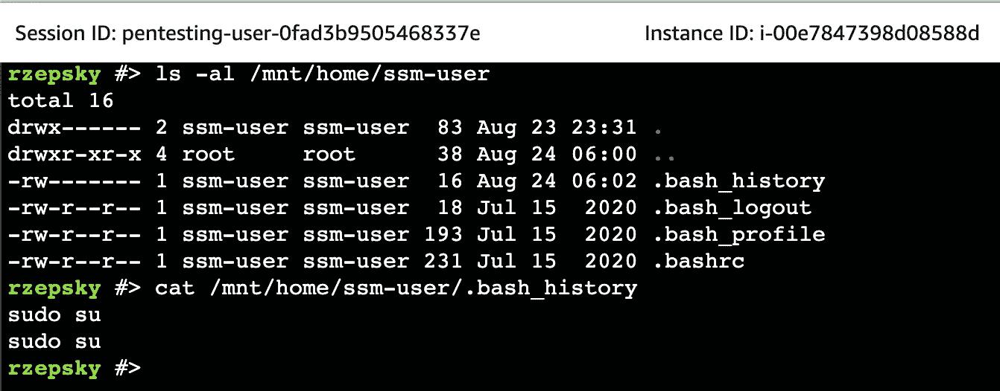

所以让我们检查一下*根的*T3 文件:

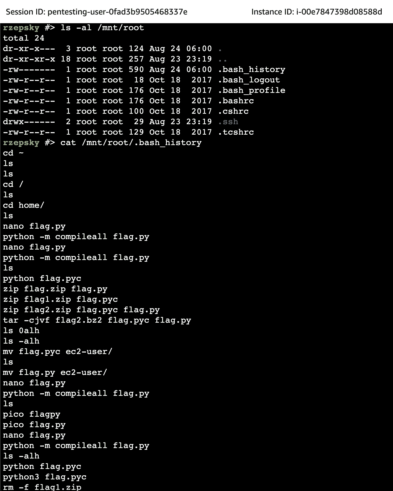

嗯……仍然看不到标志，但至少我可以看到采取所有这些行动的日期(请注意，根据`ls -al`命令的输出，您可以发现`.bash_history`文件在 24ᵗʰ8 月被修改)。因此，让我们不要检查挂载卷中的所有文件，而只过滤掉那些在 23ʳᵈ8 月之后修改过的文件(您可以通过运行下面的命令来做到这一点:`find /mnt/ -type f -mtime -xx`其中`-xx`是文件被修改的天数)。结果找到了 165 个文件。

从挑战描述中，我们知道:

> "(…)标志是一个 AWS 访问密钥"

在官方[文档](https://docs.aws.amazon.com/IAM/latest/UserGuide/reference_identifiers.html#identifiers-prefixes)中，你可以找到 AWS 访问键使用 AKIA 或亚洲前缀的信息。如果您对 23ʳᵈ8 月之后修改的所有文件运行`grep ^AKIA`，您将最终在`/mnt/var/lib/amazon/ssm/i-022903e02a0fed192/session/orchestration/sso-admin-087e79117eb921608/Standard_Stream/ipcTempFile.log`文件中找到该标志:

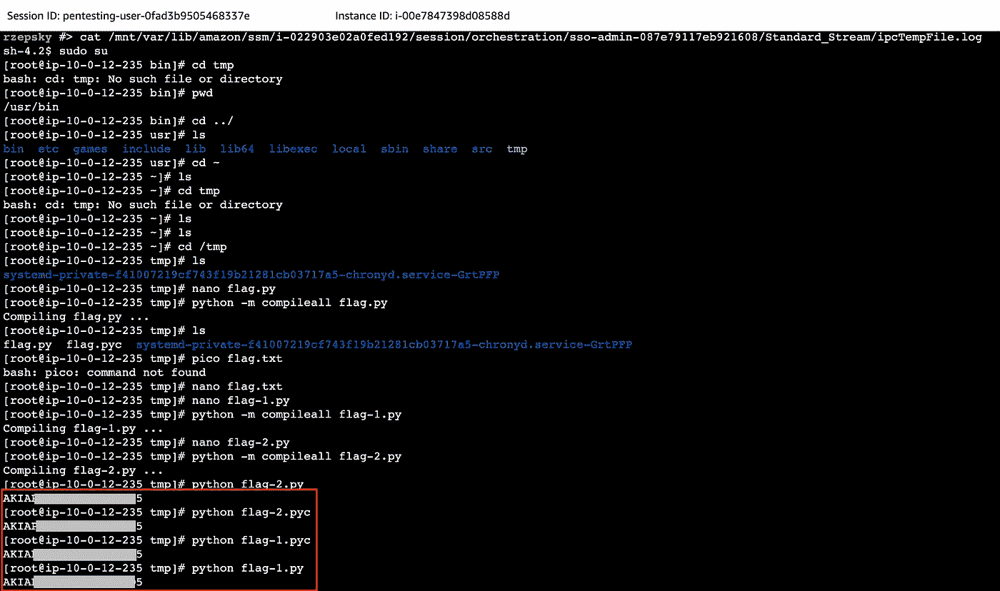

如您所见**所有 SSM 会话的命令及其输出都存储在本地**的文件中

`/var/lib/amazon/ssm/[instance ID]/session/orchestration/[SSM session ID]/Standard_Stream/ipcTempFile.log`

对共享 EBS 快照拥有权限的任何人都可以很容易地泄露这些日志。换句话说，任何检索到的或作为参数传递的机密都可能通过本地 SSM 日志无意中暴露出来。

# 可选择的解决方案

也可以用不同的方式检索标志。让我们再看一次`/mnt/root/.bash_history`文件，特别是根用户最后采取的动作:

```
# cat /mnt/root/.bash_history
...
python3 flag.pyc
rm -f flag1.zip
rm -f flag1.bz2
rm -f flag.pyc
rm -f flag.py
ls
rm -f flag*
ls
cd ec2-user/
ls
rm -f *
ls ../ssm-user/
exit
```

正如你所看到的,*标志** 文件被删除。但这是否意味着它们被永久移除了呢？如果您阅读官方白皮书[“安全流程概述”](https://d0.awsstatic.com/whitepapers/aws-security-whitepaper.pdf)，您会发现:

> EBS 快照是整个 EBS 卷的块级视图。请注意，通过卷上的文件系统不可见的数据(如已删除的文件)可能存在于 EBS 快照中。

这意味着我应该能够恢复删除的文件。为了测试它，我将使用 [PhotoRec](https://www.cgsecurity.org/wiki/TestDisk_Download) 工具，这是一个免费的文件恢复工具。使用以下命令可以很容易地将它安装在 Amazon Linux 实例上:

```
# amazon-linux-extras install epel -y
# yum update -y
# yum install testdisk -y
```

让我们运行 PhotoRec，并选择已装载的卷来恢复从中删除的文件:

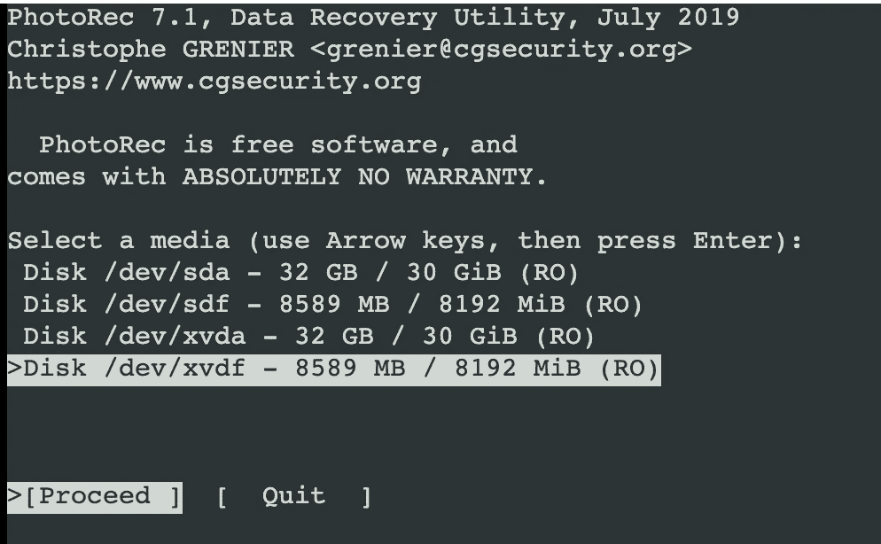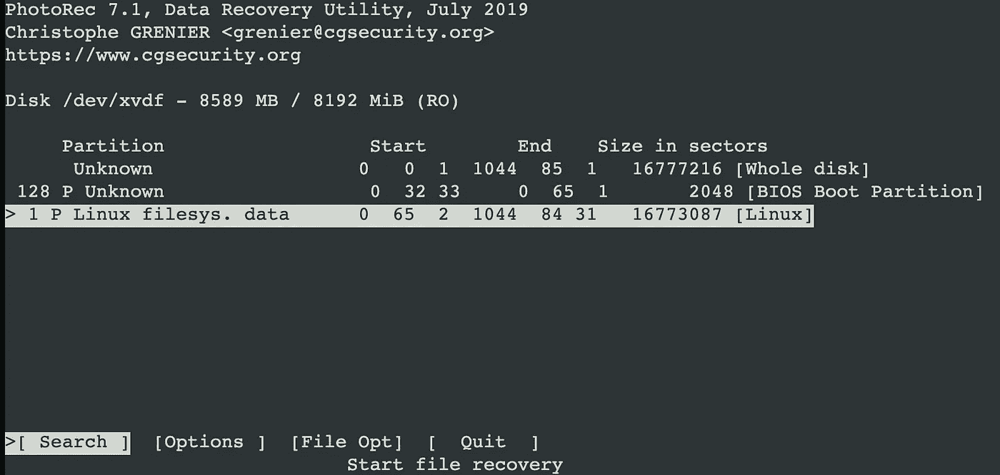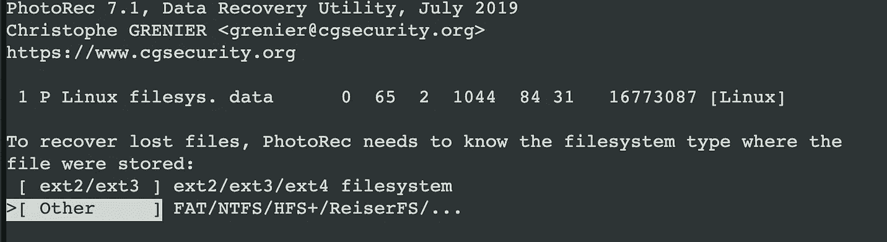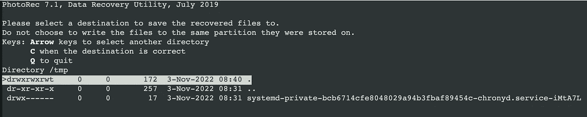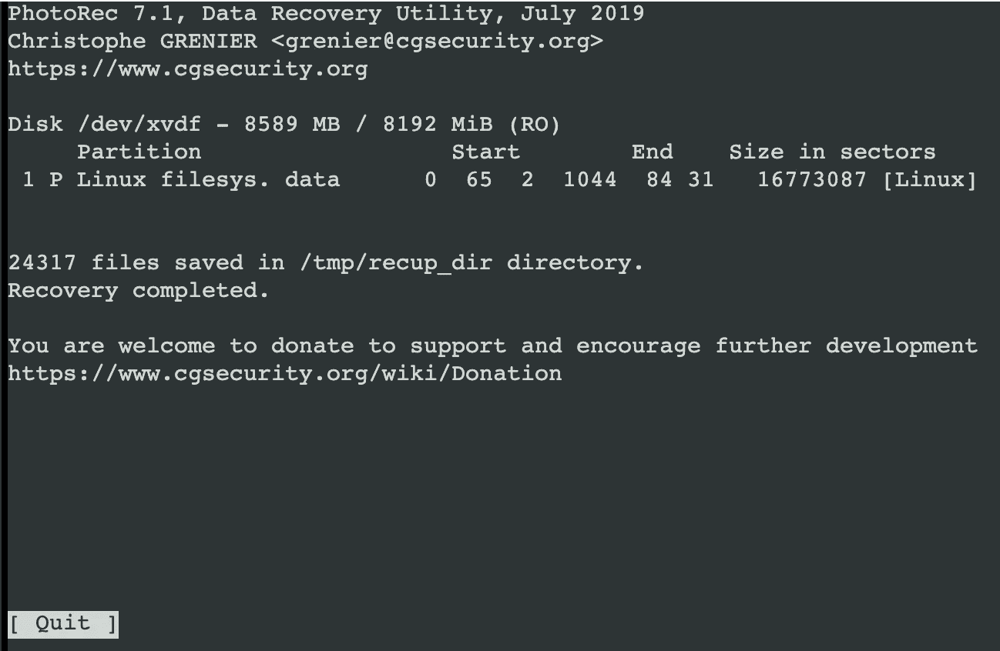

因为卷被挂载为 XFS 文件系统，所以您看不到恢复的文件名(EXT4 在这里会更好)。然而，因为我们知道这个标志是一个 AWS 访问键，所以我们可以搜索所有恢复的文件。正如您在下面看到的，该标志是在 Lorem Ipsum 文本中“注入”的:

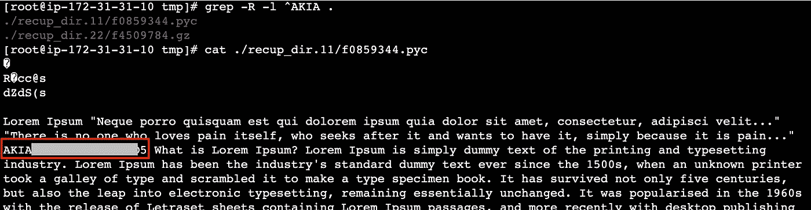

# 结论

“向公众开放”的挑战不仅是一个很大的乐趣，但也集中在重要的安全风险。我们可以从中了解到:

*   **所有 SSM 会话的命令及其输出都存储在本地，**
*   **从 EBS 卷中删除的文件可以恢复(EBS 卷在终止后被擦除)。**

请继续关注，不久我将发布更多关于 [pentesting.cloud](https://pentesting.cloud/) 挑战的演练😉

## 来自 Infosec 的报道:Infosec 每天都有很多内容，很难跟上。[加入我们的每周简讯](https://weekly.infosecwriteups.com/)以 5 篇文章、4 个线程、3 个视频、2 个 GitHub Repos 和工具以及 1 个工作提醒的形式免费获取所有最新的 Infosec 趋势！