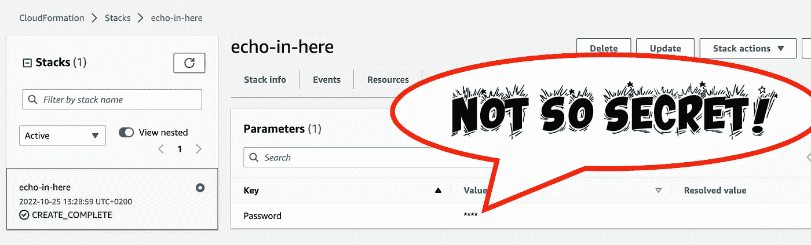
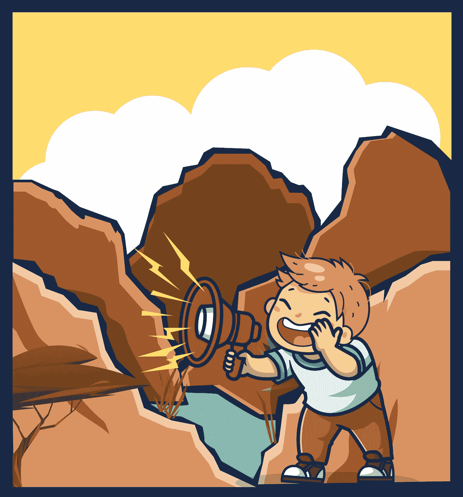
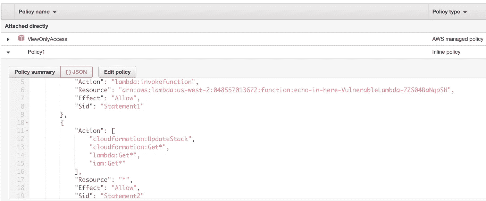
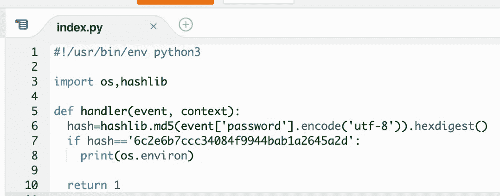
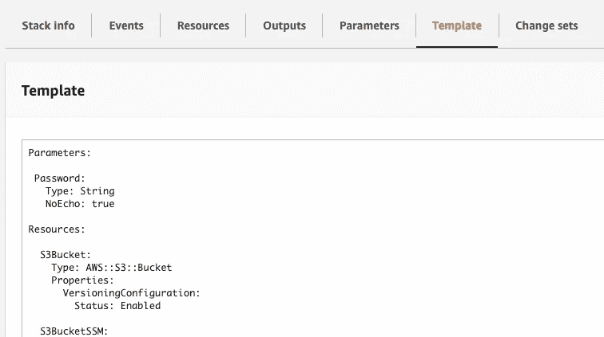
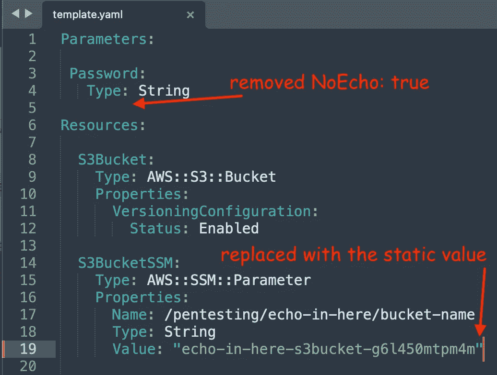
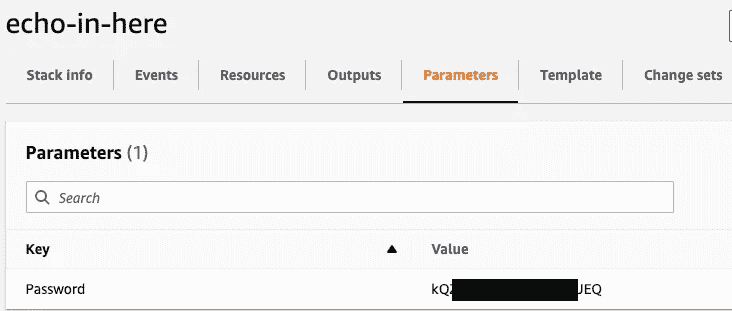
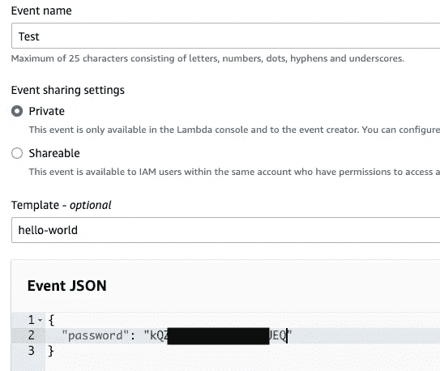
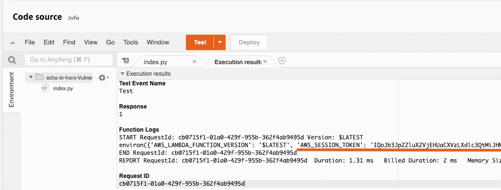
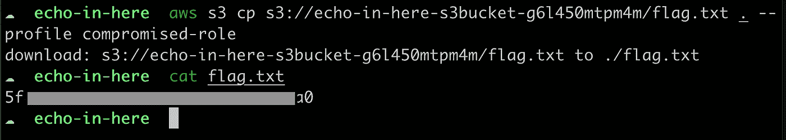

# 第二部分:“这里有回音吗？”AWS CTF 演练

> 原文：<https://infosecwriteups.com/pentesting-cloud-part-2-is-there-an-echo-in-here-ctf-walkthrough-54ec188a585d?source=collection_archive---------1----------------------->

在这篇博文中，我将向你展示一种揭示受`NoEcho`属性保护的云信息值的技术。换句话说，你将学习如何显示隐藏在`****`后面的已经部署的云阵堆栈的秘密。



这是*[*的遍历，这里有回音吗？*](https://pentesting.cloud/challenge/echo-in-here/)*来自 [pentesting.cloud](https://pentesting.cloud/) CTF 的挑战。有许多令人敬畏的 AWS 安全相关的挑战，所以如果你还没有尝试过，那么跳过阅读剧透，尝试自己解决它！但是如果你在这个挑战中卡住了，或者只是想看看诀窍，你可以直接跳到[主](#8d90)部分😉**

****

# **三、二、一……我们开始吧！**

**在挑战指令[之后，我部署了*“回声”云团堆栈*。这就是我们想要的:](https://pentesting.cloud/challenge/echo-in-here/)**

> **该标志是一个 md5 散列，位于由挑战创建的 s3 存储桶的根文件夹中的 flag.txt 中。**

**要找到它，我们可以使用名为*pentest-user*的专用 IAM 用户，他被授予以下权限:**

****

**让我们分析一下*测试用户*可以调用的 Lambda 函数:**

****

**这个简单的函数将显示所有的环境变量(包括访问密钥 ID、秘密访问密钥和附加执行角色的会话令牌！)，但前提是在事件对象中传递正确的密码。密码可以在部署的 CloudFormation 堆栈中找到。然而，它被掩盖了…😔有办法查看吗？当然是！**

# **发现 NoEcho 参数的值**

**如果你不想在 CloudFormation 模板中硬编码一个特定的值，那么你可以在创建栈的时候把它作为一个 [*参数*](https://docs.aws.amazon.com/AWSCloudFormation/latest/UserGuide/parameters-section-structure.html) 来传递。然而，*参数*的值反映给任何被允许进行`DescribeStacks` [API 调用](https://docs.aws.amazon.com/cli/latest/reference/cloudformation/describe-stacks.html)的人。但是如果 CloudFormation 模板中的参数具有属性`NoEcho: true`，则该值可以被屏蔽。因此，无论您是否在 AWS 控制台管理或 AWS CLI 中打开堆栈的参数选项卡，该值都将被屏蔽，例如:**

```
**$ aws cloudformation describe-stacks --query "Stacks[].Parameters[*]" --profile pentesting-user**
```

**输出:**

```
**[
    [
        {
            "ParameterKey": "Password",
            "ParameterValue": "****"
        }
    ]
]**
```

**一些 AWS 用户(我在野外见过很多次)错误地认为这是传递秘密的安全方式，例如数据库密码，尽管 AWS [文档](https://docs.aws.amazon.com/AWSCloudFormation/latest/UserGuide/parameters-section-structure.html)明确指出，推荐的方法是使用动态参数(例如引用存储在 AWS 系统管理器参数存储或 AWS 秘密管理器中的秘密值)\_(ツ)_/**

***pentesting-user* 拥有`cloudformation:UpdateStack`权限，足以暴露密码值。我们所要做的就是……<drumroll🥁>……用设置为`false`的`NoEcho`属性来更新堆栈(或者简单地删除它)。但是请耐心等待，只是编辑/删除参数属性不会被 CloudFormation 服务识别为…更改😕让我演示一下。**

**为了更新堆栈，我们当然需要一个模板。 *pentesting-user* 拥有`“cloudformation:Get*”`权限，因此我们可以从已经创建的堆栈中获取模板(在 CloudFormation 仪表盘中，只需点击堆栈名称，然后转到*模板*选项卡):**

****

**全选并保存为`template.yaml`文件。如果您只删除了`NoEcho: true`行并试图调用[更新堆栈](https://docs.aws.amazon.com/cli/latest/reference/cloudformation/update-stack.html) *操作，那么您将得到以下错误消息:**

```
**$ aws cloudformation update-stack --stack-name echo-in-here --template-body file://template.yaml --parameters ParameterKey=Password,UsePreviousValue=true --capabilities CAPABILITY_NAMED_IAM --profile pentesting-user

An error occurred (ValidationError) when calling the UpdateStack operation: No updates are to be performed.**
```

> *** —请注意，如果您不想更新参数值，而是使用已经存在的值，那么您必须在更新堆栈操作期间通过`UsePreviousValue=true`明确指定它。**

***pentest-user*没有修改任何资源的权限，但是在`Resource`部分对 CloudFormation 模板做一点小小的改变就可以解决这个问题🤯因此，让我们用已经创建的 S3 桶的名称替换原来的`template.yaml`中的`!Ref S3Bucket`(因此没有对任何资源进行更改，但是这种更改被 CloudFormation 服务识别为新的模板文件):**

****

**因此，让我们再次尝试运行上述相同的命令，但这一次使用更新的`template.yaml`文件:**

```
**$ aws cloudformation update-stack --stack-name echo-in-here --template-body file://template.yaml --parameters ParameterKey=Password,UsePreviousValue=true --capabilities CAPABILITY_NAMED_IAM --profile pentesting-user

{
    "StackId": "arn:aws:cloudformation:us-west-2:XXXXXXXXXXXX:stack/echo-in-here/36f1c740-70c0-11ed-b156-0699d225df8d"
}**
```

**更新完成后，让我们回到云形成`echo-in-here`堆栈的参数选项卡，瞧，我们可以看到未屏蔽的*密码*值:**

****

**现在，让我们回到*pentest-user*可以调用的`echo-in-here-VulnerableLambda-7ZS04BaNqpSH` Lambda 函数。当您从 AWS 控制台管理中调用 Lambda 函数时(只需单击 Lambda 函数*代码*选项卡中的`Test`按钮),然后您可以传递`Event.json`文件中的参数，在这里您应该使用无屏蔽密码:**

****

**一旦 Lambda 被执行，您可以看到被执行函数的所有环境变量，包括假设的执行角色所使用的凭证:**

****

**现在让我们将本地终端中的折衷 Lambda 执行角色配置为*折衷角色*配置文件。您可以使用以下命令来完成此操作:**

```
**# specify the AWS_ACCESS_KEY_ID, AWS_SECRET_ACCESS_KEY and the region:
$ aws configure --profile compromised-role

# specify the AWS_SESSION_TOKEN:
$ aws configure --profile compromised-role set aws_session_token PUT_AWS_SESSION_TOKEN_HERE

# check if the profile is correctly configured:
$ aws sts get-caller-identity --profile compromised-role

{
    "UserId": "AROAQWTRZHKUAF6QTSLWX:echo-in-here-VulnerableLambda-7ZS04BaNqpSH",
    "Account": "XXXXXXXXXXXX",
    "Arn": "arn:aws:sts::XXXXXXXXXXXX:assumed-role/echo-in-here-VulnerableRole-UBOWSUETXTJV/echo-in-here-VulnerableLambda-7ZS04BaNqpSH"
}**
```

**最后，我们可以下载并读取`flag.txt`文件:**

****

# **结论**

***[*这里有回音吗？*这里的一个重要教训是**堆栈资源所需的任何秘密都应该存储在 CloudFormation** 之外(例如，在 AWS Systems Manager 参数存储或 AWS Secrets Manager 中)并从 CloudFormation 模板中动态引用。此外，这样的秘密应该被加密，这将增加额外的访问控制层(委托人不仅需要访问秘密的许可，还需要根据 KMS CMK 密钥策略解密秘密的许可)。](https://pentesting.cloud/challenge/echo-in-here/)***

> **如果您对 [pentesting.cloud](https://pentesting.cloud/) 挑战赛的下一部分感兴趣，请告诉我👏这篇文章或者在 [Twitter](https://twitter.com/Rzepsky) / [LinkedIn](https://www.linkedin.com/in/pawel-rzepa-5326965b/) 上关注我。**

## **来自 Infosec 的报道:Infosec 每天都有很多内容，很难跟上。[加入我们的每周简讯](https://weekly.infosecwriteups.com/)以 5 篇文章、4 个线程、3 个视频、2 个 GitHub Repos 和工具以及 1 个工作提醒的形式免费获取所有最新的 Infosec 趋势！**