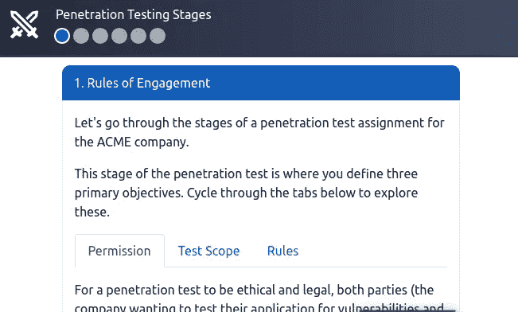
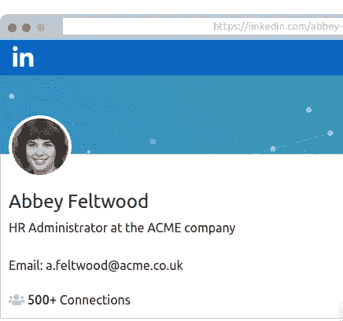
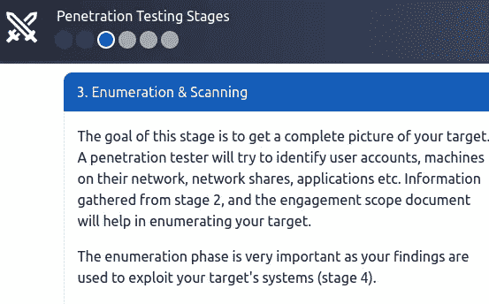

# Pentesting 基本面 Tryhackme

> 原文：<https://infosecwriteups.com/pentesting-fundamentals-tryhackme-717f51d6126b?source=collection_archive---------1----------------------->

大家好，了不起的黑客们今天我想出了另一个关于 Tryhackme 的有趣话题，它就是 pente sting foundation。

从这些文章中，你知道什么是 Pentesting，这些话题里面有什么，让它来试试这个。

渗透测试(也称为 pentest)是一种合乎道德的尝试，旨在挑战和分析现有的安全防御措施，以保护这些资产和信息。渗透测试与检查类似，包括使用与怀有恶意的人所使用的工具、技术和方法相同的工具、技术和方法。

> **您被允许对组织执行安全审核；你会是哪种类型的黑客？**

*Ans:白帽子*

这些黑客被视为“好人”。他们遵守法律，利用自己的能力帮助别人。例如，渗透测试人员代表公司执行授权合约。

> **如果你攻击一个组织并窃取其数据，你会是哪种类型的黑客？**

*Ans:黑帽*

这些人是犯罪分子，他们经常试图伤害组织或以牺牲他人为代价获得经济利益。例如，ransomware 的作者会用恶意代码感染设备，并将数据作为人质索要赎金。

> **哪份文件定义了渗透测试项目应如何实施？**

*Ans:交战规则*

ROE 是在渗透测试项目的早期阶段创建的文档。本文档分为三个主要部分(如下表中所述)，每个部分最终负责决定如何执行合约。你确实可以在 SANS 研究所在线查看这个文档的一个很好的例子。

> **渗透测试的哪个阶段涉及使用公开可获得的信息？**

*Ans:信息收集*

它用于使用公开可获得的信息收集信息。

> **如果你想为五旬节电信使用一个框架，你会使用什么框架？注意:我们在这里寻找的是首字母缩略词，而不是全名。**

*Ans: OSSTMM*

开源安全测试方法手册为网络安全的系统、软件、应用、通信和人的方面提供了一个全面的测试策略框架。
因为该方法主要涉及这些系统和应用如何通信，所以它包括用于:
电信(电话、VoIP 等)的方法。)

> **什么样的框架关注 web 应用程序的测试？**

*Ans: OWASP*

“开放 web 应用程序安全项目”框架是一个社区驱动的、频繁更新的框架，仅用于测试 Web 应用程序和服务的安全性。

> 您被要求测试一个应用程序，但无权访问其源代码——这是什么测试过程？

*Ans:黑匣子*

测试人员作为普通用户，测试应用程序或软件的功能和交互。该测试可以包括与界面(如按钮)的交互，并查看是否返回了期望的结果。这种类型的测试不需要编程知识或对程序的理解。

> **你被要求测试一个网站，你被允许访问源代码——这是什么测试过程？**

*Ans:白盒*

测试人员将完全了解应用程序及其预期行为，这将比黑盒测试花费更长的时间。在白盒测试场景中，全面知识提供了一种测试方法，确保整个攻击面都可以得到验证。

> **极致渗透试验**

在这个任务中，我们需要找到一面让我们看到演示的旗帜

我们想按照一些步骤来获得旗帜。

单击“下一步”,我们将进入信息收集步骤

一个人，Linkedin 个人资料显示在这里，电子邮件被披露

在枚举步骤之后，我收集了他们的 IP 地址并进行了扫描

枚举结束后，我进行了开发和后期开发模块终于到达了标志。

> 答:THM{PENTEST_COMPLETE}

# 🔈 🔈Infosec Writeups 正在组织其首次虚拟会议和网络活动。如果你对信息安全感兴趣，这是最酷的地方，有 16 个令人难以置信的演讲者和 10 多个小时充满力量的讨论会议。[查看更多详情并在此注册。](https://iwcon.live/)

 [## IWCon2022 - Infosec 书面报告虚拟会议

### 与世界上最优秀的信息安全专家建立联系。了解网络安全专家如何取得成功。将新技能添加到您的…

iwcon.live](https://iwcon.live/)