# 云中的测试:引入 AriaCloud

> 原文：<https://infosecwriteups.com/pentesting-in-the-clouds-introducing-ariacloud-58cb5cc1c50d?source=collection_archive---------3----------------------->

## 今天的天气预报说会有一个多云和红色的对手

## 用于远程测试的 Docker 容器


一个 [riaCloud](https://github.com/iknowjason/ariacloud) 是为远程测试而构建的 Docker 容器。从它的 Github [主页](https://github.com/iknowjason/ariacloud):

> Aria Cloud 是一个 Docker 容器，非常适合通过 SSH 或 RDP 进行远程测试，主要侧重于云安全工具，其次是活动目录工具。在需要通过 RDP 或 SSH 进行远程访问的情况下，将它用于假定的违规测试，或者用于简单的 AD 实验室测试。它是为需要使用 SSH 或 RDP 远程访问容器，然后运行其安全工作流(即云环境)的使用情形而构建的。该报告还包括一个自动化的 Terraform 模板+ Ansible 剧本，以部署 Aria Cloud 作为运行在 Ubuntu Linux 虚拟机上的容器，通过 RDP 远程访问。

在这篇文章中，我将快速介绍它是什么，并展示一个演示。完整的文档可以在[这里](https://github.com/iknowjason/ariacloud)找到。

**免责声明**:请不要将你在本文中学到的任何东西用于未经授权或非法的目的。在对网络运行此工具之前，请确保获得网络所有者的许可。

# 用例

B 除了有一个有趣的研究工具来试验 Docker 网络，我还想为以下用例开发一个基础设施测试工具:

1.  **云渗透测试工具:**一个 docker pentest 容器，包含了很多云安全 pentest 工具。这使得该容器对于以云为中心的安全评估非常有用。您可以随意派生、克隆它，并添加您想要的任何工具。
2.  **支持 RDP 和 SSH 的远程测试:** SSH 或 RDP 进入容器，通过内部局域网运行您的任务。该项目提供了两个独立的映像，它们是为使用 SSH 或 RDP 进行远程访问而预先构建的。该容器通过主机 IP 地址公开一个 SSH 或 RDP 服务，并且只需要一个 docker run 命令。RDP 配置使用 XRDP，并已被证实与微软 RDP 客户端和 Rdesktop linux 客户端配合良好。
3.  **假定违规渗透测试:**围绕“假定违规渗透测试”服务或“假定凭据泄露”服务的需求日益增长。特别是在新冠肺炎疫情，更换现场顾问是必不可少的。有了这个，评估员可能会运送一台笔记本电脑或一个小型机箱(例如，英特尔 NUC、System76 Meerkat)。pentest box 可以建立到 pentest 基础设施的持久 auto-ssh 反向外壳，避免入站 NAT 或防火墙问题。或者，他们可能只是使用客户端的 VPN，远程访问为 pentest 准备的虚拟机。这个 docker 容器可以帮助满足这些需求，但方式不同。客户端简单地安装 Docker，您为容器提供一些简单的运行时指令。然后，您可以通过 SSH 或 RDP 进入它，并访问客户端的网络。您甚至可以配置容器来运行到您的基础设施的自动 SSH 反向 SSH 隧道，或者(更简单的选项)使用 [ngrok](https://ngrok.com/) 来暴露防火墙后面的 RDP/SSH 隧道。与运送硬件或装载虚拟机相比，容器更加轻量、灵活和便携。
4.  **云培训实验室或网络靶场:** AriaCloud 支持使用 Terraform 模板在 Azure 中自动部署。它也包含在活动目录网络[范围](https://github.com/iknowjason/juliart)中。您可以在自己的云环境中使用它进行训练和攻击模拟。

但是这与其他 docker 容器和虚拟化安全工具有什么不同呢？我很高兴你问了这个问题，因为我总是喜欢在决定构建新的东西之前对现有的工具做一些研究。首先，进攻性安全部门的优秀人员已经并将继续用 Kali Linux 做出惊人的成绩。大声喊出来，向那些人脱帽致敬。所以这个容器是建立在 Kali Linux 上的，当然:-)如果你需要的话，Azure 和 Amazon 市场上都有 Kali Linux VM。

AriaCloud 支持 RDP，它是一个 docker 容器。如果您还没有玩过容器，它们非常灵活、可移植，而且功能强大。它包含了包中的所有依赖项，可以轻松快速地共享或定制。还有几个其他社区 pentesting 码头集装箱。这款产品的不同之处在于，它打包了许多云评估工具，并且还支持远程 RDP，这与其他产品略有不同。您可以用一个命令运行它，而不必在启动支持远程访问的服务之前先连接到控制台。SSH 或 RDP 服务自动启动，XRDP 配置已经调优并与容器捆绑在一起。提供 Kali Linux 菜单是显而易见的，不仅仅是对喜欢 GUI 的人。问题是有一些我喜欢的图形数据库工具，比如需要 Neo4J 的 Bloodhound。新的 RoadTools Azure 评估工具在 localhost 上使用 web 浏览器，因此该功能对于其他需要在 localhost 上使用本地 UI 的基于浏览器的工具来说非常好。

# 图像中包含的工具

*   元包:kali-linux-core、kali-linux-top10、kali-desktop-core
*   xRDP 和 SSH(用于远程访问)
*   socat，powershell 7，smbclient
*   AWS cli 工具(AWS、s3cmd)
*   Azure cli 工具(az)
*   谷歌云平台 cli 工具(gcloud，kubectl)
*   道路工具([https://github.com/dirkjanm/ROADtools](https://github.com/dirkjanm/ROADtools))
*   风暴观察者(【https://github.com/Azure/Stormspotter】T2
*   童子军套件(【https://github.com/nccgroup/ScoutSuite】T4
*   云 _ 枚举([https://github.com/initstring/cloud_enum](https://github.com/initstring/cloud_enum))
*   cloud mapper([https://github.com/duo-labs/cloudmapper](https://github.com/duo-labs/cloudmapper))
*   桶流([https://github.com/eth0izzle/bucket-stream](https://github.com/eth0izzle/bucket-stream))
*   帕库([https://github.com/RhinoSecurityLabs/pacu](https://github.com/RhinoSecurityLabs/pacu))
*   维达尔([https://github.com/carnal0wnage/weirdAAL](https://github.com/carnal0wnage/weirdAAL)
*   邪恶-winrm([https://github.com/Hackplayers/evil-winrm](https://github.com/Hackplayers/evil-winrm))
*   Impacket Python 库和工具([https://github.com/SecureAuthCorp/impacket](https://github.com/SecureAuthCorp/impacket))
*   尼奥 4j([https://neo4j.com/](https://neo4j.com/))
*   猎犬号(【https://github.com/BloodHoundAD/BloodHound】T2
*   猎犬(【https://github.com/DefensiveOrigins/PlumHound】T4
*   Fox-IT Bloodhound-python 数据入口([https://github.com/fox-it/BloodHound.py](https://github.com/fox-it/BloodHound.py))
*   git leaks([https://github.com/zricethezav/gitleaks](https://github.com/zricethezav/gitleaks))
*   shh git([https://github.com/eth0izzle/shhgit](https://github.com/eth0izzle/shhgit)
*   吉特罗布([https://github.com/michenriksen/gitrob](https://github.com/michenriksen/gitrob))
*   松露猪([https://github.com/dxa4481/truffleHog](https://github.com/dxa4481/truffleHog))
*   探秘([https://github.com/Yelp/detect-secrets](https://github.com/Yelp/detect-secrets))
*   风疹([https://github.com/GhostPack/Rubeus](https://github.com/GhostPack/Rubeus))
*   米米卡茨([https://github.com/gentilkiwi/mimikatz](https://github.com/gentilkiwi/mimikatz)

# 浏览在 RDP 支持下构建它的演示

现在是有趣的事情。让我们展示一个在 RDP 支持下部署它的演示。在这个例子中，我们将从我的 Docker Hub 容器注册中心下载它，并在 RDP 用例中运行它。我目前正在安装了 docker 的 Ubuntu Linux 20.04 虚拟机上运行这个测试。

**步骤 1:** 发出 docker pull 命令，从容器存储库中下载它:

```
docker pull iknowjason/aria-rdp:latest
```

拉取完成后，它应该是这样的:

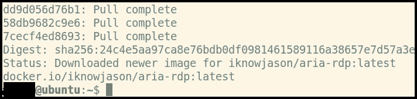

步骤 2: 发出这个命令来运行它。这将绑定 RDP 端口，并在运行 Docker:

```
docker run -d --name myname2 -p 3389:3389 iknowjason/aria-rdp:latest
```

**步骤 3:** 验证监听端口:

```
docker port myname2
```

结果应该是这样的:

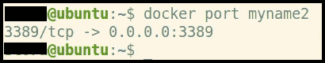

**步骤 4:** 获取您的 Docker 主机的 IP 地址，该地址将用于 RDP 客户端。在我的例子中，我运行的是带 NAT 的 Ubuntu 虚拟机，我的虚拟机主机实际上是 Windows 10。我会 RDP 到 Ubuntu 虚拟机访客的 NAT IP 地址。

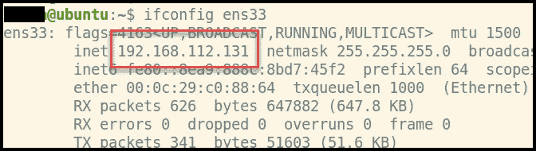

**第 5 步:**使用您的 RDP 客户端将 RDP 放入容器，让神奇的事情发生。在这种情况下，我使用如下所示的 ***mstsc*** :

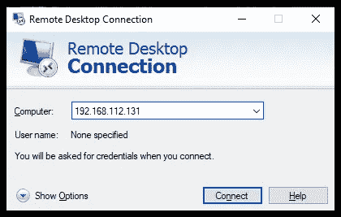

选择“是”接受默认证书。

RDP 提示符将如下所示。

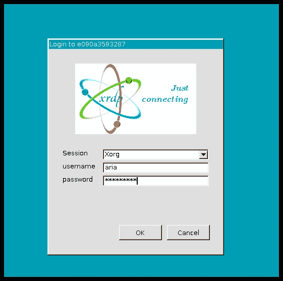

**用户名:**咏叹调

**密码:**！aria123！

认证后，你会看到几个小错误(在我的任务列表上)，但之后你会看到一个漂亮的 Kali Linux 菜单:

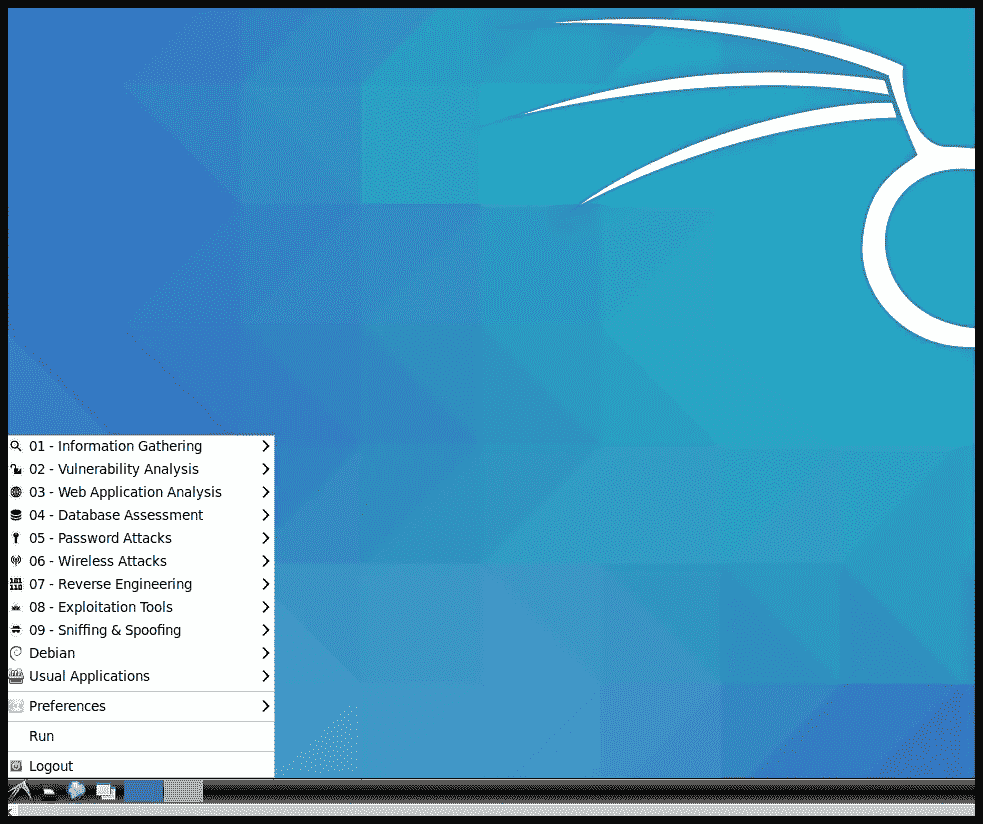

大多数工具都被安装到一个标准的 ***/usr/local/bin*** 路径中。对于一些特殊的工具，它们被安装到 ***/opt*** 目录中，如下图所示:

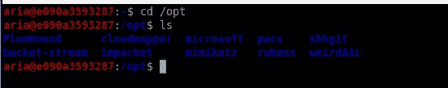

# Azure 广告:道路工具

Dirk-jan [Mollema](https://dirkjanm.io/introducing-roadtools-and-roadrecon-azure-ad-exploration-framework/) 创建了一个名为 ROADTools 的 Azure AD pentesting 框架和库。我非常喜欢这个工具和 Azure pentesting，所以我将使用 AriaCloud 快速浏览一下 ROADTools。容器捆绑了这个非常好的工具。请注意，Azure pentesting 工具是新生事物，这个特定的工具相对较新。

**步骤 1:** 使用正确的选项向 Azure 租户帐户进行身份验证。在我的实验中，我启用了 MFA，所以我使用了设备代码身份验证流程。这会将 authtoken 写入 ***。roadtools_auth*** ，如下图。按照说明进行操作，并使用您的 web 浏览器进行身份验证。

```
roadrecon auth --device-code
```

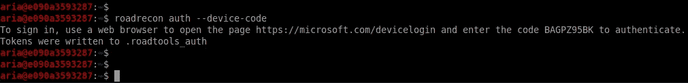

**第二步:**运行 road tools*命令同***road recon***。这将转储我们稍后将探索的所有 Azure 对象。如果您使用了设备代码身份验证，请指定要使用的文件—令牌文件。*

```
*roadrecon gather --tokenfile .roadtools_auth*
```

*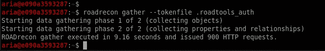*

***步骤 3:** 验证工作目录中创建的 roadrecon.db 文件。*

*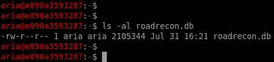*

***第 4 步:**启动 ROADRecon GUI 并浏览数据。确保运行指定的命令来打开在步骤 2 中创建的 roadrecon.db 文件。*

```
*roadrecon-gui --database roadrecon.db*
```

*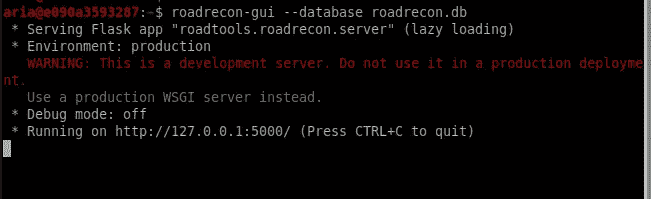*

***第五步:**启动火狐浏览器，导航到 [http://127.0.0.1:5000。](http://127.0.0.1:5000.)探索数据。*

*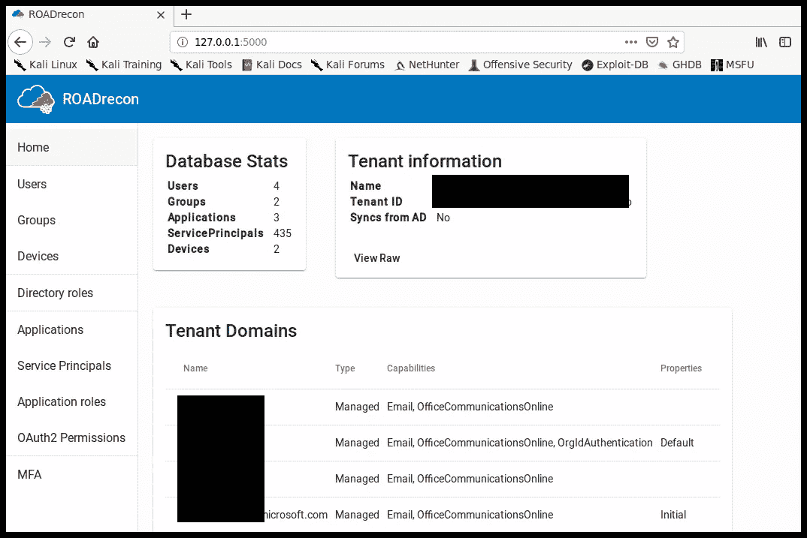*

# *后续步骤*

1.  *Kubernetes 工具*
2.  *修复初始认证后的小 RDP 错误*
3.  *修复 Mac OS RDP 客户端黑屏(微软远程桌面)*
4.  *用于 AWS 部署的 Terraform 模板*

# *结论*

*感谢您阅读本文，我希望您能像我喜欢调试和创建它一样喜欢这个工具。集装箱是未来。网络安全容器的使用案例将继续增长。叉起来！克隆它！让我知道未来用例的任何想法。*