# 测试 iOS|从 iOS 模拟器 Corellium 开始并重新签名 IPA

> 原文：<https://infosecwriteups.com/pentesting-ios-starting-with-ios-emulator-corellium-re-signing-ipa-9ce3cbd19721?source=collection_archive---------0----------------------->

[Corellium](https://corellium.com/) 在我们开创性的安全研究平台 CORSEC 上为个人账户提供了**基于 iOS 的虚拟设备。 [Corellium 的 iOS 设备可能越狱也可能不越狱](https://support.corellium.com/hc/en-us/articles/360053569554-Introduction-to-iOS-Devices)，可以用于安全研究。**

Corellium 是一个高级 iOS 模拟器，可以在上面运行和测试 iOS 应用程序。虽然没有应用程序商店的支持，我们可以通过重新签名直接安装应用程序。
这篇博客讨论了在 **Corellium** 上的 iPhone X 模拟器上安装应用程序(IPA)的多种重新签名方法。
**有多种方法可以重新签署 IPA，下面提到的方法不需要开发者帐户。**

# 让我们开始吧。

1.  首先，我们需要从页面下载 VPN 文件，并将其连接到专用网络。这有助于我们进入与模拟器相同的网络。

> 要下载 VPN 文件，点击 OVPN 文件。

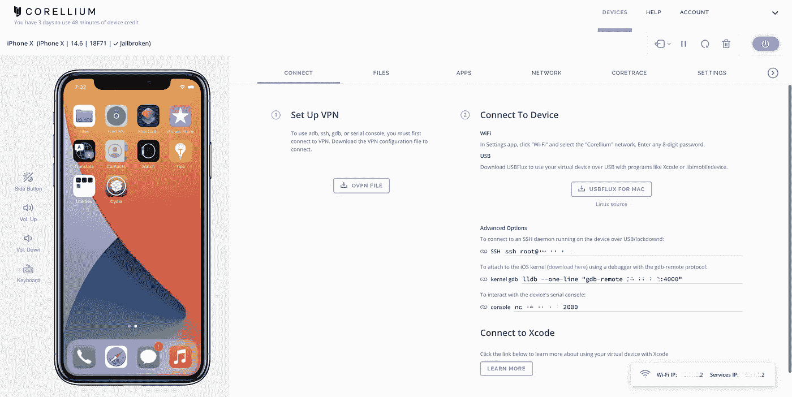

2.连接到 **Corellium VPN** ，它会在 10.x.x.x 范围内分配一个私有 IP。

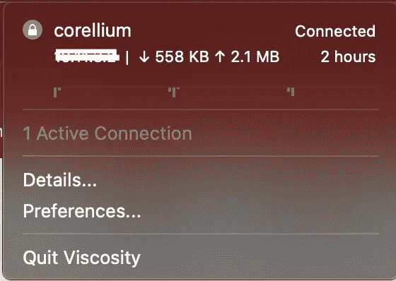

3.我们试着通过下载 IPA 来安装[geosnow](https://github.com/GeoSn0w)创建的 [Myriam iOS 安全 App](https://github.com/GeoSn0w/Myriam) 。

4.点击应用程序并选择安装。

> 我们将尝试直接上传未签名的 IPA

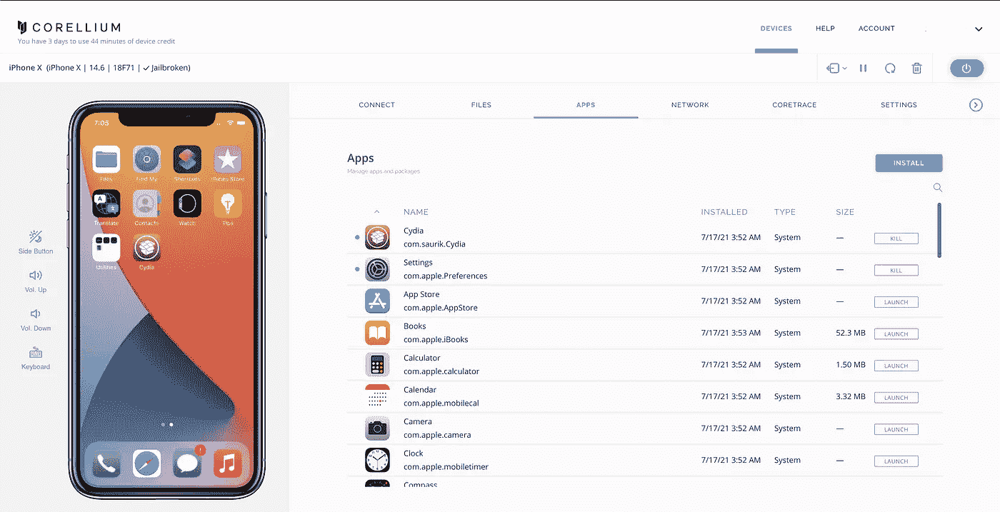

5.直接从 release 下载 IPA。

```
#wget [https://github.com/GeoSn0w/Myriam/raw/master/IPA%20Releases/Myriam%20Beta%204.0.ipa](https://github.com/GeoSn0w/Myriam/raw/master/IPA%20Releases/Myriam%20Beta%204.0.ipa)
```

6.如我们所见，我们有一个新下载的 IPA。

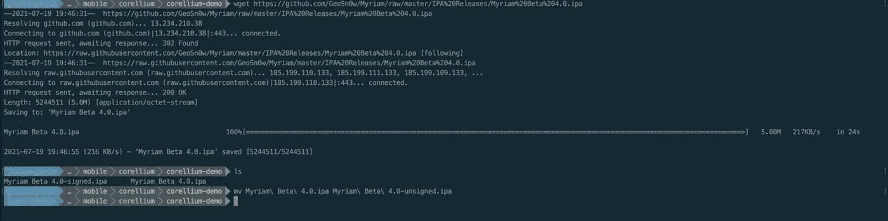

7.出于演示目的，我们可以将其重命名为 unsigned。点击安装并选择 IPA 文件。

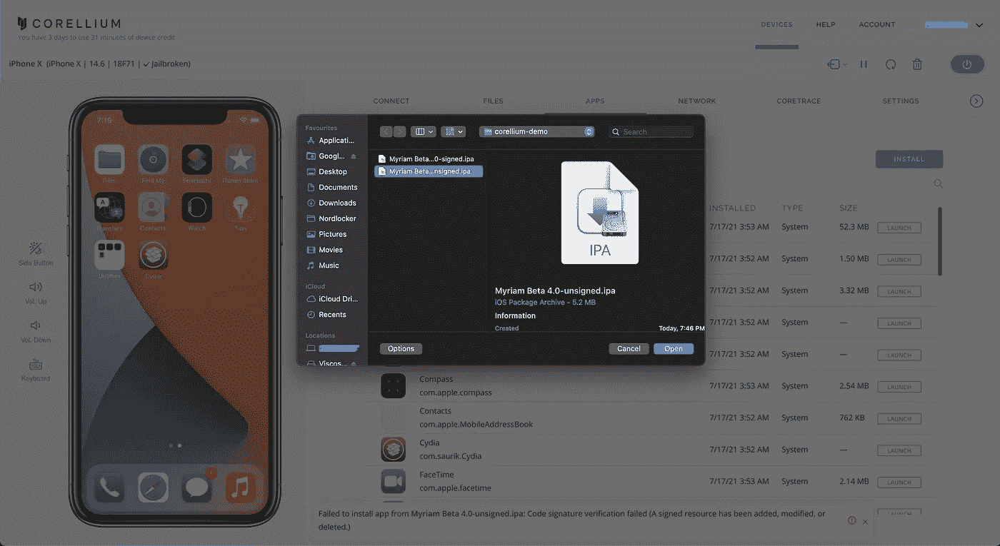

8.检查底部的错误，无法安装 Myriam Beta 4.0-unsigned.ipa 的应用程序。

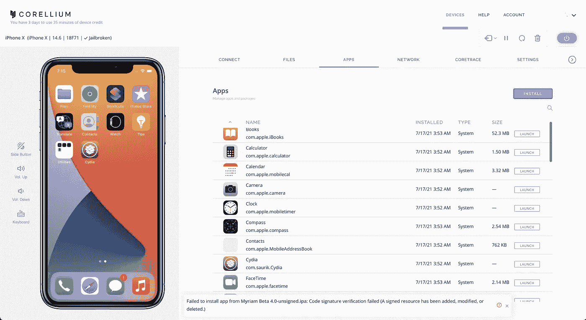

9.我们通过 iOS App Signer 来签名吧。你可以从[这里](https://github.com/DanTheMan827/ios-app-signer)下载。

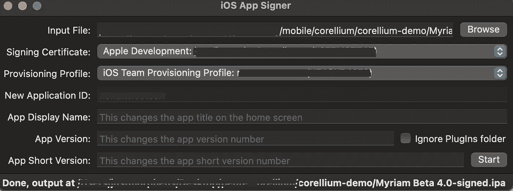

l

10.在输入文件中选择 IPA，并确保您有签名证书和预置描述文件。我们现在有一个已签名的 IPA 文件。

> 如果出现错误，只需打开 Xcode 并在偏好设置中添加帐户。

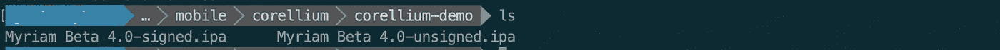

11.让我们上传文件并检查错误:

```
Failed to install app from Myriam Beta 4.0-signed.ipa. Code signature verification failed. Note: Above mentioned error and this error is different.
```

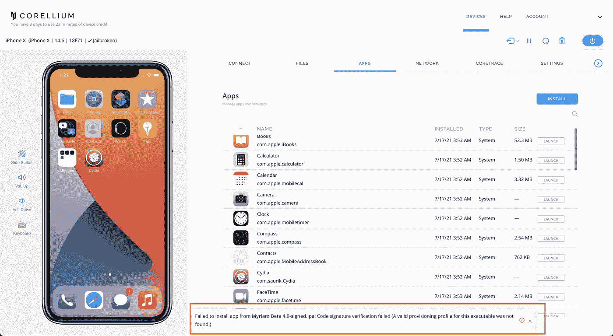

12.现在让我们使用[异议](https://github.com/sensepost/objection/wiki/Patching-iOS-Applications)来修补 IPA 并上传。

```
objection patchipa --source Myriam\ Beta\ 4.0-unsigned.ipa --codesign-signature XXXXXXXXXXXXXXXXXX -P ~/Library/MobileDevice/Provisioning\ Profiles/XXXXXXXXXXXXXXXX.mobileprovision
```

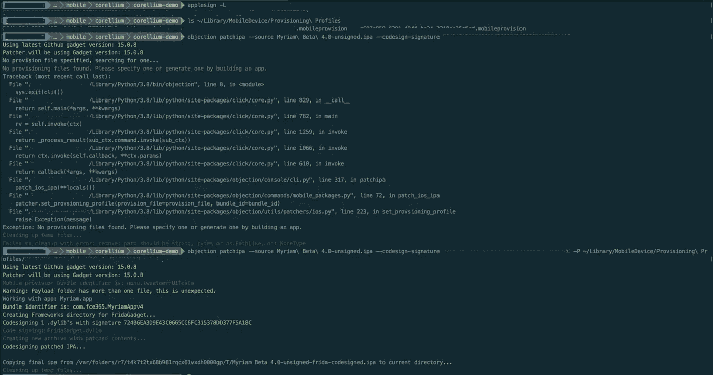

13.将新代码签名的 IPA 文件上传到仿真器。

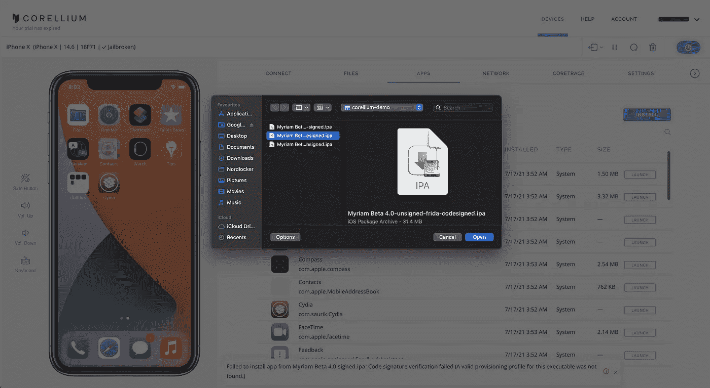

14.检查错误:

```
Failed to install app from Myriam Beta 4.0-signed.ipa. Code signature verification failed.
```

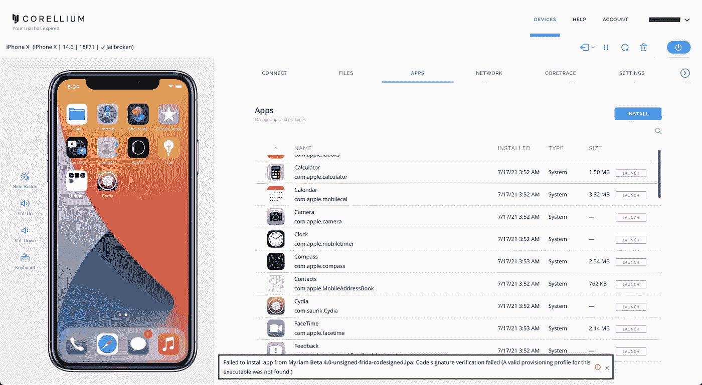

15.运行下述命令，检查已安装的**配置文件**和**签名**。

> 对于共同签名:
> 
> `applesign -L`
> 
> [用于配置文件](https://stackoverflow.com/questions/12059608/list-installed-mobile-provisioning-profiles):
> 
> `cd ~/Library/MobileDevice/Provisioning\ Profiles && ls`

16 .现在让我们使用 [applesign](https://github.com/nowsecure/node-applesign) ，它是 NodeJS 模块和命令行实用程序，用于重新签署 iOS 应用程序(IPA 文件)。

```
applesign -i xxxxxxxxxxxxxxxxxxxxxxx Myriam\ Beta\ 4.0-unsigned.ipa -m ~/Library/MobileDevice/Provisioning\ Profiles/xxxxxxxxxxxxxxxxxxxxxx.mobileprovision
```

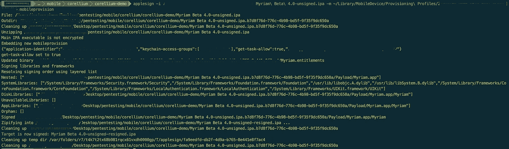

17.检查与上面相同的错误。


18.然后我从 [Reddit](https://www.reddit.com/r/jailbreak/comments/jcs93x/help_appsync_unified_ios_14/) 开始了解 AppSync Unified。**可以禁用 ios app 签名验证。**

> 我添加了 cydia repo 并安装了 AppSync Unified。

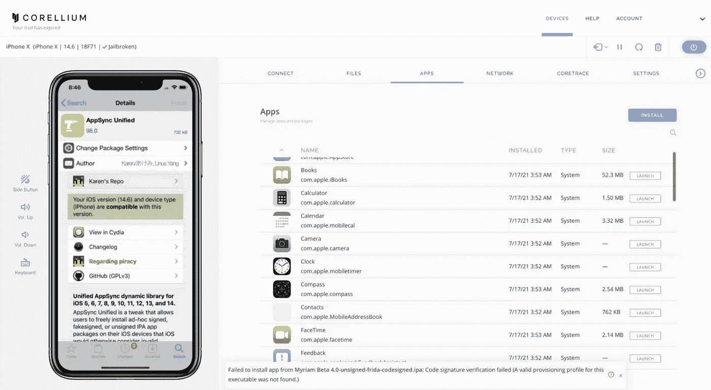

19.将未签名的 IPA 直接上传到模拟器。

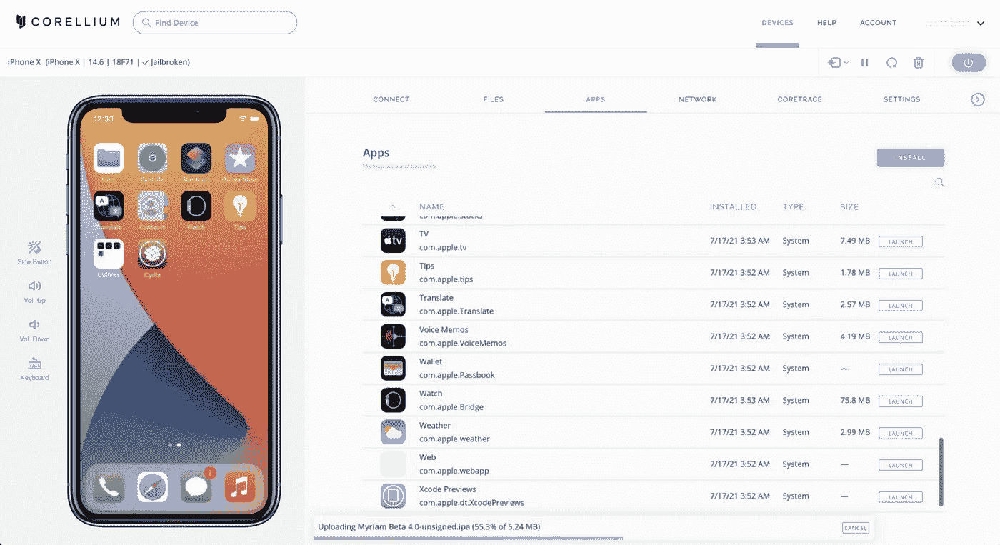

20.IPA 已成功安装在模拟器上。


21.让我们尝试访问应用程序，不管它是否工作。

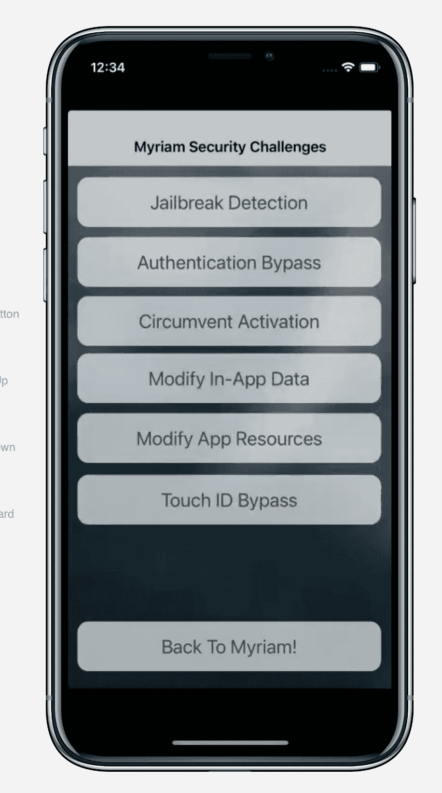

22.另一种安装 Myriam 的方式是直接通过 [Cydia](https://cydia.saurik.com/) 。

***注意:这不是 Corellium 官方博客，如果要使用模拟器请联系 Corellium 团队。***

***还可以在***[](http://www.saurik.com/id/8)*上阅读更多关于签约的内容*

# *参考资料:*

*[https://kubadownload.com/news/appsync-unified/](https://kubadownload.com/news/appsync-unified/)*

*[https://medium . com/xc notes/IOs-应用程序-验证-失败-d806d83ffdae](https://medium.com/xcnotes/ios-application-verification-failed-d806d83ffdae)*

*[https://github . com/sense post/objection/wiki/Patching-iOS-Applications](https://github.com/sensepost/objection/wiki/Patching-iOS-Applications)*

*[https://github.com/DanTheMan827/ios-app-signer](https://github.com/DanTheMan827/ios-app-signer)*

*[**http://www.saurik.com/id/8**](http://www.saurik.com/id/8)*

*[https://www . Reddit . com/r/jail break/comments/jcs 93 x/help _ app sync _ unified _ IOs _ 14/](https://www.reddit.com/r/jailbreak/comments/jcs93x/help_appsync_unified_ios_14/)*

*[https://corellium.com](https://corellium.com/)*

*[](https://defparam.medium.com/ios-app-testing-through-burp-on-corellium-fe59ed849516) [## 在 Corellium 上通过打嗝进行 iOS 应用测试

### 介绍

defparam.medium.com](https://defparam.medium.com/ios-app-testing-through-burp-on-corellium-fe59ed849516) [](https://www.buymeacoffee.com/justmorpheus)*