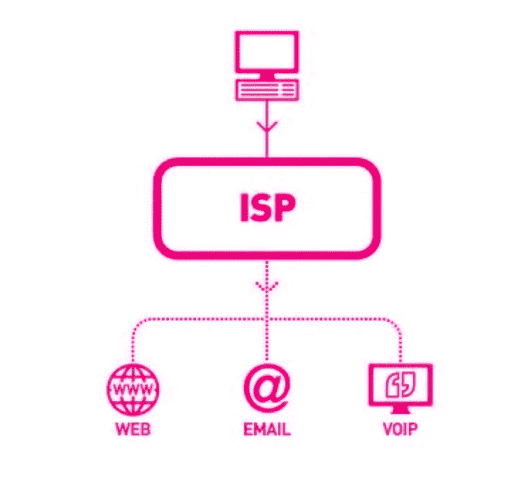
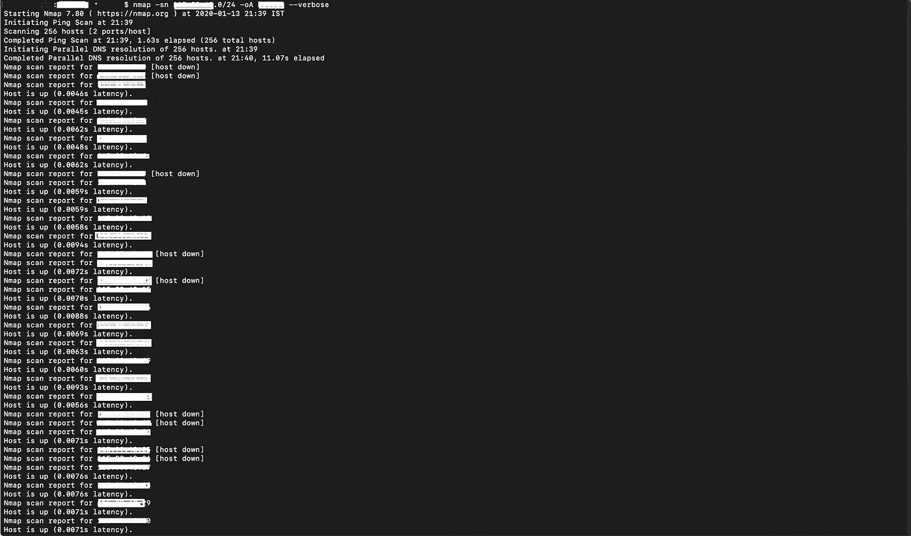
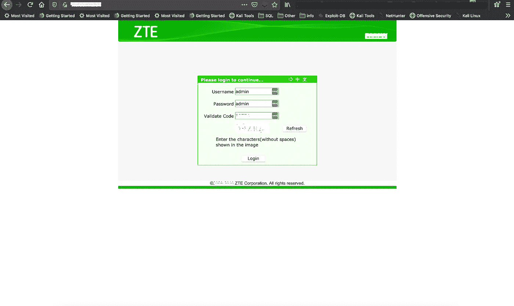
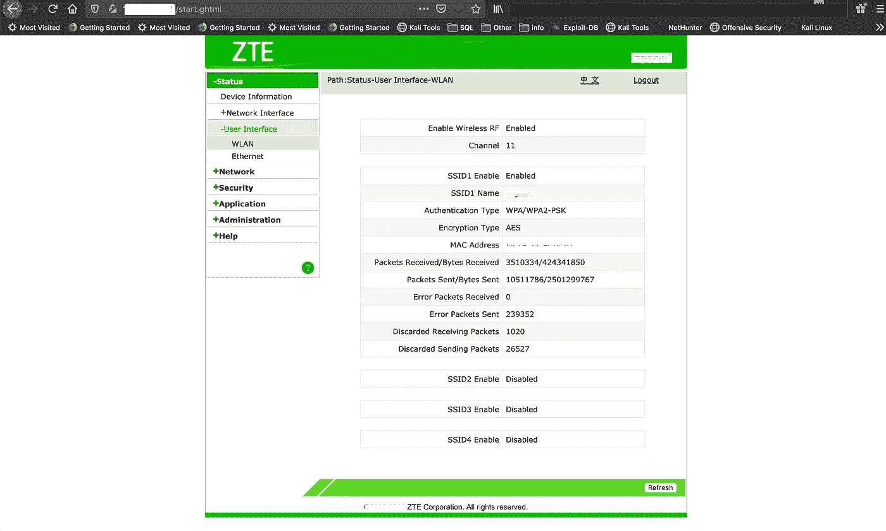
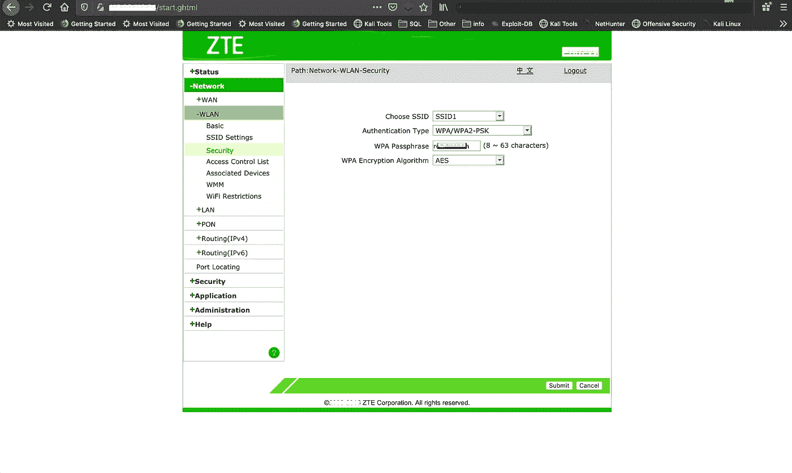
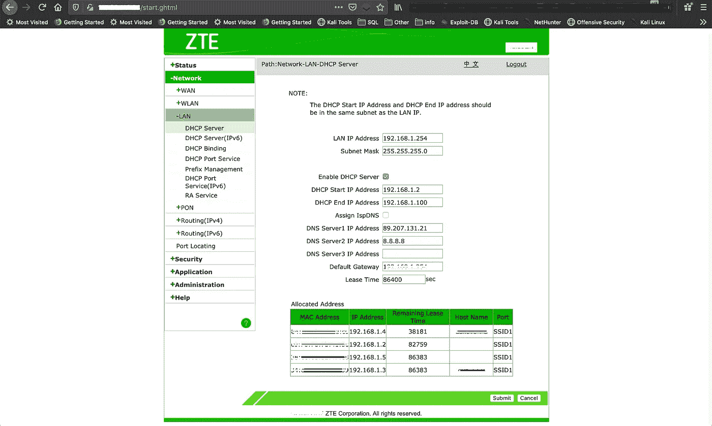

# 测试 ISP 101 |我如何入侵和修复我的 ISP

> 原文：<https://infosecwriteups.com/pentesting-isp-101-how-i-hacked-fixed-my-isp-643e9201f7e9?source=collection_archive---------0----------------------->

这篇博客是关于我使用的 ISP 配置错误的问题。在 Shodan 上工作时，我发现 **ISP** 将 WiFi 调制解调器/路由器留有公共 IP 和默认密码。这可能导致恶意攻击者对多个 ISP 客户进行黑客攻击。我试着通过推特联系他们。
没有一个用户受到剥削或困扰。数据被屏蔽，仅用于 POC 和报告目的。

[信用](https://www.itrelease.com/wp-content/uploads/2010/12/ISP.jpg)

# 描述:

有一个**路由器**/调制解调器的登录**页面**将出现在 192.168.1.1，然后我不知道我的路由器控制台的用户名或密码。作为一名安全工程师，我输入了 admin/admin，我在路由器内部。我登录到我的路由器的管理控制台(192.168.1.1)，直接进入显示互联网连接的页面( [PPPOE](http://techterms.com/definition/pppoe) )。在广域网状态下，它显示网关地址。网关 IP 地址是的 IP 地址，所有 internet 流量都通过它路由到外部网络。我开始扫描，但后来我看到公共 IP 分配给我的路由器/调制解调器。我复制并打开了它。我可以看到同样的路由器控制台。然后，我启动了 nmap，对整个范围进行了 ping 扫描。我发现了多个活跃的 IP。令我惊讶的是，所有的路由器都可以公开访问。然后，所有这些路由器都有一个版本，其版本与我的路由器相似，然后我通过 admin/admin 登录。之后，我使用 shodan 并输入所有分配给路由器的公共 IP，令我惊讶的是，我只能找到容易受到错误配置的路由器版本，从而简化了我的攻击面，我可以看到所有设备及其密码等。很容易改变他们的 DNS，使用手机密码喷雾和路由器密码，等等。

我试图通过 Twitter 联系 ISP，但当我向 cert-in 报告该问题时，没有任何响应，问题已经解决。

> 也有可能使用他人的凭证直接连接到服务器，并通过存储在路由器连接页面的 ISP 凭证获得互联网连接。

# 影响:

此漏洞的影响很大，因为任何恶意实体都可以使用公开可用的结果，并通过登录 WiFi 调制解调器/路由器来利用所有客户。

> 作为分配给调制解调器的公共 IP，具有登录面板的默认凭证，由于中兴路由器，通过 192.168.1.1 访问，具有默认的管理员/管理员密码。任何人都可以登录到调制解调器，窃取数据，毒害和改变 dns，以执行基于 DNS 的攻击，影响通过设备连接的所有用户。
> 
> **执行 ping 扫描- >查找正常运行的路由器- >通过管理员/管理员登录- >利用受害者。**

1.  攻击者可以通过默认用户名密码(即 admin/admin)登录，查看密码和设备，并使用 Nmap 将其公开。
2.  攻击者可以找到 wifi 调制解调器的 SSID，如果在 SSID 或密码中使用，还可以获得用户的个人详细信息(如手机号码等)。
3.  向攻击者毒害 DNS 网关 DNS 可导致基于大型网络钓鱼的攻击，从而通过大量攻击窃取银行凭证以及社交网络凭证。
4.  它会完全接管受害者的无线调制解调器。

# 易受攻击的 URL:

[http://Public-IP-Address/start . ghtml](http://192.168.1.1/start.ghtml)

# 复制步骤:

1.  通过 ifconfig 和 route -n 检查您的本地 IP 和调制解调器网关。
2.  通过 Nmap 运行 [ping sweep](https://www.binarytides.com/ping-sweep-network-nmap/) 命令。

nmap ping 扫描

3.保存 IP 并打开 IP 列表。这也可以自动化。

4.打开公共 IP 后，会出现可访问的路由器登录页面。

使用公共 IP 地址登录

5.然后尝试默认路由器凭证(admin/admin)。

Wifi 认证面板

6.嘣！我们在别人的设备里。

WIFI 密码

7.检查受害者的连接设备和其他详细信息。

受害者的设备

8.同样在 [shodan.io](http://shodan.io) 中搜索这些 IP 会给你路由器的名称和型号。

Shodan 搜索结果

9.搜索路由器的默认用户名和密码，即 admin/admin。

10.攻击者可以转储这些数据或公开发布这些数据，还可以利用这些数据来嗅探流量，甚至尝试密码喷射攻击。

# 补救措施:

*   不允许网络中的 ping 扫描。
*   更改所有 WiFi 调制解调器的默认凭据。
*   基于公共 IP 的访问应仅限于 ISP 的 IP，因此不允许任何其他 IP 通过端口 80 访问。

在下一篇教程中，我们将看到其他攻击和通过多种工具和 python 脚本实现的进一步自动化。

> 此问题已通过 cert-in 报告给 ISP，也通过 Twitter 联系了 ISP，但他们没有回应。

终于过了一段时间，我收到了一封关于这个问题的邮件。
无论如何，问题已经解决，这是一个好消息。

> 免责声明:所有提供的信息仅用于教育目的。本页面上与道德黑客和信息安全相关的信息无意被恶意/非法使用，作者对所提供信息的任何误用概不负责。
> 如果您是 ISP，请在问题被利用之前测试并修复它。

