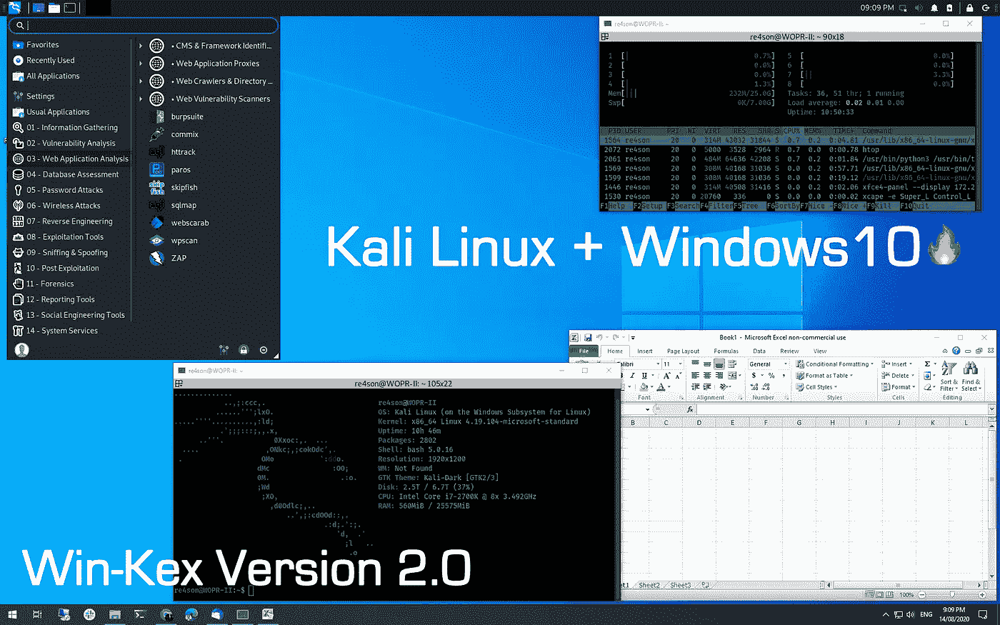
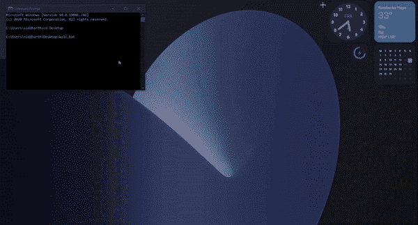

# Windows 上的 Pentesting

> 原文：<https://infosecwriteups.com/pentesting-on-windows-f88bbe455f7b?source=collection_archive---------1----------------------->

Kali 2020.3 来了！在本文中，我们将使用 Windows Subsystem for Linux (WSL 2)和**win-kex**(Kali Desktop Experience for Windows)安装 Kali Linux，并将其与其他虚拟化软件进行比较。

我已经盼了很久了。我检查的最后一个发行版是 Arch，我喜欢它，但是我用了 25 秒来启动，而我的 windows 只用了 5-7 秒。我用了一段时间，然后再次切换回 windows。我是从 Kali Linux 上知道这个新特性 [**Win-KEX**](https://www.kali.org/docs/wsl/win-kex/) 的。这里有一个简短而精确的教程，教你如何设置它。这就是我们最终会得到的结果。



Kali Linux WSL2 的实际应用

**安装:**

*   检查 windows 版本。你可以在启动菜单中搜索 Winver 来查看。应该是**Windows 2020 年 5 月 10 日(2004)，Windows 2019 年 5 月 10 日(1903)，或者 Windows 2019 年 11 月 10 日(1909)** **或者更晚。**
*   现在我们必须启用 WSl(Linux 的 windows 子系统)，这可以通过**打开和关闭 windows 功能**来完成。或者通过在 Powershell(admin)中运行此命令，需要重新启动。

```
dism.exe /online /enable-feature /featurename:Microsoft-Windows-Subsystem-Linux /all /norestart
```

*   从同一菜单中启用虚拟机功能，或者您可以使用 power shell 命令“需要重新启动”来执行此操作。

```
dism.exe /online /enable-feature /featurename:VirtualMachinePlatform /all /norestart dism.exe /online /enable-feature /featurename:Microsoft-Windows-Subsystem-Linux /all /norestart
```

*   下载新的 Linux 内核更新包[链接](https://wslstorestorage.blob.core.windows.net/wslblob/wsl_update_x64.msi)安装就好。
*   从微软商店下载 Kali Linux 并创建一个用户。
*   打开 cmd 并运行这个命令，将刚刚下载的 kali Linux wsl1 转换为 wsl2。

```
wsl.exe --listwsl.exe --set-version kali-linux 2
```

这将需要 4-5 分钟的时间。现在，在您的 windows 机器(大小:500mb)中，一个最小的 kali Linux 运行在一个完整的 Linux 内核上。现在我们必须安装一些软件包。在 kali 上运行以下命令。

```
sudo apt update && sudo apt install -y **kali-win-kex**
```

> **无需升级**。

更新后，它将安装 **kali-win-kex 包**包的大小约为 1 GB，安装后总 kali 大小将为 3–4gb。大约需要 10-20 分钟，因为它正在上面安装一个轻量级桌面环境 **XFCE** 。当这一切完成后，请重新启动计算机。

> 在 Kali 终端上运行 **Kex** 命令，它将要求设置密码。

瞧吧！现在你可以在 GUI 上使用卡利语了。现在你可以在上面安装所有你喜欢的工具了。

**故障排除:**

*   更新错误: `The following signatures were invalid: EXPKEYSIG`

```
wget [https://archive.kali.org/archive-key.asc](https://archive.kali.org/archive-key.asc) -O /etc/apt/trusted.gpg.d/kali-archive-key.asc
```

*   运行 Kex 命令给出错误: ***请尝试“kex start”来启动服务。如果服务器无法启动，请尝试“kex kill”或重启 WSL2 会话并重试。***

```
vncserver --localhost no && kex --win -s
```

**温馨提示**:

1.  用这个命令(***vncserver—localhost no&&kex—win-s***)创建一个 start.sh 文件，并在 home 文件夹中给它可执行的权限。
2.  现在用这个(**wsl-d kali-Linux bash/home/kali/start . sh**)命令创建一个. BAT 文件。当你运行 bat 文件时，它会打开 kali 并运行 start.sh，这将打开 kali 窗口。

**与虚拟机箱的比较& VMWARE:**

```
PARAMETERS       WSL2         VIRTUAL BOX         VMWARE
BOOT TIME:       5 sec          15-20 sec         15 sec
SIZE:            5 GB           15 GB             15 GB
RAM:             1-2 GB         2 GB              2 GB
SNAPSHOT:        NO             YES               YES
```

未来:我正在为 Arch Linux 做类似的项目。

## **如果这篇文章有帮助，请点击拍手👏按钮下面几下，以示你对作者的支持！⬇**