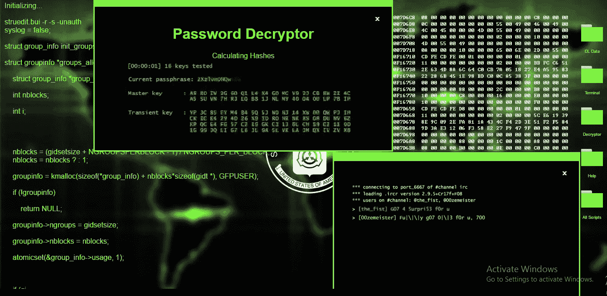

# Pentesting:相关性、十大工具等等

> 原文：<https://infosecwriteups.com/pentesting-the-relevance-top-10-tools-and-more-b15a7e70ed9f?source=collection_archive---------1----------------------->

什么是 pentesting？ Pentesting 是一种允许对计算机系统或网络进行的模拟网络攻击，旨在识别安全漏洞并提高组织的安全态势。测试活动的[主要动机是在黑客之前发现系统漏洞并修复它。Pentesters 也被称为道德黑客，他们通过在其他人之前指出并利用他们的计算机系统中的安全漏洞来帮助组织。在这篇文章中，我们将看到](/getting-started-with-penetration-testing-and-dealing-with-everyday-mood-and-motivation-d1cc96d8b531)[与 pentesting](/day-13-introduction-to-pentesting-100daysofhacking-bc44550e8548) 的相关性，十大渗透测试工具及其解释，pentester 的良好属性，学习 pentesting 的资源，以及印度将雇佣 pentester 的 pentesting 公司。

# 测试的相关性

在当前网络威胁增加的情况下，pentesting 变得比以往任何时候都更加重要。组织正在他们的计算机系统和网络上存储越来越多的数据，这推动了网络安全威胁的增长。黑客们一直在寻找侵入这些系统并获取这些有价值数据的方法。Pentesting 有助于组织在黑客之前发现系统中的任何安全漏洞并修复它们。通过这种方式，pentesters 帮助组织避免代价高昂的数据泄露和网络攻击的其他负面后果。

# 十大测试工具及说明

可用于 pentesting 的工具因被测试系统的类型而异，但有一些通用工具在大多数情况下都会用到。以下是印度[十大测试工具列表](https://www.getastra.com/blog/security-audit/top-pentest-tools-in-india/)，以及每个工具的简要说明:

1.  **Burp Suite:** Burp Suite 是[执行 web 应用](/how-was-my-first-web-application-penetration-test-d18fdd78d2d5)安全测试的综合平台。它具有非常有效和受欢迎的所有功能。

**2。Astra 的 Pentest** :这个工具非常适合对软件、应用程序和网站进行 Pentest 和漏洞扫描。该工具提供了内置的手动和自动测试以及漏洞管理仪表板。

**3。Metasploit:**[Metasploit](https://en.wikipedia.org/wiki/Metasploit_Project)是一个开发和执行漏洞利用代码的框架。它包含一个针对不同平台和漏洞的大型数据库。

**4。Nmap:** Nmap 是一个网络探测工具，可以用来扫描网络和主机的漏洞。

**5。Wireshark:** Wireshark 是一个[网络流量分析器](/carnage-network-traffic-analysis-with-wireshark-5fe97e530499)，可以用来记录和分析数据。

**6。Kali Linux:** 渗透测试发行版又称为 [Kali Linux](/day-1-installing-kali-linux-100daysofhacking-eeb5954e0837) 。这是一个基于 Debian 的操作系统，设计用于取证和渗透测试。它预装了许多对测试活动有用的工具。

**7。Aircrack-ng:** Aircrack-ng 是一个无线网络安全应用程序，可用于解密 WEP 和 WPA 密钥。

**8。开膛手约翰:**开膛手是一个密码破解工具，可以用来检查你所有的选项。

9。Ophcrack : Ophcrack 是另一个使用彩虹表破解密码的密码破解工具。

10。SQLmap: 当你扫描网站漏洞时，你可能会利用 SQLmap 来利用 [SQL 注入漏洞](/how-i-found-a-sql-flaw-on-an-online-medical-store-1edfc29fed91)。

如上所述，有几种测试工具。

# 好性格的特征

在一个好的 pentester 中，一些重要的属性是:

**-分析和逻辑思维:** Pentesters 需要能够进行分析和逻辑思维，以识别系统中的安全弱点。

创造力:创造力在测试中很重要，因为它可以帮助测试者想出利用漏洞的新方法。

**-关注细节:**关注细节很重要，这样才能发现所有的小细节，而这些小细节可以在一次测试中产生巨大的影响。

**-耐心:**耐心很重要，因为有些测试可能需要很长时间才能完成，在这个过程中不要放弃也很重要。

# 学习测试的资源

如果你对学习 pentesting 感兴趣，网上有很多资源。下面列出了一些最好的方法:

**-Pentestit:** Pentestit 是一个提供免费 pentesting 在线课程的网站。

**-Hackthebox:** Hackthebox 是一个提供挑战的网站，可以用来学习测试技巧。

**-Pentester Academy:**[Pentester Academy](https://www.pentesteracademy.com/)是一个提供 pentesting 视频课程的在线平台。

# 印度将雇佣圣灵降临者的圣灵降临公司

印度有几家公司提供测试服务。下面列出了一些最好的方法:

**-Appsecco:** Appsecco 是一家总部位于班加罗尔的安全公司，提供测试服务。

**-Securelayerseven:**Securelayerseven 是一家位于孟买的安全公司，提供测试服务。

**-Indusface** : Indusface 是一家位于德里的安全公司，提供测试服务。

# 结论

这些只是印度提供测试服务的一些测试公司。还有很多，所以如果你有兴趣从事测试行业，一定要做好调查，找到适合你的公司。感谢阅读！我希望这篇文章有助于理解 pentesting 的相关性以及学习 pentesting 可用的顶级工具和资源。干杯！