# 以合法方式执行侦察的工具

> 原文：<https://infosecwriteups.com/perform-reconnaissance-the-legal-way-osint-80c159b1402a?source=collection_archive---------0----------------------->

## 被动信息收集技术

*注意:尽管本文中提到的一些被动工具是完全合法使用的，但它仍然可能违反一些组织的政策。因此，在尝试任何侦察之前，一定要确保得到他们的同意。*

[https://diva dilemma . WordPress . com/2012/08/23/diva-detective/](https://divadilemma.wordpress.com/2012/08/23/diva-detective/)

> [开源情报(OSINT)](https://en.wikipedia.org/wiki/Open-source_intelligence) 是在公共领域和互联网上公开的个人或组织的数据集合。

**OSINT 用于网络杀伤链的早期侦察阶段。**

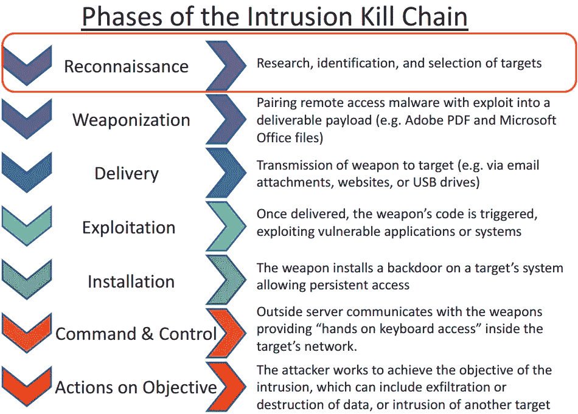

# 侦察阶段:

1.  **足迹** -被动侦察
2.  **扫描** -主动侦察
3.  **枚举**——利用被动+主动的结果获取更多信息，了解攻击面的规模。

> ***在这里，我将主要关注可以合法进行的足迹活动。***

[**OSINT 框架**](https://osintframework.com) 分类列出了**被动和主动工具**可以在侦察阶段使用以获取 OSINT 资源。

# 跟踪足迹的工具——被动侦察

以下是一些可用于被动侦察的工具。

## 谷歌多金

谷歌呆子技术只是搜索过滤器

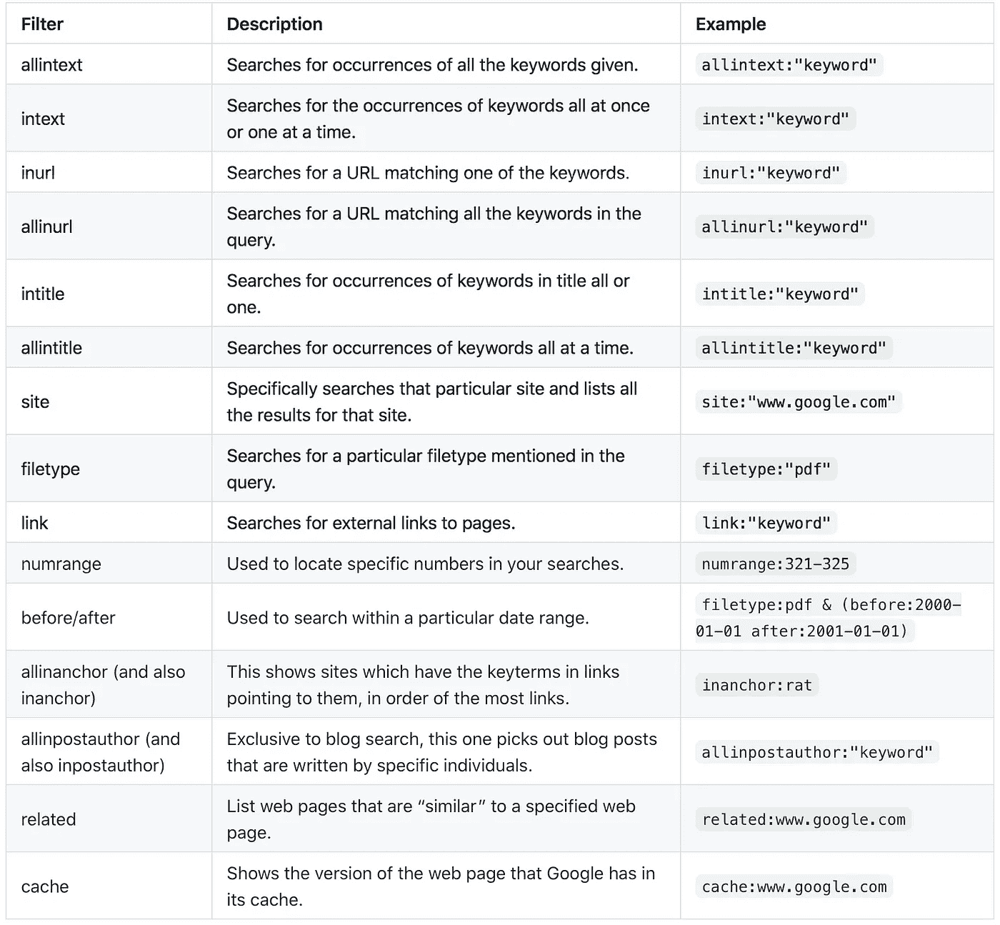

[https://gist . github . com/sundown dev/283 efaddbcf 896 ab 405488330 D1 BBC 06](https://gist.github.com/sundowndev/283efaddbcf896ab405488330d1bbc06)

## Whois 查找

输出域名所有权详细信息

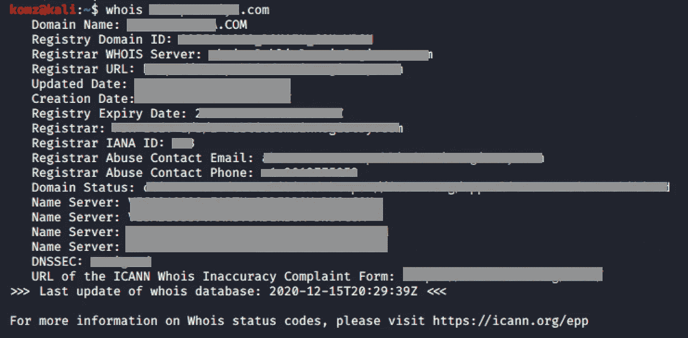

## 用`nslookup | dig | host`查询 DNS 服务器

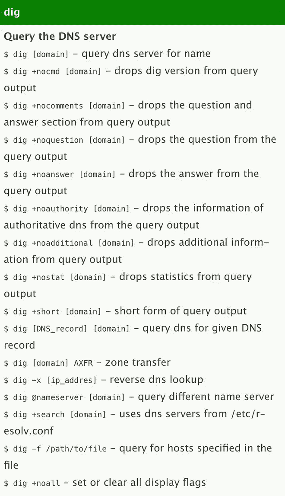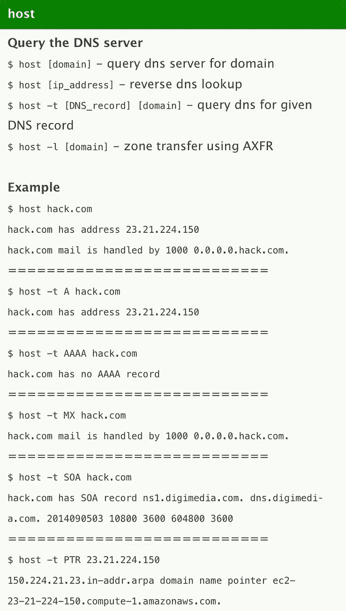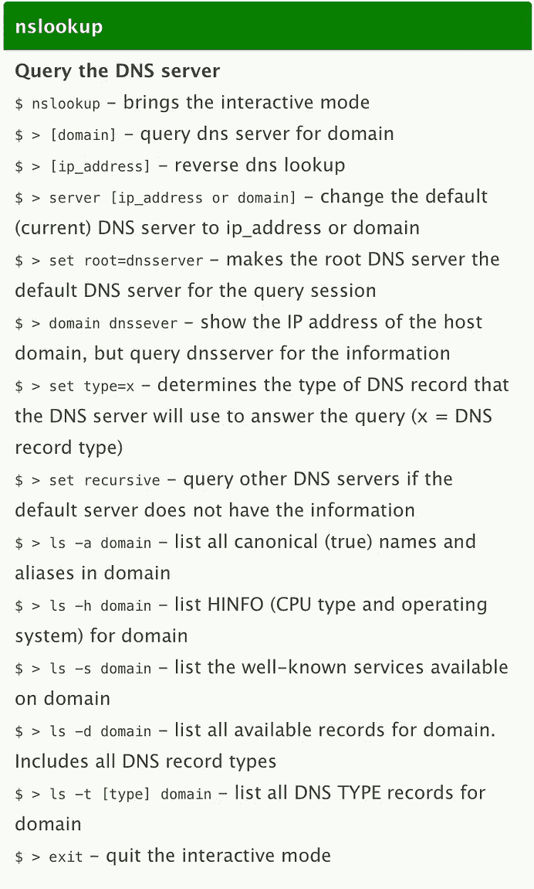

[https://cheatography.com/janek/cheat-sheets/dns/](https://cheatography.com/janek/cheat-sheets/dns/)

## [Shodan.io](https://www.shodan.io)

物联网设备的搜索引擎

## [积累](https://github.com/OWASP/Amass) -被动子域搜索

发现给定域名的子域`amass enum -passive -d owasp.org -src`

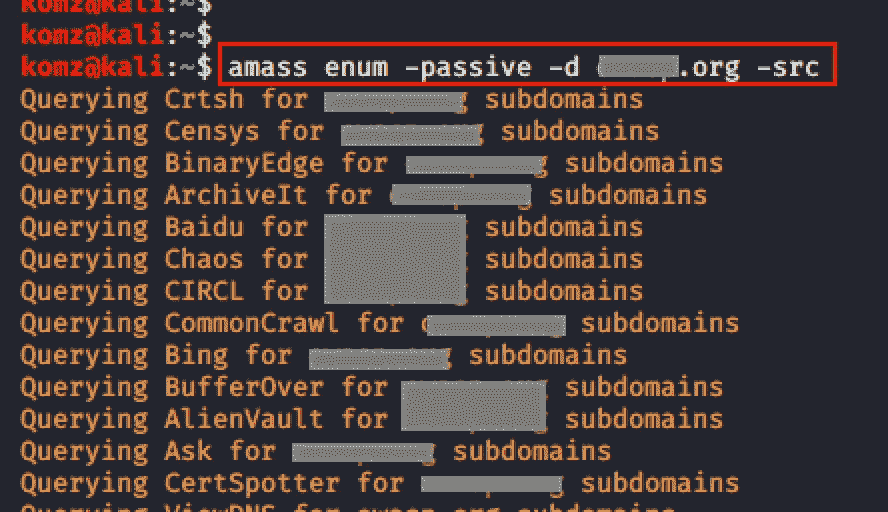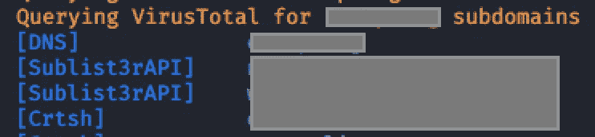

## [重新确认](https://github.com/s0md3v/ReconDog)

基本信息采集的列表如下所示。

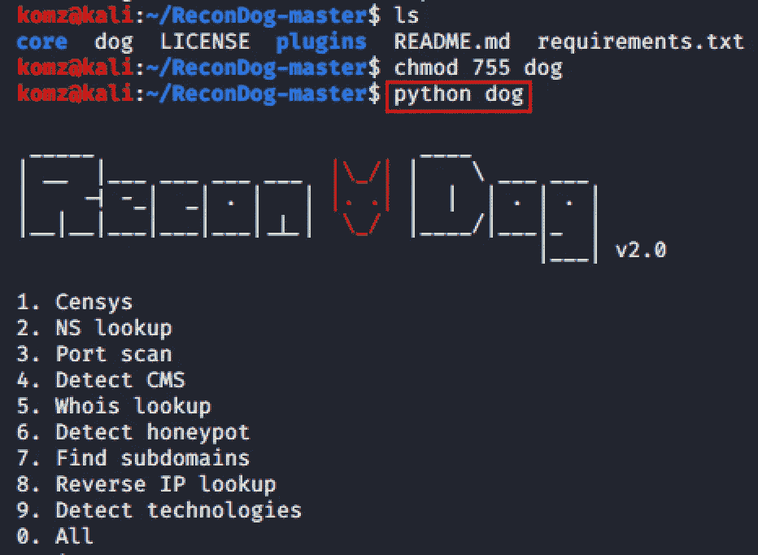

## [P0F](https://tools.kali.org/information-gathering/p0f) -被动交通足迹

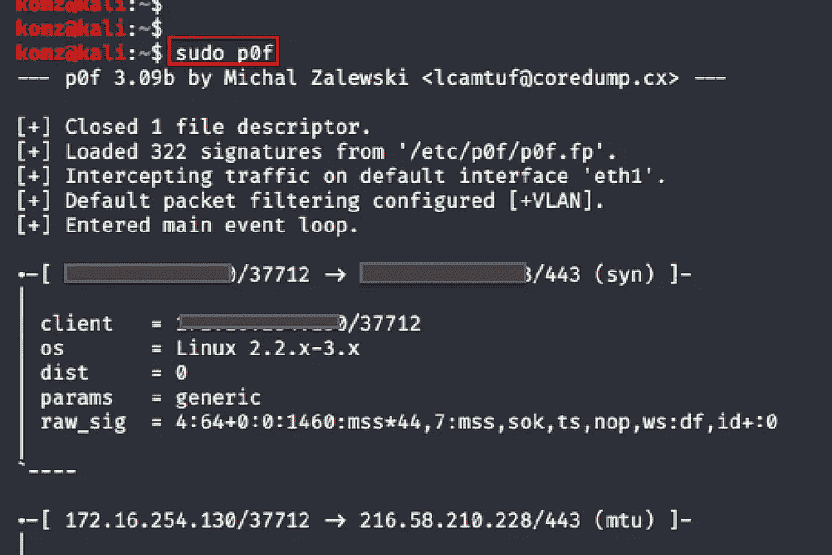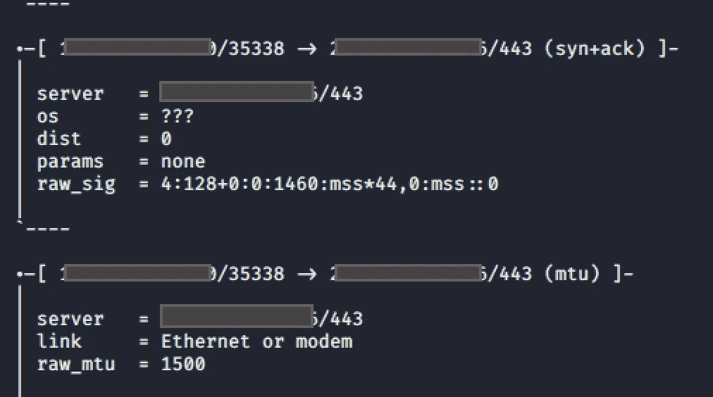

## Web 公共可用内容

`$ wget -r - -reject index.html - -no-parent [http://domain-name/](http://domainname/)`

## 其他工具

[**Recon-ng**](https://github.com/lanmaster53/recon-ng)**-**一个半被动的全功能 web 侦察框架。

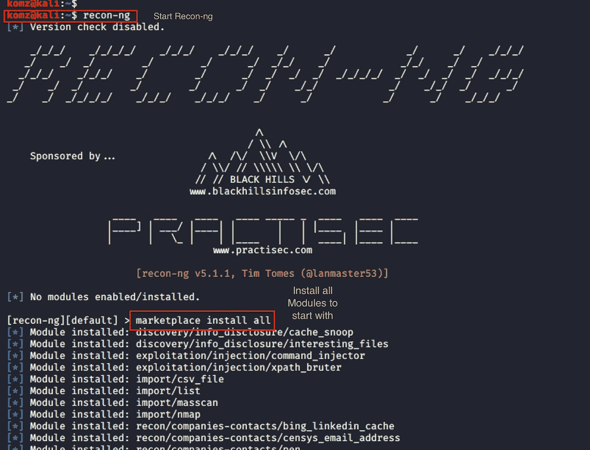

Wireshark -网络流量嗅探器

**网络挖掘器** -网络流量嗅探器

Flag Fox -一个 firefox 插件，显示服务器位置、域名国籍和其他地理位置信息。

Sputnik -一个 firefox 插件，使用免费开源智能(OSINT)资源右键搜索 IP、域、文件散列和 URL

**收割机**——从不同的公共来源收集信息，如电子邮件、子域名、主机、员工姓名、开放端口和横幅。

*最后更新:2020 年 12 月 17 日*