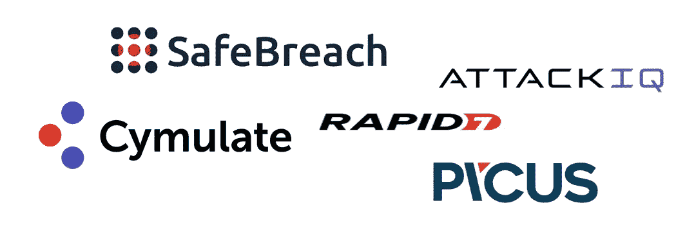
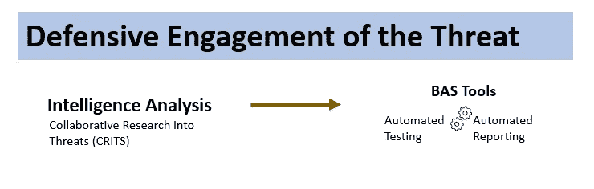
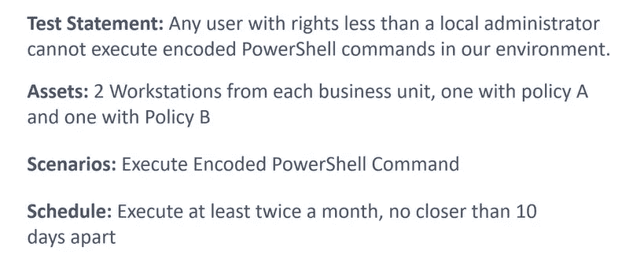
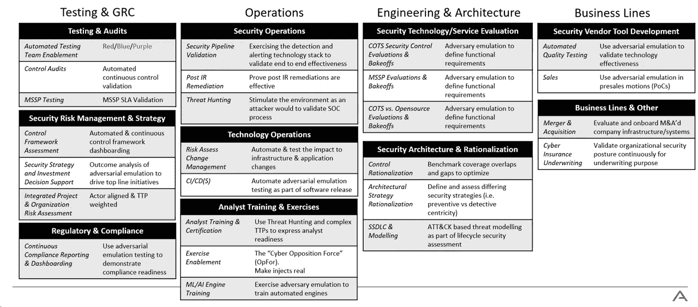
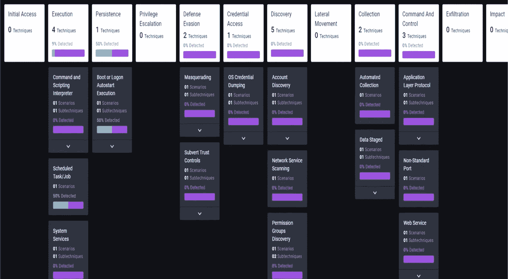
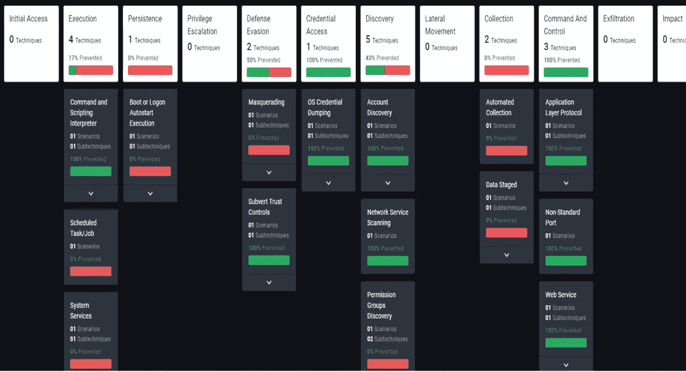

# 使用违规和攻击模拟(BAS)工具执行安全差距分析

> 原文：<https://infosecwriteups.com/performing-security-gap-analysis-using-breach-attack-simulation-bas-tools-3717f482cec6?source=collection_archive---------3----------------------->

## 持续测试和审计-紫色团队活动

# BAS 概述

BAS 是一种高级安全测试方法。它旨在确定组织的现有安全控制是否检测到攻击并做出应有的响应，以改善组织的安全状况。

一些 BAS 平台包括:

下图显示了在 BAS 工具中执行情报分析期间观察到的攻击者行为，以及操作员为进行安全差距分析而观察到的响应。

[https://infosecwriteups . com/operationaling-mitre-att-CK-to-harden-cyber-defenses-ba9f 6852228 f](/operationalizing-mitre-att-ck-to-harden-cyber-defenses-ba9f6852228f)

## 为什么我们需要 BAS 工具？

BAS 工具通过主要使用 MITRE 框架对企业基础设施持续进行完整的攻击周期模拟来帮助执行差距分析。该测试通常由紫色团队在*“威胁通知防御*”策略中进行，该策略包括 3 个要素:

*   网络威胁情报分析
*   威胁的防御战
*   重点共享和协作

# 紫色团队

紫色团队通过协调和联合红色和蓝色团队的活动，最大限度地提高防御能力，以保护最重要的资产。

# 评估差距分析的设计

## 1.识别威胁

*   使用米特 ATT 和 CK 网站来识别可能针对您的垂直行业的威胁团体
*   使用米特 ATT 和 CK 导航器绘制已知威胁集团使用技术和软件。

## 2.进行测试

*   **创建测试语句**(将你的问题与一个假设结合起来，形成一个测试语句)。检查你的测试陈述是否符合任何 MITRE 技术和策略。
*   **根据测试陈述(操作系统、安全控制、用户等)确定您环境中用于差距分析测试的资产**。
*   **决定场景**运行。*这应该是迭代的。场景=单元测试。*
*   **安排测试**(考虑本地或远程资产测试、测试可用性、对用户的影响？，多久进行一次测试？等等)

AttackIQ Academy 示例摘录

## 3.减轻

*   联络 IT/安全运营部
*   使用 BAS 工具详细报告
*   确定发现的差距是否可以由只需要调整的现有策略或工具覆盖。

## 4.报告和迭代

*   重新运行评估并查看结果
*   使用 BAS 工具差异报告
*   继续添加新的资产和场景

# **部署 BAS 工具**

*   **使用代理** -利用您环境中的单个资产来执行测试，然后将结果发送到 BAS 服务器。它也更容易部署
*   **使用虚拟-** BAS 工具代理在虚拟实验室环境中使用，使用实验室组件模拟生产网络；无代理部署也是一个选项，通过重放数据包来观察环境如何响应
*   **使用服务**——这不需要部署。外部云服务模拟或重放针对一个目标或一系列目标的攻击或行为。它通常专注于利用漏洞。

# 安全控制验证程序的 BAS 模拟

## 测试方法:

*   **行为模拟** -一种生产安全方法，它将攻击者行为(开发前&开发后活动)作为单元测试而不是有效载荷来重现。
*   **行为重放** -生产非安全方法，重放攻击者行为，通常来自数据包捕获。
*   **恶意软件引爆** -一种生产不安全的方法。类似于沙盒，但侧重于安全控制的响应能力，而不是了解恶意软件的运行方式。针对虚拟测试实验室环境运行恶意软件样本，以了解您的安全控制对攻击的响应程度。
*   **基于服务的测试**——使用多种方法的组合，可能包括人工组件；理解范围内/范围外以及测试的频率是至关重要的。

# BAS 使用案例

从 AttackIQ Academy 中提取的用例

两个众所周知的使用案例是:

## 持续安全验证用例

此使用案例用于验证贵组织现有的安全控制策略，以确保其部署正确。该流程包括为您的资产选择现有的单个安全控制，创建或使用现有的 BAS 单元测试模板来运行目标控制，执行这些测试并分析结果。

## 质量保证测试用例

**验证:**安全控制、操作系统策略和其他本机控制。差距分析的质量保证测试可应用于:

*   黄金图像测试
*   部署新服务器

# 结果

下面是使用 BAS 工具+ MITRE 框架的 purple 团队练习的 AttackIQ 结果示例。[*attack IQ*](https://www.attackiq.com/)*是一个安全优化平台，提供自动化的安全控制验证。*

检测分数

预防得分

**最后，减少并重新验证控制差距！**

# 相关文章

*   [实施米特 ATT & CK 强化网络防御](/operationalizing-mitre-att-ck-to-harden-cyber-defenses-ba9f6852228f)

## 来自 Infosec 的报道:Infosec 每天都有很多内容，很难跟上。[加入我们的每周简讯](https://weekly.infosecwriteups.com/)以 5 篇文章、4 条线索、3 个视频、2 个 GitHub Repos 和工具以及 1 个工作提醒的形式免费获取所有最新的 Infosec 趋势！