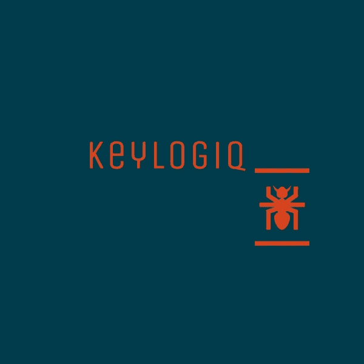

# 持久的 Windows 10 和 11 键盘记录器(keylogiq)

> 原文：<https://infosecwriteups.com/persistent-windows-10-and-11-keylogger-keylogiq-eada8f2dbf9c?source=collection_archive---------0----------------------->

在这篇文章中，我将向你描述我是如何为 Windows 10 和 11 创建不可检测的键盘记录器的。首先，如果键盘记录器已经存在，为什么我决定创建我自己的工具。嗯，我找不到任何，其中包括一些额外的功能，如每隔 X 分钟通过电子邮件发送结果，我想。此外，最重要的是，我找不到一个有持久选择权的人。因此，只要计算机重新启动或打开，键盘记录器将再次开始记录。对我来说，创建一个工具也很重要，这个工具可以选择升级攻击，比如添加键盘抓取器、后门等。

然而，由于这个工具主要是为了教育和娱乐而设计的，所以我并不关心它在记录特殊字符方面有多准确。我找到了用 C++写的源代码，并进行了测试。它工作得很好，所以我决定进一步实现其他东西。也许你会问为什么我决定使用用 C++编写的键盘记录程序，而不是用 python。嗯，当我们谈论文件扩展名时，我认为 C++是最合适的。用 C++编译的代码。exe 扩展，默认在 windows 下可执行，而 python 给你扩展。py，需要在 windows 机器上预装 python 来执行。当然，也有将 python 代码转换成 exe 文件的方法，但是很多时候，效果并不好，至少对我来说是这样。

以下是键盘记录器的源代码:

目前，我已经介绍了键盘记录器。下一步是实现通过电子邮件发送结果。我试图用 C++在键盘记录器中实现这个功能，但不幸的是我失败了。用 C++已经够令人沮丧了，所以我决定在 powershell 脚本上实现这个函数，无论如何我需要用它来设置 persistent。下面是用 powershell 编写的部分代码，它每 600 秒发送一封带有附件(Records.txt)的电子邮件，其中键盘记录器记录击键的结果。这是重复的，直到键盘记录器的过程是积极的。

此外，我创建了**主批处理文件**，其中包含了后续函数。它在后台 powershell 脚本中启动，将【keylogger.exe】、 **Records.txt** 、 **ps_mail.ps1** 和 **persistent.bat** 文件下载到特定的文件夹中并执行流程。所有文件都存放在 **Users\(用户名)\AppData\Local\Temp** 中，只有 persistent.bat 文件存放在引导时自动启动的文件所在的位置 **(Users\(用户名)\ AppData \ Roaming \ Microsoft \ Windows \ Start Menu \ Programs \ Startup)**。

下面是 main.bat 的代码:

和 persistant.bat 看起来是这样的:

原来如此。我做了一个不可检测的持久键盘记录器，可以在 Windows 10 和 Windows 11 中工作。有时你需要在发送邮件前重启你的 Windows 系统，但是不要担心，它会从头开始记录所有的按键，这样你在重启后就能收到邮件。

你可以在 [**我的 Github 库**](https://github.com/pr0xy-8L4d3/keylogiq) 中找到这个现成的键盘记录器。