# pfSense 首次安装和配置

> 原文：<https://infosecwriteups.com/pfsense-first-install-and-configuration-869f8508e087?source=collection_archive---------0----------------------->

一段时间以来，我一直想安装和尝试一个比通常的基于 Debian 的发行版的 UFW 更完整的开源防火墙，所以今天我们将看到如何在虚拟环境中安装和配置 pfSense，我们将做一些测试。

pfSense 是一款基于 FreeBSD 的**开源**防火墙，支持它的公司也转售硬件版本，面向个人和企业公司，此外还有 AWS 和微软 Azure 的云版本。
这款防火墙拥有许多经典功能(作为付费产品)，例如:*状态数据包检测、GeoIP 阻止、反向代理、VLAN、VPN、NAT、第 7 层应用检测、深度数据包检测*等等。

在他们的网站上找到更多信息:[https://www.pfsense.org/](https://www.pfsense.org/)

# 建立实验室

该实验室将有 3 台虚拟机，一台使用 Xubuntu 的桌面虚拟机，一台使用 Ubuntu (CLI)的服务器，以及一台将托管我们的 **pfSense** 防火墙的虚拟机，所有这些都由 VirtualBox 管理。

这是我们的网络:

*   带有两个网络的虚拟机防火墙( *pfSense* ):一个 NAT 和一个内部网络(无互联网)
*   只有内部网络的虚拟机桌面( *Xubuntu* )
*   只有内部网络的虚拟机服务器( *Ubuntu* )

防火墙的 NAT 网络在 10.0.2.0/24 上，并且将是唯一可以访问互联网的网络。内部网络将保持在 192.168.0.0/16。

以下是 pfsense 防火墙的默认登录凭据:

```
user: admin
password: pfsense
```

有关 pfSense 安装过程的更多信息，请访问以下链接:[https://docs . net gate . com/pf sense/en/latest/config/setup-wizard . html](https://docs.netgate.com/pfsense/en/latest/config/setup-wizard.html)

# pfSense 安装

在我们的虚拟机中挂载 pfSense ISO 并启动。这将是我们看到的第一个屏幕:

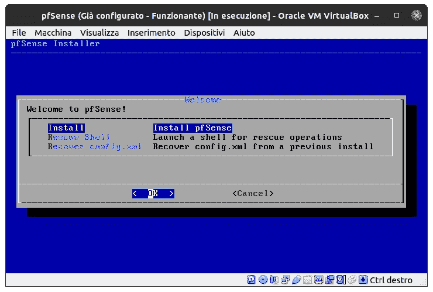

第二步要求您选择一个键映射来正确映射键盘。

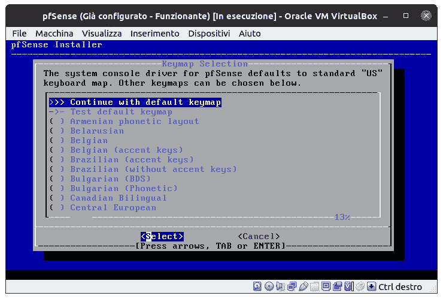

第三步是关于硬盘分区，如果你没有特别的需要，让它自动进行，并根据你给虚拟机的设置选择 UEFI 或 BIOS:

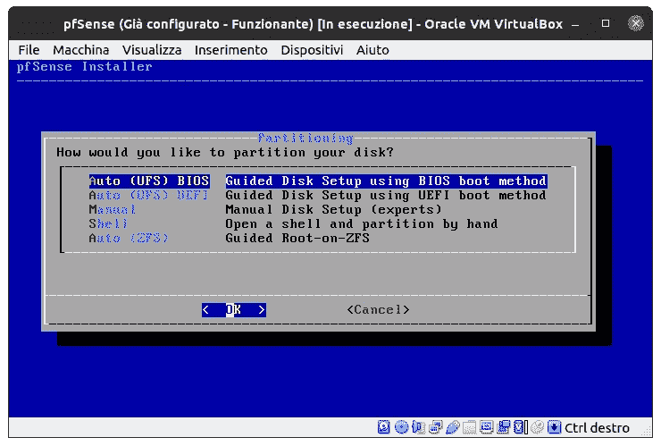

几分钟后，安装将通过此屏幕完成，让我们继续并重新启动虚拟机。


这是重启后运行的 pfSense 防火墙:

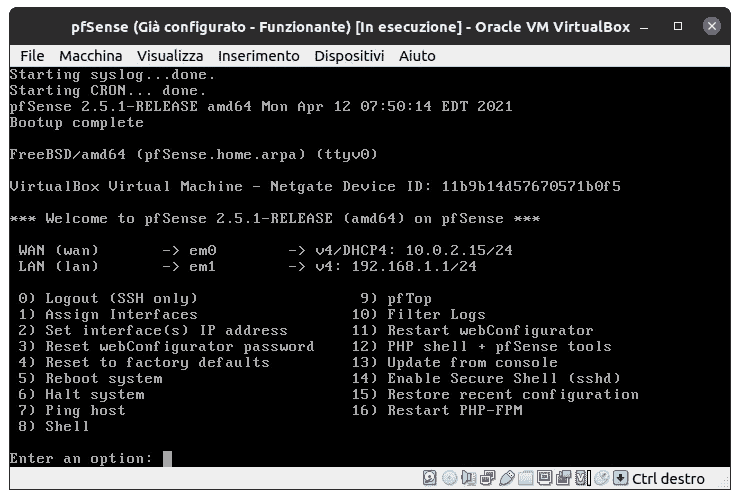

如您所见，WAN 和 LAN 接口预配置了标准地址，您可以直接从 shell 或通过 web 界面更改设置，并设置您自己的参数。
不可能更改广域网，因为它是由 VirtualBox 直接管理的(除非我们希望固件不要连接到互联网)。

# pfSense 配置

我们将通过浏览器进行配置，但也可以直接从机器上的命令行进行配置。可以通过 HTTPS 端口 443 上的 IP 地址(或设置后的 DNS 名称)访问防火墙的 web 接口。
这将是安装向导向我们显示的第一个屏幕:

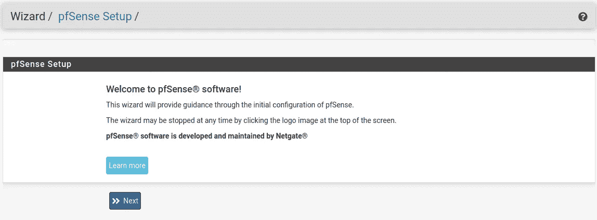

我们首先输入*主机名*、*域名*和 *DNS 服务器*信息:

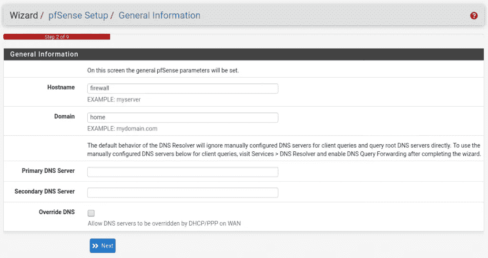

在我们的配置中，它们将如下设置:

*   **主机名**:防火墙
*   **域**:首页
*   **主** **DNS** :将此字段留空
*   **辅助** **DNS** :将此字段留空
*   **覆盖**DNS:取消选择 DNS 覆盖

步骤 3 涉及时间服务器和时区设置:

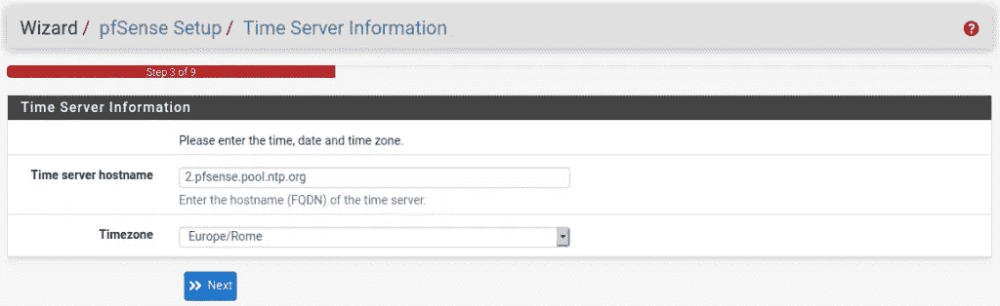

保留 pfSense 提议的默认 NTP 服务器，并将时区更改为**欧洲/罗马**。

下一个屏幕是关于 WAN 配置的:

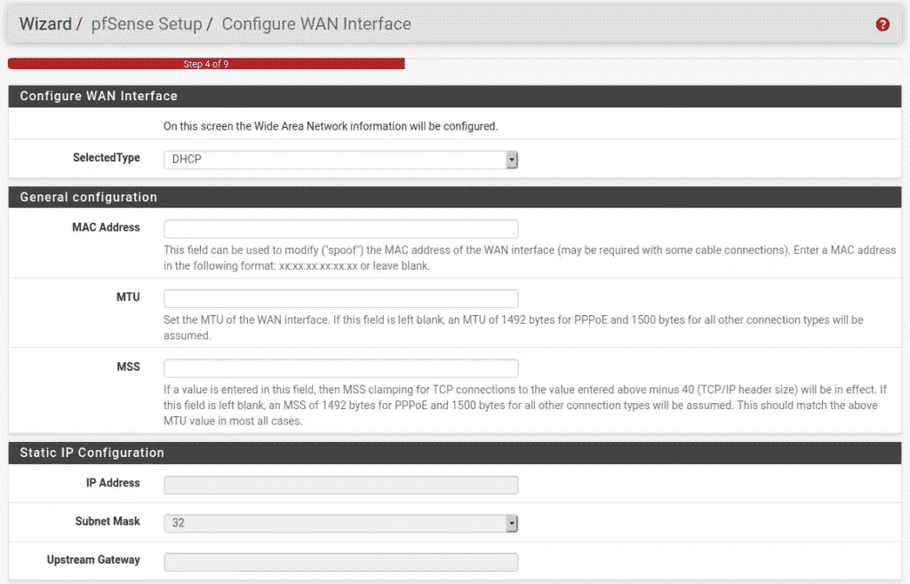

将所有字段保留防火墙建议的默认设置，并继续进行 LAN 配置:

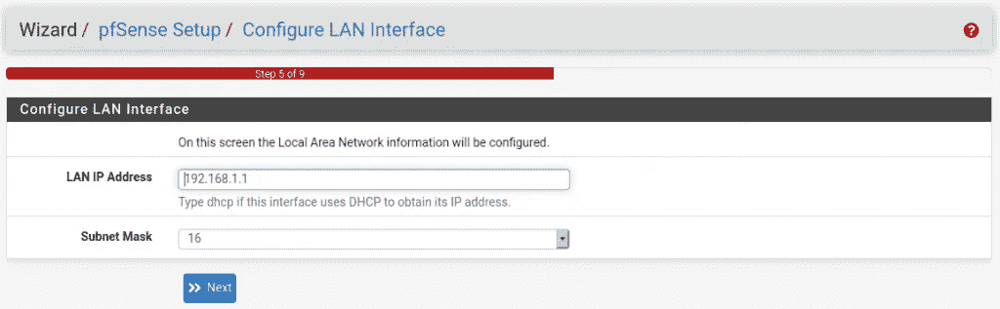

在第 5 步之后，我们可以为 web 界面设置一个新密码，并继续到最后，这时系统会提示我们重新加载新设置。

# 规则设置—阻止 SSH

我要报告的场景很简单:我们将阻止特定 IP 的出站 SSH 流量。

在 pfSense web 界面的顶部菜单中，转到**防火墙- >规则**。

让我们转到 **LAN** 选项卡并单击一个“ *Add* ”按钮，稍后我们将移动该规则。

**注意:** : *从上到下解释防火墙规则，当数据包“匹配”某个规则时，不会解释后续规则。*

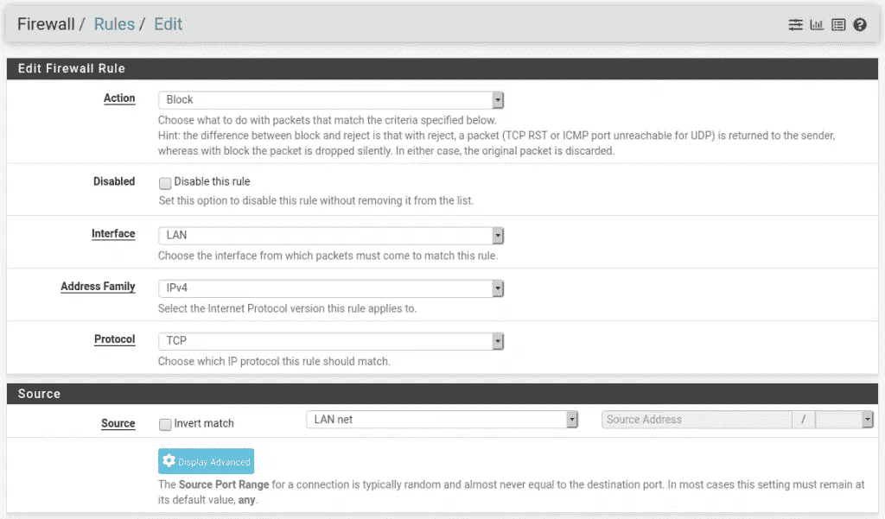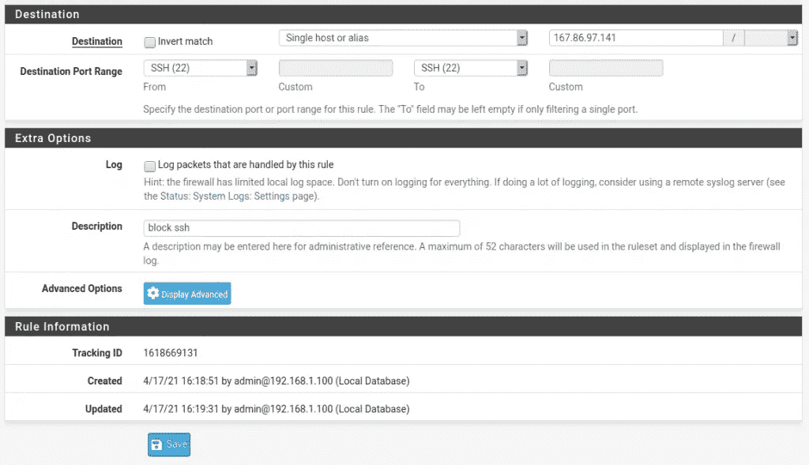

在“目的地端口范围”框中，可以指定所显示的端口范围或自定义范围。

保存规则，页面将要求我们重新加载，以便在我们的防火墙中加载新规则，在我们将规则移动到“任何到任何”之后，我们必须重新加载，新规则的顺序将是这样:

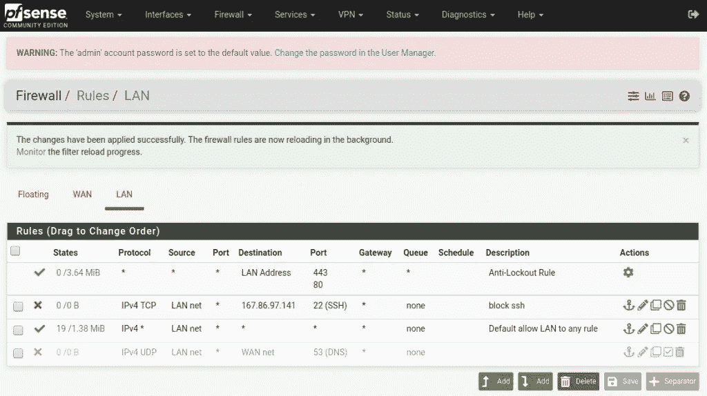

# 规则测试

为了测试我们的定制规则，我们将从 Xubuntu 机器建立 SSH 连接，然后尝试从防火墙直接连接。

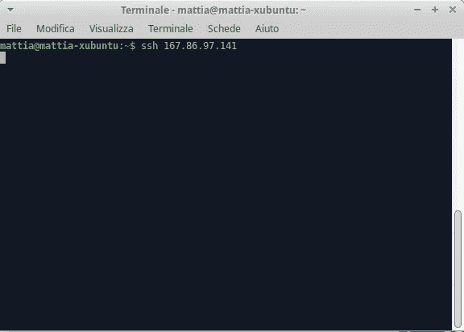

正如您从图片中看到的，来自 Xubuntu 的连接挂起，因为我们的 **pfSense** 已经阻止了到服务器的 SSH 流量。带有那个*目的 IP* 和那个端口的数据包被阻塞，所以如果我们的连接请求用其他协议封装(例如用 VPN)或者我们在另一个端口上配置我们服务器的 SSH 守护进程，我们可以很容易地绕过防火墙。

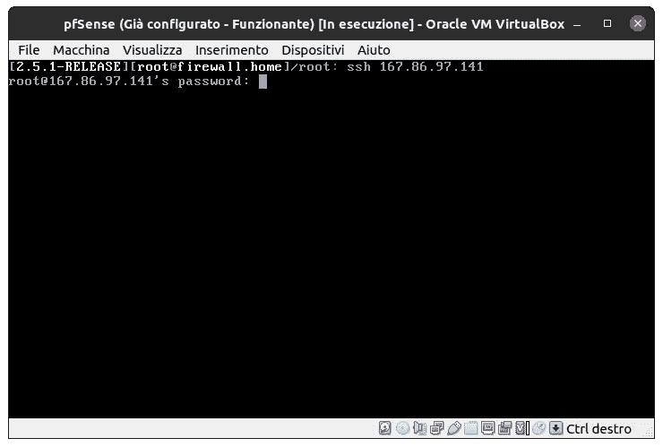

直接使用防火墙，连接是成功的，因为它来自 WAN 接口(10.0.2.15 ),而我们的规则是针对 LAN 的。
让我们看看禁用规则后 Xubuntu 虚拟机的结果:

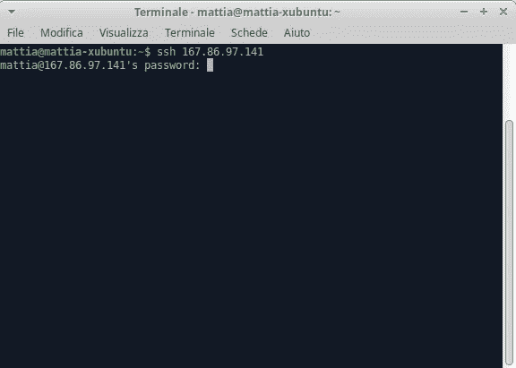

显然，通过禁用规则，我们的 pfSense 允许连接发出并到达其目的地。

现在，我们尝试收紧规则，使其仅对 Xubuntu 计算机有效，然后我们编辑当前规则，并通过输入桌面虚拟机的源 IP 地址(在本例中为 192.168.1.100)对其进行修改:


尝试从 ubuntu 服务器建立 SSH 连接的结果如下:

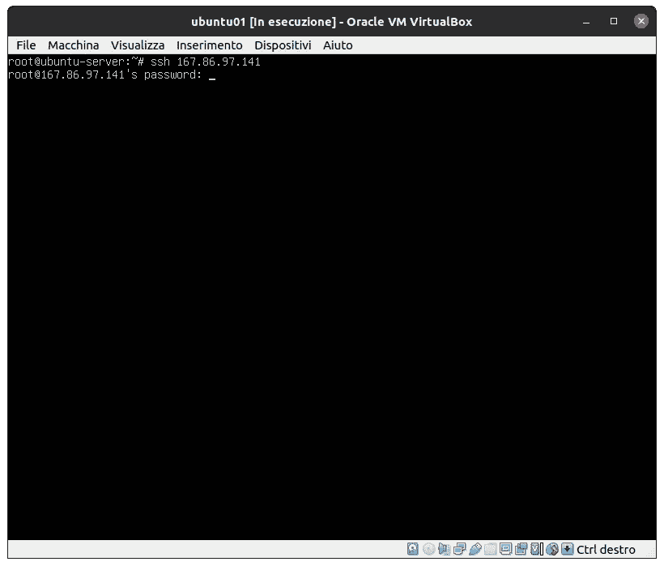

# 结论

pfSense 是一个保护我们网络的伟大工具，它是开源的，也有预装该系统的物理设备(可从 Netgate 商店获得)。
然而，在一些简单的用例中(例如，阻塞一些端口)，使用安全组(和其他云提供商上的等效物)或 UFW 可能更方便，而不是管理整个系统。我认为 **pfSense** 是一个非常好的解决方案，可以用作家庭防火墙或用于中小型企业，当然，研究这种设备如何工作也是有用的，而无需花费任何东西。

*原发布于*[*https://mattiazignale . it*](https://mattiazignale.it/installazione-e-configurazione-del-firewall-pfsense/)*。*